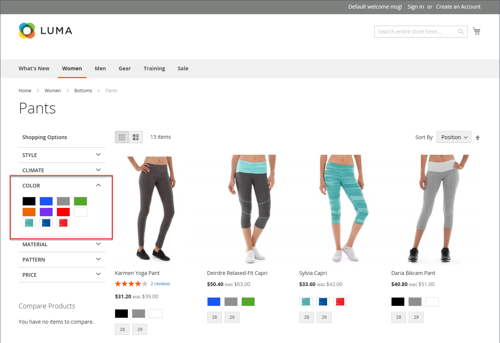

# Färgrutor för produkt

Kunderna har höga förväntningar på att välja en färg, och det är viktigt att produktbeskrivningarna återger varje tillgänglig färg, mönster eller textur. byxorna i följande exempel är till exempel inte tillgängliga i rött, grönt och blått. De finns bara i vissa nyanser av rött, grönt och blått, som troligen är unika för den här produkten.

{width="700" zoomable="yes"}

För [konfigurerbara produkter](product-create-configurable.md), kan färg indikeras med en visuell färgruta, en textfärgruta eller en indatakontroll. Färgrutor kan användas på produktsidan, i produktlistor och i [navigering i flera lager](navigation-layered.md). På produktsidan synkroniseras färgrutorna så att motsvarande produktbild visas när du väljer färgrutan. När kunden väljer färgrutan visas motsvarande värde i inmatningsfältet och färgrutan markeras som aktuell markering.

>[!NOTE]
>
>Du kan konfigurera attribut för färgrutor så att de inte visar motsvarande enkla produktbilder när du väljer färgrutan genom att ange _[!UICONTROL Update Product Preview Image]_alternativvärde till `No` på [!UICONTROL Attribute Edit] i Admin.

## Textbaserade färgrutor

Om en bild inte är tillgänglig för en färgruta visas attributvärdet som text. En textbaserad färgruta fungerar som en knapp med en textetikett och fungerar på samma sätt som en färgruta med en bild. När textbaserade färgrutor används för att visa tillgängliga storlekar stryks alla storlekar som inte är tillgängliga över.

{width="700" zoomable="yes"}

## Färgrutor i navigering i lager

Färgrutor kan också användas i lagernavigering om _[!UICONTROL Use in Layered Navigation]_egenskapen för färgattributet är inställd på `Yes`. I följande exempel visas både textbaserade färgrutor och färgrutor i lageruppbyggd navigering.

{width="700" zoomable="yes"}

## Skapa färgrutor för produkter

Färgrutor kan definieras som en komponent i `color` eller konfigurera lokalt för en viss produkt och laddas upp som [produktbilder](product-image.md#upload-an-image).

I de tidigare exemplen finns byxorna &quot;Sylvia Capri&quot; med följande värden: `red`, `green`och `blue`. Eftersom färgrutorna togs från produktbilden är varje färg en riktig representation av färgen. The `color` används för att hantera informationen för alla produktfärger och färgrutor.

### Steg 1: Skapa färgrutorna

Använd någon av följande metoder för att skapa färgrutor för dina produkter.

#### Metod 1: Lägga till en färgruta

1. Om du vill fånga en produkts verkliga färg öppnar du bilden i en fotoredigerare och använder pipettverktyget för att identifiera den exakta färgen och noterar det motsvarande hexadecimala värdet.

   {width="400"}

1. På _Administratör_ sidebar, gå till **[!UICONTROL Stores]** > _[!UICONTROL Attributes]_>**[!UICONTROL Product]**.

1. I rutnätet öppnar du _färg_ i redigeringsläge.

1. Verifiera att **[!UICONTROL Catalog Input Type for Store Owner]** är inställd på `Visual Swatch`.

1. Om du inte vill visa motsvarande enkla produktbilder när du väljer färgrutan på produktvisningssidan anger du **[!UICONTROL Update Product Preview Image]** till `No`.

1. Under _[!UICONTROL Manage Swatch (Values of Your Attribute)]_, klicka **[!UICONTROL Add Swatch]**och gör följande:

   {width="600" zoomable="yes"}

   - I _Färgruta_ klickar du på den nya färgrutan och väljer **[!UICONTROL Choose a color]** på menyn.

     {width="500" zoomable="yes"}

   - Placera markören i färgväljaren **#** tar du bort det aktuella värdet och anger det hexadecimala värdet med sex tecken för den nya färgen.

     {width="500" zoomable="yes"}

   - Spara färgrutan genom att klicka på _Färghjul_ (  ) i färgväljarens nedre högra hörn.

   - I _Administratör_ anger du en etikett som beskriver färgen för lagringsadministratören.

     Om det är tillämpligt kan du även ange översättningen av färgen för varje språk som stöds. I följande exempel inkluderas SKU som referens i _Administratör_ eftersom färgerna bara används för en viss produkt. Du kan inkludera ett mellanslag eller ett understreck i etiketten, men inte ett bindestreck.

   - I _Är standard_ markerar du den färgruta som ska vara standardalternativet.

   - Om du vill ändra ordningen på färgrutorna klickar du på _[!UICONTROL Order]_ och dra objektet till en ny plats i listan.

     {width="400"}

1. När du är klar klickar du på **[!UICONTROL Save Attribute]** och uppdatera cacheminnet när du uppmanas till detta.

1. Öppna varje produkt i redigeringsläge och uppdatera **Färg** -attribut med rätt färgruta.

   Följ stegen nedan om du vill uppdatera flera produkter samtidigt.

#### Metod 2: Överför en färgrutebild

1. Om du vill hämta en bild för en färgruta öppnar du produktbilden i en fotoredigerare och sparar ett fyrkantigt område av bilden som avbildar färgen, mönstret eller texturen.

   Om det behövs kan du upprepa den här åtgärden för varje produktvariant.

   Färgrutans storlek och mått bestäms av temat. Om du sparar en bild som en fyrkant bevaras vanligtvis ett mönsters proportioner.

   {width="400"}

1. På _Administratör_ sidebar, gå till **[!UICONTROL Stores]** > _[!UICONTROL Attributes]_>**[!UICONTROL Product]**.

1. I rutnätet öppnar du **[!UICONTROL color]** i redigeringsläge.

1. Verifiera att **[!UICONTROL Catalog Input Type for Store Owner]** är inställd på `Visual Swatch`.

1. Om du inte vill visa motsvarande enkla produktbilder när du väljer färgrutan på produktvisningssidan anger du **[!UICONTROL Update Product Preview Image]** till `No`.

1. Under _[!UICONTROL Manage Swatch]_(värden för ditt attribut), klicka på&#x200B;**[!UICONTROL Add Swatch]**och gör följande:

   - I _[!UICONTROL Swatch]_klickar du på den nya färgrutan för att visa menyn och väljer **[!UICONTROL Upload a file]**.

   - Navigera till den färgrutefil som du har förberett och välj den fil som ska överföras.

   - Upprepa dessa steg för varje färgrutebild.

   - Ange etiketterna för Admin och storefront.

     I det här exemplet inkluderas SKU:n i Admin-etiketten som referens eftersom dessa färger endast används för en viss produkt. Du kan inkludera ett mellanslag eller ett understreck i etiketten, men det får inte innehålla ett bindestreck.

     {width="500" zoomable="yes"}

1. När du är klar klickar du på **[!UICONTROL Save Attribute]** och uppdatera cacheminnet när du uppmanas till detta.

1. Öppna varje produkt i redigeringsläge och uppdatera **[!UICONTROL Color]** -attribut med rätt färgruta.

   Följ stegen nedan om du vill uppdatera flera produkter samtidigt.

### Steg 2: Uppdatera produkterna

1. På _Administratör_ sidebar, gå till **[!UICONTROL Catalog]** > **[!UICONTROL Products]**.

1. Använd **[!UICONTROL Filter]** för att visa listan efter namn eller SKU och endast inkludera de tillämpliga produkterna.

1. Markera kryssrutan för varje produkt som färgrutan gäller för i rutnätet.

1. Ange **[!UICONTROL Actions]** till `Update Attributes`.

   I det här exemplet väljs alla blå konfigurationer av byxorna.

   {width="600" zoomable="yes"}

1. Bläddra nedåt till **[!UICONTROL Color]** och välj **[!UICONTROL Change]** kryssrutan.

   {width="400"}

1. Välj den färgruta som gäller för de valda produkterna och klicka på **[!UICONTROL Save]**.

1. Uppdatera cacheminnet när du uppmanas till detta.

   {width="200"}

## Lägga till färgrutor i en enkel produkt

1. På _Administratör_ sidebar, gå till **[!UICONTROL Catalog]** > **[!UICONTROL Products]**.

1. Öppna en produkt i redigeringsläge, kontrollera produktstatus (bör vara aktiverad).

1. Klicka **[!UICONTROL Create Configurations]** knappen (under `Configurations` -fliken).

1. I popup-fönstret väljer du attributet Färg och **[!UICONTROL Next]**.

1. Välj färgrutor från attributet som du vill inkludera i den här produkten.

1. Klicka på i förloppsindikatorn **[!UICONTROL Next]**.

1. [Konfigurera bilder, pris och kvantitet](product-create-configurable.md#step-3-configure-the-images-price-and-quantity).

   I det här steget anger du bilder, priser och kvantitet för varje konfiguration. De tillgängliga alternativen är desamma för alla, och du kan bara välja ett. Du kan använda samma inställning för alla SKU:er, använda en unik inställning för varje SKU:er eller hoppa över inställningarna för tillfället.

1. När konfigurationen för bilder, pris och kvantitet är klar klickar du på **[!UICONTROL Next]** längst upp till höger.

   De aktuella produktvariationerna visas längst ned i avsnittet Konfiguration. Om du är nöjd med konfigurationen klickar du på **[!UICONTROL Generate Products]**.
