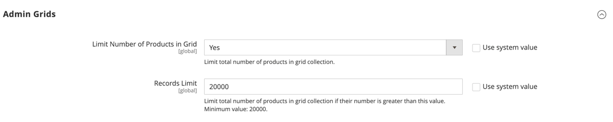
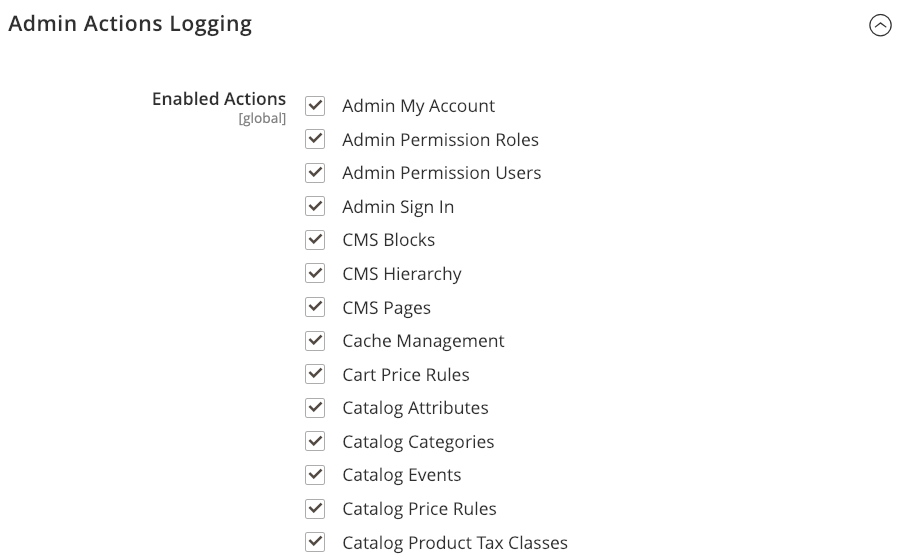

# Avancerat > Admin

{{config}}

## [!UICONTROL Admin User Emails]

<!-- zoom -->

Mer information om hur du ändrar de här inställningarna finns i [Glömt lösenord och återställ e-post](../../systems/permissions-users-all.md#forgotten-password-and-reset-emails).

| Fält | [Omfång](../../getting-started/websites-stores-views.md#scope-settings) | Beskrivning |
|---------------------------------------------|------------------------------------------------------------------------|----------------------------------------------------------------------------------------------------------------------------------------------------------------------------------------------------------------|
| [!UICONTROL Forgot Password Email Template] | Global | Identifierar e-postmallen som används för meddelandet som skickas när en Admin-användare glömmer sitt lösenord. Standardmall: `Forgot Admin Password` |
| [!UICONTROL Forgot and Reset Email Sender] | Global | Identifierar butikskontakten som visas som avsändare av _Glömt lösenordet_ e-post. Standardavsändare: `General Contact` Andra avsändaralternativ: `Sales Representative`, `Customer Support`, `Custom Email` |
| [!UICONTROL User Notification Template] | Global | Bestämmer e-postmallen som används som standard för administratörsmeddelanden. Standardmall: `User Notification` |

{style="table-layout:auto"}

## [!UICONTROL Startup Page]

<!-- zoom -->

Mer information om hur du ändrar de här inställningarna finns i [Ändra startsidan](../../getting-started/admin-dashboard.md#change-the-startup-page) i _Starthandbok_.

| Fält | [Omfång](../../getting-started/websites-stores-views.md#scope-settings) | Beskrivning |
|---------------------------|------------------------------------------------------------------------|------------------------------------------------------------------|
| [!UICONTROL Startup Page] | Global | Bestämmer startsidan för administratören som visas när du har loggat in. |

{style="table-layout:auto"}

### [!UICONTROL Startup Page] alternativ

| Område |                                                                                                                                                                                                                                                                                                                                                                           | Alternativ |
|---------------------------------------------------------|---------------------------------------------------------------------------------------------------------------------------------------------------------------------------------------------------------------------------------------------------------------------------------------------------------------------------------------------------------------------------|---------------------------------------------------------------------------------------------------------------------------------------------------------------------------------------------------------------------------------------------------------------------------------------------------------------------------------------------------------------------------------------------------------------------------------------------------------------------------------------------------------------------------------------------------------------------------------------------|
| [`Dashboard`](../../getting-started/admin-dashboard.md) |                                                                                                                                                                                                                                                                                                                                                                           |                                                                                                                                                                                                                                                                                                                                                                                                                                                                                                                                                                                             |
| `Sales` | `Operations` | [`Quotes`](../../b2b/quotes.md)   [`Orders`](../../stores-purchase/orders.md) [`Invoices`](../../stores-purchase/invoices.md) [`Shipments`](../../stores-purchase/shipments.md) [`Credit Memos`](../../stores-purchase/credit-memos.md) [`Billing Agreements`](../../stores-purchase/paypal-billing-agreements.md) [`Returns`](../../stores-purchase/returns.md)   [`Transactions`](../../stores-purchase/transactions.md) `Braintree Virtual Terminal` |
| `Catalog` | [`Inventory`](../../inventory-management/introduction.md) | [`Products`](../../catalog/products-list.md) [`Categories`](../../catalog/categories.md) [`Shared Catalog`](../../b2b/catalog-shared-create.md)  |
| `Customers` | [`All Customers`](../../customers/customers-all.md) [`Now Online`](../../customers/now-online.md) [`Customer Groups`](../../customers/customer-groups.md) [`Segments`](../../customers/customer-segments.md)   [`Companies`](../../b2b/account-companies.md) |                                                                                                                                                                                                                                                                                                                                                                                                                                                                                                                                                                                             |
| `Marketing` | `Promotions` | [`Catalog Price Rule`](../../merchandising-promotions/price-rules-catalog.md)  [`Cart Price Rules`](../../merchandising-promotions/price-rules-cart.md))  [`Related Products Rules`](../../merchandising-promotions/product-related-rules.md)   [`Gift Card Accounts`](../../stores-purchase/product-gift-card-accounts.md)  |
|                                                         | [`Private Sales`](../../merchandising-promotions/events-private-sales.md)  | [`Events`](../../merchandising-promotions/event-configure.md)  [`Invitations`](../../merchandising-promotions/invitations.md) |
|                                                         | `Communications` | [`Email Templates`](../../systems/email-templates.md)  [`Newsletter Template`](../../merchandising-promotions/newsletter-template.md)  [`Newsletter Queue`](../../merchandising-promotions/newsletter-queue.md)  [`Newsletter Subscribers`](../../merchandising-promotions/newsletter-subscribers.md)  [`Email Reminders`](../../merchandising-promotions/email-reminder-rules.md)  |
|                                                         | `SEO & Search` | [`Search Terms`](../../catalog/search-terms.md)  [`Search Synonyms`](../../catalog/search-terms.md#search-synonyms)  [`URL Rewrites`](../../merchandising-promotions/url-rewrite.md)  [`Site Map`](../../merchandising-promotions/sitemap-xml.md) |
|                                                         | [`User Content`](../../catalog/settings-advanced-product-reviews.md) | [`All Reviews`](../../catalog/settings-advanced-product-reviews.md)  [`Pending Reviews`](../../merchandising-promotions/product-reviews-moderate.md)   |
| `Content` | `Elements` | [`Pages`](../../content-design/pages.md) [`Hierarchy`](../../content-design/page-hierarchy.md)  [`Blocks`](../../content-design/blocks.md) [`Dynamic Blocks`](../../content-design/dynamic-blocks.md)  [`Widgets`](../../content-design/widgets.md) [`Media Gallery`](../../content-design/media-storage.md) |
|                                                         | `Design` | [`Configuration`](../../content-design/configuration.md) [`Themes`](../../content-design/themes.md) [`Schedule`](../../content-design/schedule.md) |
|                                                         | `Content Staging`   | [Kontrollpanel](../../content-design/content-staging.md) |
| `Reports` | [`Marketing`](../../getting-started/marketing-reports.md) | `Products in Cart` `Search Terms` `Abandoned Carts` `Newsletter Problem Reports` |
|                                                         | [`Reviews`](../../getting-started/review-reports.md) | `By Customer`  `By Products`  |
|                                                         | [`Sales`](../../getting-started/sales-reports.md) | `Orders` `Tax` `Invoiced` `Shipping` `Refunds` `Coupons` `PayPal Settlement` `Braintree Settlement` |
|                                                         | `System Insights` | [`Site-Wide Analysis Tool`](https://experienceleague.adobe.com/docs/commerce-operations/tools/site-wide-analysis-tool/access.html)  |
|                                                         | [`Customers`](../../getting-started/customer-reports.md) | `Order Total` `Order Count` `New` `Wish Lists` `Segments`  |
|                                                         | [`Products`](../../getting-started/product-reports.md) | `Views` `Bestsellers` `Low Stock` `Ordered` `Downloads` |
|                                                         | [`Private Sales`](../../getting-started/private-sales-reports.md)  | `Invitations` `Invited Customers` `Conversions` |
|                                                         | `Statistics` | [`Refresh Statistics`](../../getting-started/sales-reports.md#refresh-statistics) |
|                                                         | [`Business Intelligence`](../../getting-started/business-intelligence.md) | `Advanced Reporting` `BI Essentials`  |
|                                                         | `Customer Engagement` | `Dashboard` `Importer Status` `Automation Enrollment` `Campaign Sends` `SMS Sends` `Cron Tasks` `Log Viewer` `Abandoned Carts` |
| `Stores` | `Settings` | [`All Stores`](../../stores-purchase/stores.md) [`Configuration`](../../configuration-reference/guide-overview.md) [`Terms and Conditions`](../../stores-purchase/terms-and-conditions.md) [`Order Status`](../../stores-purchase/order-status.md) |
|                                                         | [`Inventory`](../../inventory-management/introduction.md) | [`Sources`](../../inventory-management/sources-stocks.md#sources) [`Stocks`](../../inventory-management/sources-stocks.md#stocks) |
|                                                         | [`Taxes`](../../stores-purchase/taxes.md) | [`Tax Rules`](../../stores-purchase/tax-rules.md) [`Tax Zones and Rates`](../../stores-purchase/tax-zones-rates.md) |
|                                                         | [`Currency`](../../stores-purchase/currency.md) | [`Currency Rates`](../../stores-purchase/currency-configuration.md) [`Currency Symbols`](../../stores-purchase/currency-configuration.md#step-5-customize-currency-symbols-optional) |
|                                                         | `Attributes` | [`Customer`](../../systems/data-attributes-customer.md) [`Customer Address`](../../systems/data-attributes-customer.md#customer-addresses) [`Product`](../../systems/data-attributes-product.md) [`Attribute Set`](../../catalog/attribute-sets.md) [`Returns`](../../stores-purchase/attributes-returns.md) [`Ratings`](../../merchandising-promotions/product-reviews.md#create-custom-ratings) |
|                                                         | `Other Settings` | [`Reward Exchange Rates`](../../merchandising-promotions/reward-exchange-rates.md) [`Gift Wrapping`](../../stores-purchase/cart-configuration.md#gift-wrap) [`Gift Registry`](../../merchandising-promotions/gift-registry-create.md) |
| `System` | [`Data Transfer`](../../systems/data-transfer.md) | [`Import`](../../systems/data-import.md) [`Export`](../../systems/data-export.md) [`Import/Export Tax Rates`](../../systems/data-transfer-tax-rates.md) [`Import History`](../../systems/data-import.md#import-history) [`Scheduled Import/Export`](../../systems/data-scheduled-import-export.md) |
|                                                         | `Extensions` | [`Integrations`](../../systems/integrations.md) |
|                                                         | `Tools` | [`Cache Management`](../../systems/cache-management.md) [`Index Management`](../../systems/index-management.md) |
|                                                         | `Support` | [`Data Collector`](../../systems/support.md#data-collector) [`System Report`](../../systems/support.md#system-reports) |
|                                                         | `Permissions` | [`All Users`](../../systems/permissions-users-all.md) [`Locked Users`](../../systems/permissions-users-all.md#locked-users) [`User Roles`](../../systems/permissions-user-roles.md) |
|                                                         | `Action Log`  | [`Report`](../../systems/action-log.md) [`Archive`](../../systems/action-log-archive.md) [`Bulk Actions`](../../systems/action-log-bulk-actions.md) |
|                                                         | `Other Settings` | [`Notifications`](../../systems/notifications.md) [`Custom Variables`](../../systems/variables-custom.md) [`Manage Encryption Key`](../../systems/encryption-key.md) |
| `Find Partners & Extensions` |                                                                                                                                                                                                                                                                                                                                                                           |                                                                                                                                                                                                                                                                                                                                                                                                                                                                                                                                                                                             |

{style="table-layout:auto"}

<!-- Feature still in development 
## [!UICONTROL Unified Experience]

The [!UICONTROL Unified Experience] option is available in Adobe Commerce deployments that have the Commerce Admin Unified Experience extension loaded. This extension enables integration with Experience Cloud to streamline cross-application workflows between Commerce and other Experience Cloud solutions. See [Adobe Experience Cloud Integration for Commerce Admin](../../getting-started/admin-unified-experience-integration-overview.md).

| Field        | [Scope](../../getting-started/websites-stores-views.md#scope-settings) | Description                                                                                                                                                                                                                                                                                                                                                                    |
|--------------|------------------------------------------------------------------------|--------------------------------------------------------------------------------------------------------------------------------------------------------------------------------------------------------------------------------------------------------------------------------------------------------------------------------------------------------------------------------|
| Enable       | Global                                                                 | Determines if the Commerce instance uses the Experience Cloud integration. Before enabling this feature, review the [requirements and configuration instructions](../../getting-started/admin-unified-experience-integration-overview.md). Options: Yes/No.                                                                                                                    |
| Project Name | Global                                                                 | Identifies the instance in the Experience Cloud Commerce Projects workspace when the Unified Experience is enabled. The name can contain only alphanumeric characters and spaces. Defaults to the [cloud environment name](https://experienceleague.adobe.com/docs/commerce-cloud-service/user-guide/architecture/pro-architecture.html?lang=en#pro-environment-architecture). |

{style="table-layout:auto"}

-->

## [!UICONTROL Admin Base URL]

<!-- zoom -->

Mer information om hur du anger dessa alternativ finns i [Konfigurera bas-URL:en](../../stores-purchase/store-urls.md#configure-the-base-url) i _Butiks and Purchase Experience Guide_.

| Fält | [Omfång](../../getting-started/websites-stores-views.md#scope-settings) | Beskrivning |
|------------------------------------|------------------------------------------------------------------------|-----------------------------------------------------------------------------------------------------------------------------------------------------------------------------------------------------------------------------------|
| [!UICONTROL Use Custom Admin URL] | Global | Avgör om en anpassad URL används för att komma åt administratören. Alternativ: `Yes` / `No` |
| [!UICONTROL Custom Admin URL] | Global | Anger en anpassad URL för att komma åt administratören. Som standard är Admin-URL samma som bas-URL:en. **Viktigt:** Admin-URL:en måste finnas i samma Commerce-installation och ha samma dokumentrot som butiken. |
| [!UICONTROL Use Custom Admin Path] | Global | Avgör om en anpassad sökväg används för att komma åt administratören. Standardsökvägen är `admin`. Alternativ: `Yes` / `No` |
| [!UICONTROL Custom Admin Path] | Global | Ändrar namnet på administratörens standardsökväg till något svårt att gissa sig till. Ange namnet på den anpassade sökvägen med gemener. Till exempel: `aardvark` |

{style="table-layout:auto"}

## [!UICONTROL Security]

<!-- zoom -->

Mer information om hur du anger dessa alternativ finns i [Konfigurera administratörssäkerhet](../../systems/security-admin.md) i _Handbok för adminsystem_.

| Fält | [Omfång](../../getting-started/websites-stores-views.md#scope-settings) | Beskrivning |
|--------------------------------------------------------|------------------------------------------------------------------------|--------------------------------------------------------------------------------------------------------------------------------------------------------------------------------------------------------------------------------------------------------------------------------------------------------------------------------------------------------------------------------------------------------------------------------------------------------------------------------------------------------------------------------------------------------------------------------------------------------|
| [!UICONTROL Admin Account Sharing] | Butiksvy | Avgör om en Admin-användare kan logga in på samma konto samtidigt från olika enheter. Alternativ:  **`Yes`**- Tillåter flera aktiva sessioner från samma administratörskonto. **`No`** - Endast en aktiv session per administratörskonto tillåts. |
| [!UICONTROL Password Reset Protection Type] | Butiksvy | Bestämmer vilken metod som används för att hantera begäranden om återställning av lösenord. Alternativ:  **`By IP and Email`**- Lösenordet kan återställas online när ett svar har tagits emot från meddelandet skickas till den e-postadress som är kopplad till administratörskontot. **`By IP`** - Lösenordet kan återställas online utan ytterligare bekräftelse.  **`By Email`**- Lösenordet kan bara återställas genom att svara via e-post på meddelandet som skickas till den e-postadress som är kopplad till administratörskontot. **`None`** - Lösenordet kan bara återställas av butiksadministratören. |
| [!UICONTROL Recovery Link Expiration Period (hours)] | Global | Anger hur många timmar en länk för lösenordsåterställning ska vara giltig. |
| [!UICONTROL Max Number of Password Reset Requests] | Butiksvy | Anger det maximala antalet lösenordsbegäranden som kan skickas per timme. |
| [!UICONTROL Min Time Between Password Reset Requests] | Butiksvy | Anger det minsta antalet minuter mellan begäranden om återställning av lösenord. |
| [!UICONTROL Add Secret Key to URLs] | Global | När det här alternativet är aktiverat läggs en hemlig nyckel till i Admin-URL:en som en försiktighetsåtgärd mot att den utnyttjas. Alternativ: `Yes` / `No` |
| [!UICONTROL Login Is Case Sensitive] | Global | Avgör om inloggningsuppgifter som anges av en användare måste matcha de lagrade. Alternativ: `Yes` / `No` |
| [!UICONTROL Admin Session Lifetime (seconds)] | Global | Anger längden på en Admin-session i sekunder. |
| [!UICONTROL Maximum Login Failures to Lockout Account] | Global | Anger hur många gånger administratörsanvändare kan försöka logga in innan deras konton är låsta. Om fältet är tomt ställs ingen miniminivå in. Standardvärde: `6` |
| [!UICONTROL Lockout Time (minutes)] | Global | Anger hur många minuter ett administratörskonto är låst innan användaren kan försöka logga in igen. Standardvärde: `30` |
| [!UICONTROL Password Lifetime (days)] | Global | Anger antalet dagar innan ett administratörslösenord upphör att gälla. Om fältet är tomt ställs ingen livstid in. Standardvärde: `90` |
| [!UICONTROL Password Change] | Global | Avgör om administratörsanvändare måste ändra sina lösenord. Alternativ:  **`Forced`**- Kräver att administratörsanvändare ändrar sina lösenord efter att kontot har konfigurerats. **`Recommended`** - Rekommenderar att administratörsanvändare ändrar sina lösenord efter att kontot har konfigurerats. |

{style="table-layout:auto"}

## [!UICONTROL Dashboard]

<!-- zoom -->

Mer information om hur du anger dessa alternativ finns i [Kontrollpanel för administratörer](../../getting-started/admin-dashboard.md) i _Starthandbok_.

| Fält | [Omfång](../../getting-started/websites-stores-views.md#scope-settings) | Beskrivning |
|----------------------------|------------------------------------------------------------------------|-------------------------------------------------------------------------------------------------------|
| [!UICONTROL Enable Charts] | Global | Avgör om instrumentpanelen innehåller ett diagram som genererats från aktuella försäljningsdata. Alternativ: `Yes` / `No` |

{style="table-layout:auto"}

## [!UICONTROL Admin Grids]

<!-- zoom -->

Mer information om hur du anger dessa alternativ finns i [Begränsa produktvisning](../../catalog/products-list.md#limit-product-display) i _Kataloghanteringsguide_.

>[!NOTE]
>
>För att förbättra prestanda för stora kataloger rekommenderar vi att du begränsar antalet produkter som visas i rutnätet.

| Fält | [Omfång](../../getting-started/websites-stores-views.md#scope-settings) | Beskrivning |
|-----------------------------------------------|------------------------------------------------------------------------|-------------------------------------------------------------------------------------------------------------------------------------|
| [!UICONTROL Limit Number of Products in Grid] | Global | Anger om antalet produkter som visas i rutnätet är begränsat till _[!UICONTROL Records Limit]_värde. Alternativ: `Yes` / `No` |
| [!UICONTROL Records Limit] | Global | Anger antalet produkter i produktrutnätet. Standardminimivärdet är `20000`. |

## [!UICONTROL CAPTCHA]

<!-- zoom -->

Mer information om hur du anger dessa alternativ finns i [CAPTCHA](../../systems/security-captcha.md) i _Handbok för adminsystem_.

| Fält | [Omfång](../../getting-started/websites-stores-views.md#scope-settings) | Beskrivning |
|-------------------------------------------------------|------------------------------------------------------------------------|-------------------------------------------------------------------------------------------------------------------------------------------------------------------------------------------------------------------------------------------------------------------------------------------------------------------------------------------------------------------------------------------------------------------------------------------------------------------------------------------------------------------------------------------------------------------------------------------------------------------------------------------------------------------------------------------------------------------------------------------------------------------------------------------------|
| [!UICONTROL Enable CAPTCHA in Admin] | Global | Aktiverar CAPTCHA för administratörsinloggning. Alternativ: `Yes` / `No` |
| [!UICONTROL Font] | Global | Anger vilket teckensnitt som används för att visa CAPTCHA. Om du vill lägga till ett eget teckensnitt placerar du teckensnittsfilen i samma katalog som din Commerce-instans och lägger till deklarationen i filen config.xml på `app/code/Magento/Captcha/etc` Standardteckensnitt:` LinLibertine` |
| [!UICONTROL Forms] | Global | Bestämmer vilka formulär som CAPTCHA används i. Alternativ: `Admin Login` / `Admin Forgot Password` |
| [!UICONTROL Displaying Mode] | Global | Avgör när CAPTCHA visas. Alternativ:  **`Always`**- CAPTCHA krävs alltid för att logga in. **`After number of attempts to login`** - Visar [!UICONTROL Number of Unsuccessful Attempts to Login] fält. Ange antalet tillåtna inloggningsförsök. Värdet 0 (noll) liknar inställningen för visningsläge till Alltid. Det här alternativet täcker inte formulären Glömt lösenord och Skapa användare. Om CAPTCHA är aktiverat och inställt på att visas, inkluderas det alltid i formuläret. **Anteckning**: För att spåra antalet misslyckade inloggningsförsök räknas varje försök att logga in under en e-postadress och från en IP-adress. Det maximala antalet inloggningsförsök från samma IP-adress är 1 000. Den här begränsningen gäller bara när CAPTCHA är aktiverat. |
| [!UICONTROL Number of Unsuccessful Attempts to Login] | Global | Anger hur många gånger en person kan försöka logga in innan kontot är låst. För att spåra antalet misslyckade inloggningsförsök spåras försöken från en e-postadress från en enda IP-adress. Det maximala antalet försök från samma IP-adress är 1 000. Den här begränsningen gäller bara om CAPTCHA är aktiverat. |
| [!UICONTROL CAPTCHA Timeout (minutes)] | Global | Anger livslängden för aktuell CAPTCHA. När CAPTCHA förfaller måste användaren läsa in sidan igen. |
| [!UICONTROL Number of Symbols] | Global | Anger antalet symboler som används i CAPTCHA. Högsta tillåtna värde är `8`. Du kan också ange ett intervall, till exempel `5-8`. |
| [!UICONTROL Symbols Used in CAPTCHA] | Global | Avgör vilka symboler som används i CAPTCHA. Endast bokstäver (a-z och A-Z) och siffror (0-9) tillåts. Standarduppsättningen symboler som föreslås i fältet utesluter symboler som liknar varandra, som i, l eller 1. Om du visar dessa symboler i CAPTCHA minskar risken för att en användare känner igen CAPTCHA korrekt. |
| [!UICONTROL Case Sensitive] | Global | Avgör om tecknen som används i CAPTCHA är skiftlägeskänsliga. Alternativ: `Yes` / `No` |

{style="table-layout:auto"}

## [!UICONTROL Admin Actions Logging]

{{ee-feature}}

<!-- zoom -->

Mer information om hur du anger dessa alternativ finns i [Åtgärdsloggarkiv](../../systems/action-log-archive.md) i _Handbok för adminsystem_.

| Fält | [Omfång](../../getting-started/websites-stores-views.md#scope-settings) | Beskrivning |
|-----------------------------|------------------------------------------------------------------------|-----------------------------------------------------------------------------------------------------------------------------------------------------------------------------------------------------------------------------------------------------------------------------------------------------------------------------------------------------------------------------------------------------------------------------------------------------------------------------------------------------------------------------------------------------------------------------------------------------------------------------------------------------------------------------------------------------------------------------------------------------------------------------------------------------------------------------------------------------------------------------------------------------------------------------------------------------------------------------------------------------------------------------------------------------------------------------------------------------------------------------------------------------------------------------------------------------------------------------------------------------------------------------------------------------------------------------------------------------------------------------------------------------------------------------------------------------------------------------------------------------------------------------------------------------------------------------------------------------------------------------------------------------------------------------------------------------------------------------------------------------------------------------------------------|
| [!UICONTROL Enable Actions] | Global | Aktiverar åtgärdsloggning för var och en av de valda åtgärderna:  `Admin My Account`  `Admin Permission Roles`  `Admin Permission Users`  `Admin Sign In`  `CMS Blocks`  `CMS Hierarchy`  `CMS Pages`  `Cache Management`  `Cart Price Rules`  `Catalog Attributes`  `Catalog Categories`  `Catalog Events`  `Catalog Price Rules`  `Catalog Product Tax Classes`  `Catalog Product Templates`  `Catalog Products`  `Catalog Ratings`  `Catalog Reviews`  `Catalog Search`  `Checkout Terms and Conditions`  `Companies`  `Company Credit`  `Custom Variables`  `Customer Groups`  `Customer Invitations`  `Customer Tax Classes`  `Customers`  `Design Configuration`  `Gift Card Accounts`  `Gift Registry Entity`  `Gift Registry Type`  `Index Management`  `Login as a Customer`  `Manage Currency Rates`  `Manage Customer Address Attributes`  `Manage Customer Attributes`  `Manage Design`  `Manage Dynamic Blocks`  `Manage Segments`  `Manage Store Views`  `Manage Stores`  `Manage Websites`  `Negotiable Quotes`  `Newsletter Queue`  `Newsletter Subscribers`  `Newsletter Templates`  `PayPal Settlement Reports`  `Reports`   `Reward Points Rates`  `Rule-Based Product Relations`  `Sales Archive`  `Sales Credit Memos`  `Sales Invoices`  `Sales Order Status`  `Sales Orders`  `Sales Shipments`  `Shared Catalog`  `Shopping Cart Management`  `Store Credit`  `System Backups`  `System Configuration`  `Tax Rates`  `Tax Rules`  `Transactional Emails`  `URL Rewrites`  `Widget`  `XML Sitemap` |

{style="table-layout:auto"}

## [!UICONTROL Admin Usage]

<!-- zoom -->

Mer information om hur du anger dessa alternativ finns i [Insamling av användningsdata](../../getting-started/admin.md#usage-data-collection) i _Starthandbok_.

| Fält | Omfång | Beskrivning |
|------------------------------------------|--------|--------------------------------------------------------------------------------------------------------------------------------------------------------------------------------------------------------------------------------------------------------------------------------------------------------------------------------------------------------------------------------------------------------------------------------------------------------------------------------------------------------------------------------------------------------------------------------------------------------------|
| [!UICONTROL Enable Admin Usage Tracking] | Global | Ger Adobe tillstånd att samla in administratörsinformation för att förbättra upplevelsen av att använda _Administratör_ och tillhörande produkter och tjänster. Genom att datainsamlingen tillåts kan du även _Produktvägledning_ som är utformat för att ge interaktivt innehåll som hjälp, funktionsbeskrivningar, guider, introduktionsinformation, funktionsmeddelanden med mera till _Administratör_. Enskilda administratörer identifieras inte i användningsdata. Alternativ: **`Yes`**- Tillåter datainsamling och aktiverar _Produktvägledning_. **`No`** - Tillåter inte datainsamling och aktiverar inte _Produktvägledning_. |

{style="table-layout:auto"}
