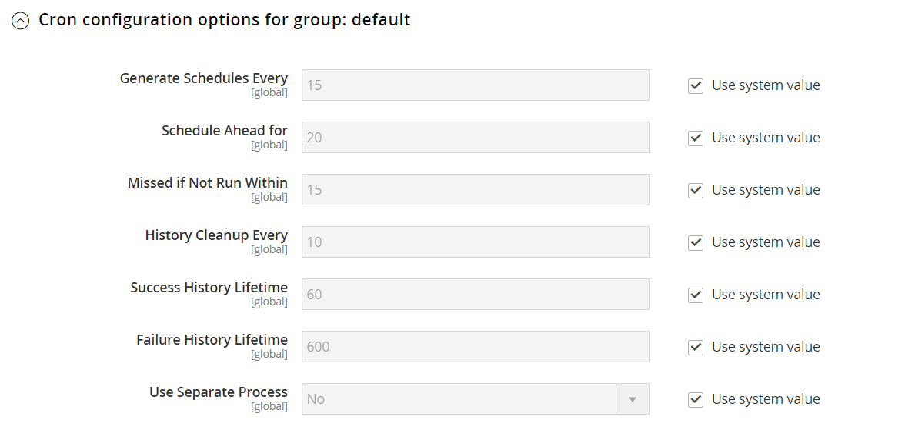

# [!UICONTROL Advanced] > [!UICONTROL System]

{{config}}

## [!UICONTROL Cron (Scheduled Tasks)]

<!-- zoom -->

Mer information om hur du ändrar de här konfigurationsinställningarna finns i [Kron (schemalagda aktiviteter)](../../systems/cron.md).

### [!UICONTROL index]

<!-- zoom -->

| Fält | [Omfång](../../getting-started/websites-stores-views.md#scope-settings) | Beskrivning |
|--- |--- |--- |
| [!UICONTROL Generate Schedules Every] | Global | Anger frekvensen i minuter som scheman genereras. |
| [!UICONTROL Schedule Ahead for] | Global | Anger antalet minuter i förväg som scheman genereras. |
| [!UICONTROL Missed if Not Run Within] | Global | Fastställer antalet minuter innan ett cron-jobb som ännu inte har körts markeras som missat. |
| [!UICONTROL History Cleanup Every] | Global | Anger antalet minuter som förflyter innan kron-historiken rensas. |
| [!UICONTROL Success History Lifetime] | Global | Anger det antal minuter som posten för slutförda kronijobb sparas i databasen. |
| [!UICONTROL Failure History Lifetime] | Global | Anger det antal minuter som posten med misslyckade kronijobb sparas i databasen. |
| [!UICONTROL Use Separate Process] | Global | Avgör om cron-jobb utförs parallellt som separata processer. Alternativ: `Yes` / `No` |

{style="table-layout:auto"}

### [!UICONTROL default]

<!-- zoom -->

| Fält | [Omfång](../../getting-started/websites-stores-views.md#scope-settings) | Beskrivning |
|--- |--- |--- |
| [!UICONTROL Generate Schedules Every] | Global | Anger frekvensen i minuter som scheman genereras. |
| [!UICONTROL Schedule Ahead for] | Global | Anger antalet minuter i förväg som scheman genereras. |
| [!UICONTROL Missed if Not Run Within] | Global | Fastställer antalet minuter innan ett cron-jobb som ännu inte har körts markeras som missat. |
| [!UICONTROL History Cleanup Every] | Global | Anger antalet minuter som förflyter innan kron-historiken rensas. |
| [!UICONTROL Success History Lifetime] | Global | Anger det antal minuter som posten för slutförda kronijobb sparas i databasen. |
| [!UICONTROL Failure History Lifetime] | Global | Anger det antal minuter som posten med misslyckade kronijobb sparas i databasen. |
| [!UICONTROL Use Separate Process] | Global | Avgör om cron-jobb utförs parallellt som separata processer. Alternativ: `Yes` / `No` |

{style="table-layout:auto"}

## [!UICONTROL MySQL Message Queue Cleanup]

{{ee-feature}}

<!-- zoom -->

| Fält | [Omfång](../../getting-started/websites-stores-views.md#scope-settings) | Beskrivning |
|--- |--- |--- |
| [!UICONTROL Successful Messages Lifetime] | Global | Anger livslängden för slutförda meddelanden i minuter. Ange noll om du vill hoppa över rensningen. Standard: `10080` (7 dagar) |
| [!UICONTROL New Messages Lifetime] | Global | Anger livslängden för nya meddelanden i minuter. Ange noll om du vill hoppa över rensningen. Standard: `10080` (7 dagar) |
| [!UICONTROL Failed Messages Lifetime] | Global | Anger livslängden för misslyckade meddelanden i minuter. Ange noll om du vill hoppa över rensningen. Standard: `10080` (7 dagar) |
| [!UICONTROL Retry Messages in Progress After] | Global | Avgör hur länge systemet väntar på ett meddelande innan det försöker igen. Standard: `1440` (24 timmar) |

{style="table-layout:auto"}

## [!UICONTROL Mail Sending Settings]

<!-- zoom -->

Mer information om hur du ändrar de här inställningarna finns i [Konfigurera e-postkommunikation](../../systems/email-communications.md) i _handboken för administratörssystem_.

>[!IMPORTANT]
>
>**Säkerhetsmeddelande** Vi rekommenderar att alla handlare omedelbart ställer in sin sändningskonfiguration för e-post för att skydda mot en nyligen identifierad potentiell fjärrexekvering av kod. Vi rekommenderar att du undviker att använda [!DNL Sendmail] för e-postkommunikation tills problemet är löst. Kontrollera att [!UICONTROL Mail Sending Settings] är inställt på [!UICONTROL Set Return Path] i `No`.

| Fält | [Omfång](../../getting-started/websites-stores-views.md#scope-settings) | Beskrivning |
|--- |--- |--- |
| [!UICONTROL Disable Email Communications] | Butiksvy | Avgör om e-postkommunikation är aktiverad för butiken. Alternativ: `Yes` / `No` |
| [!UICONTROL Transport] | Butiksvy | Bestämmer transporttypen för e-postkommunikation från butiken. Alternativ: `Sendmail` / `SMTP` |
| [!UICONTROL Host] | Butiksvy | (Endast för SMTP- och Windows-servrar) Anger namnet som används för att referera till värden. Standardvärde: `localhost` |
| [!UICONTROL Port (25)] | Butiksvy | (Endast för SMTP- och Windows-servrar) Identifierar porten som används för e-postkommunikation. Standardvärde: `25` |
| [!UICONTROL Set Return-Path] | Butiksvy | Avgör om en routningsadress används för returnerade e-postmeddelanden. Alternativ: `No` / `Yes` / `Specified` |

{style="table-layout:auto"}

### SMTP-alternativ

När du väljer SMTP vid transporttypen finns det ytterligare alternativ för att konfigurera SMTP-serveranslutningen.

<!-- zoom -->

| Fält | [Omfång](../../getting-started/websites-stores-views.md#scope-settings) | Beskrivning |
|--- |--- |--- |
| [!UICONTROL Username] | Butiksvy | Inloggningsanvändarnamn för SMTP-servern. |
| [!UICONTROL Password] | Butiksvy | Lösenord för inloggning på SMTP-servern. |
| [!UICONTROL Auth] | Butiksvy | Bestämmer autentiseringstypen för SMTP-serveranslutningen. Alternativ: `NONE` / `PLAIN` / `LOGIN` |
| [!UICONTROL SSL] | Butiksvy | Bestämmer verifieringstyp för värdsäkerhetscertifikatet. Alternativ: `SSL` / `TLS` |

{style="table-layout:auto"}

## [!UICONTROL Currency]

<!-- zoom -->

Mer information om hur du ändrar den här inställningen finns i [Valutakonfiguration](../../stores-purchase/currency-configuration.md) i _Butiker och inköpsupplevelseguiden_.

| Fält | [Omfång](../../getting-started/websites-stores-views.md#scope-settings) | Beskrivning |
|--- |--- |--- |
| [!UICONTROL Installed Currencies] | Global | Anger vilka valutor som är tillgängliga för Commerce-installationen. Alternativen omfattar alla tillgängliga valutor, med installerade valutor valda. |

{style="table-layout:auto"}

## [!UICONTROL Security]

<!-- zoom -->

Mer information om hur du ändrar de här inställningarna finns i [Sessionshantering](../../systems/security-session-management.md) i _handboken för administrationssystem_.

| Fält | [Omfång](../../getting-started/websites-stores-views.md#scope-settings) | Beskrivning |
|--- |--- |--- |
| [!UICONTROL Max Session Size in Admin] | Global | Begränsa den maximala sessionsstorleken i byte. Använd `0` för att inaktivera. |
| [!UICONTROL Max Session Size in Storefront] | Global | Begränsa den maximala sessionsstorleken i byte. Använd `0` för att inaktivera. |

{style="table-layout:auto"}

## [!UICONTROL Notifications]

<!-- zoom -->

Mer information om hur du ändrar de här inställningarna finns i [Systemmeddelanden](../../systems/notifications.md) i _handboken för administrationssystem_.

| Fält | [Omfång](../../getting-started/websites-stores-views.md#scope-settings) | Beskrivning |
|--- |--- |--- |
| [!UICONTROL Use HTTPS to Get Feed] | Global | Avgör om administratörsmeddelanden levereras via en säker kanal. Alternativ: `Yes` / `No` |
| Uppdateringsfrekvens | Global | Anger frekvensen för uppdateringar av administratörsmeddelanden. Alternativ: `1 Hour` / `2 Hours` / `6 Hours` / `12 Hours` / `24 Hours` |
| [!UICONTROL Last Update] | Global | Anger datum och tid för den senaste meddelandeuppdateringen. |

{style="table-layout:auto"}

## [!UICONTROL Backup Settings]

<!-- zoom -->

{{$include /help/_includes/backups-note.md}}

Mer information om hur du ändrar de här inställningarna finns i [Säkerhetskopiering av system](../../systems/backups.md) i _handboken för administratörssystem_.

| Fält | [Omfång](../../getting-started/websites-stores-views.md#scope-settings) | Beskrivning |
|--- |--- |--- |
| [!UICONTROL Enable Backup] | Global | Anger om Commerce-instansen tillåter säkerhetskopiering. Alternativ: `Yes` / `No` |
| [!UICONTROL Enable Scheduled Backup] | Global | (Visas när _[!UICONTROL Enable Backup]_är inställd på `Yes`.) Anger om Commerce-instansen automatiskt säkerhetskopieras enligt ett regelbundet schema. Alternativ: `Yes` / `No` |
| [!UICONTROL Scheduled Backup Type] | Global | (Visas när _[!UICONTROL Enable Scheduled Backup]_är inställd på `Yes`.) Anger vilka element i Commerce-instansen som ingår i säkerhetskopian. Alternativ: `Database` / `Database and Media` / `System` / `System (excluding Media)` |
| [!UICONTROL Start Time] | Global | (Visas när [!UICONTROL Enable Scheduled Backup] är inställd på `Yes`.) Anger timmen, minuten och sekunden då den schemalagda säkerhetskopieringen börjar. |
| [!UICONTROL Frequency] | Global | (Visas när [!UICONTROL Enable Scheduled Backup] är inställd på `Yes`.) Anger hur ofta den schemalagda säkerhetskopieringen ska utföras. Alternativ: `Daily` / `Weekly` / `Monthly` |
| [!UICONTROL Maintenance Mode] | Global | (Visas när [!UICONTROL Enable Scheduled Backup] är inställd på `Yes`.) Anger om arkivet är i underhållsläge under den schemalagda säkerhetskopieringen. Alternativ: `Yes` / `No` |

{style="table-layout:auto"}

## [!UICONTROL Admin Actions Log Archiving]

{{ee-feature}}

<!-- zoom -->

Mer information om hur du ändrar de här inställningarna finns i [Åtgärdsloggarkiv](../../systems/action-log-archive.md) i _handboken för administrationssystem_.

| Fält | [Omfång](../../getting-started/websites-stores-views.md#scope-settings) | Beskrivning |
|--- |--- |--- |
| [!UICONTROL Log Entry Lifetime, Days] | Butiksvy | Anger antalet dagar som administratörsåtgärder sparas i arkivet med administratörsåtgärder. Standard: `60` |
| [!UICONTROL Log Archiving Frequency] | Butiksvy | Anger hur ofta administratörsåtgärdsloggarna arkiveras. Alternativ: `Daily` / `Weekly` / `Monthly` |

{style="table-layout:auto"}

## [!UICONTROL Full Page Cache]

<!-- zoom -->

Mer information om hur du ändrar de här inställningarna finns i [Helsidescachning](../../systems/cache-management.md#full-page-caching) i _handboken för administratörssystem_.

<!-- zoom -->

| Fält | [Omfång](../../getting-started/websites-stores-views.md#scope-settings) | Beskrivning |
|--- |--- |--- |
| [!UICONTROL Caching Application] | Global | Bestämmer vilket program som används för att hantera helsidescachen. Alternativ:  **`Built-in Application`**- Rekommenderas inte för produktionsmiljön. **`Varnish Caching`** - Rekommenderas för produktionsmiljön. |
| [!UICONTROL TTL for public content] | Global | Anger livslängden för cacheminnet för offentligt innehåll i sekunder. Standardvärde: `120` |
| [!UICONTROL Handles param size] | global | Anger det maximala antalet [layoutreferenser](https://developer.adobe.com/commerce/frontend-core/guide/layouts/#layout-handles) som kan bearbetas på HTTP-slutpunkten [`{BASE-URL}/page_cache/block/esi`](https://experienceleague.adobe.com/docs/commerce-operations/configuration-guide/cache/use-varnish-esi.html). Genom att begränsa storleken kan du förbättra säkerheten och prestandan. Standardvärde: `100` |
| **[!UICONTROL Varnish Configuration]** |  |  |
| [!UICONTROL Access list] | Global | Anger de IP-adresser som kan tömma konfigurationen för lack för att generera en konfigurationsfil. Avgränsa flera poster med komma. Standardvärde: `localhost` |
| [!UICONTROL Backend host] | Global | Anger den serverdelsvärd som genererar konfigurationsfiler. Standardvärde: `localhost` |
| [!UICONTROL Backend port] | Global | Anger den serverdelsport som används för att generera konfigurationsfiler. Standardvärde: `8080` |
| [!UICONTROL Grace period] | Global | Avgör hur länge varnish visar inaktuellt innehåll om serverdelen inte är responsiv. Standardvärde: `300` |
| **[!UICONTROL Export Configuration]** |  |  |
| [!UICONTROL Export VCL for Varnish 4] | Global | Exporterar filen `varnish.vcl` för version 4. |
| [!UICONTROL Export VCL for Varnish 5] | Global | Exporterar filen `varnish.vcl` för version 5. |
| [!UICONTROL Export VCL for Varnish 6] | Global | Exporterar filen `varnish.vcl` för version 6. |

{style="table-layout:auto"}

## [!UICONTROL Storage Configuration for Media]

<!-- zoom -->

Mer information om hur du ändrar de här inställningarna finns i [Använd en mediedatabas](../../content-design/media-storage-database.md) i _Innehåll- och designguiden_.

| Fält | [Omfång](../../getting-started/websites-stores-views.md#scope-settings) | Beskrivning |
|--- |--- |--- |
| [!UICONTROL Media Storage] | Global | Bestämmer vilken metod som ska användas för att lagra mediefiler. Standardinställning: `File System` |
| [!UICONTROL Environment Update Time] | Global | Anger hur ofta mediefilens miljö uppdateras i sekunder. Standardvärde: `3600` |

{style="table-layout:auto"}

<!-- zoom -->

>[!IMPORTANT]
>
>Databasens medialagringsmetod används inte i Adobe Commerce och Magento Open Source 2.4.3.

| Fält | [Omfång](../../getting-started/websites-stores-views.md#scope-settings) | Beskrivning |
|--- |--- |--- |
| [!UICONTROL Media Storage] | Global | Anger databasen som den metod som används för att lagra mediefiler. |
| [!UICONTROL Select Media Database] | Global | Identifierar namnet på databasen som används för medielagring. Standardinställning: `default_setup` |
| [!UICONTROL Synchronize] |  | Synkroniserar överföringen av alla media till den angivna databasplatsen. |
| Uppdateringstid för miljö | Global | Anger hur ofta mediefilens miljö uppdateras i sekunder. Standardvärde: `3600` |

{style="table-layout:auto"}

## [!UICONTROL Bulk Actions]

{{ee-feature}}

<!-- zoom -->

Mer information om hur du ändrar de här inställningarna finns i [Massåtgärder](../../systems/action-log-bulk-actions.md) i _handboken för administratörssystem_.

| Fält | [Omfång](../../getting-started/websites-stores-views.md#scope-settings) | Beskrivning |
|--- |--- |--- |
| [!UICONTROL Days Saved in Log] | Global | Anger antalet dagar som massåtgärder sparas i arkivet _Massåtgärdslogg_. Standard: `60` |

{style="table-layout:auto"}

## [!UICONTROL Scheduled Import/Export File History Cleaning]

{{ee-feature}}

<!-- zoom -->

Mer information om hur du ändrar de här inställningarna finns i [Schemalagd import och export](../../systems/data-scheduled-import-export.md) i _handboken för administrationssystem_.

| Fält | [Omfång](../../getting-started/websites-stores-views.md#scope-settings) | Beskrivning |
|--- |--- |--- |
| [!UICONTROL Save File, Days] | Global | Anger hur många dagar som historikfiler för import/export sparas. |
| [!UICONTROL Enable Scheduled File History Cleaning] | Global | Aktiverar schemalagd rensning av import-/exportfiler. Alternativ: `Yes` / `No` |
| [!UICONTROL Clean Now] |  | Åsidosätter den schemalagda rensningen och rensar omedelbart import-/exporthistorikfilerna. |
| [!UICONTROL Start Time] | Global | Anger timme, minut och sekund för rensning av import-/exporthistorikfilen. |
| [!UICONTROL Frequency] | Global | Anger hur ofta import-/exporthistorikfilerna rensas. Alternativ: `Daily` / `Weekly` / `Monthly` |
| [!UICONTROL Error Email Recipient] | Global | E-postadressen till den person som ska få ett meddelande om ett fel inträffar när import-/exportfilhistoriken rensas. Avgränsa flera adresser med komma. |
| [!UICONTROL Error Email Sender] | Global | Identifierar den butikskontakt som visas som meddelandets avsändare. Standardavsändare: `General Contact` |
| [!UICONTROL Error Email Template] | Global | Identifierar den e-postmall som används för rensningsfelmeddelanden för import/export av filer. Standardmall: `File History Clean Failed` |

{style="table-layout:auto"}

## [!UICONTROL Image Upload Configuration]

<!-- zoom -->

<!-- [Image Upload Configuration](https://experienceleague.adobe.com/en/docs/commerce-admin/systems/action-logs/action-log-bulk-actions) -->

| Fält | [Omfång](../../getting-started/websites-stores-views.md#scope-settings) | Beskrivning |
|--- |--- |--- |
| [!UICONTROL Quality] | Global | Anger JPG-kvaliteten för den storleksändrade bilden. Lägre kvalitet minskar filstorleken. Använd 80-90 % för att minska filstorleken med hög kvalitet. Standard: `80` |
| [!UICONTROL Enable Frontend Resize] | Global | Aktivera den här inställningen för att tillåta att Commerce ändrar storlek på stora, stora bilder som du kan överföra för sidan _Produktinformation_. Commerce ändrar storlek på bildfilerna med JavaScript innan filen överförs. När bildens storlek ändras behålls de exakta proportionerna och den största storleken för Maximal bredd och Maximal höjd får inte överskridas. Standard: `Yes` |
| [!UICONTROL Maximum Width] | Global | Anger bildens maximala pixelbredd. När bildens storlek ändras överskrider den inte denna bredd. Standard: `1920` |
| [!UICONTROL Maximum Height] | Global | Anger bildens maximala pixelhöjd. När bildens storlek ändras överskrider den inte den här höjden. Standard: `1200` |

{style="table-layout:auto"}

## [!UICONTROL Media Gallery]

<!-- zoom -->

| Fält | [Omfång](../../getting-started/websites-stores-views.md#scope-settings) | Beskrivning |
|--- |--- |--- |
| [!UICONTROL Enable Old Media Gallery] | Global | Aktiverar eller inaktiverar det gamla mediegalleriet. |

{style="table-layout:auto"}

## [!UICONTROL Media Gallery Image Optimization]

<!-- zoom -->

| Fält | [Omfång](../../getting-started/websites-stores-views.md#scope-settings) | Beskrivning |
|--- |--- |--- |
| [!UICONTROL Enable Image Optimization] | Global | Avgör om bildens storlek ändras för att minska filstorleken på de bilder som infogas i innehållet. Originalbilder bevaras i Mediegalleriet. |
| [!UICONTROL Maximum Width] | Global | Den maximala bredden (i pixlar) för bilder som infogats från Mediegalleriet i innehållet. |
| [!UICONTROL Maximum Height] | Global | Den maximala höjden (i pixlar) för bilder som infogats från Mediegalleriet i innehållet. |

{style="table-layout:auto"}

## [!UICONTROL Adobe Stock Integration]

<!-- zoom -->

Mer information om hur du konfigurerar de här inställningarna finns i [Adobe Stock Integration](../../content-design/adobe-stock.md) i _Content and Design Guide_.

| Fält | [Omfång](../../getting-started/websites-stores-views.md#scope-settings) | Beskrivning |
|--- |--- |--- |
| [!UICONTROL Enabled Adobe Stock] | Global | Aktiverar eller inaktiverar Adobe Stock Integration. |
| [!UICONTROL API Key (Client ID)] | Global | Det krävs en API-nyckel för att ansluta butiken till Adobe Stock-tjänsten. |
| [!UICONTROL Client Secret] | Global | Klienthemlighet för Adobe Stock-integrering krävs. |
| [!UICONTROL Test Connection] |  | Kör ett test för att verifiera att API-nyckeln är giltig för användning med Adobe Stock-tjänsten. |

{style="table-layout:auto"}

<!-- Last updated from includes: 2023-02-22 09:59:54 -->
