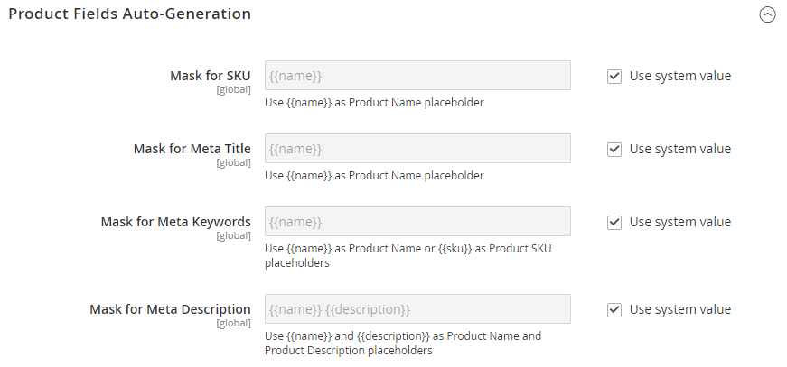
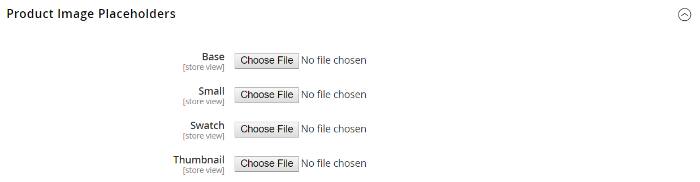
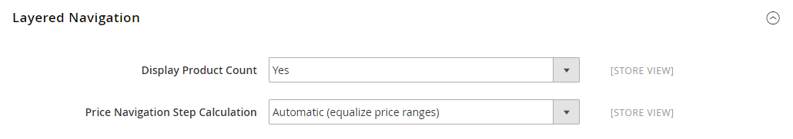

# [!UICONTROL Catalog] > [!UICONTROL Catalog]

{{config}}

## [!UICONTROL Product Fields Auto-Generation]

<!-- zoom -->

<!-- [Product Fields Auto-Generation](https://docs.magento.com/user-guide/catalog/product-fields-autogenerated.html) -->

| Fält | [Omfång](../../getting-started/websites-stores-views.md#scope-settings) | Beskrivning |
|--- |--- |--- |
| [!UICONTROL Mask for SKU] | Global | Bestämmer SKU-fältets standardvärde baserat på platshållarvärden från andra fält och eventuell ytterligare text som anges. Standardplatshållare:  Produktnamn - `{{name}}` |
| [!UICONTROL Mask for Meta Title] | Global | Bestämmer standardvärdet för fältet Meta Title baserat på platshållarvärden från andra fält och eventuell ytterligare text som anges. Standardplatshållare:  Produktnamn - `{{name}}` |
| [!UICONTROL Mask for Meta Keywords] | Global | Bestämmer standardvärdet för _Meta-nyckelord_ fält baserat på platshållarvärden från andra fält och eventuell ytterligare text som anges. Standardplatshållare:  Produktnamn - `{{name}}` |
| [!UICONTROL Mask for Meta Description] | Global | Bestämmer standardvärdet för fältet Metabeskrivning baserat på platshållarvärden från andra fält och eventuell ytterligare text som anges. Standardplatshållare:  Produktnamn - `{{name}}`  Beskrivning - `{{description}}` |

{style="table-layout:auto"}

## [!UICONTROL Product Reviews]

<!-- zoom -->

<!-- [Product Reviews](https://docs.magento.com/user-guide/marketing/product-reviews.html) -->

| Fält | [Omfång](../../getting-started/websites-stores-views.md#scope-settings) | Beskrivning |
|--- |--- |--- |
| [!UICONTROL Enabled] | Butiksvy | Aktiverar produktrecensioner. Alternativ: `Yes` / `No` |
| [!UICONTROL Allow Guests to Write Reviews] | Webbplats | Avgör om kunderna måste öppna ett konto hos din butik för att kunna skriva produktrecensioner. |

{style="table-layout:auto"}

## [!UICONTROL Storefront]

<!-- zoom -->

<!-- [Storefront](https://docs.magento.com/user-guide/catalog/navigation-product-listings.html) -->

| Fält | [Omfång](../../getting-started/websites-stores-views.md#scope-settings) | Beskrivning |
|--- |--- |--- |
| [!UICONTROL List Mode] | Butiksvy | Bestämmer formatet för sökresultatlistan. Alternativ:  **`Grid Only`**- Formaterar listan som ett rutnät med rader och kolumner. Varje produkt visas i en enda cell i rutnätet. **`List Only`** - Formaterar listan med varje produkt på en separat rad.  **`Grid (default / List)`**- Produkterna visas som standard i stödrastervyn och kan växlas till listvyn. **`List (default / Grid)`** - Produkterna visas som standard i listvyn och kan växlas till stödrastervyn. |
| [!UICONTROL Products per Page on Grid Allowed Values] | Butiksvy | Anger hur många produkter som visas i stödrastervyn. Ange flera värden avgränsade med kommatecken om du vill välja alternativ. |
| [!UICONTROL Products per Page on Grid Default Value] | Butiksvy | Anger hur många produkter som visas per sida som standard i stödrastervyn. |
| [!UICONTROL Products per Page on List Allowed Values] | Butiksvy | Bestämmer antalet produkter som visas i listvyn. Ange flera värden avgränsade med kommatecken om du vill välja alternativ. |
| [!UICONTROL Products per Page on List Default Value] | Butiksvy | Anger antalet produkter som visas per sida som standard i listvyn. |
| Produktlista sortera efter | Butiksvy | Bestämmer sorteringsordningen i sökresultatlistan. Valet av alternativ avgörs av kategorins visningsinställningar och de tillgängliga attribut som anges som `Used for Sorting in Product Listing`. Standardvärdet är `Use All Available Attributes` och innehåller vanligtvis Bästa värde, Namn, Pris. Den här inställningen gäller inte för [!DNL Live Search] [Sidwidget för produktlista](https://experienceleague.adobe.com/en/docs/commerce-merchant-services/live-search/live-search-storefront/plp-styling). |
| [!UICONTROL Allow All Products per Page] | Butiksvy | Om inställt på `Yes`, innehåller `ALL` i kontrollen &quot;Visa per sida&quot;. |
| [!UICONTROL Remember Category Pagination] | Global | Om inställt på `Yes`, sparas de aktuella sidnumreringsvärdena för kategorier när kunderna bläddrar från en kategori till en annan i [produktlistor](../../catalog/navigation-product-listings.md). När du sparar värdet används mer lagringsutrymme och det kan påverka hur sidor indexeras av sökmotorer. Alternativ: `Yes` / `No` (standard) |
| [!UICONTROL Use Flat Catalog Category] | Global | Aktiverar [platt kategoristruktur](../../catalog/catalog-flat.md) (rekommenderas inte). Alternativ: `Yes` / `No` |
| [!UICONTROL Use Flat Catalog Product] | Global | Aktiverar plattproduktstrukturen. (rekommenderas inte) Alternativ: `Yes` / `No` |
| [!UICONTROL Swatches per Product] | Butiksvy | Anger antalet tillgängliga färgrutor för varje produkt. Standard: `16` |
| [!UICONTROL Show Swatches in Product List] | Butiksvy | Anger om färgrutorna visas i produktlistan. Alternativ: `Yes` / `No` |
| [!UICONTROL Show Swatch Tooltip] | Butiksvy | Anger om verktygstipset för färgrutan visas. Alternativ: `Yes` / `No` |

{style="table-layout:auto"}

## [!UICONTROL Product Alerts]

<!-- zoom -->

<!-- [Product Alerts](https://docs.magento.com/user-guide/catalog/inventory-product-alerts.html) -->

| Fält | [Omfång](../../getting-started/websites-stores-views.md#scope-settings) | Beskrivning |
|--- |--- |--- |
| [!UICONTROL Allow Alerts When Product Price Changes] | Butiksvy | Avgör om det finns e-postaviseringar tillgängliga för produktprisändringar. Alternativ: `Yes` / `No` |
| [!UICONTROL Price Alert Email Template] | Butiksvy | Identifierar mallen som används för e-postaviseringar om produktprisändringar. Standardmall: `Product price alert` |
| [!UICONTROL Allow Alert When Product Comes Back in Stock] | Webbplats | Avgör om kunderna kan välja att få en avisering när produkten kommer tillbaka i lager. Alternativ: `Yes` / `No` |
| [!UICONTROL Stock Alert Email Template] | Butiksvy | Identifierar mallen som används för e-postmeddelanden om lagervarningar. Standardmall: `Product stock alert` |
| [!UICONTROL Alert Email Sender] | Butiksvy | Bestämmer butikskontakten som visas som avsändare av produktvarningsmeddelandet. Alternativ: `General Contact` / `Sales Representative` / `Customer Support` / `Custom Email` |

{style="table-layout:auto"}

## [!UICONTROL Product Alerts Run Settings]

<!-- zoom -->

<!-- [Product Alerts Run Settings](https://docs.magento.com/user-guide/catalog/inventory-product-alert-run-settings.html) -->

| Fält | [Omfång](../../getting-started/websites-stores-views.md#scope-settings) | Beskrivning |
|--- |--- |--- |
| [!UICONTROL Frequency] | Global | Välj hur ofta produktvarningar skickas ut. Alternativ: `Daily` / `Weekly` / `Monthly` |
| [!UICONTROL Start Time] | Global | Välj vilken tid på dagen som produktaviseringsprocessen ska starta. Den här tiden ska vara efter att pris- eller lageruppdateringar har utförts. |
| [!UICONTROL Error Email Recipient] | Global | Identifiera e-postadressen till den person (vanligtvis en butiksadministratör) som ska få ett e-postmeddelande när ett fel uppstår i produktaviseringsprocessen. |
| [!UICONTROL Error Email Sender] | Global | Välj rollen som e-postmeddelandet är `from`. |
| [!UICONTROL Error Email Template] | Global | Välj den e-postmall som ska användas för felmeddelanden för produktaviseringar. |

{style="table-layout:auto"}

## [!UICONTROL Product Image Placeholders]

<!-- zoom -->

<!-- [Product Image Placeholders](https://docs.magento.com/user-guide/catalog/product-image-placeholders.html) -->

| Fält | [Omfång](../../getting-started/websites-stores-views.md#scope-settings) | Beskrivning |
|--- |--- |--- |
| [!UICONTROL Base Image] | Butiksvy | Identifierar platshållarfilen som valts för basbilden. |
| [!UICONTROL Small Image] | Butiksvy | Identifierar platshållarfilen som valts för den lilla bilden. |
| [!UICONTROL Swatch] | Butiksvy | Identifierar platshållarfilen som valts för färgrutan. |
| [!UICONTROL Thumbnail] | Butiksvy | Identifierar platshållarfilen som valts för miniatyrbilden. |
| [!UICONTROL Choose File] |  | Navigerar till filen och överför den som platshållarbild för typen. |

{style="table-layout:auto"}

## [!UICONTROL Recently Viewed/Compared Products]

<!-- zoom -->

<!-- Recently Viewed/Compared Products](https://docs.magento.com/user-guide/marketing/products-viewed-compared.html) -->

| Fält | [Omfång](../../getting-started/websites-stores-views.md#scope-settings) | Beskrivning |
|--- |--- |--- |
| [!UICONTROL Synchronize widget products with backend storage] | Global | Anger synkroniseringen av produktwidgetinformation, t.ex. produkt-ID, med databasen. På så sätt kan information återanvändas på andra enheter. |
| [!UICONTROL Show for Current] | Webbplats | Begränsar de produkter som visas till den aktuella webbplatsen. Alternativ: `Website` / `Store` / `Store View` |
| [!UICONTROL Default Recently Viewed Products Count] | Butiksvy | Anger det maximala antalet nyligen visade produkter som visas i listan. |
| [!UICONTROL Default Recently Compared Products Count] | Butiksvy | Anger det maximala antalet nyligen jämförda produkter som visas i listan. |
| [!UICONTROL Lifetime of products in Recently Viewed Widget] | Global | Avgör hur länge i sekunder som visade produkter visas i listan över senast visade. |
| [!UICONTROL Lifetime of products in Recently Compared Widget] | Global | Avgör hur länge jämförda produkter visas i listan över senast jämförda produkter i sekunder. |

{style="table-layout:auto"}

## [!UICONTROL Product Video]

<!-- zoom -->

<!-- [Product Videos](https://docs.magento.com/user-guide/catalog/product-video.html) -->

| Fält | [Omfång](../../getting-started/websites-stores-views.md#scope-settings) | Beskrivning |
|--- |--- |--- |
| [!UICONTROL YouTube API key] | Butiksvy | Anger den API-nyckel som krävs för att ansluta till YouTube-servern. |
| [!UICONTROL Autostart base video] | Butiksvy | Om du vill starta videon automatiskt när sidan har lästs in anger du att `Yes`. |
| [!UICONTROL Show related video] | Butiksvy | Om du vill visa relaterade videoklipp anger du `Yes`. |
| [!UICONTROL Auto restart video] | Butiksvy | Om du vill aktivera automatisk uppspelning av video anger du `Yes`. |

{style="table-layout:auto"}

## [!UICONTROL Price]

<!-- zoom -->

<!--Price](https://docs.magento.com/user-guide/catalog/catalog-price-scope.html) -->

| Fält | [Omfång](../../getting-started/websites-stores-views.md#scope-settings) | Beskrivning |
|--- |--- |--- |
| [!UICONTROL Catalog Price Scope] | Global | Bestämmer omfattningen för basvalutan. Alternativ: `Global` / `Website` |
| [!UICONTROL Default Product Price] | Global |  (Endast Adobe Commerce) Definierar standardproduktpriset, om tillämpligt. |

{style="table-layout:auto"}

## [!UICONTROL Layered Navigation]

>[!NOTE]
>
>Standardsökkonfigurationen som beskrivs i det här avsnittet skiljer sig åt för [Live Search](https://experienceleague.adobe.com/docs/commerce-merchant-services/live-search/overview.html).

<!-- [Layered Navigation - Automatic (equalize price ranges)](https://docs.magento.com/user-guide/catalog/navigation-layered-configuration.html) -->

<!-- zoom -->

<!-- zoom -->

<!-- zoom -->

| Fält | [Omfång](../../getting-started/websites-stores-views.md#scope-settings) | Beskrivning |
|--- |--- |--- |
| [!UICONTROL Display Product Count] | Butiksvy | Avgör om produktantalet visas efter varje attribut, prisintervall och kategori. Alternativ: `Yes` / `No` |
| [!UICONTROL Price Navigation Step Calculation] | Butiksvy | Bestämmer vilken metod som används för att bestämma [prisnavigeringssteg](../../catalog/navigation-layered.md#configure-price-navigation)). Alternativ:  `Automatic (equalize price ranges)` - Baserar beräkningen på prisintervallet för produkter i gruppen.  `Automatic (equalize product counts)` - Baserar beräkningen av antalet produkter i gruppen. Fastställer ett tröskelvärde för minsta antal produkter i gruppen, för att förhindra att de delas upp i mindre grupper.  `Manual` - Använder divisionsgränsen som du anger för prisintervall. |
| [!UICONTROL Default Price Navigation Step] | Butiksvy | Anger antalet produkter som ingår i varje steg. |
| [!UICONTROL Maximum Number of Price Intervals] | Butiksvy | Fastställer en gräns för antalet prisintervall som visas i lagerstyrd navigering. |

{style="table-layout:auto"}

## [!UICONTROL Category Permissions]

{{ee-feature}}

<!-- zoom -->

<!-- [Category Permissions](https://docs.magento.com/user-guide/catalog/category-permissions.html) -->

| Fält | [Omfång](../../getting-started/websites-stores-views.md#scope-settings) | Beskrivning |
|--- |--- |--- |
| [!UICONTROL Enable] | Global | Aktiverar kategoribegränsningar. Som standard begränsas alla kategorier när du använder den här funktionen. Alternativ: `Yes` / `No` |
| [!UICONTROL Allow Browsing Category] | Webbplats | Bestämmer vem som får bläddra igenom kategorier. Alternativ:  `Yes, for Everyone` - Alla besökare och kunder kan bläddra i kategorin.  `Yes, for Specified Customer Groups` - Tillåter endast medlemmar i valda kundgrupper att bläddra i kategorin.  `No, Redirect to Landing Page` - Nekar åtkomst till kategorin och dirigerar om den till den valda sidan. |
| [!UICONTROL Display Product Prices] | Webbplats | Kontrollerar visningen av produktpriser för kategorin. Alternativ:  `Yes, for Everyone` - Alla kan se priset på produkterna i kategorin.  `Yes, for Specified Customer Groups` - Tillåter endast medlemmar i valda kundgrupper att se priset på produkter i kategorin.  `No` - Stänger av visningen av produktpriser för kategorin. |
| [!UICONTROL Allow Adding to Cart] | Webbplats | Bestämmer vem som kan köpa produkter från kategorin. Alternativ:  `Yes, for Everyone` - Alla kan placera produkter från kategorin i sina kundvagnar.  `Yes, for Specified Customer Groups` - Tillåter endast medlemmar i valda kundgrupper att placera produkter från kategorin i sina kundvagnar.  `No` - Ingen får placera produkter från kategorin i sina kundvagnar. |
| [!UICONTROL Disallow Catalog Search by] | Webbplats | Identifierar de kundgrupper som inte tillåts söka efter produkter i kategorin. |

{style="table-layout:auto"}

## [!UICONTROL Search Engine Optimization]

<!-- zoom -->

<!-- [Search Engine Optimization](https://docs.magento.com/user-guide/catalog/product-search-engine-optimization.html) -->

| Fält | [Omfång](../../getting-started/websites-stores-views.md#scope-settings) | Beskrivning |
|--- |--- |----------------------------------------------------------------------------------------------------------------------------------------------------------------------------------------------------------------------------------------------------------------------------------------------------------------------------------------------------------------------------------------------------------|
| [!UICONTROL Popular Search Terms] | Butiksvy | Bestämmer om _Vanliga sökvillkor_ implementeras i butiken. Den här inställningen gäller inte för butiker som använder [Live Search](https://experienceleague.adobe.com/docs/commerce-merchant-services/live-search/overview.html). Alternativ: `Enable` / `Disable` |
| [!UICONTROL Product URL Suffix] | Butiksvy | Avgör om ett suffix, till exempel html eller htm, används på produkt-URL:er. Om det används ska du inte ange någon punkt före suffixet, eftersom det tillämpas automatiskt. |
| [!UICONTROL Category URL Suffix] | Butiksvy | Avgör om ett suffix, till exempel html eller htm, används på kategorins URL:er. Om det används ska du inte ange någon punkt före suffixet, eftersom det tillämpas automatiskt. |
| [!UICONTROL Use Categories Path for Product URLs] | Butiksvy | Anger om kategorisökvägar ingår i produkt-URL:er. Om du gör det kan flera URL-adresser peka på samma sida, vilket kan påverka sökordningen. Mer information finns på [Kanonisk meta-tagg](../../merchandising-promotions/meta-data.md#canonical-meta-tag). |
| [!UICONTROL Create Permanent Redirect for URLs if URL Key Changed] | Butiksvy | Avgör om en permanent omdirigering skapas automatiskt när en URL-nyckel ändras. När det är implementerat är kryssrutan Skapa anpassad omdirigering för gammal URL under fältet för produkt-URL-nyckel markerad som standard. Alternativ: `Yes` / `No` |
| [!UICONTROL Generate "category/product" URL Rewrites] | Global | Avgör om Adobe Commerce genererar data och sparar dem i omskrivningstabeller när en användare sparar en kategori som innehåller många tilldelade produkter. Alternativ: `Yes` / `No`   **_Viktigt:_**Om du sparar dessa genererade data i en URL-omskrivningstabell kan prestandan försämras. Se [Automatiska produktomdirigeringar](../../merchandising-promotions/url-redirect-product-automatic.md) för mer information. |
| [!UICONTROL Apply transliteration for product URL] | Butiksvy | Avgör om translitterering används när produkt-URL:er skapas eller uppdateras. Alternativ: `Yes` / `No`. Standardvärdet är `Yes`.   I vissa fall bör du inaktivera translitterering. Om du till exempel har en webbutik på kinesiska rekommenderar SEO att URL:er för produkten matchar produktnamnet. Ställ in alternativet till `No` tillåter att kinesiska tecken används i produkt-URL:er i stället för ASCII-motsvarigheter. |
| [!UICONTROL Page Title Separator] | Butiksvy | Identifierar tecknet som skiljer kategorinamnet och underkategorin åt i webbläsarens namnlist. |
| [!UICONTROL Use Canonical Link Meta Tag for Categories] | Butiksvy | Om det finns flera URL:er som pekar på samma kategorisida använder det här alternativet en kanonisk meta-tagg för att identifiera den kategori-URL som sökmotorer ska indexera. URL:en innehåller ett fullständigt namn till kategorin med meta-taggen. Detta minskar dubblettinnehållet och förbättrar SEO. Alternativ: `Yes` / `No` |
| [!UICONTROL Use Canonical Link Meta Tag for Products] | Butiksvy | Om det finns flera URL:er som pekar på samma produktsida använder det här alternativet en kanonisk meta-tagg för att identifiera den produkt-URL som sökmotorer ska indexera. URL:en innehåller ett fullständigt namn till produkten med meta-taggen. Detta minskar dubblettinnehållet och förbättrar SEO. Alternativ: `Yes` / `No` |

{style="table-layout:auto"}

## [!UICONTROL Category Top Navigation]

<!-- zoom -->

<!-- Category Top Navigation](https://docs.magento.com/user-guide/catalog/navigation-top.html) -->

| Fält | [Omfång](../../getting-started/websites-stores-views.md#scope-settings) | Beskrivning |
|--- |--- |--- |
| [!UICONTROL Maximal Depth] | Global | Anger antalet underkategorinivåer i den övre navigeringen. Standardvärdet för `0` placerar ingen gräns för antalet nivåer. |

{style="table-layout:auto"}

## [!UICONTROL Catalog Search]

Det finns två varianter av katalogsökningskonfigurationen: De inställningar som är tillgängliga när [[!DNL Live Search]](https://experienceleague.adobe.com/docs/commerce-merchant-services/live-search/overview.html) installeras och de som finns för Adobe Commerce. Följ instruktionerna för installationen.

### Adobe Commerce med [!DNL Live Search]

När Live Search är installerat innehåller katalogsökningen följande konfigurationsinställningar:

<!-- zoom -->

<!-- [Catalog Search for Live Search](https://docs.magento.com/user-guide/catalog/search-configuration.html) -->

| Fält | [Omfång](../../getting-started/websites-stores-views.md#scope-settings) | Beskrivning |
|--- |--- |--- |
| [!UICONTROL Minimal Query Length] | Butiksvy | Det minsta antalet tecken som tillåts i en katalogsökning. Värdet som anges för det här alternativet måste vara kompatibelt med motsvarande intervall som anges i sökmotorkonfigurationerna för Elasticsearch. Om du till exempel anger det här värdet som `2` i Adobe Commerce, uppdatera värdet i sökmotorn. |
| [!UICONTROL Maximum Query Length] | Butiksvy | Det maximala antalet tecken som tillåts i en katalogsökning. Värdet som anges för det här alternativet måste vara kompatibelt med motsvarande intervall som anges i sökmotorkonfigurationerna för Elasticsearch. Om du till exempel anger värdet 300 i Adobe Commerce, uppdaterar du värdet i sökmotorn. |
| [!UICONTROL Number of top search results to cache] | Butiksvy | Antalet populära söktermer och sökresultat som ska cachelagras för snabbare svar. Ange värdet för `0` cachelagrar alla söktermer och sökresultat när de anges en andra gång. Standardvärde: `100` |
| [!UICONTROL Autocomplete Limit] | Butiksvy | Anger det maximala antalet rader som är tillgängliga i [storefront poser] sida. Standardvärdet kan ändras när Live Search installeras och uppdateras senare genom att den här konfigurationsinställningen ändras. Standardvärde: `8` |

{style="table-layout:auto"}

### Adobe Commerce med Elasticsearch

Inbyggda Adobe Commerce med Elasticsearch innehåller följande konfigurationsinställningar:

<!-- zoom -->

<!-- [Catalog Search](https://docs.magento.com/user-guide/catalog/search-configuration.html) -->

>[!IMPORTANT]
>
>På grund av att supporten för Elasticsearch 7 upphör i augusti 2023 rekommenderas att alla Adobe Commerce-kunder migrerar till sökmotorn OpenSearch 2.x. Mer information om hur du migrerar sökmotorn under uppgraderingen finns i [Migrerar till OpenSearch](https://experienceleague.adobe.com/docs/commerce-operations/upgrade-guide/prepare/opensearch-migration.html) i _Uppgraderingshandbok_.

| Fält | [Omfång](../../getting-started/websites-stores-views.md#scope-settings) | Beskrivning |
|--- |--- |--- |
| [!UICONTROL Minimal Query Length] | Butiksvy | Det minsta antalet tecken som tillåts i en katalogsökning. Värdet som anges för det här alternativet måste vara kompatibelt med motsvarande intervall som anges i sökmotorkonfigurationerna för Elasticsearch. Om du till exempel anger det här värdet som `2` i Adobe Commerce, uppdatera värdet i sökmotorn. |
| [!UICONTROL Maximum Query Length] | Butiksvy | Det maximala antalet tecken som tillåts i en katalogsökning. Värdet som anges för det här alternativet måste vara kompatibelt med motsvarande intervall som anges i sökmotorkonfigurationerna för Elasticsearch. Om du till exempel anger värdet 300 i Adobe Commerce, uppdaterar du värdet i sökmotorn. |
| [!UICONTROL Number of top search results to cache] | Butiksvy | Antalet populära söktermer och sökresultat som ska cachelagras för snabbare svar. Ange värdet för `0` cachelagrar alla söktermer och sökresultat när de anges en andra gång. Standardvärde: `100` |
| [!UICONTROL Enable EAV Indexer] | Global | Avgör om du vill aktivera eller inaktivera indexeraren för produkt-EAV. Den här funktionen förbättrar indexeringshastigheten och begränsar indexeraren från att användas av tillägg från tredje part. Det här alternativet visas endast för sökmotorer med Elasticsearch eller Elasticsearch 5.0+. Standardalternativ: `Yes` för aktiverad |
| [!UICONTROL Autocomplete Limit] | Butiksvy | Det maximala antalet sökfrågor som ska visas under sökfältet för automatisk ifyllning av sökning. Om du begränsar den här mängden ökar sökningens prestanda och storleken på den visade listan minskar. Standardvärde: `8` |
| Sökmotor | Global | Identifierar den sökmotor som krävs för att bearbeta begäranden om katalogdata. Elasticsearch 7.6.x krävs för alla installationer av Adobe Commerce. Alternativ: `Elasticsearch 7` |
| [!UICONTROL Elasticsearch Server Hostname] | Global | Anger Elasticsearch-serverns namn. Standardvärde: `elasticsearch.internal` |
| [!UICONTROL Elasticsearch Server Port] | Global | Anger antalet serverportar som används av Elasticsearch. Standardvärde: `9200` |
| [!UICONTROL Elasticsearch Index Prefix] | Global | Tilldelar ett prefix som identifierar indexvärdet för Elasticsearch. Standardvärde: `magento2` |
| [!UICONTROL Enable Elasticsearch HTTP Auth] | Global | Om det här alternativet är aktiverat används HTTP-autentisering för att fråga efter användarnamn och lösenord innan Elasticsearch Server används. Alternativ: `Yes` / `No` |
| [!UICONTROL Elasticsearch HTTP Username] | Global | När _Aktivera Elasticsearch HTTP-autentisering_ är inställd på `Yes`, anger användarnamnet för Elasticsearch HTTP-autentisering. |
| [!UICONTROL Elasticsearch HTTP Password] | Global | När _Aktivera Elasticsearch HTTP-autentisering_ är inställd på `Yes`, anger lösenordet för Elasticsearch HTTP-autentisering. |
| [!UICONTROL Elasticsearch Server Timeout] | Global | Anger antalet sekunder innan serverns timeout inträffar. Standardvärde: `15` |
| [!UICONTROL Test Connection] |  | Validerar Elasticsearch-anslutningen. |
| [!UICONTROL Enable Search Recommendations] | Butiksvy | Avgör om sökrekommendationer erbjuds när en sökning inte ger några resultat och visas under `Related search terms` på sökresultatsidan. Alternativ: `Yes` / `No`  Om inställningen är Ja visas ytterligare alternativ för _[!UICONTROL Search Recommendations Count]_och_[!UICONTROL Shows Results Count for Each Recommendation]_. |
| [!UICONTROL Search Recommendations Count] | Butiksvy | Anger antalet söktermer som erbjuds som rekommendationer. Som standard visas inte fler än fem. |
| [!UICONTROL Show Results Count for Each Recommendation] | Butiksvy | När inställt på `Yes`, visas antalet produkter som hittats för den föreslagna sökrekommendationen inom parentes. Alternativ: `Yes` / `No` |
| [!UICONTROL Enable Search Suggestions] | Butiksvy | Avgör om sökförslag visas för vanliga felstavningar. När det här alternativet är aktiverat visas sökförslag för alla förfrågningar som inte ger några resultat och som visas under `Did you mean` i **Sökresultat** sida. Sökförslag kan påverka sökresultatet. När inställt på `Yes`visas ytterligare alternativ för Aktivera sökning i Recommendations och tillhörande fält. Alternativ: `Yes` / `No` |
| [!UICONTROL Search Suggestions Count] | Butiksvy | Anger antalet sökförslag som erbjuds. Till exempel: `2` |
| [!UICONTROL Show Results Count for Each Suggestion] | Butiksvy | Anger om antalet sökresultat visas för varje förslag. Beroende på temat visas numret oftast inom hakparenteser efter förslaget. Alternativ: `Yes` / `No` |
| [!UICONTROL Minimum Terms to Match] | Butiksvy | Anger ett värde som motsvarar antalet termer i frågan som sökresultaten ska matcha för att returneras. Detta ger optimala resultat och relevans för kunderna. Procentvärden motsvarar ett tal och vid behov avrundas nedåt och används som minsta antal termer som ska matchas i frågan. Värdet kan vara ett negativt eller positivt heltal, ett negativt eller ett positivt tal, en kombination av de två eller flera kombinationerna. Mer information finns på [minimum_should_match, parameter](https://www.elastic.co/guide/en/elasticsearch/reference/current/query-dsl-minimum-should-match.html) i dokumentationen för Elasticsearch. |

{style="table-layout:auto"}

## [!UICONTROL Downloadable Product Options]

<!-- zoom -->

<!-- [Downloadable Product Options](https://docs.magento.com/user-guide/catalog/product-download-options.html) -->

| Fält | [Omfång](../../getting-started/websites-stores-views.md#scope-settings) | Beskrivning |
|--- |--- |--- |
| [!UICONTROL Order Item Status to Enable Downloads] | Webbplats | Anger den status som en order måste ha innan hämtningar blir tillgängliga. Alternativ: `Pending` / `Invoiced` |
| [!UICONTROL Default Maximum Number of Downloads] | Webbplats | Fastställer standardantalet nedladdningar som är tillgängliga för en kund. |
| [!UICONTROL Shareable] | Webbplats | Avgör om kunderna måste logga in på sina konton för att komma åt nedladdningslänken. Alternativ:  **Ja** - Länken kan skickas med e-post, som sedan kan delas med andra.  **Nej** - Kunder måste logga in på sina konton för att få åtkomst till nedladdningslänken. |
| [!UICONTROL Default Sample Title] | Butiksvy | Standardtiteln för alla exempelfiler. |
| [!UICONTROL Default Link Title] | Butiksvy | Standardlänken för alla nedladdningsbara titlar. |
| [!UICONTROL Opens Links in New Window] | Webbplats | Avgör om nedladdningslänken öppnas i ett nytt webbläsarfönster. Alternativ: `Yes` / `No` |
| [!UICONTROL Use Content Disposition] | Butiksvy | Avgör hur länken till det hämtningsbara innehållet levereras, som en e-postbilaga eller som en infogad länk i ett webbläsarfönster. Alternativ:  **`Attachment`**- Hämtningslänken levereras som en e-postbilaga. **`Inline`** - Hämtningslänken levereras som en intern länk på en webbsida. |
| [!UICONTROL Disable Guest Checkout if Cart Contains Downloadable Items] | Webbplats | Avgör om gäster som köper hämtningsbara produkter måste registrera sig för ett konto och logga in för att slutföra utcheckningsprocessen. Alternativ:  **`Yes`**- Om kundvagnen innehåller hämtningsbara produkter måste gästen antingen registrera sig för ett konto eller logga in på ett befintligt konto för att slutföra köpet. **`No`** - Hämtningslänken levereras som en intern länk i e-postmeddelandets brödtext.    _**Obs!**_ Gästutcheckning är bara tillgänglig för nedladdningsprodukter om Delningsbart är inställt på `Yes`. |

{style="table-layout:auto"}

## [!UICONTROL Date & Time Custom Options]

<!-- zoom -->

<!-- Date & Time Custom Options](https://docs.magento.com/user-guide/stores/attribute-date-time-options.html) -->

| Fält | [Omfång](../../getting-started/websites-stores-views.md#scope-settings) | Beskrivning |
|--- |--- |--- |
| [!UICONTROL Use JavaScript Calendar] | Butiksvy | Avgör om JavaScript-kalendern används som indatakontroll för datumfält. Alternativ: `Yes` / `No`  Om inställt på `No`visas en separat listruta för varje del av datumfältet. |
| [!UICONTROL Date Fields Order] | Butiksvy | Fastställer ordningen för de tre datumfälten. Alternativ: `Day` / `Month` / `Year` |
| [!UICONTROL Time Format] | Butiksvy | Anger tidsformatet till antingen 12 eller 24 timmar. Alternativ: `12h AM/PM` / `24h` |
| [!UICONTROL Year Range] | Butiksvy | Definierar start- och slutintervallet för år som visas i _År_ fält. Värdet måste anges i YYYY-format. |

{style="table-layout:auto"}

## [!UICONTROL Catalog Events]

{{ee-feature}}

<!-- zoom -->

<!-- [Catalog Events](https://docs.magento.com/user-guide/marketing/events-private-sales.html) -->

| Fält | [Omfång](../../getting-started/websites-stores-views.md#scope-settings) | Beskrivning |
|--- |--- |--- |
| [!UICONTROL Enable Catalog Events Functionality] | Webbplats | Avgör om händelsemodulen är aktiverad. |
| [!UICONTROL Enable Catalog Event Widget on Frontend] | Butiksvy | Avgör om händelsewidgeten är tillgänglig i butiken. Detta är ett statiskt block med information om händelser på din plats. |
| [!UICONTROL Number of Events to be Displayed in the Event Slider Widget] | Butiksvy | Anger antalet händelser som visas i widgeten för händelseglaget på kategorisidorna. Använd `limit="x"` variabel. |
| [!UICONTROL Events to Scroll per Click in Event Slider Widget] | Butiksvy | Avgör antalet händelser som visas i händelseglagwidgeten på CMS-sidor, t.ex. hemsidan. Använd `scroll="x"` variabel. |

{style="table-layout:auto"}

## [!UICONTROL Rule-Based Product Relations]

{{ee-feature}}

<!-- zoom -->

<!-- [Rule-Based Product Relations](https://docs.magento.com/user-guide/marketing/product-related-rules.html) -->

| Fält | [Omfång](../../getting-started/websites-stores-views.md#scope-settings) | Beskrivning |
|--- |--- |--- |
| [!UICONTROL Maximum Number of Products in Related Products List] | Global | Anger det högsta antalet produkter som kan visas i _Samhörande produkter_ lista. |
| [!UICONTROL Show Related Products] | Global | Avgör vilken lista över relaterade produkter som visas i butiken. Det kan vara antingen den lista som väljs manuellt i produktinformationen, den lista som skapas som svar på en produktrelationsregel eller en kombination av de två. Alternativ: `Both Selected and Rule-Based` / `Selected Only` / `Rule-Based Only` |
| [!UICONTROL Rotation Mode for Products in Related Products List] | Global | Bestämmer i vilken ordning produkterna i _Samhörande produkter_ visas. Alternativ: `Do not rotate` / `Shuffle` |
| [!UICONTROL Maximum Number of Products in Cross-Sell Product List] | Global | Anger det maximala antalet produkter som kan visas i korsförsäljningslistan. |
| [!UICONTROL Show Cross-Sell Products] | Global | Avgör vilken lista över korsförsäljningsprodukter som visas i butiken. Det kan vara antingen den lista som väljs manuellt i produktinformationen, den lista som skapas som svar på en produktrelationsregel eller en kombination av de två. Alternativ: `Both Selected and Rule-Based` / `Selected Only` / `Rule-Based Only` |
| [!UICONTROL Rotation Mode for Products in Cross-Sell Products List] | Global | Bestämmer i vilken ordning produkterna i korsförsäljningslistan visas. Alternativ: Rotera inte/Blanda inte |
| [!UICONTROL Maximum Number of Products in Upsell Product List] | Global | Anger det högsta antalet produkter som kan visas i _Merförsäljning_ lista. |
| [!UICONTROL Show Upsell Products] | Global | Avgör vilken lista över merförsäljningsprodukter som visas i butiken. Det kan vara antingen den lista som väljs manuellt i produktinformationen, den lista som skapas som svar på en produktrelationsregel eller en kombination av de två. Alternativ: `Both Selected and Rule-Based` / `Selected Only` / `Rule-Based Only` |
| [!UICONTROL Rotation Mode for Products in Upsell Product List] | Global | Anger i vilken ordning produkterna i Upsell Product list visas. Alternativ: `Do not rotate` / `Shuffle` |

{style="table-layout:auto"}
