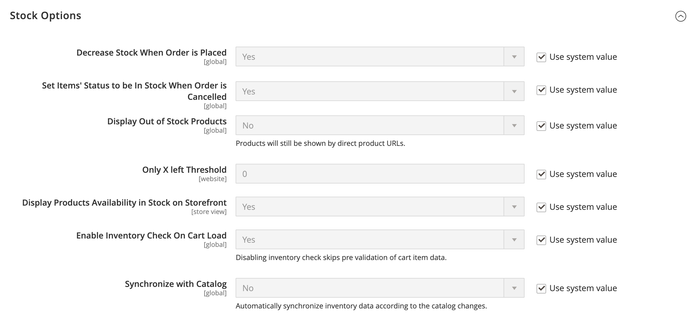

# [!UICONTROL Catalog] > [!UICONTROL Inventory]

{{config}}

>[!NOTE]
>
>[!DNL Inventory Management] för Adobe Commerce och Magento Open Source får ni de verktyg ni behöver för att hantera ert produktlager. Handlare med en enda butik till flera lager, butiker, upphämtningsplatser, avsändare med mera kan använda dessa funktioner för att behålla kvantiteter för försäljning och hantera leveranser för att slutföra beställningar. Mer information om de här funktionerna och hur du kan använda dem för att hantera Stock på flera platser finns i [_[!DNL Inventory Management] Användarhandbok _](https://experienceleague.adobe.com/docs/commerce-admin/inventory/introduction.html).

## [!UICONTROL Stock Options]

<!-- zoom -->

<!-- [Stock Options](https://docs.magento.com/user-guide/catalog/inventory-options-global.html) -->

| Fält | [Omfång](../../getting-started/websites-stores-views.md#scope-settings) | Beskrivning |
|--- |--- |--- |
| [!UICONTROL Decrease Stock When Order is Placed] | Global | Om inställt på `Yes`minskar kvantiteten i lager när ordern läggs. Med _Hantera Stock_ aktiverat, bokningar anges för beställda produkter och kvantiteter. Alternativ: `Yes` / `No` |
| [!UICONTROL Set Items' Status to be in Stock When Order is Cancelled] | Butiksvy | Om inställt på `Yes`, returnerar artiklar till lager när ordern annulleras. Med _Hantera Stock_ aktiverat, bokningen rensas för annullerade produkter och kvantiteter. Alternativ: `Yes` / `No` |
| [!UICONTROL Display Out of Stock Products] | Global | Om inställt på `Yes`, visar produkter som inte finns i lager. Om produktvarningar också är aktiverade kan kunderna registrera sig för att få meddelanden när produkten blir tillgänglig. Alternativ: `Yes` / `No` |
| [!UICONTROL Only X left Threshold] | Webbplats | Fastställer tröskelvärdet för `Only x left` meddelande. Om värdet till exempel är 3 visas meddelandet när det finns tre eller färre objekt i lager. Meddelandet visas inte om värdet är `0`. |
| [!UICONTROL Display products availability in Stock on Storefront] | Butiksvy | Om inställt på `Yes`, visar `In Stock` eller `Out of Stock` på produktsidan. Alternativ: `Yes` / `No` |
| [!UICONTROL Enable Inventory Check On Cart Load] | Global | Avgör om en lagerkontroll utförs när en produkt läses in i kundvagnen. Om du inaktiverar den här lagerkontrollen kan du förbättra prestanda för utcheckningssteg, särskilt när det finns många artiklar i kundvagnen. Men om ni hoppar över förvalideringen kan kunderna se _slut på lager_ fel senare i utcheckningsprocessen. Alternativ: `Yes` / `No` |
| [!UICONTROL Synchronize with Catalog] | Global | När inställt på `Yes`, justeras lagerdata efter katalogändringarna (t.ex. produktborttagningar, SKU-ändringar och ändringar av produkttyper) och säkerställer enhetlighet mellan lager och katalog. Alternativ: `Yes` / `No` |

{:style=&quot;table-layout:auto&quot;}

## [!UICONTROL Product Stock Options]

<!-- zoom -->

<!-- [Product Stock Options](https://docs.magento.com/user-guide/catalog/inventory-options-global.html) -->

| Fält | [Omfång](../../getting-started/websites-stores-views.md#scope-settings) | Beskrivning |
|--- |--- |----------------------------------------------------------------------------------------------------------------------------------------------------------------------------------------------------------------------------------------------------------------------------------------------------------------------------------------------------------------------------------------------------------------------------------------------------------------------------------------------------------------------------------------------------------------------------------------------------------------------------------------------------------------------------------------------------------------------------------------------------------------------------------|
| [!UICONTROL Manage Stock] | Global | Avgör om du använder fullständig lagerkontroll för att hantera artiklarna i din katalog. Alternativ:  **Ja** - Aktiverar fullständig lagerkontroll för att spåra antalet artiklar som för närvarande finns i lager.  **Nej** - spårar inte antalet artiklar som för närvarande finns i lager. |
| [!UICONTROL Backorders] | Global | Avgör hur din butik hanterar restorder. En restorder ändrar inte orderns bearbetningsstatus. Pengarna godkänns eller hämtas direkt när beställningen görs, oavsett om produkten finns i lager eller inte. När produkten blir tillgänglig skickas den. Alternativ:  **Inga bakgrunder** - Tar inte emot restorder när produkten inte finns i lager.  **Tillåt kvantitet under 0** - Accepterar restorder när kvantiteten är under noll.  **Tillåt kvantitet under 0 och meddela kund** - Accepterar restorder när kvantiteten är under noll, men meddelar kunderna att beställningar fortfarande kan göras. |
| [!UICONTROL Use deferred Stock update] | Global |  (Endast Adobe Commerce) Avgör om lageruppdatering ska fördröjas om restorder tillåts ( _Restorder_ är inställt på något annat än `No backorders` standardvärde). Fungerar för en enstaka produkt eller för en hel webbplats och använder _Jobbkö_ mekanism som gör att indikatorerna för lagerkvantitet kan uppdateras asynkront efter att beställningarna har placerats ut. Det här alternativet fungerar även med [Asynkron orderplacering](https://experienceleague.adobe.com/docs/commerce-operations/performance-best-practices/high-throughput-order-processing.html#asynchronous-order-placement) i kombination med [Inventory management](../../inventory-management/introduction.md). |
| Högsta tillåtna antal i kundvagn | Global | Fastställer det högsta antalet produkter som kan köpas i en enda order. Som standard är den maximala kvantiteten satt till 10 000. |
| [!UICONTROL Out-of-Stock Threshold] | Global | Bestämmer lagernivån där en produkt anses vara ur lager. Alternativ:  **Positivt belopp** - med _Restorder_ inaktiverat, ange ett positivt värde. När Restorder är aktiverade ignoreras det här beloppet.  **Noll** - med _Restorder_ aktiverad, ange `0` ger oändliga efterbeställningar.  **Negativt belopp** - med _Restorder_ om det är aktiverat rekommenderar vi att du anger ett negativt belopp. Beloppet läggs till i den säljbara kvantiteten. Ange till exempel -50 om du vill tillåta order upp till detta belopp. |
| [!UICONTROL Minimum Qty Allowed in Shopping Cart] | Global | Bestämmer det minsta beloppet för en artikel som är tillgänglig för inköp enligt kundgrupp. Som standard är den minsta kvantiteten satt till 1. Klicka **[!UICONTROL Add Minimum Qty]** om du vill ange ett annat värde för en viss kundgrupp. |
| [!UICONTROL Notify for Quantity Below] | Global | Fastställer lagernivån där ett meddelande om att lagret har underskridit tröskelvärdet skickas. |
| [!UICONTROL Enable Qty Increments] | Global | Avgör om artiklar kan säljas i kvantitetssteg. Alternativ: `Yes` / `No` |
| [!UICONTROL Qty Increments] | Global | Fastställer antalet produkter som utgör en kvantitetsökning. |
| [!UICONTROL Automatically Return Credit Memo Item to Stock] | Global | Avgör om artiklar på kreditnotor automatiskt returneras till lagret. Alternativ: `Yes` / `No` |

{:style=&quot;table-layout:auto&quot;}

## [!UICONTROL Admin Bulk Operations]

<!-- zoom -->

<!-- [Admin Bulk Operations](https://docs.magento.com/user-guide/catalog/inventory-options-global.html) -->

>[!NOTE]
>
>Konfigurera och ge support **asynkrona köhanterare** måste du använda kommandoraden. Detta kan kräva hjälp av utvecklare. Se [Starta användare i meddelandekön](https://experienceleague.adobe.com/docs/commerce-operations/configuration-guide/cli/start-message-queues.html) i _Konfigurationshandbok_.

| Fält | [Omfång](../../getting-started/websites-stores-views.md#scope-settings) | Beskrivning |
|--- |--- |--- |
| [!UICONTROL Run asynchronously] | Global | Avgör om du kör gruppåtgärder asynkront för massproduktåtgärder inklusive [bulk](../../inventory-management/bulk-assignment.md) tilldela källor, ta bort tilldelning från källor och [överför lager till källa](../../inventory-management/inventory-transfer.md). Den samlar in massåtgärder fram till _[!UICONTROL Asynchronous batch size]_kör sedan dessa åtgärder. Den här funktionen är inaktiverad som standard. Vi rekommenderar att du granskar prestanda med flera åtgärder innan du aktiverar. Alternativ: **`Yes`**- Kör alla gruppåtgärder för [!DNL Inventory Management] asynkront. Om du vill aktivera måste du konfigurera en asynkron köhanterare. **`No`**- Standard. Kör inte gruppåtgärder asynkront. |
| [!UICONTROL Asynchronous batch size] | Global | Ange **[!UICONTROL Run asynchronously]** till `Yes` ange ett värde för _[!UICONTROL Asynchronous batch size]_fält.  Standardbatchstorleken är 100. När gruppprocesser når den här mängden körs de. |

{:style=&quot;table-layout:auto&quot;}

## [!UICONTROL Inventory Indexer Settings]

| Fält | [Omfång](../../getting-started/websites-stores-views.md#scope-settings) | Beskrivning |
|--- |--- |--- |
| [!UICONTROL Stock/Source reindex strategy] | Global | Bestämmer vilken strategi som används för omindexering av lager/källa. Alternativ: `Synchronous` / `Asynchronous` (en asynkron köhanterare måste konfigureras för asynkront läge) |

>[!NOTE]
>
> På grund av behovet av lageruppdateringar för de orderrelaterade aktiviteterna aktiveras också lagerindexeraren när produkten sparas, oavsett `Synchronous` eller `Asynchronous` inställning.

{:style=&quot;table-layout:auto&quot;}

## [!UICONTROL Distance Provider for Distance Based SSA]

<!-- zoom -->

<!-- [Distance Providers for Distance Based SSA](https://docs.magento.com/user-guide/catalog/inventory-configure-distance-priority.html) -->

| Fält | [Omfång](../../getting-started/websites-stores-views.md#scope-settings) | Beskrivning |
|--- |--- |--- |
| [!UICONTROL Provider] | Global | Bestämmer vilken provider som ska användas för algoritmen för val av avståndsprioritetskälla. Den här funktionen är aktiverad som standard. Alternativ:  **`Google MAP`**- Använder Google tjänster för att beräkna avståndet och tiden mellan leveransdestinationsadressen och källplatserna (adress och GPS-koordinater). Det här alternativet kräver en Google API-nyckel och kan medföra avgifter via Google. **`Offline Calculation`** - Beräknar avståndet med hjälp av en inbäddad databas för att fastställa närmaste källa till leveransens måladress. Om du vill använda det här alternativet kan du behöva utvecklarhjälp för att initialt hämta databasplatsinnehållet för alla länder som du levererar till via en kommandorad. |

{:style=&quot;table-layout:auto&quot;}

## [!UICONTROL Google Distance Provider]

<!-- zoom -->

<!-- [Google Distance Provider](https://docs.magento.com/user-guide/catalog/inventory-configure-distance-priority.html) -->

| Fält | [Omfång](../../getting-started/websites-stores-views.md#scope-settings) | Beskrivning |
|--- |--- |--- |
| [!UICONTROL Google API key] | Global | Ange Google API-nyckeln för Google MAP-providern. Nyckeln finns i [!DNL Google Maps Platform] och borde ha [!DNL Geocoding API] och [!DNL Distance Matrix API] aktiverat. Mer information finns i [Konfigurera algoritmen för avståndsprioritet](../../inventory-management/distance-priority-algorithm.md#configure-the-distance-priority-algorithm) i _Inventory management Guide_. |
| [!UICONTROL Computation mode] | Global | Anger riktningar och sökvägar för att beräkna avståndet från leveransadressen och alla källor som är tilldelade till lagret. Som standard används körläget vid beräkningar. Alternativ:  **`Driving`**- Standardinställning, begär standardkörriktningar via vägnätet. **`Walking`** - Begär promenadanvisningar med fotgängare och sidospolar (där sådana finns).  **`Bicycling`**- Begär cykelväggar med cykliska vägar och önskade gator (för närvarande endast tillgängligt i USA och vissa kanadensiska städer). |
| [!UICONTROL Value] | Global | Anger vad som ska beräknas och returneras för avståndet och tiden för källplatserna till leveransdestinationsadressen. Algoritmen Distance Priority (Avståndsprioritet) rekommenderar källan med kortast möjliga avstånd eller tid till leveransadressen, vilket ger snabbare och eventuellt billigare leverans för att leverera försändelser. Alternativ:  **`Distance`**- Returnerar avståndet mellan punkter i mått (kilometer och meter) eller i imperium (engelska mil och fot). **`Time to Destination`** - Returnerar den tid som krävs för att resa från källplatserna till leveransadressen i timmar och minuter. |

{:style=&quot;table-layout:auto&quot;}
