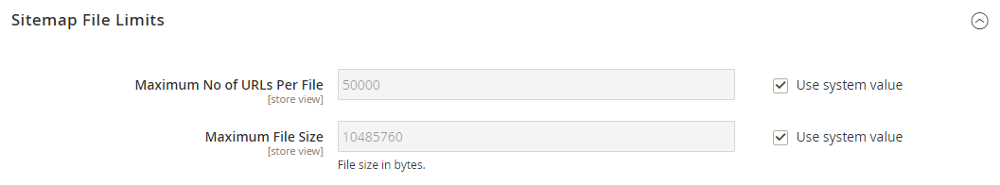

# [!UICONTROL Catalog] > [!UICONTROL XML Sitemap]

{{config}}

## [!UICONTROL Categories Options]

<!-- zoom -->

<!-- [Categories Options](https://experienceleague.adobe.com/sv/docs/commerce-admin/marketing/seo/sitemap-xml) -->

| Fält | [Omfång](../../getting-started/websites-stores-views.md#scope-settings) | Beskrivning |
|--- |--- |--- |
| [!UICONTROL Frequency] | Butiksvy | Anger hur ofta platskartekategorier uppdateras. Alternativ: `Always` / `Hourly` / `Daily` / `Weekly` / `Monthly` / `Yearly` / `Never` |
| [!UICONTROL Priority] | Butiksvy | Ett värde mellan `0.0` och `1.0` som bestämmer prioriteten för uppdateringar av kategoriplatskartan i förhållande till annat innehåll. Noll (`0.0`) har den lägsta prioriteten. |

{style="table-layout:auto"}

## [!UICONTROL Products Options]

<!-- zoom -->

<!-- [Products Options](https://experienceleague.adobe.com/sv/docs/commerce-admin/marketing/seo/sitemap-xml) -->

| Fält | [Omfång](../../getting-started/websites-stores-views.md#scope-settings) | Beskrivning |
|--- |--- |--- |
| [!UICONTROL Frequency] | Butiksvy | Anger hur ofta platskartprodukter uppdateras. Alternativ: `Always` / `Hourly` / `Daily` / `Weekly` / `Monthly` / `Yearly` / `Never` |
| [!UICONTROL Priority] | Butiksvy | Ett värde mellan `0.0` och `1.0` som bestämmer prioriteten för uppdateringar av produktplatskartan i förhållande till annat innehåll. Noll (`0.0`) har den lägsta prioriteten. |
| [!UICONTROL Add Images into Sitemap] | Butiksvy | Anger i vilken utsträckning bilder ska tas med i platskartan. Alternativ: `None` / `Base Only` / `All` |

{style="table-layout:auto"}

## [!UICONTROL CMS Pages Options]

<!-- zoom -->

<!-- [CMS Pages Options](https://experienceleague.adobe.com/sv/docs/commerce-admin/marketing/seo/sitemap-xml) -->

| Fält | [Omfång](../../getting-started/websites-stores-views.md#scope-settings) | Beskrivning |
|--- |--- |--- |
| [!UICONTROL Frequency] | Butiksvy | Anger hur ofta platskartor som CMS-sidor uppdateras. Alternativ: `Always` / `Hourly` / `Daily` / `Weekly` / `Monthly` / `Yearly` / `Never` |
| [!UICONTROL Priority] | Butiksvy | Ett värde mellan `0.0` och `1.0` som avgör prioriteten för CMS sidplatskarta i relation till annat innehåll. Noll (`0.0`) har den lägsta prioriteten. |

{style="table-layout:auto"}

## [!UICONTROL Store Url Options]

| Fält | [Omfång](../../getting-started/websites-stores-views.md#scope-settings) | Beskrivning |
|--- |--- |--- |
| [!UICONTROL Frequency] | Butiksvy | Anger hur ofta URL-adresser ska uppdateras. Alternativ: `Always` / `Hourly` / `Daily` / `Weekly` / `Monthly` / `Yearly` / `Never` |
| [!UICONTROL Priority] | Butiksvy | Ett värde mellan `0.0` och `1.0` som bestämmer prioriteten för uppdatering av butiks-URL i förhållande till annat innehåll. Noll (`0.0`) har den lägsta prioriteten. |

{style="table-layout:auto"}

## [!UICONTROL Generation Settings]

<!-- zoom -->

<!-- [Generation Settings](https://experienceleague.adobe.com/sv/docs/commerce-admin/marketing/seo/sitemap-xml) -->

| Fält | [Omfång](../../getting-started/websites-stores-views.md#scope-settings) | Beskrivning |
|--- |--- |--- |
| [!UICONTROL Enabled] | Butiksvy | Avgör om en XML-platskarta är tillgänglig för butiken. Alternativ: `Yes` / `No` |
| [!UICONTROL Start Time] | Butiksvy | Anger timmen, minuten och sekunden på dagen då platskartan uppdateras. |
| [!UICONTROL Frequency] | Butiksvy | Anger hur ofta platskartan uppdateras. Alternativ: `Daily` / `Weekly` / `Monthly` |
| [!UICONTROL Error Email Recipient] | Butiksvy | E-postadressen till den person som får ett meddelande om ett fel inträffar under platskartuppdateringsprocessen. Om du har flera adresser avgränsar du dem med kommatecken. |
| [!UICONTROL Error Email Sender] | Webbplats | Identifierar den butikskontakt som visas som avsändare av felmeddelandet. Alternativ: `General Contact` / `Sales Representative` / `Customer Support` / `Custom Email 1` / `Custom Email 2` |
| [!UICONTROL Error Email Template] | Webbplats | Identifierar e-postmallen som används för felmeddelandet. Standardmall: `Sitemap generate Warnings` |

{style="table-layout:auto"}

## [!UICONTROL Sitemap File Limits]

<!-- zoom -->

<!-- [Sitemap File Limits](https://experienceleague.adobe.com/sv/docs/commerce-admin/marketing/seo/sitemap-xml) -->

| Fält | [Omfång](../../getting-started/websites-stores-views.md#scope-settings) | Beskrivning |
|--- |--- |--- |
| [!UICONTROL Maximum No of URLs Per File] | Butiksvy | Anger det maximala antalet URL:er som kan inkluderas i en enskild platskarta. |
| [!UICONTROL Maximum File Size] | Butiksvy | Anger den maximala storleken för den genererade platskartan, i byte. |

{style="table-layout:auto"}

## [!UICONTROL Search Engine Submission Settings]

<!-- zoom -->

<!-- [Search Engine Submission Settings](https://experienceleague.adobe.com/sv/docs/commerce-admin/marketing/seo/sitemap-xml) -->

| Fält | [Omfång](../../getting-started/websites-stores-views.md#scope-settings) | Beskrivning |
|--- |--- |--- |
| [!UICONTROL Enable Submission to Robots.txt] | Butiksvy | Aktiverar direktiv som ska skickas för filen robots.txt. Alternativ: `Yes` / `No` |

{style="table-layout:auto"}
