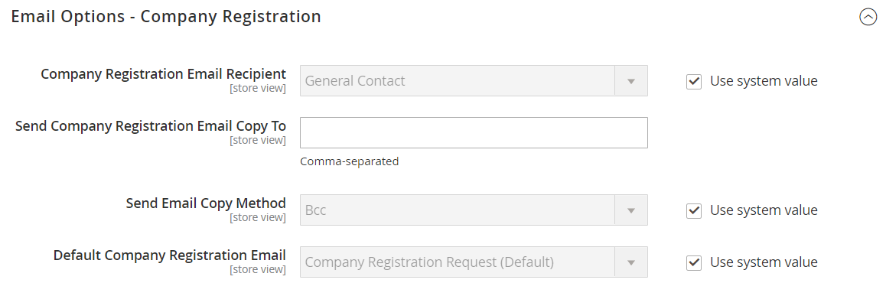

# [!UICONTROL Customers] > [!UICONTROL Company Configuration]

{{b2b-feature}}

{{config}}

>[!TIP]
>
>Med installation och aktivering av Adobe Commerce B2B kan köpupplevelsen personaliseras med företagsspecifika funktioner. Adobe Commerce B2B är en integrerad lösning som stöder både B2B- och B2C-modeller. Mer information om B2B-funktionerna finns i [Adobe Commerce B2B-användarhandboken](https://experienceleague.adobe.com/docs/commerce-admin/b2b/introduction.html?lang=sv-SE).

>[!NOTE]
>
>Åtkomsten till de här konfigurationsalternativen för B2B-funktioner styrs av [rollresurserna](../../systems/permissions-user-roles.md#role-resources). De här rollresurserna måste anges för användarrollen som tilldelats administratörsanvändaren.

Mer information om hur du konfigurerar de här inställningarna finns i [Aktivera grundläggande B2B-funktioner](../../b2b/enable-basic-features.md) i _Adobe Commerce B2B-användarhandboken_.

## [!UICONTROL General]

<!-- zoom -->

| Fält | [Omfång](../../getting-started/websites-stores-views.md#scope-settings) | Beskrivning |
|--- |--- |--- |
| [!UICONTROL Allow Company Registration from the Storefront] | Webbplats | Avgör om besökare i din butik har möjlighet att [registrera](../../customers/customer-sign-in.md) för ett företagskonto eller ett enskilt konto. Alternativ: `Yes` / `No` |

{style="table-layout:auto"}

## [!UICONTROL Email Options - Company Registration]

<!-- zoom -->

| Fält | [Omfång](../../getting-started/websites-stores-views.md#scope-settings) | Beskrivning |
|--- |--- |--- |
| [!UICONTROL Company Registration Email Recipient] | Butiksvy | Butikskontakten som meddelas när en företagsregistreringsbegäran skickas från butiken. Alternativ: `General Contact` / `Sales Representative` / `Customer Support` / `Custom Email 1` / `Custom Email 2` |
| [!UICONTROL Send Company Registration Email Copy To] | Butiksvy | E-postadressen till varje person som ska få en kopia av registreringsmeddelandet. Avgränsa flera e-postadresser med komma. |
| [!UICONTROL Send Email Copy Method] | Butiksvy | E-postmetoden som används för att skicka en kopia av registreringens e-postmeddelande. Alternativ: `Bcc` / `Separate Email` |
| [!UICONTROL Default Company Registration Email] | Butiksvy | E-postmallen som används som standard för företagsregistreringsmeddelandet. Standardmall: `Company Registration Request` |

{style="table-layout:auto"}

## [!UICONTROL Customer-Related Emails]

<!-- zoom -->

| Fält | [Omfång](../../getting-started/websites-stores-views.md#scope-settings) | Beskrivning |
|--- |--- |--- |
| [!UICONTROL Default 'Sales Rep Assigned' Email] | Butiksvy | E-postmallen som används som standard när en säljare tilldelas ett företagskonto. Det här e-postmeddelandet skickas till säljaren och företagsadministratören. Standardmall: `Sales Representative Assigned to Company` |
| [!UICONTROL Default 'Assign Company to Customer' Email] | Butiksvy | E-postmallen som används som standard när ett enskilt kundkonto tilldelas ett företagskonto. Det här e-postmeddelandet skickas endast till kunden. Standardmall: `Assign Company to Customer` |
| [!UICONTROL Default 'Assign Company Admin' Email] | Butiksvy | E-postmallen som används när en företagsadministratör tilldelas ett företag. Det här e-postmeddelandet skickas till säljaren och företagsadministratören. Standardmall: `Assign Company Admin` |
| [!UICONTROL Default 'Company Admin Inactive' Email] | Butiksvy | E-postmallen som används som standard när statusen för den person som fungerar som företagsadministratör ändras till Inaktiv. Systemet skickar ett e-postmeddelande om ändringen till nya och tidigare företagsadministratörer. Standardmall: `Company Admin Set Inactive` |
| [!UICONTROL Default 'Company Admin Changed to Member' Email] | Butiksvy | E-postmallen som används som standard när den tidigare företagsadministratören blir företagsmedlem. E-postmeddelandet skickas endast till företagsmedlemmen. Standardmall: `Company Admin Changed to Member` |
| [!UICONTROL Default 'Customer Status Active' Email] | Butiksvy | E-postmallen som används som standard när en kunds status blir aktiv. Det här e-postmeddelandet skickas endast till kunden. Standardmall: `Customer Status Active` |
| [!UICONTROL Default 'Customer Status Inactive' Email] | Butiksvy | E-postmallen som används som standard när en kunds status blir inaktiv. Det här e-postmeddelandet skickas endast till kunden. Standardmall: `Customer Status Inactive` |

{style="table-layout:auto"}

## [!UICONTROL Company Status Change]

<!-- zoom -->

| Fält | [Omfång](../../getting-started/websites-stores-views.md#scope-settings) | Beskrivning |
|--- |--- |--- |
| [!UICONTROL Company Status Change Email Recipient] | Butiksvy | Butikskontakten som meddelas när status för ett företag ändras. Alternativ: `General Contact` / `Sales Representative` / `Customer Support` / `Custom Email 1` / `Custom Email 2` |
| [!UICONTROL Send Company Status Change Email Copy To] | Butiksvy | E-postadressen till varje person som ska få en kopia av meddelandet om företagsstatusändring. Avgränsa flera e-postadresser med komma. |
| [!UICONTROL Send Email Copy Method] | Butiksvy | E-postmetoden som används för att skicka en kopia av meddelandet om statusändring. Alternativ: `Bcc` / `Separate Email` |
| [!UICONTROL Default "Company Status Change to Active 1' Email] | Butiksvy | E-postmallen som används när ett företags status ändras från _Väntande godkännande_ till _Aktiv_. Standardmall: `Company Status Active 1` |
| [!UICONTROL Default 'Company Status Change to Active 2' Email] | Butiksvy | E-postmallen som används som standard när ett företags status ändras från _Avvisad_ eller _Blockerad_ till _Aktiv_. Standardmall: `Company Status Active 2` |
| [!UICONTROL Default 'Company Status Change to Rejected' Email] | Butiksvy | E-postmallen som används som standard när ett företags status ändras till _Avvisad_. Standardmall: `Company Status Rejected` |
| [!UICONTROL Default 'Company Status Change to Blocked' Email] | Butiksvy | E-postmallen som används som standard när ett företags status ändras till _Blockerad_. Standardmall: `Company Status Blocked` |
| [!UICONTROL Default 'Company Status Change to Pending Approval' Email] | Butiksvy | E-postmallen som används som standard när ett företags status ändras till _Väntar på godkännande_. Standardmall: `Company Status Pending Approval` |

{style="table-layout:auto"}

## [!UICONTROL Company Credit]

<!-- zoom -->

| Fält | [Omfång](../../getting-started/websites-stores-views.md#scope-settings) | Beskrivning |
|--- |--- |--- |
| [!UICONTROL Company Credit Change Email Sender] | Butiksvy | Butikskontakten som meddelas när en ändring av ett företags kredit sker. Alternativ: `General Contact` / `Sales Representative` / `Customer Support` / `Custom Email 1` / `Custom Email 2` |
| [!UICONTROL Send Company Credit Change Email Copy To] | Butiksvy | E-postadressen till varje person som ska få en kopia av meddelandet om företagets kreditändring. Avgränsa flera e-postadresser med komma. |
| [!UICONTROL Send Email Copy Method] | Butiksvy | E-postmetoden som används för att skicka en kopia av meddelandet om kreditändring. Alternativ: `Bcc` / `Separate Email` |
| [!UICONTROL Allocated Email Template] | Butiksvy | E-postmallen som används som standard när företagskrediter tilldelas. Det här e-postmeddelandet skickas till företagsadministratören. Standardmall: `Credit Limit Allocated` |
| [!UICONTROL Updated Email Template] | Butiksvy | E-postmallen som används som standard när ett företags kreditgräns uppdateras. Det här e-postmeddelandet skickas till företagsadministratören. Standardmall: `Credit Limit Updated` |
| [!UICONTROL Reimbursed Email Template] | Butiksvy | E-postmallen som används som standard när en [återbetalning](../../b2b/credit-company.md#apply-a-payment-to-a-company-account) görs till företagets kredit. Det här e-postmeddelandet skickas till företagsadministratören. Standardmall: `Credit Reimbursed` |
| [!UICONTROL Refunded Email Template] | Butiksvy | E-postmallen som används som standard när ett belopp från en order återbetalas till företagskrediter. Det här e-postmeddelandet skickas till företagsadministratören. Standardmall: `Order Refunded to Company Credit` |
| [!UICONTROL Reverted Email Template] | Butiksvy | E-postmallen som används som standard när en order återställs till företagskrediter. Det här e-postmeddelandet skickas till företagsadministratören. Standardmall: `Order Reverted to Company Credit` |

{style="table-layout:auto"}
