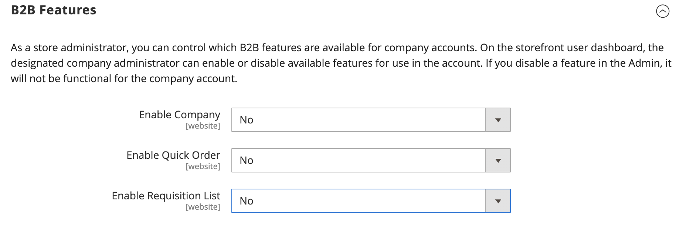

# [!UICONTROL General] > [!UICONTROL B2B Features]

{{b2b-feature}}

{{config}}

>[!TIP]
>
>Med installation och aktivering av B2B för Adobe Commerce kan köpupplevelsen personaliseras med företagsspecifika funktioner. B2B för Adobe Commerce är en integrerad lösning som stöder både B2B- och B2C-modeller. Mer information om B2B-funktionerna finns i [_Användarhandbok för B2B för Adobe Commerce_](https://experienceleague.adobe.com/docs/commerce-admin/b2b/introduction.html).

## [!UICONTROL B2B Features]

<!-- zoom -->

| Fält | [Omfång](../../getting-started/websites-stores-views.md#scope-settings) | Beskrivning |
|------- |----------------------------------------------------------------------- |------------ |
| [[!UICONTROL Enable Company]](../../b2b/account-companies.md) | Webbplats | När det här alternativet är aktiverat kan kunder hantera sina företagstilldelningar från sin kontokontrollpanel och dessutom aktiveras funktionen för delad katalog och B2B-offert som standard. Alternativ: `Yes` / `No` |
| [[!UICONTROL Enable Quick Order]](../../b2b/quick-order.md) | Webbplats | När det här alternativet är aktiverat kan kunder och gäster snabbt göra beställningar baserat på SKU eller produktnamn. Alternativ: `Yes` / `No` |
| [[!UICONTROL Enable Requisition List]](../../b2b/configure-requisition-lists.md) | Webbplats | När det här alternativet är aktiverat kan kunder skapa och hantera rekvisitionslistor från sin kontokontrollpanel. |

{style="table-layout:auto"}

<!-- zoom -->

När funktionen Företag är aktiverad är ytterligare fält tillgängliga för delad katalog och B2B-offert.

| Fält | [Omfång](../../getting-started/websites-stores-views.md#scope-settings) | Beskrivning |
|------- |----------------------------------------------------------------------- |------------ |
| [[!UICONTROL Enable Shared Catalog]](../../b2b/catalog-shared.md) | Webbplats | När det här alternativet är aktiverat kan du skapa välstrukturerade kataloger med anpassade priser som är tillgängliga globalt eller begränsade till specifika företag. Alternativ: `Yes` / `No` |
| [!UICONTROL Enable Shared Catalog direct products price assigning] | Webbplats | När _[!UICONTROL Enable Shared Catalog]_fältet är inställt på `Yes`, är det här alternativet tillgängligt. När det här alternativet är aktiverat lagras endast produkter som är tilldelade till en delad katalog i prisindexet. Produkter som inte är tilldelade den delade katalogen visas inte i butiken. Alternativ: `Yes` / `No` |
| [[!UICONTROL Enable B2B Quote]](../../b2b/configure-quotes.md) | Webbplats | När det här alternativet är aktiverat kan företagsköpare skicka en anbudsförfrågan från kundvagnen. Alternativ: `Yes` / `No` |

{style="table-layout:auto"}

### [!UICONTROL Default B2B Payment Methods]

<!-- zoom -->

| Fält | [Omfång](../../getting-started/websites-stores-views.md#scope-settings) | Beskrivning |
|------- |----------------------------------------------------------------------- |------------ |
| [!UICONTROL Applicable Payment Methods] | Global | Bestämmer valet av betalningsmetoder som är tillgängliga för B2B-köpare. Alternativ: `All Payment Methods` / `Specific Payment Methods` |
| [!UICONTROL Payment Methods] | Global | Anger varje betalningsmetod som är tillgänglig för B2B-köpare. |

{style="table-layout:auto"}

### [!UICONTROL Default B2B Shipping Methods]

<!-- zoom -->

| Fält | [Omfång](../../getting-started/websites-stores-views.md#scope-settings) | Beskrivning |
|------- |----------------------------------------------------------------------- |------------ |
| [!UICONTROL Applicable Shipping Methods] | Global | Bestämmer valet av leveransmetoder som är tillgängliga som standard för B2B-köpare. Alternativ: `All Shipping Methods` / `Specific Shipping Methods` |
| [!UICONTROL Shipping Methods] | Global | Anger varje leveransmetod som är tillgänglig som standard för B2B-köpare.  **_Obs!_**Du kan också begränsa leveransmetoderna för en viss [företagskonto](../../b2b/account-companies.md). |

{style="table-layout:auto"}

## [!UICONTROL Order Approval Configuration]

<!-- zoom -->

| Fält | [Omfång](../../getting-started/websites-stores-views.md#scope-settings) | Beskrivning |
|------- |----------------------------------------------------------------------- |------------ |
| [[!UICONTROL Enable Purchase Orders]](../../stores-purchase/purchase-order.md) | Webbplats | När det här alternativet är aktiverat kan företag skapa inköpsorder. Alternativ: `Yes` / `No` |

{style="table-layout:auto"}

