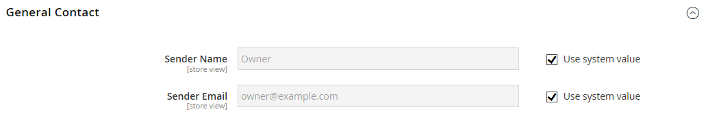

# [!UICONTROL General] > [!UICONTROL Store Email Addresses]

{{config}}

Mer information om de här konfigurationsfälten och alternativen finns i [Lagra e-postadresser](../../getting-started/store-details.md#store-email-addresses).

## [!UICONTROL General Contact]

<!-- zoom -->

| Fält | [Omfång](../../getting-started/websites-stores-views.md#scope-settings) | Beskrivning |
|--- |--- |--- |
| [!UICONTROL Sender Name] | Butiksvy | Namnet som visas som avsändaren av e-postmeddelandet som skickas av identiteten `General Contact`. |
| [!UICONTROL Sender Email] | Butiksvy | E-postadressen som är associerad med identiteten `General Contact`. |

{style="table-layout:auto"}

## [!UICONTROL Sales Representative]

<!-- zoom -->

| Fält | [Omfång](../../getting-started/websites-stores-views.md#scope-settings) | Beskrivning |
|--- |--- |--- |
| [!UICONTROL Sender Name] | Butiksvy | Namnet som visas som avsändaren av e-postmeddelandet som skickas av identiteten `Sales Representative`. |
| [!UICONTROL Sender Email] | Butiksvy | E-postadressen som är associerad med identiteten `Sales Representative`. |

{style="table-layout:auto"}

## [!UICONTROL Customer Support]

<!-- zoom -->

| Fält | [Omfång](../../getting-started/websites-stores-views.md#scope-settings) | Beskrivning |
|--- |--- |--- |
| [!UICONTROL Sender Name] | Butiksvy | Namnet som visas som avsändaren av e-postmeddelandet som skickas av identiteten `Customer Support`. |
| [!UICONTROL Sender Email] | Butiksvy | E-postadressen som är associerad med identiteten `Customer Support`. |

{style="table-layout:auto"}

## Egen e-post 1

<!-- zoom -->

| Fält | [Omfång](../../getting-started/websites-stores-views.md#scope-settings) | Beskrivning |
|--- |--- |--- |
| [!UICONTROL Sender Name] | Butiksvy | Namnet som visas som avsändaren av e-postmeddelandet som skickas av identiteten `Custom 1`. |
| [!UICONTROL Sender Email] | Butiksvy | E-postadressen som är associerad med identiteten `Custom 1`. |

{style="table-layout:auto"}

## Egen e-post 2

<!-- zoom -->

| Fält | [Omfång](../../getting-started/websites-stores-views.md#scope-settings) | Beskrivning |
|--- |--- |--- |
| [!UICONTROL Sender Name] | Butiksvy | Namnet som visas som avsändaren av e-postmeddelandet som skickas av identiteten `Custom 2`. |
| [!UICONTROL Sender Email] | Butiksvy | E-postadressen som är associerad med identiteten `Custom 2`. |

{style="table-layout:auto"}
