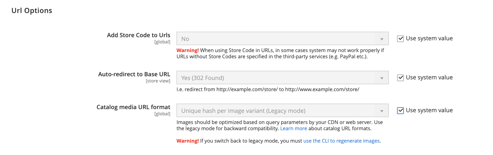

# [!UICONTROL General] > [!UICONTROL Web]

{{config}}

## [!UICONTROL URL Options]

<!-- zoom -->

<!-- [URL Options configuration settings](https://experienceleague.adobe.com/sv/docs/commerce-admin/stores-sales/site-store/store-urls) -->

| Fält | Omfång | Beskrivning |
|  ---  |  ---  |  ---  |
| [!UICONTROL Add Store Code to URLs] | Global | Om Rewrites för webbserver är aktiverat infogar Store-koden för den aktuella vyn i URL:en. Alternativ: `Yes` / `No`.  När det här fältet är inställt på `Yes` måste du inkludera butikskoder i webbläsarens URL:er för att säkerställa att URL-omskrivningar mappas korrekt och att alla sidor öppnas korrekt. På så sätt undviker du _404 Sidan som inte hittades_-fel. |
| [!UICONTROL Auto-redirect to Base URL] | Butiksvy | (För inställningar för en enskild butik) Om det finns en bruten länk på din webbplats dirigerar om trafiken till bas-URL:en i stället för till en sida med meddelandet&quot;Hittar inte 404 sida&quot;. Alternativ:` No` / `Yes (302 Found)` / `Yes (301 Moved Permanently)`  **_Viktigt:_**&#x200B;Använd inte automatisk omdirigering till bas-URL för inställningar för flera lager. |
| [!UICONTROL Catalog media URL format] | Global | Definierar det [URL-format](../../catalog/catalog-urls.md) som tilldelats produkter och kategorier. Alternativ: Unik hash per bildvariant (äldre läge) definierar det konverterade filnamnet som ett unikt hash-värde. Bildoptimering baserad på frågeparametrar definierar processen [bildoptimering](../../content-design/media-gallery-image-optimization.md) beroende på frågeparametrar. |

{style="table-layout:auto"}

## [!UICONTROL Search Engine Optimization]

<!-- zoom -->

<!-- [Search Engine Optimization configuration settings](https://experienceleague.adobe.com/sv/docs/commerce-admin/marketing/seo/url-rewrites/url-rewrite) -->

| Fält | [Omfång](../../getting-started/websites-stores-views.md#scope-settings) | Beskrivning |
|--- |--- |--- |
| [!UICONTROL Use Web Server Rewrites] | Butiksvy | PHP-baserade system innehåller vanligtvis en fil med namnet `index.php` i rotmappen. Som standard visas filnamnet i URL:en precis efter namnet på rotmappen. När detta är aktiverat utelämnar systemet `index.php` från URL:en. Denna användbarhet gör varje URL mer koncis och påverkar inte prestanda eller rangordning. Alternativ: `Yes` / `No` |

{style="table-layout:auto"}

## [!UICONTROL Base URLs]

<!-- zoom -->

<!-- [Base URLS configuration settings](https://experienceleague.adobe.com/sv/docs/commerce-admin/stores-sales/site-store/store-urls) -->

| Fält | [Omfång](../../getting-started/websites-stores-views.md#scope-settings) | Beskrivning |
|--- |--- |--- |
| [!UICONTROL Base URL] | Butiksvy | Den fullständiga adressen till Commerce-rotmappen som inte körs via en krypterad kanal (SSL). URL:en måste avslutas med ett snedstreck. |
| [!UICONTROL Base Link URL] | Butiksvy | En tagg som används som platshållare för bas-URL:en. |
| [!UICONTROL Base URL for Static View Files] | Butiksvy | En sökväg som pekar på platsen för statiska filer som används av temat, till exempel CSS, teckensnitt, bilder och JavaScript. En platshållare används för att representera bas-URL. Om din Commerce-installation har flera platser med samma mappstruktur kan du ha olika mappar för varje plats. Ställ in konfigurationsomfånget på rätt plats innan du anger bas-URL:en för statiska vyfiler. Du kan även ange en mapp utanför din Commerce-installation. |
| [!UICONTROL Base URL for User Media Files] | Butiksvy | En sökväg som pekar på platsen för katalogbilder och andra mediefiler. En platshållare används för att representera bas-URL. Om din Commerce-installation har flera platser med samma mappstruktur kan du ha olika mediamappar för var och en av dem. Detta ger dig möjlighet att säkerhetskopiera och återställa varje mediemapp separat. Du kan även ange en mediemapp utanför Commerce-installationen. |

{style="table-layout:auto"}

## [!UICONTROL Base URLs (Secure)]

<!-- zoom -->

<!-- [Base URLs (Secure) configuration settings](https://experienceleague.adobe.com/sv/docs/commerce-admin/stores-sales/site-store/store-urls) -->

| Fält | [Omfång](../../getting-started/websites-stores-views.md#scope-settings) | Beskrivning |
|--- |--- |--- |
| [!UICONTROL Secure Base URL] | Butiksvy | Den fullständiga adressen till Commerce-rotmapp som levereras med krypterat SSL-/TLS-protokoll. URL:en måste avslutas med ett snedstreck. |
| [!UICONTROL Secure Base Link URL] | Butiksvy | En tagg som används som platshållare för bas-URL:en som körs över en säker kanal. |
| [!UICONTROL Secure Base URL for Static View Files] | Butiksvy | En märkordstagg som pekar på platsen för statiska filer som CSS, teckensnitt, bilder och JavaScript som används av temat. Filerna kan finnas på en osäker eller säker kanal. Om din Commerce-installation har flera platser med samma mappstruktur kan du ha olika mappar för varje plats. Ställ in konfigurationsomfånget på rätt plats innan du anger bas-URL:en för statiska vyfiler. Du kan även ange en mapp utanför din Commerce-installation. |
| [!UICONTROL Secure Base URL for User Media Files] | Butiksvy | En sökväg som pekar på platsen för katalogbilder och andra mediefiler. Filerna kan finnas på en osäker eller säker kanal. En platshållare används för att representera bas-URL. Om din Commerce-installation har flera platser med samma mappstruktur kan du ha olika mediamappar för var och en av dem. Detta ger dig möjlighet att säkerhetskopiera och återställa varje mediemapp separat. Du kan även ange en mediemapp utanför Commerce-installationen. |
| [!UICONTROL Use Secure URLs on Storefront] | Butiksvy | Om din domän har ett säkerhetscertifikat kan du välja att köra butiken med eller utan SSL-kryptering. Alternativ: **`Yes`**- Lagra URL:er börjar med `https` för att ange att sidan levereras med krypterat, säkert protokoll. **`No`** - Lagra URL:er börjar med `http` för att ange att sidan levereras utan säkert protokoll. |
| [!UICONTROL Use Secure URLs in Admin] | Global | Om din domän har ett säkerhetscertifikat kan du välja att köra arkivadministratören, med eller utan SSL-kryptering. Alternativ:  **`Yes`**- Admin-URL:er börjar med `https` för att ange att sidan levereras med krypterat, säkert protokoll. **`No`** - Admin-URL:er börjar med `http` för att ange att sidan levereras utan säkert protokoll.  När säkra URL:er har aktiverats för både arkivet och administratören visas ytterligare två fält för att aktivera och konfigurera `HSTS`. |
| [!UICONTROL Enable HTTP Strict Transport Security (HSTS)] | Butiksvy | När det här alternativet är aktiverat tillhandahåller [`HSTS`][1] ett mått på säkerhet mot attacker av typen&quot;man in the middle&quot; och förhindrar att användare åsidosätter meddelandet om&quot;ogiltigt certifikat&quot;. Alternativ: `Yes` / `No` |
| [!UICONTROL Upgrade Insecure Requests] | Butiksvy | När det här alternativet är aktiverat konverteras osäkra (`HTTP`) begäranden som tas emot från webbläsaren till det säkra (`HTTPS`) protokollet. Alternativ: `Yes` / `No` |
| [!UICONTROL Offloader Header] | Global | Anger värdet `offloader_header` i serverkonfigurationen för att identifiera protokollet mellan klienten och belastningsutjämnaren. De flesta Commerce-installationer använder standardvärdet `X-Forwarded-Proto` (XFP) för att identifiera protokollet som antingen `HTTP` eller `HTTPS`. |

{style="table-layout:auto"}

## [!UICONTROL Default Pages]

<!-- zoom -->

<!-- [Default Pages configuration settings](https://experienceleague.adobe.com/sv/docs/commerce-admin/content-design/elements/pages/pages#configure-default-pages) -->

| Fält | [Omfång](../../getting-started/websites-stores-views.md#scope-settings) | Beskrivning |
|--- |--- |--- |
| [!UICONTROL Default Web URL] | Butiksvy | Anger landningssidan som är associerad med bas-URL:en. Standardinställningen är &quot;cms&quot; för att ange en sida från Commerce Content Management System (CMS). Du kan också använda en annan typ av landningssida, till exempel en blogg. Om till exempel en blogg är installerad på servern på `magento/blog` kan du ange namnet på bloggmappen som en relativ sökväg till urvalet av sidor. |
| [!UICONTROL CMS Home Page] | Butiksvy | Om du vill välja butikens hemsida väljer du CMS-sidan i listan. Som standard visas hela urvalet av CMS-sidor som är tillgängliga för din butik på CMS hemsida. |
| [!UICONTROL Default No-route URL] | Butiksvy | Innehåller URL-adressen till den standardsida som du vill ska visas när ett `404 Page not Found`-fel inträffar. Standardvärdet är `cms/noroute/index`. |
| [!UICONTROL CMS No Route Page] | Butiksvy | Identifierar en specifik CMS-sida som du vill ska visas när ett fel av typen 404 Sidan hittades inte inträffar. Standardsidan är 404 Hittades inte. |
| [!UICONTROL CMS No Cookies Page] | Butiksvy | Identifierar en specifik CMS-sida som visas när cookies inte är aktiverade för webbläsaren. På sidan förklaras varför cookies används och hur du aktiverar dem för varje webbläsare. Standardsidan är Aktivera cookies. |
| [!UICONTROL Show Breadcrumbs for CMS Pages] | Butiksvy | Avgör om ett spårningsspår visas på alla CMS-sidor i katalogen. Alternativ: `Yes` / `No` |

{style="table-layout:auto"}

## [!UICONTROL Default Layouts]

<!-- zoom -->

<!--[Default Layouts](https://experienceleague.adobe.com/sv/docs/commerce-admin/content-design/design/layout/page-layout) -->

| Fält | [Omfång](../../getting-started/websites-stores-views.md#scope-settings) | Beskrivning |
|--- |--- |--- |
| [!UICONTROL Default Product Layout] | Global | Bestämmer [layouten](../../content-design/page-layout.md) som används som standard för produktsidor. Alternativ:  **`No layout updates`**- Som standard är layoutuppdateringar inte tillgängliga för produktsidor. **`Empty`** - Som standard används en tom layout för produktsidor.  **`1 column`**- I används som standard en enda kolumnlayout för produktsidor. **`2 columns with left bar`** - I används som standard en layout med två kolumner och sidofältet till vänster för produktsidor.  **`2 columns with right bar`**- I används som standard en layout med två kolumner och sidofältet till höger för produktsidor. **`3 columns`** - Som standard används en layout med tre kolumner och sidofält till vänster och höger för produktsidor. **`Page -- Full Width`**- (Kräver [!DNL Page Builder]) Layouten Sida - Full bredd används som standard för produktsidor. **`Category - Full Width`** - (Kräver [!DNL Page Builder]) I används som standard layouten Kategori - full bredd för produktsidor.  **`Product - Full Width`**- (Kräver [!DNL Page Builder]) I används som standard layouten Produkt - Full bredd för produktsidor. |
| [!UICONTROL Default Category Layout] | Global | Bestämmer [layouten](../../content-design/page-layout.md) som används som standard för kategorisidor. Alternativ:  **`No layout updates`**- Som standard är layoutuppdateringar inte tillgängliga för kategorisidor. **`Empty`** - Som standard används en tom layout för kategorisidor.  **`1 column`**- Som standard används en enda kolumnlayout för kategorisidor. **`2 columns with left bar`** - Som standard används en layout med två kolumner och sidofältet till vänster för kategorisidor.  **`2 columns with right bar`**- Som standard används en layout med två kolumner och sidofältet till höger för kategorisidor. **`3 columns`** - I används som standard en layout med tre kolumner och sidofält till vänster och höger för kategorisidor. **`Page - Full Width`**- (Kräver [!DNL Page Builder]) Layouten Sida - Full bredd används som standard för kategorisidor. **`Category - Full Width`** - (Kräver [!DNL Page Builder]) Som standard används layouten Kategori - full bredd för kategorisidor.  **`Product - Full Width`**- (Kräver [!DNL Page Builder]) Som standard används layouten Produkt - Full bredd för kategorisidor. |
| Standardsidlayout | Global | Bestämmer [layouten](../../content-design/page-layout.md) som används som standard för CMS-sidor. Alternativ:  **`No layout updates`**- Som standard är layoutuppdateringar inte tillgängliga för CMS-sidor. **`Empty`** - Som standard används en tom layout för CMS-sidor.  **`1 column`**- Som standard används en enda kolumnlayout för CMS-sidor. **`2 columns with left bar`** - I används som standard en layout med två kolumner och sidofältet till vänster för CMS-sidor. **`2 columns with right bar`**- I används som standard en layout med två kolumner och sidofältet till höger för CMS-sidor. **`3 columns`** - Som standard används en layout med tre kolumner och sidofält till vänster och höger för CMS-sidor. **`Page - Full Width`**- (Kräver [!UICONTROL Page Builder]) Layouten Sida - Full bredd används som standard för CMS-sidor. **`Category - Full Width`** - (Kräver [!UICONTROL Page Builder]) Som standard används layouten Kategori - full bredd för CMS-sidor.  **`Product - Full Width`**- (Kräver [!DNL Page Builder]) I används som standard layouten Produkt - Full bredd för CMS-sidor. |

{style="table-layout:auto"}

## [!UICONTROL Default Cookie Settings]

<!-- zoom -->

<!-- [Default Cookie configuration settings](https://experienceleague.adobe.com/sv/docs/commerce-admin/start/compliance/privacy/compliance-cookie-law) -->

| Fält | [Omfång](../../getting-started/websites-stores-views.md#scope-settings) | Beskrivning |
|--- |--- |--- |
| [!UICONTROL Cookie Lifetime] | Butiksvy | Anger hur länge en cookie kan finnas innan den tas bort automatiskt. Standardvärdet är 3 600 sekunder (1 timme) |
| [!UICONTROL Cookie Path] | Butiksvy | Anger de mappar på servern där Commerce cookies kan användas. Om du vill göra Commerce-cookies tillgängliga överallt i installationen anger du Cookie-sökvägen till ett enda snedstreck: `/`. Det här värdet kan bara innehålla cookie-sökvägen och **_får inte_** innehålla några andra cookie-parametrar. |
| [!UICONTROL Cookie Domain] | Butiksvy | Avgör om Commerce cookies är tillgängliga för underdomäner. Om du till exempel vill ha stöd för `mysubdomain`.domain.com anger du namnet på din domän med en punkt i början, som `.domain.com`. Det här värdet kan bara innehålla cookie-domänen och **_får inte_** innehålla några andra cookie-parametrar. |
| [!UICONTROL Use HTTP Only] | Butiksvy | Avgör om Commerce Cookies bara kan användas över en osäker kanal (http), eller också kan användas över en krypterad kanal (https). Alternativ: `Yes` / `No` |
| [!UICONTROL Cookie Restriction Mode] | Webbplats | Avgör om läget för begränsning av cookie är aktiverat. Alternativ: `Yes` / `No` |

{style="table-layout:auto"}

## [!UICONTROL Session Validation Settings]

<!-- zoom -->

<!-- [Session Validation configuration settings](https://experienceleague.adobe.com/sv/docs/commerce-admin/systems/security/security-session-management#session-validation) -->

| Fält | [Omfång](../../getting-started/websites-stores-views.md#scope-settings) | Beskrivning |
|--- |--- |--- |
| [!UICONTROL Validate REMOTE_ADDR] | Global | Verifierar att IP-adressen för en begäran matchar `$_SESSION` data. Sessionen avslutas om en annan IP-adress upptäcks. Alternativ: `Yes` / `No` |
| [!UICONTROL Validate HTTP_VIA] | Global | Verifierar inkommande proxydata och kontrollerar att proxyadressen för en begäran matchar `$_SESSION` data. Sessionen avslutas om en annan proxyadress upptäcks. Alternativ: `Yes` / `No` |
| [!UICONTROL Validate HTTP_x_FORWARDED_FOR] | Global | Verifierar utgående proxydata och kontrollerar att den vidarebefordrade adressen för en begäran matchar `$_SESSION` data. Sessionen avslutas om en annan adress för vidarebefordrad har identifierats. Alternativ: `Yes` / `No` |
| [!UICONTROL Validate HTTP_USER_AGENT] | Global | `USER_AGENT` refererar till den webbläsare eller enhet som används för att komma åt webbplatsen. Den verifierar att namnet och versionen på webbläsaren, och operativsystemet, matchar `$_SESSION` data. Sessionen avslutas om en annan användaragent identifieras från en begäran till en annan i samma session. Alternativ: `Yes` / `No` |

{style="table-layout:auto"}

## [!UICONTROL Browser Capabilities Detection]

<!-- zoom -->

<!-- [Browser Capabilities Detection configuration settings](https://experienceleague.adobe.com/sv/docs/commerce-admin/systems/security/security-browser-capabilities-detection) -->

| Fält | [Omfång](../../getting-started/websites-stores-views.md#scope-settings) | Beskrivning |
|--- |--- |--- |
| [!UICONTROL Redirect to CMS-page if Cookies are Disabled] | Butiksvy | Om cookies är inaktiverade i webbläsaren dirigeras de automatiskt om till CMS No Cookies Page. Alternativ: `Yes` / `No` |
| [!UICONTROL Show Notice if JavaScript is Disabled] | Butiksvy | Om JavaScript är inaktiverat i webbläsaren visas ett meddelande som uppmanar användaren att aktivera JavaScript-alternativ: `Yes` / `No` (inaktiveras) |
| [!UICONTROL Show Notice if Local Storage is Disabled] | Butiksvy | Visar ett meddelande om den lokala cachen är inaktiverad. Alternativ: `Yes` / `No` |

{style="table-layout:auto"}

[1]: https://cheatsheetseries.owasp.org/cheatsheets/HTTP_Strict_Transport_Security_Cheat_Sheet.html
