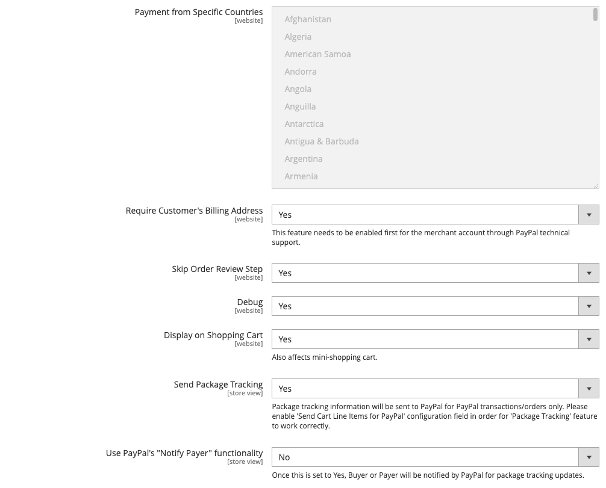

# [!UICONTROL Sales] > [!UICONTROL Payment Methods] > [!UICONTROL Braintree]

>[!IMPORTANT]
>
>**Commerce 2.4-migrering:** 
>För tidigare versioner av Adobe Commerce och Magento Open Source än 2.4.0 rekommenderar vi att säljarna installerar och konfigurerar det officiella tillägget för betalningsintegration från [Commerce Marketplace](https://marketplace.magento.com/catalogsearch/result/?q=braintree) för att ersätta kärnintegreringen. Från och med 2.4.0 ingår nu tillägget i kärnversionen.
>  
>När handlare migrerar till Commerce 2.4 måste de avinstallera det tillägg som distribuerats på Marketplace (`paypal/module-braintree` eller `gene/module-braintree`) och uppdatera eventuella kodanpassningar för att använda namnutrymmet `PayPal_Braintree` i stället för `Magento_Braintree`. Konfigurationsinställningarna från det paketerade tillägget för Commerce och det tillägg som distribueras på Commerce Marketplace sparas. Betalningar som gjorts med dessa versioner av tillägget fångas, annulleras eller återbetalas som vanligt.
>  
>Om du uppgraderar till Commerce 2.4.0 och inte använder det Commerce Marketplace-tillägg som rekommenderas i din tidigare version 2.3.x fungerar inte multiadressfunktionen med version 2.4.0 av Braintree. När en kund väljer _leverera till flera adresser_ visas inte Braintree betalningsmetod. Commerce Marketplace-tillägget som tidigare rekommenderats för 2.3.x har detta problem med flera adresser.

{{config}}

>[!IMPORTANT]
>
>Om du behöver hjälp med oväntade kostnader på kortet kan du få hjälp på sidan [Avbryt prenumeration](https://helpx.adobe.com/manage-account/using/cancel-subscription.html).

## [!UICONTROL Basic Braintree Settings]

<!-- zoom -->

| Fält | [Omfång](../../getting-started/websites-stores-views.md#scope-settings) | Beskrivning |
|--- |--- |--- |
| [!UICONTROL Title] | Butiksvy | Standardvärde: `Credit Card` (Braintree) |
| [!UICONTROL Environment] | Butiksvy | Tillval: `Sandbox` / `Production` |
| [!UICONTROL Payment Action] | Butiksvy | Anger vilken åtgärd Braintree ska vidta när en betalning bearbetas. Alternativ:  **`Authorize`**- Medel på kundens kreditkort är auktoriserade, men överförs inte från kontot. En beställning skapas i din butiksadministratör. Du kan hämta försäljningen senare och skapa en faktura. **`Intent Sale`** (tidigare `Authorize and Capture` i tidigare versioner) - Medel på kundens kreditkort har godkänts och hämtats av Braintree, och en order och en faktura skapas i din butiksadministratör. |
| [!UICONTROL Sandbox Merchant ID] | Butiksvy | Detta är den unika identifieraren för hela sandlådegatewaykontot. Ditt säljar-id, som även kallas offentligt _id_ eller _produktions-id_, skiljer sig åt för dina produktions- och sandbox-gateways. Det här fältet visas när fältet är inställt på _[!UICONTROL Environment]_`Sandbox`. |
| [!UICONTROL Sandbox Public Key] | Butiksvy | Detta är din användarspecifika, offentliga identifierare som begränsar åtkomsten till krypterade data. Varje användare som är kopplad till din sandbox Braintree-gateway har sin egen offentliga sandlådenyckel. Det här fältet visas när fältet _[!UICONTROL Environment]_&#x200B;har värdet `Sandbox`. |
| [!UICONTROL Sandbox Private Key] | Butiksvy | Detta är din användarspecifika, privata identifierare som begränsar åtkomsten till krypterade data. Varje användare som är associerad med din Braintree-gateway i Sandbox har sin egen privata nyckel för sandlådan. Det här fältet visas när fältet är inställt på _[!UICONTROL Environment]_`Sandbox`. |
| [!UICONTROL Merchant ID] | Butiksvy | Detta är den unika identifieraren för hela ditt gateway-konto, inklusive de flera handelskonton som kan finnas i din gateway. Ditt handlar-ID är också känt som _publikt ID_ eller _produktions-ID_ och skiljer sig åt för din produktions- och sandlådegateway. Det här fältet visas när fältet är inställt på _[!UICONTROL Environment]_`Production`. |
| [!UICONTROL Public Key] | Butiksvy | Detta är din användarspecifika, offentliga identifierare som begränsar åtkomsten till krypterade data. Varje användare som är kopplad till din Braintree-gateway har en egen offentlig nyckel. Det här fältet visas när fältet _[!UICONTROL Environment]_&#x200B;har värdet `Production`. |
| [!UICONTROL Private Key] | Butiksvy | Detta är din användarspecifika, privata identifierare som begränsar åtkomsten till krypterade data. Varje användare som är kopplad till din Braintree-gateway har sin egen privata nyckel. Det här fältet visas när fältet _[!UICONTROL Environment]_&#x200B;har värdet `Production`. |
| [!UICONTROL Enable Card Payments] | Webbplats | Avgör om betalningsmetoden för Braintree-kreditkort är tillgänglig för dina kunder som betalningsmetod. Alternativ: `Yes` / `No` |
| [!UICONTROL Enable Vault for Card Payments] | Webbplats | När det här alternativet är aktiverat tillhandahålls säker lagring för kundbetalningsinformation så att kunderna inte behöver ange sin kreditkortsinformation på nytt för varje köp. Alternativ: `Yes` / `No` |
| [!UICONTROL Enable Vault CVV Re-verification] | Webbplats | När det här alternativet är aktiverat valideras CVV-reglerna i ditt Braintree-konto. Alternativ: `Yes` / `No` |

{style="table-layout:auto"}

## [!UICONTROL Advanced Braintree Settings]

{width="550" zoomable="yes"}

| Fält | [Omfång](../../getting-started/websites-stores-views.md#scope-settings) | Beskrivning |
|--- |--- |--- |
| [!UICONTROL Vault Title] | Webbplats | En beskrivande rubrik för din referens som identifierar valvet där kundkortsinformationen lagras. |
| [!UICONTROL Merchant Account ID] | Webbplats | Det konto-ID för handelskonto som ska associeras med Braintree-transaktioner från den här webbplatsen. Om inget anges används standardhandelskontot från ditt Braintree-konto. |
| [!UICONTROL Enable Checkout Express Payments] | Webbplats | Ger en snabbare utcheckning med Express Payment-alternativ i början av utcheckningsprocessen, inklusive PayPal, PayLater, Apple Pay och Google Pay. Alternativ: `Yes` / `No` |
| [!UICONTROL Skip Fraud Checks on Admin Orders] | Webbplats | Förhindrar att transaktionen skickas för utvärdering som en del av [!DNL Advanced Fraud Tools]-kontroller, på beställningar som gjorts via administratören endast när värdet är `Yes`. Alternativ: `Yes` / `No` |
| [!UICONTROL Bypass Fraud Protection Threshold] | Webbplats | `Advanced Fraud Protection` kontroller ignoreras när tröskelvärdet uppnås eller överskrids. Om du lämnar fältet tomt inaktiveras det här alternativet. |
| [!UICONTROL Debug] | Webbplats | Avgör om kommunikation mellan Braintree-systemet och din butik registreras i en loggfil. Alternativ: `Yes` / `No` |
| [!UICONTROL CVV Verification] | Webbplats | Avgör om kunderna måste ange den tresiffriga säkerhetskoden från baksidan av ett kreditkort. Alternativ: `Yes` / `No` |
| [!UICONTROL Send Card Line Items] | Webbplats | Skicka vagnsradobjekten för alla betalningsmetoder. Alternativ: `Yes` / `No` |
| [!UICONTROL Credit Card Types] | Webbplats | Anger varje kreditkort som du godkänner som betalning via Braintree. Tryck och håll ned `Ctrl` (eller `Command` på Mac) om du vill välja en kombination av kort. Alternativ: `American Express` / `Visa` / `MasterCard` / `Discover` / `JCB` / `Diners` / `Maestro International` |
| [!UICONTROL Sort Order] | Webbplats | Bestämmer i vilken ordning Braintree listas med andra betalningsmetoder i kassan. |

## [!UICONTROL Braintree Webhooks Settings]

<!-- zoom -->

| Fält | [Omfattning](../../getting-started/websites-stores-views.md#scope-settings) | Beskrivning |
|--- |--- |--- |
| [!UICONTROL Enable Webhook] | Webbplats | För att möjliggöra webbokrosfunktionen för bedrägeriskydd, ACH-betalningar, lokala betalningsmetoder och tvister. Alternativ: `Yes` / `No` |
| [!UICONTROL Fraud Protection URL] | Webbplats | Lägg till den här URL:en i ditt Braintree-konto som [!UICONTROL Webhook Destination URL]. **Den här URL:en måste vara säker och offentligt tillgänglig.** |
| [!UICONTROL Fraud Protection Approve Order Status] | Webbplats | När bedrägeriskyddet har godkänts av Braintree tilldelas den valda orderstatusen till Commerce-ordern. Den här statusen används för att uppdatera status för den order där ACH-betalningsmetoden används och när den flyttas till `SETTLED` i Braintree. |
| [!UICONTROL Fraud Protection Reject Order Status] | Webbplats | När bedrägeriskyddet inte godkänns av Braintree tilldelas den valda orderstatusen till Commerce-ordern. Den här statusen används för att uppdatera status för den order där ATTE-betalningsmetoden används och när `SETTLEMENT` är `DECLINED` i Braintree. |

{style="table-layout:auto"}

## [!UICONTROL Country Specific Settings]

<!-- zoom -->

| Fält | [Omfång](../../getting-started/websites-stores-views.md#scope-settings) | Beskrivning |
|--- |--- |--- |
| [!UICONTROL Payment from Applicable Countries] | Webbplats | Avgör om du godkänner betalningar som har bearbetats av Braintree från alla länder, eller endast vissa länder. Alternativ: `All Allowed Countries` / `Specific Countries` |
| [!UICONTROL Payment from Specific Countries] | Webbplats | Om tillämpligt, identifierar de specifika länder från vilka du godkänner betalningar som bearbetats av Braintree. |
| [!UICONTROL Country Specific Credit Card Types] | Webbplats | Identifierar de kreditkort som accepteras per land för betalningar som bearbetas av Braintree. En post sparas för varje land. Alternativ:  **`Country`**- Välj land. **`Allowed Card Types`** - Välj varje kreditkort som godkänts från landet som betalning via Braintree.  **`Add`**- Lägg till en rad som tillåter kreditkort för ett annat land. **`Action`** - Tar bort posten med tillåtna kreditkort för landet. |

{style="table-layout:auto"}

## [!UICONTROL ACH through Braintree]

<!-- zoom -->

| Fält | [Omfång](../../getting-started/websites-stores-views.md#scope-settings) | Beskrivning |
|--- |--- |--- |
| [!UICONTROL Enabled ACH Direct Debit] | Webbplats | Avgör om [!DNL ACH Direct Debit] ingår som betalningsmetod via Braintree. Alternativ: `Yes` / `No` |
| [!UICONTROL Enable Vault for ACH Direct Debit] | Webbplats | Kunderna kan vault/store sin engångsbetalningsmetod ACH Direct Debit för framtida bruk. När betalningsinformationen har säkrats kan kunden använda betalningsmetoden ACH Direct Debit utan att behöva ange data på nytt eller autentisera sin betalningsinformation på nytt. Alternativ: `Yes` / `No` |
| [!UICONTROL Sort Order] | Webbplats | Bestämmer den ordning som [!DNL ACH Direct Debit] visas med andra betalningsmetoder vid utcheckning. |

{style="table-layout:auto"}

## [!UICONTROL Apple Pay through Braintree]

<!-- zoom -->

| Fält | [Omfång](../../getting-started/websites-stores-views.md#scope-settings) | Beskrivning |
|--- |--- |--- |
| [!UICONTROL Enable ApplePay through Braintree] | Webbplats | Avgör om Apple Pay ingår som betalningsmetod via Braintree. Alternativ: `Yes` / `No`    Domänen måste vara [verifierad i Braintree-kontot först](https://developer.paypal.com/braintree/docs/guides/apple-pay/configuration/javascript/v3). |
| [!UICONTROL Enable Vault for ApplePay] | Webbplats | Kunderna kan validera/lagra sina betalningsmetoder i Apple Pay för framtida bruk. När betalningsinformationen har säkrats kan kunden använda Apple Pay utan att behöva ange några uppgifter eller autentisera sin betalningsinformation på nytt. Alternativ: `Yes` / `No` |
| [!UICONTROL Payment Action] | Webbplats | Anger vilken åtgärd Braintree ska vidta när en betalning bearbetas. Alternativ:  **`Authorize`**- Medel på kundkortet har godkänts, men inte överförts från kundens konto. En beställning skapas i din butiksadministratör. Du kan hämta försäljningen senare och skapa en faktura. **`Intent Sale`** - Medel på kundkortet auktoriseras och hämtas av Braintree, och en order och faktura skapas i din butiksadministratör. **_Obs!_** Detta var `Authorize and Capture` i 2.3.x och tidigare versioner. |
| [!UICONTROL Merchant Name] | Butiksvy | Etikett som visas för kunder på ApplePay-popup-menyn. |
| [!UICONTROL Sort Order] | Webbplats | Bestämmer i vilken ordning Apple Pay ska listas med andra betalningsmetoder vid utcheckning. |

{style="table-layout:auto"}

## [!UICONTROL Local Payment Methods]

<!-- zoom -->

| Fält | [Omfattning](../../getting-started/websites-stores-views.md#scope-settings) | Beskrivning |
|--- |--- |--- |
| [!UICONTROL Enabled Local Payment Methods] | Webbplats | Avgör om lokal betalningsmetod ingår som betalningsmetod via Braintree. Tillval: `Yes` / `No` |
| [!UICONTROL Title] | Webbplats | Etikett som visas i avsnittet betalningssätt för utcheckning. Standardvärde: `Local Payments` |
| [!UICONTROL Fallback Button Text] | Webbplats | Ange den text som ska användas för knappen som visas på Braintree grundsida som tar kunderna tillbaka till webbplatsen. Standardvärde: `Complete Checkout` |
| [!UICONTROL Redirect on Fail] | Webbplats | Anger den URL där kunderna ska omdirigeras när lokala betalningsmetoder avbryts, misslyckas eller stöter på fel. Det ska vara betalningssidan för utcheckning (till exempel `https://www.domain.com/checkout#payment`). |
| [!UICONTROL Allowed Payment Method] | Webbplats | Välj den lokala betalningsmetod som ska aktiveras. Alternativ: `Bancontact` / `EPS` / `iDeal` / `MyBank` / `P24` / `SEPA/ELV Direct Debit` |
| [!UICONTROL Sort Order] | Webbplats | Bestämmer den ordning som den lokala betalningsmetoden listas med andra betalningsmetoder vid utcheckning. |

{style="table-layout:auto"}

>[!NOTE]
>
>Det paketerade Braintree-tillägget stöder inte alla lokala betalningsmetoder som anges i [Braintree utvecklardokumentation](https://developer.paypal.com/braintree/docs/guides/local-payment-methods/overview). Andra lokala betalningsmetoder håller på att utvecklas och kommer att stödjas i framtida versioner.

## [!UICONTROL GooglePay through Braintree]

<!-- zoom -->

| Fält | [Omfång](../../getting-started/websites-stores-views.md#scope-settings) | Beskrivning |
|--- |--- |--- |
| [!UICONTROL Enabled GooglePay through Braintree] | Webbplats | Avgör om [!DNL Google Pay]-betalning ingår som en betalningsmetod via Braintree. Alternativ: `Yes` / `No` |
| [!UICONTROL Enable Vault for GooglePay] | Webbplats | Kunderna kan validera/lagra sina betalningsmetoder i Google Pay för framtida bruk. När betalningsinformationen har säkrats kan kunden använda Google Pay utan att behöva ange några uppgifter eller autentisera sin betalningsinformation på nytt. Alternativ: `Yes` / `No` |
| [!UICONTROL Payment Action] | Webbplats | Anger vilken åtgärd Braintree ska vidta när en betalning bearbetas. Alternativ:  **`Authorize`**- Medel på kundkortet har godkänts, men inte överförts från kundens konto. En beställning skapas i din butiksadministratör. Du kan hämta försäljningen senare och skapa en faktura. **`Intent Sale`** - Medel på kundkortet auktoriseras och hämtas av Braintree, och en order och faktura skapas i din butiksadministratör. **_Obs!_** Detta var `Authorize and Capture` i 2.3.x och tidigare versioner. |
| [!UICONTROL Button Color] | Webbplats | Anger färgen på knappen [!DNL Google Pay]. Alternativ: `White` / `Black` |
| [!UICONTROL Merchant ID] | Butiksvy | ID från Google måste anges här. |
| [!UICONTROL Accepted Cards] | Webbplats | Välj den typ av kort som en kund kan använda för att beställa med [!DNL Google Pay]. |
| [!UICONTROL Sort Order] | Webbplats | Bestämmer i vilken ordning Google Pay ska listas med andra betalningsmetoder vid utcheckning. |

{style="table-layout:auto"}

## [!UICONTROL Venmo through Braintree]

<!-- zoom -->

| Fält | [Omfång](../../getting-started/websites-stores-views.md#scope-settings) | Beskrivning |
|--- |--- |--- |
| [!UICONTROL Enable Venmo through Braintree] | Webbplats | Avgör om [!DNL Venmo] ingår som betalningsmetod via Braintree. Alternativ: `Yes` / `No` |
| [!UICONTROL Enable Vault for Venmo] | Webbplats | Kunderna kan validera/lagra sin betalmetod i Venmo för framtida bruk. När betalningsinformationen har säkrats kan kunden använda betalningsmetoden Venmo utan att behöva skriva in uppgifter på nytt eller autentisera sin betalningsinformation på nytt. Alternativ: `Yes` / `No` |
| [!UICONTROL Payment Action] | Webbplats | Anger vilken åtgärd Braintree ska vidta när en betalning bearbetas. Alternativ:  **`Authorize`**- Medel på kundkortet har godkänts, men inte överförts från kundens konto. En beställning skapas i din butiksadministratör. Du kan hämta försäljningen senare och skapa en faktura. **`Intent Sale`** - Medel på kundkortet auktoriseras och hämtas av Braintree, och en order och faktura skapas i din butiksadministratör. **_Obs!_** Detta var _Auktorisera och hämta_ i 2.3.x och tidigare versioner. |
| [!UICONTROL Sort Order] | Webbplats | Bestämmer den ordning som Venmo listas med andra betalningsmetoder vid utcheckning. |

{style="table-layout:auto"}

## [!UICONTROL PayPal through Braintree]

{width="550" zoomable="yes"}
{width="550" zoomable="yes"}

| Fält | [Omfång](../../getting-started/websites-stores-views.md#scope-settings) | Beskrivning |
|--- |--- |--- |
| [!UICONTROL Enable PayPal through Braintree] | Webbplats | Avgör om PayPal inkluderas som betalningsmetod via Braintree. Alternativ: `Yes` / `No` |
| [!UICONTROL Enable PayPal Credit through Braintree] | Webbplats | Avgör om PayPal-kredit inkluderas som betalningsmetod via Braintree. Alternativ: `Yes` / `No`. Det här fältet visas när `Enable PayPal through Braintree` är inställt på `Yes` |
| [!UICONTROL Enable PayPal PayLater through Braintree] | Webbplats | Avgör om PayPal PayLater inkluderas som betalningsmetod via Braintree. Alternativ: `Yes` / `No`. Det här fältet visas när `Enable PayPal through Braintree` är inställt på `Yes` |
| [!UICONTROL Title] | Butiksvy | Etiketten som identifierar PayPal genom Braintree för kunder vid utcheckning. Standardvärde: `PayPal` |
| [!UICONTROL Vault Enabled] | Webbplats | När det här alternativet är aktiverat tillhandahålls säker lagring för kundbetalningsinformation, så att kunderna inte behöver ange sin PayPal-information på nytt för varje köp. Alternativ: `Yes` / `No` |
| [!UICONTROL Send Cart Line Items for PayPal] | Webbplats | Skicka radartiklar (orderartiklar) till PayPal tillsammans med presentkort, Presentomslutning för artiklar, Presentomslutning för order, Store Credit, Shipping och Tax som radartiklar. Alternativ: `Yes` / `No` |
| [!UICONTROL Sort Order] | Webbplats | Ett tal som bestämmer i vilken ordning PayPal via Braintree visas med andra betalningsmetoder vid utcheckning. |
| [!UICONTROL Override Merchant Name] | Butiksvy | Ett alternativt namn som kan användas för att identifiera handlaren för varje butiksvy. |
| [!UICONTROL Payment Action] | Webbplats | Bestämmer vilken åtgärd PayPal ska vidta via Braintree när en betalning bearbetas. Alternativ:  **`Authorize`**- Medel på kundkortet har godkänts, men inte överförts från kundens konto. En beställning skapas i din butiksadministratör. Du kan hämta försäljningen senare och skapa en faktura. **`Authorize and Capture`** - Medel på kundkortet auktoriseras och hämtas av PayPal via Braintree, och en order och faktura skapas i din butiksadministratör. |
| [!UICONTROL Payment from Applicable Countries] | Webbplats | Avgör om du godkänner betalningar som bearbetas av PayPal via Braintree från alla länder, eller bara vissa länder. Alternativ: `All Allowed Countries` / `Specific Countries` |
| [!UICONTROL Payment from Specific Countries] | Webbplats | Om tillämpligt, identifierar de specifika länder från vilka du godkänner betalningar som bearbetats av Braintree. |
| [!UICONTROL Require Customer's Billing Address] | Webbplats | Avgör om kundens faktureringsadress krävs för att skicka en order. Alternativ: `Yes` / `No` |
| [!UICONTROL Skip Order Review Step] | Webbplats | Avgör om kunder ska omdirigeras till granskningssidan innan betalningen är slutförd. Alternativ: `Yes` / `No` |
| [!UICONTROL Debug] | Webbplats | Avgör om kommunikation mellan PayPal via Braintree-systemet och din butik registreras i en loggfil. Alternativ: `Yes` / `No` |
| [!UICONTROL Display on Shopping Cart] | Webbplats | Avgör om PayPal-knappen visas i [mini cart](../../stores-purchase/cart-configuration.md#mini-cart) och på sidan [kundvagn](../../stores-purchase/cart.md). Alternativ: `Yes` / `No` |
| [!UICONTROL Send Package Tracking] | Webbplats | Paketspårningsinformation skickas endast till PayPal för PayPal-transaktioner/order. Du måste aktivera konfigurationsfältet [!UICONTROL Send Cart Line Items for PayPal] för att funktionen [!UICONTROL Package Tracking] ska fungera korrekt. Alternativ: `Yes` / `No` |
| [!UICONTROL Use PayPal's "Notify Payer" functionality] | Webbplats | När inställningen är Ja meddelas Buyer eller Payer av PayPal om uppdateringar för paketspårning. Alternativ: `Yes` / `No` |

{style="table-layout:auto"}

>[!NOTE]
>
>Antingen **[!DNL PayPal Credit]** eller **[!DNL PayPal PayLater]** kan aktiveras. Båda metoderna kan inte aktiveras samtidigt.

### [!UICONTROL Styling]

<!-- zoom -->

| Fält | [Omfång](../../getting-started/websites-stores-views.md#scope-settings) | Beskrivning |
|--- |--- |--- |
| [!UICONTROL Location] | Webbplats | Avgör var PayPal-knappar och meddelanden återges på butiken. Alternativ: `Mini-Cart and Cart Page` / `Checkout Page` / `Product Page` |

{style="table-layout:auto"}

**[!UICONTROL Mini-Cart and Cart Page]**

Alternativet och inställningarna i det här avsnittet varierar beroende på inställningen i fältet _[!UICONTROL Location]_.

| Fält | [Omfång](../../getting-started/websites-stores-views.md#scope-settings) | Beskrivning |
|--- |--- |--- |
| [!UICONTROL PayPal Button Type] | Webbplats | Anger knappen till en av tre typer: `PayPal Button` / `PayPal Pay Later Button` / `PayPal Credit Button` |

**[!UICONTROL PayPal Button]**

Alternativen och inställningarna i det här avsnittet varierar beroende på vilken knapptyp som har valts i fältet _[!UICONTROL PayPal Button Type]_.

| Fält | [Omfång](../../getting-started/websites-stores-views.md#scope-settings) | Beskrivning |
|--- |--- |--- |
| [!UICONTROL Show PayPal Button] | Webbplats | Anger platsen för PayPal-knappen på den valda platsen. Alternativ: `Yes` / `No` |
| [!UICONTROL Button Label] | Webbplats | Anger etiketten för PayPal-knappen. Alternativ: `Paypal` / `Checkout` / `Buy Now` / `Pay` |
| [!UICONTROL Color] | Webbplats | Bestämmer färgen på PayPal-knappen. Alternativ: `Blue` / `Black` / `Gold` / `Silver` |
| [!UICONTROL Shape] | Webbplats | Bestämmer formen på PayPal-knappen. Alternativ: `Pill` / `Rectangle` |
| [!UICONTROL Size(Deprecated)] | Webbplats | Anger storleken på PayPal-knappen. Alternativ: `Medium` / `Large` / `Responsive` |

{style="table-layout:auto"}

>[!NOTE]
>
>Konfigurationsfältet **[!DNL Size(Deprecated)]** är föråldrat och används inte för att formatera PayPal-knapparna.

När de här alternativen är angivna kan du se förhandsvisningen av PayPal-knapparna och PayLater-meddelandena. Det finns kontroller som du kan använda för att tillämpa inställningarna eller återställa värdena:

| Fält | [Omfång](../../getting-started/websites-stores-views.md#scope-settings) | Beskrivning |
|--- |--- |--- |
| [!UICONTROL Apply] | Webbplats | Lagrar de valda formatinställningarna för knappar och PayLater-meddelanden och använder dem på den aktuella platsen och den aktuella knapptypen. |
| [!UICONTROL Apply to All Buttons] | Webbplats | Lagrar de valda formatinställningarna för knappar och PayLater-meddelandevärden och använder dem för alla knapptyper och platser. |
| [!UICONTROL Reset to Recommended Defaults] | Webbplats | Returnerar formateringsinställningarna till de rekommenderade standardvärdena för knappar och PayLater-meddelanden och använder dem för alla knapptyper och platser. |

{style="table-layout:auto"}

## [!UICONTROL Pay Later Messaging]

**[!UICONTROL Product Page]**

<!-- zoom -->

| Fält | [Omfång](../../getting-started/websites-stores-views.md#scope-settings) | Beskrivning |
|--- |--- |------------------------------------------------------------------------------------------------------------------------------------------------------------------------------------------------------------------------------------------|
| [!UICONTROL Show PayLater Messaging] | Webbplats | Aktiverar PayLater-meddelanden på den valda platsen. Alternativ: `Yes` / `No`. Visar meddelanden om att betala senare för tillgängliga erbjudanden. Begränsningar gäller. [Klicka här om du vill veta mer.](https://developer.paypal.com/studio/checkout/pay-later/us) |
| [!UICONTROL Message Layout] | Webbplats | Bestämmer layouten för PayLater-meddelandet. Alternativ: `Text` / `Flex` |
| [!UICONTROL Logo] | Webbplats | Anger vilken logotyp som används för meddelandet Betala senare. Alternativ: `Inline` / `Primary` / `Alternative` / `None` |
| [!UICONTROL Logo Position] | Webbplats | Anger logotyppositionen för meddelandet Betala senare. Alternativ: `Left` / `Right` / `Top` |
| [!UICONTROL Text Color] | Webbplats | Anger textfärgen för meddelandet Betala senare. Alternativ: `Black` / `White` / `Monochrome` / `Grayscale` |

{style="table-layout:auto"}

**[!UICONTROL Cart]**

<!-- zoom -->

| Fält | [Omfång](../../getting-started/websites-stores-views.md#scope-settings) | Beskrivning |
|--- |--- |------------------------------------------------------------------------------------------------------------------------------------------------------------------------------------------------------------------------------------------|
| [!UICONTROL Show PayLater Messaging] | Webbplats | Aktiverar PayLater-meddelanden på den valda platsen. Alternativ: `Yes` / `No`. Visar meddelanden om att betala senare för tillgängliga erbjudanden. Begränsningar gäller. [Klicka här om du vill veta mer.](https://developer.paypal.com/studio/checkout/pay-later/us) |
| [!UICONTROL Message Layout] | Webbplats | Bestämmer layouten för PayLater-meddelandet. Alternativ: `Text` / `Flex` |
| [!UICONTROL Logo] | Webbplats | Anger vilken logotyp som används för meddelandet Betala senare. Alternativ: `Inline` / `Primary` / `Alternative` / `None` |
| [!UICONTROL Logo Position] | Webbplats | Anger logotyppositionen för meddelandet Betala senare. Alternativ: `Left` / `Right` / `Top` |
| [!UICONTROL Text Color] | Webbplats | Anger textfärgen för meddelandet Betala senare. Alternativ: `Black` / `White` / `Monochrome` / `Grayscale` |

{style="table-layout:auto"}

**[!UICONTROL Checkout]**

<!-- zoom -->

| Fält | [Omfång](../../getting-started/websites-stores-views.md#scope-settings) | Beskrivning |
|--------------------------------------|--- |-------------------------------------------------------------------------------------------------------------------------------------------------------------------------------------------------------------------------------------------|
| [!UICONTROL Show PayLater Messaging] | Webbplats | Aktiverar PayLater-meddelanden på den valda platsen. Alternativ: `Yes` / `No`. Visar meddelanden om att betala senare för tillgängliga erbjudanden. Begränsningar gäller. [Klicka här om du vill veta mer.](https://developer.paypal.com/studio/checkout/pay-later/us) |
| [!UICONTROL Text Align] | Webbplats | Bestämmer layouten för PayLater-meddelandet. Alternativ: `Left` / `Center` / `Right` |
| [!UICONTROL Text Color] | Webbplats | Anger textfärgen för meddelandet Betala senare. Alternativ: `Black` / `White` |

{style="table-layout:auto"}

## Inställningar för 3d-säker verifiering

<!-- zoom -->

| Fält | [Omfång](../../getting-started/websites-stores-views.md#scope-settings) | Beskrivning |
|--- |--- |--- |
| [!UICONTROL 3D Secure Verification] | Webbplats | Avgör om en transaktion måste genomgå en extra verifieringsprocess när kunden är registrerad i ett program som _Verifierad av VISA_. Alternativ: `Yes` / `No` |
| [!UICONTROL Always request 3DS] | Webbplats | Challenge the 3D Secure request always for all the transaction. Alternativ: `Yes` / `No` |
| [!UICONTROL Threshold Amount] | Webbplats | Anger det högsta orderbelopp som tillåts för bearbetning på en enda order. Braintree avvisar auktorisering om orderbeloppet överstiger detta tröskelbelopp. |
| [!UICONTROL Verify for Applicable Countries] | Webbplats | Anger de länder där betalning måste verifieras. Alternativ: `All Allowed Countries` / `Specific Countries` |
| [!UICONTROL Verify for Specific Countries] | Webbplats | I tillämpliga fall, anges de specifika länder från vilka betalningar från Braintree måste verifieras. |

{style="table-layout:auto"}

## [!UICONTROL Dynamic Descriptors]

<!-- zoom -->

| Fält | [Omfång](../../getting-started/websites-stores-views.md#scope-settings) | Beskrivning |
|--- |--- |--- |
| [!UICONTROL Name] | Butiksvy | Namnbeskrivningen består av två delar, som avgränsas med en asterisk (*). Den första delen av beskrivningen identifierar företaget eller DBA och den andra delen identifierar produkten. Exempel: `company*myproduct`   Längden på beskrivningsfilens företags- och produktdelar kan allokeras på följande sätt, för en kombinerad längd på upp till 22 tecken:  **`Option 1`**- Företag måste vara tre tecken / Produkten kan vara upp till 18 tecken **`Option 2`** - Företag måste vara sju tecken / Produkten kan vara upp till 14 tecken  **`Option 3`**- Företag måste vara 12 tecken / Produkten kan vara upp till nio tecken |
| [!UICONTROL Phone] | Butiksvy | Telefonbeskrivningen måste innehålla mellan tio och 14 tecken och kan bara innehålla siffror, bindestreck, parenteser och punkter. Till exempel: `9999999999` `(999) 999-9999` `999.999.9999` |
| [!UICONTROL URL] | Butiksvy | URL-beskrivningen representerar ditt domännamn och kan innehålla upp till 13 tecken. Till exempel: `company.com` |

{style="table-layout:auto"}
