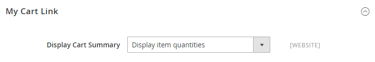

# [!UICONTROL Sales] > [!UICONTROL Checkout]

{{config}}

## [!UICONTROL Checkout Options]

<!-- zoom -->

<!--[Checkout Options](https://docs.magento.com/user-guide/sales/checkout-options.html) -->

| Fält | [Omfång](../../getting-started/websites-stores-views.md#scope-settings) | Beskrivning |
|------------------------------------------------------------------|--- |----------------------------------------------------------------------------------------------------------------------------------------------------------------------------------------------------------------------------------------------------------------------------------------------------------------------------------------------------------------------------------------------------------------------------------------------------------------------|
| [!UICONTROL Enable Guest Checkout Login] | Butiksvy | Aktivera den här inställningen för att tillåta oautentiserade användare (storefront och API:er) att fråga om en e-postadress redan är kopplad till ett kundkonto. Detta kan användas för att förbättra arbetsflödet för utcheckning av gäster genom att visa en inloggningsfråga om den angivna e-postadressen redan är registrerad på ett kundkonto, men medför att information exponeras för oautentiserade användare.  Alternativ: `Yes` / `No` |
| [!UICONTROL Enable Onepage Checkout] | Butiksvy | Bestämmer om [Ensidig utcheckning](../../stores-purchase/checkout-process.md#checkout-options) är standardformat för utcheckning. Alternativ: `Yes` / `No` |
| [!UICONTROL Allow Guest Checkout] | Butiksvy | Anger om gästerna kan gå igenom [utcheckning utan registrering](../../stores-purchase/checkout-guest.md) för ett konto hos din butik. Alternativ: `Yes` / `No` |
| [!UICONTROL Enable Terms and Conditions] | Butiksvy | Bestämmer om kunderna måste godkänna [Villkor](../../stores-purchase/terms-and-conditions.md) av försäljningen innan du gör ett köp. Alternativ: `Yes` / `No` |
| [!UICONTROL Display Billing Address On] | Butiksvy | Bestämmer platsen för faktureringsadressen under utcheckningen. Alternativ: `Payment Method` / `Payment Page` |
| [!UICONTROL Maximum Number of Items to Display in Order Summary] | Butiksvy | Anger det maximala antalet objekt som kan visas i dialogrutan _Ordersammanfattning_ vid utcheckning. Standardvärdet är `10`. |
| [!UICONTROL Enable Address Search] | Webbplats |  (Endast Adobe Commerce) Anger om kunderna kan använda [adresssökning](../../stores-purchase/checkout-address-search.md) för leverans, granskning och betalningar. När detta är aktiverat använder du alternativet Antal kundadresser (Limit) för att ange antalet sparade adresser som krävs för att aktivera den här funktionen vid utcheckning. Alternativ: `Yes` / `No` |
| Gräns för antal kundadresser | Webbplats |  (Endast Adobe Commerce) När adresssökning är aktiverat, avgör hur många sparade adresser som krävs för att aktivera den här funktionen vid utcheckning. När kundens antal sparade adresser uppfyller eller överstiger det här antalet återges endast standardadressen på _Leverans_ och _Granska och betala_ steg. Kunden kan använda en sökfunktion för att ändra den valda adressen. Standardvärdet är `10`. |

{style="table-layout:auto"}

## [!UICONTROL Shopping Cart]

<!-- zoom -->

<!--[Shopping Cart](https://docs.magento.com/user-guide/sales/cart-configuration.html) -->

| Fält | [Omfång](../../getting-started/websites-stores-views.md#scope-settings) | Beskrivning |
|--- |--- |--- |
| [!UICONTROL Quote Lifetime (days)] | Webbplats | Bestämmer [livstid för ett noterat pris](../../stores-purchase/cart-configuration.md#quote-lifetime), om några dagar. |
| [!UICONTROL After Adding a Product Redirect to Shopping Cart] | Butiksvy | Anger om [kundvagnssidan visas](../../stores-purchase/cart-configuration.md#redirect-to-cart) omedelbart efter det att en produkt lagts till i varukorgen. Alternativ: `Yes` / `No` |
| [!UICONTROL Number of Items to Display Pager] | Butiksvy | Fastställer antalet artiklar i kundvagnen innan personsökaren aktiveras. Standardvärde: `20` |
| [!UICONTROL Show Cross-sell Items in the Shopping Cart] | Butiksvy | Anger om [korsförsäljningsartiklar](../../catalog/related-products-up-sells-cross-sells.md#cross-sells) visas i kundvagnen och ger kunderna fler säljalternativ. Alternativ: `Yes` (standard) / `No` |
| [!UICONTROL Grouped Product Image] | Butiksvy | Bestämmer [miniatyrbild](../../stores-purchase/cart-configuration.md#cart-thumbnails) bild som visas för en [grupperad produkt](../../catalog/product-create-grouped.md) i kundvagnen. Alternativ: `Product Thumbnail Itself` / `Parent Product Thumbnail` |
| [!UICONTROL Configurable Product Image] | Butiksvy | Bestämmer [miniatyrbild](../../stores-purchase/cart-configuration.md#cart-thumbnails) bild som visas för en konfigurerbar produkt i kundvagnen. Alternativ: `Product Thumbnail Itself` / `Parent Product Thumbnail` |
| [!UICONTROL Preview Quote Lifetime (minutes)] | Butiksvy | Bestämmer den maximala åldern för offerten i minuter när den förhandsgranskas från kundvagnen. |
| [!UICONTROL Enable Clear Shopping Cart] | Webbplats | Avgör om kundvagnen visar alternativet för användare att rensa innehållet i vagnen i en enda åtgärd. Alternativ: `Yes` / `No` |

{style="table-layout:auto"}

## [!UICONTROL My Cart Link]

<!-- zoom -->

<!-- [*My Cart Link*](https://docs.magento.com/user-guide/sales/mini-cart.html) -->

| Fält | [Omfång](../../getting-started/websites-stores-views.md#scope-settings) | Beskrivning |
|--- |--- |--- |
| [!UICONTROL Display Cart Summary] | Webbplats | Anger vilket värde som visas inom parentes efter länken Min kundvagn. Alternativ: `Display number of items in cart` / `Display item quantities` |

{style="table-layout:auto"}

## Mini Cart

<!-- zoom -->

<!-- [*Mini Cart*](https://docs.magento.com/user-guide/sales/mini-cart.html) -->

| Fält | [Omfång](../../getting-started/websites-stores-views.md#scope-settings) | Beskrivning |
|--- |--- |--- |
| [!UICONTROL Display Mini Cart] | Butiksvy | Avgör om mini-vagnen visas på butikssidorna när användaren klickar på varukorsikonen i sidhuvudet. Visningen av minivagnen beror på temat. Alternativ: `Yes` / `No` |
| [!UICONTROL Number of Items to Display Scrollbar] | Butiksvy | Anger antalet objekt som kan visas i minivagnen innan rullningslisten aktiveras. Standard: `5` |
| [!UICONTROL Maximum Number of Items to Display] | Butiksvy | Anger det maximala antalet artiklar som kan visas i minivagnen. Standard: `10` |

{style="table-layout:auto"}

## [!UICONTROL Payment Failed Emails]

<!-- zoom -->

<!-- [*Payment Failed Emails*](https://docs.magento.com/user-guide/sales/checkout-payment-failed-emails.html) -->

| Fält | [Omfång](../../getting-started/websites-stores-views.md#scope-settings) | Beskrivning |
|--- |--- |--- |
| [!UICONTROL Payment Failed Email Receiver] | Butiksvy | Identifierar den butikskontakt som tar emot e-postmeddelanden om misslyckade betalningar. Standardmottagare: `General Contact` |
| [!UICONTROL Payment Failed Email Sender] | Butiksvy | Identifierar den butikskontakt som visas som meddelandeavsändare av e-postmeddelanden om misslyckade betalningar. Standardavsändare: `General Contact` |
| [!UICONTROL Payment Failed Template] | Butiksvy | Identifierar mallen som används för att skicka misslyckade e-postmeddelanden. Standardmall: `Payment Failed` |
| [!UICONTROL Send Payment Failed Copy To] | Butiksvy | Anger e-postadressen till alla som ska få en kopia av ett e-postmeddelande om misslyckade betalningar. Avgränsa flera adresser med komma. |
| [!UICONTROL Send Payment Failed Copy Method] | Butiksvy | Anger den e-postmetod som används för att skicka kopian. Alternativ:  **`Bcc`**- Skickar en hemlig kopia genom att inkludera mottagaren i rubriken för samma e-postmeddelande som skickas till kunden. Mottagaren av hemlig kopia är inte synlig för kunden. **`Separate Email`** - Skickar kopian som ett separat e-postmeddelande. |

{style="table-layout:auto"}
