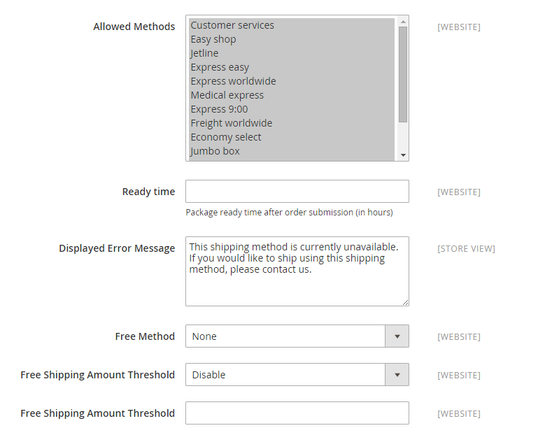

# [!UICONTROL Sales] > [!UICONTROL Delivery Methods]

{{config}}

## [!UICONTROL Basic Delivery Methods]

### [!UICONTROL Flat Rate]

<!-- zoom -->

<!-- [Flat Rate](https://experienceleague.adobe.com/en/docs/commerce-admin/stores-sales/delivery/basic-methods/shipping-flat-rate) -->

| Fält | [Omfång](../../getting-started/websites-stores-views.md#scope-settings) | Beskrivning |
|--- |--- |--- |
| [!UICONTROL Enabled] | Webbplats | När det här alternativet är aktiverat visas ett schablonbelopp som ett alternativ i avsnittet _Beräkna frakt och skatt_ i kundvagnen och i avsnittet _Leverans_ under utcheckningen. Alternativ: `Yes` / `No` |
| [!UICONTROL Title] | Butiksvy | Namnet som används för den här leveransmetoden vid utcheckning. |
| [!UICONTROL Method Name] | Butiksvy | Ett namn som beskriver den beräkningsmetod som används för att generera en leveransuppskattning. Metodnamnet visas bredvid den beräknade tariffen i kundvagnen. Standardvärdet är `Fixed`. |
| [!UICONTROL Type] | Webbplats | Beskriver vilken typ av beräkning som används för att fastställa schablonbeloppet. Alternativ:  **`None`**- Ingen beräkning används. Ställer in schablonbelopp till noll, vilket motsvarar fri frakt. **`Per Order`** - Debiterar ett schablonbelopp för hela ordern.  **`Per Item`**- debiterar ett separat schablonbelopp för varje artikel i kundvagnen. Kursen multipliceras med antalet artiklar i vagnen, även om den totala kvantiteten innehåller en kombination av olika artiklar. |
| [!UICONTROL Price] | Webbplats | Det pris du debiterar kunden för frakt till fast pris. |
| [!UICONTROL Calculate Handling Fee] | Webbplats | Avgör hur hanteringskostnaden beräknas, om en sådan inkluderas. Alternativ: `Fixed` / `Percent` |
| [!UICONTROL Handling Fee] | Webbplats | Ange det belopp som ska debiteras för en hanteringsavgift, baserat på den metod du har valt för att beräkna beloppet. Om avgiften t.ex. är baserad på en fast avgift anger du beloppet i decimalform, t.ex. 4,90. Om hanteringsavgiften baseras på en procentandel av ordern anger du beloppet i procent. Om du till exempel debiterar sex procent av ordern anger du värdet som `.06`. |
| [!UICONTROL Displayed Error Message] | Butiksvy | Ett meddelande som visas om en kund väljer ett schablonbelopp, men av någon anledning är metoden inte tillgänglig. |
| [!UICONTROL Ship to Applicable Countries] | Webbplats | Identifierar de länder där ni erbjuder frakt till schablonbelopp. Alternativ:  **`All Allowed Countries`**- Kunder från vilket land som helst som anges i butikskonfigurationen kan använda frakt med platt hastighet. **`Specific Countries`** - Kunder från endast specifika länder kan använda frakt med schablonbelopp. |
| [!UICONTROL Ship to Specific Countries] | Webbplats | Identifierar varje land där kunderna kan använda prissatt frakt. |
| [!UICONTROL Show Method if Not Applicable] | Webbplats | Avgör om ett schablonbelopp visas som ett alternativ vid utcheckning om metoden inte gäller för köpet. Alternativ: `Yes` / `No` |
| [!UICONTROL Sort Order] | Webbplats | Ett tal som bestämmer i vilken ordning som ett schablonbelopp visas när det visas med andra leveransmetoder vid utcheckning. |

{style="table-layout:auto"}

### [!UICONTROL Free Shipping]

<!-- zoom -->

<!-- [Free Shipping](https://experienceleague.adobe.com/en/docs/commerce-admin/stores-sales/delivery/basic-methods/shipping-free) -->

| Fält | [Omfång](../../getting-started/websites-stores-views.md#scope-settings) | Beskrivning |
|--- |--- |--- |
| [!UICONTROL Enabled] | Webbplats | När alternativet är aktiverat visas Fri frakt som ett alternativ i avsnittet Leverans under utcheckning. Alternativ: `Yes` / `No` |
| [!UICONTROL Title] | Butiksvy | Namnet som används för den här leveransmetoden vid utcheckning. |
| Metodnamn | Butiksvy | Ett namn som beskriver den beräkningsmetod som används för att generera en leveransuppskattning. Metodnamnet visas bredvid den beräknade tariffen i kundvagnen. Standardvärdet är `Free`. |
| Minsta orderbelopp | Webbplats | Det minimiinköp som krävs för att tillämpa Fri frakt på en order. |
| Inkludera moms i belopp | Webbplats | Avgör om moms ingår i beräkningen av minimiorderbelopp. Alternativ:  **Ja** - Moms inkluderas vid beräkning av minimiorderbelopp (Delsumma + Moms - Rabatt). **Nej** - Moms inkluderas inte vid beräkning av minimiorderbelopp (delsumma - rabatt). |
| Felmeddelande som visas | Butiksvy | Ett meddelande som visas om en kund väljer Fri frakt, men metoden är inte tillgänglig av någon anledning. |
| Leverera till tillämpliga länder | Webbplats | Identifierar de länder där du erbjuder kostnadsfri frakt. Alternativ:  **Alla tillåtna länder** - Kunder från alla länder som anges i butikskonfigurationen kan använda kostnadsfri leverans.  **Specifika länder** - Kunder från endast vissa länder kan använda kostnadsfri frakt. |
| Leverera till specifika länder | Webbplats | Identifierar varje land där kunderna kan använda kostnadsfri frakt. |
| Visa metod om den inte är tillämplig | Webbplats | Avgör om Fri frakt visas som ett alternativ vid utcheckning om metoden inte gäller för köpet. Alternativ: `Yes` / `No` |
| [!UICONTROL Sort Order] | Webbplats | Ett tal som bestämmer i vilken ordning som Fri frakt ska visas när det visas med andra leveransmetoder vid utcheckning. |

{style="table-layout:auto"}

### [!UICONTROL Table Rates]

<!-- zoom -->

<!-- [Table Rates](https://experienceleague.adobe.com/en/docs/commerce-admin/stores-sales/delivery/basic-methods/shipping-table-rate) -->

| Fält | [Omfång](../../getting-started/websites-stores-views.md#scope-settings) | Beskrivning |
|--- |--- |--- |
| [!UICONTROL Enabled] | Webbplats | När det här alternativet är aktiverat visas Registerpriser som ett alternativ i avsnittet Beräkna frakt och moms i kundvagnen och i avsnittet Leverans under utcheckningen. Alternativ: `Yes` / `No` |
| [!UICONTROL Title] | Butiksvy | Namnet som används för den här leveransmetoden vid utcheckning. |
| Metodnamn | Butiksvy | Ett namn som beskriver den beräkningsmetod som används för att generera en leveransuppskattning. Metodnamnet visas bredvid den beräknade tariffen i kundvagnen. Standardvärdet är `Table Rate`. |
| [!UICONTROL Condition] | Webbplats | Anger det villkor som beräkningen baseras på. Formatet på den överförda CSV-filen är specifikt för varje villkor. Alternativ: `Weight vs. Destination` / `Price vs. Destination` / `# of Items vs. Destination` |
| [!UICONTROL Include Virtual Products in Price Calculation] | Webbplats | Avgör om virtuella produkter, som inte kräver frakt, inkluderas i prisberäkningarna för registersatser. |
| [!UICONTROL Calculate Handling Fee] | Webbplats | Avgör hur hanteringskostnaden beräknas, om en sådan inkluderas. Alternativ: `Fixed` / `Percent` |
| [!UICONTROL Handling Fee] | Webbplats | Beloppet för eventuella avgifter som läggs till i leveransavgiften för att täcka kostnaden för att hantera leveransen. Ange värdet i decimalform. Om avgiften t.ex. baseras på en procentandel anger du 0,06 i stället för 6 %. Ange `6.00` för ett fast belopp. |
| [!UICONTROL Displayed Error Message] | Butiksvy | Ett meddelande som visas om en kund väljer Tabellavgifter, men av någon anledning är metoden inte tillgänglig. |
| [!UICONTROL Ship to Applicable Countries] | Webbplats | Identifierar de länder där du erbjuder priser för frakt. Alternativ:  **`All Allowed Countries`**- Kunder från vilket land som helst som anges i butikskonfigurationen kan använda tabellradsleverans. **`Specific Countries`** - Kunder från endast specifika länder kan använda tabelltariffsleverans. |
| [!UICONTROL Ship to Specific Countries] | Webbplats | Identifierar varje land där kunderna kan använda priser för frakt. |
| [!UICONTROL Show Method if Not Applicable] | Webbplats | Avgör om tabellavgifter visas som ett alternativ vid utcheckning om metoden inte gäller för köpet. Alternativ: `Yes` / `No` |
| [!UICONTROL Sort Order] | Webbplats | Ett tal som bestämmer i vilken ordning som tabellavgifter visas när de visas tillsammans med andra leveransmetoder vid utcheckning. |

{style="table-layout:auto"}

### [!UICONTROL In-Store Delivery]

<!-- zoom -->

<!-- [In-Store Delivery](https://experienceleague.adobe.com/en/docs/commerce-admin/stores-sales/delivery/basic-methods/shipping-in-store-delivery) -->

| Fält | [Omfång](../../getting-started/websites-stores-views.md#scope-settings) | Beskrivning |
|--- |--- |--- |
| [!UICONTROL Enabled] | Webbplats | När det här alternativet är aktiverat kan leverans i butik visas som ett alternativ i avsnittet _Beräkna frakt och moms_ i kundvagnen och i avsnittet _Leverans_ under utcheckning. Alternativ: `Yes` / `No` |
| [!UICONTROL Method Name] | Butiksvy | Ett namn som identifierar butiksupptagningsfunktionen som en leveransmetod. Värdet visas som etikett på en flik högst upp på utcheckningssidan för leverans och i tabellen över tillgängliga leveransmetoder längst ned på samma sida. Standardvärdet är `In-store Delivery`. |
| [!UICONTROL Title] | Butiksvy | Namnet som används för den här leveransmetoden vid utcheckning. |
| [!UICONTROL Price] | Webbplats | Det pris ni debiterar kunden för en upphämtning i butik. |
| [!UICONTROL Search Radius] | Webbplats | Den radie i km som ska användas vid sökning efter upphämtningsplatser. |
| [!UICONTROL Displayed Error Message] | Butiksvy | Ett meddelande som visas när en kund väljer att hämta i butik, men leveransmetoden är inte tillgänglig. |

{style="table-layout:auto"}

## [!UICONTROL Carriers]

### [!UICONTROL UPS]

{{ups-api}}

<!-- zoom -->

<!-- zoom -->

<!-- [UPS REST Account Settings]https://experienceleague.adobe.com/en/docs/commerce-admin/stores-sales/delivery/shipping-carriers/ups) -->

| Fält | [Omfång](../../getting-started/websites-stores-views.md#scope-settings) | Beskrivning |
|--- |--- |--- |
| [!UICONTROL Enabled for Checkout] | Webbplats | Avgör om UPS är tillgängligt för kunder som leveransmetod vid utcheckning. Alternativ: `Yes` / `No` |
| [!UICONTROL Enabled for RMA] | Webbplats | Avgör om UPS är tillgängligt för kunder som leveransmetod för en RMA. Alternativ: `Yes` / `No` |
| _[!UICONTROL UPS Account Settings]_ |  |  |
| [!UICONTROL Live Account] | Butiksvy | Anger att United Parcel Service-kontot är direktsänt. Alternativ: `Yes` / `No` |
| [!UICONTROL Title] | Butiksvy | Namnet som används för den här leveransmetoden vid utcheckning. |
| _[!UICONTROL UPS REST Account Settings]_ |  |  |
| [!UICONTROL Gateway URL] | Webbplats | För UPS REST-tjänsten visas följande URL:er som krävs för att överföra JSON-data: Gateway-URL, Spårnings-URL, Leverans-URL. Använd antingen sandlåda eller Produktionsslutpunkter enligt inställningen för Live-konto. |
| [!UICONTROL Mode] | Webbplats | Anger vilket överföringssätt som används för data som skickas till UPS-systemet. Alternativ:  **`Development`**- UPS verifierar inte att data som tas emot från Commerce-servern skickas via SSL. **`Live`** - UPS verifierar att data som tas emot från Commerce-servern skickas via ett säkert socketlager (SSL). |
| Användar-ID | Webbplats | Klient-ID för ditt UPS-avdelarkonto. |
| [!UICONTROL Origin of the Shipment] | Webbplats | (Endast UPS REST) Det land eller den region där produktleveransen kommer. |
| [!UICONTROL Password] | Butiksvy | Klienthemlighet för ditt UPS-avsändarkonto. |

{style="table-layout:auto"}

<!-- zoom -->

<!-- [UPS Package Information]https://experienceleague.adobe.com/en/docs/commerce-admin/stores-sales/delivery/shipping-carriers/ups) -->

| Fält | [Omfång](../../getting-started/websites-stores-views.md#scope-settings) | Beskrivning |
|--- |--- |--- |
| _[!UICONTROL UPS Negotiated Rate Settings]_ |  |  |
| [!UICONTROL Enable Negotiated Rates] | Webbplats | (Endast UPS REST) Aktiverar/inaktiverar specialpriser enligt ditt avtal med UPS. Alternativ: `Yes` / `No` |
| [!UICONTROL Packages Request Type] | Webbplats | Bestämmer hur vikt beräknas för försändelser med flera paket. Alternativ: `Divide to equal weight (one request)` / `Use origin weight (multiple requests)` |
| [!UICONTROL Shipper Number] | Webbplats | (Endast UPS REST) Det sexsiffriga UPS-leveransnumret krävs för referens till användning av förhandlade hastigheter. |
| [!UICONTROL Container] | Webbplats | Anger behållartypen som används för att paketera leveranser. Alternativ: `Customer Packaging` / `UPS Letter Envelope` / `Customer Packaging` / `UPS Letter Envelope` / `UPS Tube` / `UPS Express Box` / `UPS Worldwide 25 kilo` / `UPS Worldwide 10 kilo` |
| [!UICONTROL Weight Unit] | Webbplats | Anger standardmåttenheten för produktvikt i butiken. Mer information finns i [Dimensionell vikt](../../stores-purchase/carriers.md#dimensional-weight). |
| [!UICONTROL Tracking URL] | Webbplats | (Endast UPS REST) Den UPS-URL som används för att spåra paket. Använd `https://onlinetools.ups.com/api/track` för produktion ELLER `https://wwwcie.ups.com/api/track` för konfiguration av sandlåda. |
| [!UICONTROL Destination Type] | Webbplats | Anger standarddestinationstypen för leverans. Alternativ: `Business` / `Residential` |
| [!UICONTROL Maximum Package Weight] | Webbplats | Anger den maximala vikt ett paket kan ha enligt UPS-inställningarna. Om de beställda produkterna överstiger den högsta paketvikten är detta fraktalternativ inte tillgängligt. Enligt [UPS.com](https://www.ups.com/us/en/global.page) får paketen inte överskrida 70 kg. Kontrollera med din fraktfirma om du vill verifiera den maximala vikten. |
| [!UICONTROL Pickup Method] | Webbplats | Anger UPS-hämtningsmetoden. Alternativ: `Regular Daily Pickup` / `On Call Air` / `One Time Pickup` / `Letter Center` / `Customer Counter` |
| [!UICONTROL Minimum Package Weight] | Webbplats | Anger den minsta vikt som ett paket kan ha enligt UPS-inställningarna. Om de beställda produkterna väger mindre än den minsta paketvikten är detta fraktalternativ inte tillgängligt. Kontrollera med din fraktfirma om du vill kontrollera minimivikten. |
| [!UICONTROL Calculate Handling Fee] | Webbplats | Anger beräkningsmetoden för hanteringsavgift för tabellradsleverans. Alternativ:  **`Fixed`**- Hanteringsavgiften är en fast avgift. **`Percent`** - Hanteringsavgift används som en procentandel av orderbeloppet. |
| [!UICONTROL Handling Applied] | Webbplats | Anger om hanteringsavgift tillämpas på varje order eller på varje paket i en order. |
| [!UICONTROL Handling Fee] | Webbplats | Anger den hantering som ingår i fraktpriset. Hanteringsavgift kan anges som ett fast belopp eller som en procentandel.   **_Obs!:_** Om du anger ett procentvärde använder du decimalformatet `0.25` för 25 %. |

{style="table-layout:auto"}

<!-- zoom -->

<!-- [UPS Allowed Methods]https://experienceleague.adobe.com/en/docs/commerce-admin/stores-sales/delivery/shipping-carriers/ups) -->

| Fält | [Omfång](../../getting-started/websites-stores-views.md#scope-settings) | Beskrivning |
|--- |--- |--- |
| _[!UICONTROL UPS allowed methods]_ |  |  |
| [!UICONTROL Allowed Methods] | Webbplats | Anger vilka UPS-leveransmetoder som erbjuds kunderna. Fraktsatser beräknas på den valda leveransmetoden. |
| [!UICONTROL Free Method] | Webbplats | Identifierar den metod som används för kostnadsfri frakt via UPS. Om du vill inaktivera fri frakt väljer du Ingen.   **_Obs!:_** Den här metoden liknar grundläggande [Fri frakt](../../stores-purchase/shipping-free.md), men den visas som ett UPS-leveransalternativ vid utcheckning. |
| [!UICONTROL Free Shipping Amount Threshold] | Webbplats | Anger om fri frakt ska användas när orderbeloppet når tröskelvärdet för fri frakt. Alternativ: `Enable` / `Disable` |
| [!UICONTROL Free Shipping Amount Threshold] | Webbplats | Anger det minsta totala beloppet som en order måste uppnå för att få fri frakt. |
| [!UICONTROL Displayed Error Message] | Butiksvy | Felmeddelandet som visas när den här leveransmetoden inte är tillgänglig av någon anledning. |

{style="table-layout:auto"}

<!-- zoom -->

<!-- [UPS Applicable Countries and Other Settings]https://experienceleague.adobe.com/en/docs/commerce-admin/stores-sales/delivery/shipping-carriers/ups) -->

| Fält | [Omfång](../../getting-started/websites-stores-views.md#scope-settings) | Beskrivning |
|--- |--- |--- |
| _[!UICONTROL UPS Applicable countries and other Settings]_ |  |  |
| [!UICONTROL Ship to Applicable Countries] | Webbplats | Anger vilket land kunderna får använda den här leveransmetoden. Alternativ:  **`All Allowed Countries`**- Kunder från alla [länder](../../getting-started/store-details.md#country-options) som anges i din butikskonfiguration kan använda den här leveransmetoden. **`Specific Countries`** - När du har valt det här alternativet visas listan [!UICONTROL Ship to Specific Countries]. Välj varje land i listan där leveransmetoden kan användas. |
| [!UICONTROL Show Method if Not Applicable] | Webbplats | Avgör om UPS alltid visas som ett leveransalternativ vid utcheckning. Alternativ:  **`Yes`**- UPS visas alltid som ett leveransalternativ vid utcheckning, även om det inte är tillämpligt på ordern. **`No`** - UPS visas endast som leveransalternativ vid utcheckning om det är tillämpligt för ordern. (Om orderns vikt till exempel överstiger den maximala viktmängden.) |
| [!UICONTROL Debug] | Webbplats | Anger om dataöverföringar mellan din butik och UPS är loggade i systemet för felsökning. Om det inte finns något problem som måste spåras och loggas bör det här alternativet anges till `No`. |
| [!UICONTROL Sort Order] | Webbplats | Ett tal som bestämmer den ordning som UPS visas i när det visas med andra leveransmetoder vid utcheckning. Ange `0` överst i listan. |

{style="table-layout:auto"}

### [!UICONTROL USPS]

| Fält | [Omfång](../../getting-started/websites-stores-views.md#scope-settings) | Beskrivning |
|--- |--- |--- |
| Aktiverad för utcheckning | Webbplats | Avgör om USPS är tillgängligt för kunder som leveransmetod vid utcheckning. Alternativ: `Yes` / `No` |
| _[!UICONTROL USPS Account Settings]_ |  |  |
| [!UICONTROL Gateway URL] | Webbplats | Den URL som används för att ansluta till USPS-systemet för att dynamiskt hämta fraktkostnader. |
| [!UICONTROL Secure Gateway URL] | Webbplats | Den säkra URL som används för att ansluta till USPS-systemet via ett säkert socketlager (SSL) för att dynamiskt hämta fraktkostnader. |
| [!UICONTROL Title] | Butiksvy | Titeln på det här leveransalternativet så som det visas i kundvagnskassan. |
| [!UICONTROL User ID] | Webbplats | Ditt användar-ID för USPS-avsändarens konto. |
| [!UICONTROL Password] | Webbplats | Lösenordet för ditt USPS-avsändarkonto. |
| [!UICONTROL Mode] | Webbplats | Anger vilket överföringssätt som används för data som skickas till USPS-systemet. Alternativen är:  **`Development`**- USPS verifierar inte att data som tas emot från Commerce-servern skickas via SSL. **`Live`** - USPS verifierar att data som tas emot från Commerce-servern skickas via ett säkert socketlager (SSL). |

{style="table-layout:auto"}

Följande fält är bara tillgängliga om du har tillämpat kvalitetskorrigeringen [USPS REST API Migration quality](https://experienceleague.adobe.com/en/docs/commerce-operations/tools/quality-patches-tool/patches-available-in-qpt/v1-1-70/ac-15210). Den här korrigeringen har stöd för USPS API:er, en REST-baserad plattform som ersätter API:erna för webbverktyg. Mer information finns i [API-borttagning för USPS-webbverktyg](../../stores-purchase/carriers.md).

| Fält | [Omfång](../../getting-started/websites-stores-views.md#scope-settings) | Beskrivning |
|--- |--- |--- |
| [!UICONTROL USPS Type] | Webbplats | Välj **USPS Rest API:er** eller **USPS Web Tools API** baserat på vilket som ska användas. |
| [!UICONTROL Consumer Key] | Webbplats | Klient-ID för ditt USPS-avdelarkonto för REST API. |
| [!UICONTROL Consumer Secret] | Webbplats | Klienthemlig nyckel för USPS-avsändarkontot för REST API. |
| [!UICONTROL Account Type] | Webbplats | Typ av USPS-betalkonto. Alternativ: `"EPS"` (Enterprise Payment System) eller `"PERMIT"` (Permit Imprint) för REST API.   **_Obs!:_** Det här fältet är valfritt, men du måste aktivera skapande av leveransetiketter. |
| [!UICONTROL Pricing Options] | Webbplats | Prisalternativ för USPS: **Detaljhandel** eller **Företag**. Påverkar den fraktkostnad som används. Standardvärdet är **Commercial** för REST API. |
| [!UICONTROL Account Number] | Webbplats | Ditt USPS **kontonummer**, som används för betalning för REST API.    **_Obs!:_** Det här fältet är valfritt, men du måste aktivera skapande av leveransetiketter. |
| [!UICONTROL Customer Registration Identifier(CRID)] | Webbplats | Ett kundregistrerings-ID-nummer (CRID) är en USPS-genererad numerisk kod som unikt identifierar ett företag på en plats för REST API.    **_Obs!:_** Det här fältet är valfritt, men du måste aktivera skapande av leveransetiketter. |
| [!UICONTROL Mailer Identifier(MID)] | Webbplats | Mailer Identifier (MID) är ett fält i den intelligenta e-poststreckkoden som används för att identifiera e-postmeddelanden. MID:n tilldelas av USPS till en e-postägare, e-postagent eller annan tjänsteleverantör som begär dem för REST API.    **_Obs!:_** Det här fältet är valfritt, men du måste aktivera skapande av leveransetiketter. |
| [!UICONTROL Manifest MID] | Webbplats | Den unika identifieraren för e-post som har angetts för manifestet för REST API.    **_Obs!:_** Det här fältet är valfritt, men du måste aktivera skapande av leveransetiketter. |
| [!UICONTROL AES/ITN] | Webbplats | USPS AES - Automated Export System/ITN - Internal Transaction Number for REST API.   **_Obs!:_** Det här fältet är vanligtvis valfritt, men måste aktiveras för att skapa leveransetiketter om: <ul><li>Varje typ av varor i leveransen (enligt definition i Schedule B Export Codes på <a href="https://www.census.gov/foreign-trade/schedules/b" target="_blank">www.census.gov/foreign-trade/schedules/b</a>) värderas till 2 500 USD eller mindre och kräver ingen exportlicens.</li><li>Leveransen, oavsett värde, skickas till Kanada och kräver ingen exportlicens.</li></ul> |

{style="table-layout:auto"}

<!-- zoom -->

<!-- [USPS Packaging Settings](https://experienceleague.adobe.com/en/docs/commerce-admin/stores-sales/delivery/shipping-carriers/usps) -->

| Fält | [Omfång](../../getting-started/websites-stores-views.md#scope-settings) | Beskrivning |
|--- |--- |--- |
| _[!UICONTROL USPS packaging Settings]_ |  |  |
| [!UICONTROL Packages Request Type] | Webbplats | Bestämmer hur vikt beräknas för försändelser med flera paket. Alternativ: `Divide to equal weight (one request)` / `Use origin weight (multiple requests)` |
| [!UICONTROL Container] | Webbplats | Anger behållartypen som används för att paketera leveranser. Alternativ: `Variable` / `Flat Rate Box` / `Flat Rate Envelope` / `Rectangular` / Icke-rektangulär |
| [!UICONTROL Size] | Webbplats | Anger storleksalternativet till den typiska paketstorleken för leverans. Det här alternativet påverkar beräkningen av fraktkostnaden. Alternativ: `Regular` / `Large` / `Oversize` |
| [!UICONTROL Machinable] | Webbplats | Anger om paketet kan bearbetas av datorn. Det här alternativet påverkar beräkningen av fraktkostnaden. |
| [!UICONTROL Maximum Package Weight] | Webbplats | Anger den maximala vikt ett paket kan ha enligt vad som anges av USPS. Om de beställda produkterna överstiger den högsta paketvikten är detta fraktalternativ inte tillgängligt. |

{style="table-layout:auto"}

<!-- zoom -->

<!-- [USPS Handling Fee Settings](https://experienceleague.adobe.com/en/docs/commerce-admin/stores-sales/delivery/shipping-carriers/usps) -->

| Fält | [Omfång](../../getting-started/websites-stores-views.md#scope-settings) | Beskrivning |
|--- |--- |--- |
| _[!UICONTROL USPS Handling Fee settings]_ |  |  |
| [!UICONTROL Calculate Handling Fee] | Webbplats | Anger beräkningsmetoden för hanteringsavgift för tabellradsleverans. Alternativ:  **`Fixed`**- Hanteringsavgiften är en fast avgift. **`Percent`** - Hanteringsavgift används som en procentandel av orderbeloppet. |
| [!UICONTROL Handling Applied] | Webbplats | Anger om hanteringsavgift tillämpas på varje order eller på varje paket i en order. |
| [!UICONTROL Handling Fee] | Webbplats | Anger den hantering som ingår i fraktpriset. Hanteringsavgift kan anges som ett fast belopp eller som en procentandel.   **_Obs!:_** Använd decimalformatet `0.25` för 25 % när du skriver ett procentbelopp. |

{style="table-layout:auto"}

<!-- zoom -->

<!-- [USPS Allowed Methods](https://experienceleague.adobe.com/en/docs/commerce-admin/stores-sales/delivery/shipping-carriers/usps) -->

| Fält | [Omfång](../../getting-started/websites-stores-views.md#scope-settings) | Beskrivning |
|--- |--- |--- |
| _[!UICONTROL USPS Allowed Methods]_ |  |  |
| [!UICONTROL Allowed Methods] | Webbplats | Anger vilka metoder för USPS-leverans som erbjuds kunderna. Fraktsatser beräknas på den valda leveransmetoden. |
| [!UICONTROL Free Method] | Webbplats | Anger metoden för fri frakt via USPS, eller kan inaktiveras genom att välja `None`.   **_Obs!:_** Den här leveransmetoden liknar butikens kostnadsfria leveransmetod, men den anges som ett alternativ för USPS-leverans och identifieras som USPS-leverans. |
| [!UICONTROL Minimum Order Amount for Free Shipping] | Webbplats | Anger det minimiorderbelopp som måste uppfyllas för att få fri frakt. |
| [!UICONTROL Displayed Error Message] | Butiksvy | Felmeddelandet som visas när USPS inte är tillgängligt av någon anledning. |

{style="table-layout:auto"}

<!-- zoom -->

<!-- [USPS Applicable Countries](https://experienceleague.adobe.com/en/docs/commerce-admin/stores-sales/delivery/shipping-carriers/usps) -->

| Fält | [Omfång](../../getting-started/websites-stores-views.md#scope-settings) | Beskrivning |
|--- |--- |--- |
| _[!UICONTROL USPS Applicable Countries]_ |  |  |
| [!UICONTROL Ship to Applicable Countries] | Webbplats | Anger de länder där beställningar kan skickas. Alternativ:  **`All Allowed Countries`**- Kunder från alla [länder](../../getting-started/store-details.md#country-options) som anges i din butikskonfiguration kan använda den här leveransmetoden. **`Specific Countries`** - När du har valt det här alternativet visas listan [!UICONTROL Ship to Specific Countries]. Välj varje land i listan där leveransmetoden kan användas. |
| [!UICONTROL Show Method if Not Applicable] | Webbplats | Kontrollerar visningen av UPS-leverans vid utcheckning. Alternativ:  **`Yes`**- USPS visas alltid som ett leveransalternativ vid utcheckning, även om det inte är tillämpligt på ordern. **`No`** - USPS visas som ett leveransalternativ vid utcheckning endast om det är tillämpligt för ordern (dvs. ordervikten överskrider den högsta vikten). |
| [!UICONTROL Debug] | Webbplats | Avgör om en logg över dataöverföringar mellan din butik och USPS hanteras av systemet för felsökning. Om det inte finns något problem som måste spåras och loggas bör det här alternativet anges till `No`. |
| [!UICONTROL Sort Order] | Webbplats | Ett tal som bestämmer i vilken ordning USPS visas när det visas med andra leveransmetoder vid utcheckning. Ange `0` överst i listan. |

{style="table-layout:auto"}

### [!UICONTROL FedEx]

<!-- [FedEx Account Settings](https://experienceleague.adobe.com/en/docs/commerce-admin/stores-sales/delivery/shipping-carriers/fedex) -->

#### Kontoinställningar för FedEx

{width="600" zoomable="yes"}

| Fält | [Omfång](../../getting-started/websites-stores-views.md#scope-settings) | Beskrivning |
|-------|------ |-----------------------------------------------------------------------------|
| [!UICONTROL Enabled for Checkout] | Webbplats | Avgör om FedEx är tillgängligt för kunder som leveransmetod vid utcheckning. Alternativ: `Yes` / `No` |
| [!UICONTROL Title] | Butiksvy | Titeln på det här leveransalternativet så som det visas i kundvagnskassan. |
| [!UICONTROL Account ID] | Webbplats | Ditt FedEx-konto-ID. |
| [!UICONTROL Api Key] | Webbplats | FedEx-kontots API-nyckel. |
| [!UICONTROL Secret Key] | Webbplats | API-hemlig nyckel för ditt FedEx-konto. |
| [!UICONTROL Sandbox Mode] | Webbplats | Om du vill köra FedEx-transaktioner i en testmiljö anger du sandlådeläget till `Yes`. Alternativ: `Yes` / `No`. |
| [!UICONTROL Web-Services URL] | Webbplats | Vilken URL som krävs beror på inställningen för sandlådeläge. Alternativ:  **`Production`**- URL:en för åtkomst till FedEx-webbtjänster när butiken är aktiv. **`Sandbox`** - URL:en för att komma åt testmiljön för FedEx-webbtjänster. |

{style="table-layout:auto"}

#### Inställningar för FedEx-paketering

{width="600" zoomable="yes"}

| Fält | [Omfång](../../getting-started/websites-stores-views.md#scope-settings) | Beskrivning |
|--- |--- |--- |
| [!UICONTROL Pickup Type] | Webbplats | Välj hämtningsmetod i listan:  **`DropOff at Fedex Location`**- (standard) Anger att du släpper leveranser på din lokala FedEx-station. **`Contact Fedex to Schedule`** - Anger att du kontaktar FedEx för att begära en hämtning.  **`Use Scheduled Pickup`**- Anger att leveransen plockas upp som en del av en vanlig schemalagd hämtning. **`On Call`** - Anger att hämtningen är schemalagd genom att anropa FedEx.  **`Package Return Program`**- Anger att leveransen plockas upp av FedEx Ground Package Return Program. **`Regular Stop`** - Anger att leveransen plockas upp enligt det vanliga hämtningsschemat.  **`Tag`**- Anger att leveransupphämtningen är specifik för en Express-tagg eller markanropstaggupphämtning. Detta gäller endast för returetiketter. |
| [!UICONTROL Packages Request Type] | Webbplats | Bestämmer hur vikt beräknas för försändelser med flera paket. Alternativ: `Divide to equal weight (one request)` / `Use origin weight (multiple requests)` |
| [!UICONTROL Packaging] | Webbplats | I listan väljer du den behållartyp som du vanligtvis använder för att paketera produkter som beställts från din butik. |
| [!UICONTROL Weight Unit] | Webbplats | Den enhet som används för förpackningsvikt. Alternativ: `Pounds` (standard) / `Kilograms` |
| [!UICONTROL Maximum Package Weight] | Webbplats | Standardvärdet för FedEx är 150 pund. Kontakta din fraktfirma för att få maximal vikt. Vi rekommenderar att du använder standardvärdet om du inte har särskilda arrangemang med FedEx. |

{style="table-layout:auto"}

#### Inställningar för FedEx-hanteringsavgift

{width="600" zoomable="yes"}

| Fält | [Omfång](../../getting-started/websites-stores-views.md#scope-settings) | Beskrivning |
|--- |--- |--- |
| [!UICONTROL Calculate Handling Fee] | Webbplats | Bestämmer den metod som används för att beräkna hanteringsavgifter. Alternativ: `Fixed Fee` / `Percentage`   **_Note:_** Hanteringsavgiften är valfri och visas som en extra avgift som läggs till i FedEx-leveranskostnaden. |
| [!UICONTROL Handling Applied] | Webbplats | Avgör hur hanteringsavgifter tillämpas. Alternativ: `Per Order` / `Per Package` |
| [!UICONTROL Handling Fee] | Webbplats | Anger det belopp som debiteras som en hanteringsavgift, baserat på den metod som används för att beräkna beloppet. Om avgiften baseras på en fast avgift anger du beloppet i decimalform, till exempel `4.90`. Om hanteringsavgiften baseras på en procentandel av ordern anger du beloppet som en procentandel. Om du till exempel vill debitera sex procent av ordern anger du värdet som `.06`. |

{style="table-layout:auto"}

#### Leveransmetoder för FedEx

{width="600" zoomable="yes"}

| Fält | [Omfång](../../getting-started/websites-stores-views.md#scope-settings) | Beskrivning |
|--- |--- |--- |
| [!UICONTROL Residential Delivery] | Webbplats | Ange något av följande, beroende på om du säljer Business-to-Consumer (B2C) eller Business-to-Business (B2B):  **`Yes`**- För B2C-leveranser **`No`** - För B2B-leveranser |
| [!UICONTROL Allowed Methods] | Webbplats | Välj de leveransmetoder som du stöder i listan. Metoderna beror på ditt FedEx-konto, hur ofta och hur stora dina leveranser är och om du tillåter internationella leveranser. Som handlare kan du välja att endast erbjuda frakt på marken. |
| [!UICONTROL Hub ID] | Webbplats | Ett ID från FedEx som används med metoden [!DNL Smart Post]. |
| [!UICONTROL Free Method] | Webbplats | I listan väljer du den leveransmetod du vill använda för erbjudanden om fri frakt.   **_Obs!:_** Den här leveransmetoden liknar den vanliga metoden för fri frakt, men den anges i FedEx leveransalternativ och identifieras som FedEx-leverans. |
| [!UICONTROL Free Shipping Amount Threshold] | Webbplats | Avgör om ett minimiorderbelopp krävs för fri frakt. Alternativ:  **`Enable`**- Aktiverar kostnadsfri FedEx-leverans för order som uppfyller minimibeloppet. **`Disable`** - Inaktiverar fri FedEx-leverans med minimiorder. |
| [!UICONTROL Free Shipping Amount Threshold] | Webbplats | Anger det minsta orderbelopp som krävs för fri frakt. |
| [!UICONTROL Displayed Error Message] | Butiksvy | Meddelandet som visas när FedEx inte är tillgängligt av någon anledning. Du kan använda standardmeddelandet eller ange ett annat. |

{style="table-layout:auto"}

#### FedEx tillämpliga landsinställningar

{width="600" zoomable="yes"}

| Fält | [Omfång](../../getting-started/websites-stores-views.md#scope-settings) | Beskrivning |
|--- |--- |--- |
| [!UICONTROL Ship to Applicable Countries] | Webbplats | Anger de länder där dina kunder kan leverera med FedEx. Alternativ:  **`All Allowed Countries`**- Kunder från alla [länder](../../getting-started/store-details.md#country-options) som anges i din butikskonfiguration kan använda den här leveransmetoden. **`Specific Countries`** - När du har valt det här alternativet visas listan [!UICONTROL Ship to Specific Countries]. Välj varje land i listan där leveransmetoden kan användas. |
| [!UICONTROL Ship to Specific Countries] | Webbplats | Anger de specifika länder där dina kunder kan leverera via FedEx. |
| [!UICONTROL Debug] | Webbplats | Avgör om en logg över dataöverföringar mellan din butik och FedEx bevaras av systemet för felsökning. Om det inte finns något problem som måste spåras och loggas bör det här alternativet anges till `No`. |
| [!UICONTROL Show Method if Not Applicable] | Webbplats | Avgör när FedEx visas som en leveransmetod vid utcheckning. Alternativ:  **`Yes`**- Leveransalternativet FedEx visas i listan över leveransmetoder, oavsett om ordern är berättigad att använda den eller inte. **`No`** - Leveransalternativet FedEx visas inte i leveransmetodlistan om det inte gäller för ordern (till exempel om ordervikten överskrider den högsta vikten). |
| [!UICONTROL Sort Order] | Webbplats | Ett tal som bestämmer i vilken ordning FedEx ska visas när det visas med andra leveransmetoder vid utcheckning. Ange `0` överst i listan. |

{style="table-layout:auto"}

### [!UICONTROL DHL]

<!-- zoom -->

<!-- [DHL Account Settings](https://experienceleague.adobe.com/en/docs/commerce-admin/stores-sales/delivery/shipping-carriers/dhl) -->

| Fält | [Omfång](../../getting-started/websites-stores-views.md#scope-settings) | Beskrivning |
|--- |--- |--- |
| _[!UICONTROL DHL Account Settings]_ |  |  |
| [!UICONTROL Enabled for Checkout] | Webbplats | Avgör om DHL är tillgängligt för kunder som leveransmetod vid utcheckning. Alternativ: `Yes` / `No` |
| [!UICONTROL Title] | Butiksvy | Titeln på leveransmetoden så som den visas vid utcheckningen. |
| [!UICONTROL Gateway URL] | Webbplats | Vanligtvis kan du acceptera standard-gateway-URL:en. Om DHL har gett dig en alternativ URL anger du värdet i det här fältet. |
| [!UICONTROL Access ID] | Webbplats | Åtkomst-ID för DHL-speditorkontot. |
| [!UICONTROL Password] | Webbplats | Lösenord till DHL-speditorkontot. |
| [!UICONTROL Account Number] | Webbplats | Ditt DHL-fraktkontonummer. |

{style="table-layout:auto"}

<!-- zoom -->

<!-- [DHL Package Settings](https://experienceleague.adobe.com/en/docs/commerce-admin/stores-sales/delivery/shipping-carriers/dhl) -->

| Fält | [Omfång](../../getting-started/websites-stores-views.md#scope-settings) | Beskrivning |
|--- |--- |--- |
| _[!UICONTROL DHL Package Settings]_ |  |  |
| [!UICONTROL Calculate Handling Fee] | Webbplats | Hanteringsavgiften är valfri och visas som en extra avgift som läggs till DHL:s fraktkostnad. I listan väljer du den metod som du vill använda för att beräkna hanteringsavgifter. Alternativ: Fast avgift/procent. |
| [!UICONTROL Handling Applied] | Webbplats | I listan väljer du hur du vill att hanteringsavgifterna ska tillämpas. Alternativ: `Per Order` / `Per Package` |
| Hanteringsavgift | Webbplats | Ange det belopp som ska debiteras för en hanteringsavgift, baserat på den metod du har valt för att beräkna beloppet. Om avgiften till exempel baseras på en fast avgift anger du beloppet i decimalform, till exempel `4.90`. Om hanteringsavgiften baseras på en procentandel av ordern anger du beloppet i procent. Om du till exempel debiterar sex procent av ordern anger du värdet som `.06`. |
| [!UICONTROL Divide Order Weight] | Butiksvy | Avgör om en order på över 70 kg kan delas upp i mindre enheter för att säkerställa en korrekt fraktkostnad. Alternativ: `Yes` / `No` |
| [!UICONTROL Weight Unit] | Butiksvy | Bestämmer måttenheten för vikt som används i leveransberäkningar. Alternativ: `Pounds` / `Kilograms` |
| [!UICONTROL Size] | Butiksvy | Anger paketets storlek. Alternativ:  **`Regular`**- Levererade paket uppfyller standardpaketeringsmetoderna för DHL. I listan [!UICONTROL Allowed Methods] väljer du de paketeringsmetoder som ska användas för att leverera produkter från din butik. **`Specific`** - Om levererade paket har anpassade dimensioner fyller du i följande: [!UICONTROL Height (cm)] / [!UICONTROL Depth (cm)] / [!UICONTROL Width (cm)] |

{style="table-layout:auto"}

<!-- zoom -->

<!-- DHL Allowed Methods](https://experienceleague.adobe.com/en/docs/commerce-admin/stores-sales/delivery/shipping-carriers/dhl) -->

| Fält | [Omfång](../../getting-started/websites-stores-views.md#scope-settings) | Beskrivning |
|--- |--- |--- |
| _[!UICONTROL DHL allowed methods]_ |  |  |
| [!UICONTROL Allowed Methods] | Webbplats | I listan väljer du de leveransmetoder som du stöder. |
| [!UICONTROL Ready Time] | Webbplats | Anger när paketet är klart för hämtning (i timmar) efter att en beställning har skickats. |
| [!UICONTROL Displayed Error Message] | Butiksvy | Det här meddelandet visas när DHL av någon anledning inte är tillgängligt. Du kan använda standardmeddelandet eller skriva ett eget meddelande. |
| [!UICONTROL Free Method] |  | Den här leveransmetoden liknar den vanliga fraktmetoden, men anges i DHL:s leveransalternativ och identifieras som DHL-leverans. I listan väljer du den leveransmetod du vill använda för erbjudanden om fri frakt. |
| [!UICONTROL Free Shipping with Minimum Order Amount] | Webbplats | Ange något av följande:  **`Enable`**- Tillåt fri DHL-leverans för order som uppfyller minimibeloppet. **`Disable`** - Erbjud ingen fri DHL-leverans med minimiorder. |
| [!UICONTROL Minimum Order Amount for Free Shipping] | Webbplats | Om du aktiverar [!UICONTROL Free Shipping with Minimum Order] anger du det lägsta orderbeloppet i fältet. |

{style="table-layout:auto"}

<!-- zoom -->

<!-- [DHL Applicable Countries](https://experienceleague.adobe.com/en/docs/commerce-admin/stores-sales/delivery/shipping-carriers/dhl) -->

| Fält | [Omfång](../../getting-started/websites-stores-views.md#scope-settings) | Beskrivning |
|--- |--- |--- |
| _[!UICONTROL DHL applicable countries]_ |  |  |
| [!UICONTROL Ship to Applicable Countries] | Webbplats | Anger vilket land kunderna får använda den här leveransmetoden. Alternativ:  **Alla tillåtna länder** - Alla tillåtna länder kan använda metoden för fri frakt. Tillåtna länder anges på konfigurationssidan [!UICONTROL General].  **Specifika länder** - Begränsar det här leveransalternativet till de länder som anges i listan Leverera till specifika länder. |
| [!UICONTROL Ship to Specific Countries] | Webbplats | Anger de länder där DHL-leveranser kan skickas. Den valda listan över länder används om `Specific Countries` har valts i alternativet [!UICONTROL Ship to Applicable Countries]. |
| [!UICONTROL Show Method if Not Applicable] | Webbplats | Avgör när DHL visas som en leveransmetod vid utcheckning. Alternativ:  **`Yes`**- DHL visas alltid som ett leveransalternativ vid utcheckning, även om det inte är tillämpligt på ordern. **`No`** - DHL visas endast som leveransalternativ vid utcheckning om det är tillämpligt för ordern (dvs. ordervikten överskrider den högsta vikten). |
| [!UICONTROL Debug] | Webbplats | Skapar en loggfil med felinformation. |
| [!UICONTROL Sort Order] | Webbplats | Ett tal som bestämmer i vilken ordning DHL visas när det visas med andra leveransmetoder vid utcheckning. Ange `0` om du vill placera den överst i listan. |

{style="table-layout:auto"}
