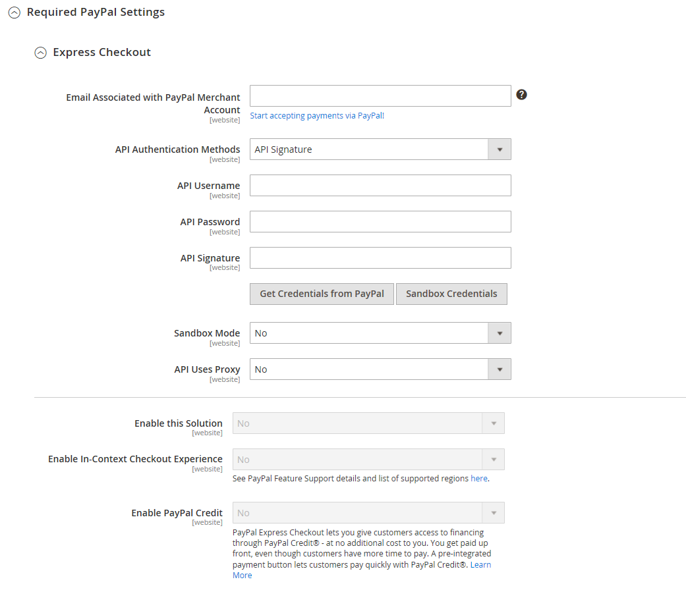

# [!UICONTROL Sales] > [!UICONTROL Payment Methods] > [!UICONTROL PayPal Express Checkout]

>[!IMPORTANT]
>
>**Krav för PSD2:**  
>Från och med den 14 september 2019 kan europeiska banker avböja betalningar som inte uppfyller [PSD2](../../getting-started/compliance-payment-services-directive.md) krav. Ingen åtgärd krävs för PayPal Express-utcheckning för att uppfylla PSD 2 eftersom alla krav hanteras av PayPal.

{{config}}

## [!UICONTROL Required PayPal Settings]

<!-- zoom -->

<!-- [PayPal Express Checkout Required Settings](../../stores-purchase/paypal-express-checkout.html) -->

| Fält | [Omfång](../../getting-started/websites-stores-views.md#scope-settings) | Beskrivning |
|--- |--- |--- |
| [!UICONTROL Enable this Solution] | Webbplats | Aktiverar [!DNL PayPal Express Checkout] som en betalningsmetod som är tillgänglig för dina kunder. Alternativ: `Yes` / `No` |
| [!UICONTROL Enable In-Context Checkout Experience] | Webbplats | Aktiverar strömlinjeformad PayPal In-Context Checkout som en betalningsmetod som är tillgänglig för dina kunder. Alternativ: `Yes` / `No` |
| [!UICONTROL Enable PayPal Credit] | Webbplats | Aktiverar PayPal-kredit så att kunderna kan köpa nu, men betala senare. Du får förskottsbetalning, men kunderna har mer tid att betala. Alternativ: `Yes` / `No` |

{style="table-layout:auto"}

### [!UICONTROL Express Checkout]

| Fält | [Omfång](../../getting-started/websites-stores-views.md#scope-settings) | Beskrivning |
|--- |--- |--- |
| [!UICONTROL Email Associated with PayPal Merchant Account] | Webbplats | Anger den e-postadress som du angav när ditt PayPal-handelskonto upprättades. E-postadressen är skiftlägeskänslig och måste exakt matcha din e-postadress i PayPal-systemet. |
| [!UICONTROL API Authentication Methods] | Webbplats | Bestämmer vilken metod som används för API-autentisering. Alternativ:  **`API Signature`**- Visar _[!UICONTROL API Signature]_i formuläret. **`API Certificate`**- Visar_[!UICONTROL API Certificate]_ i formuläret. |
| [!UICONTROL API Username] | Webbplats | Det API-användarnamn som är associerat med ditt PayPal-handelskonto. |
| [!UICONTROL API Password] | Webbplats | Det API-lösenord som är kopplat till ditt PayPal-handelskonto. |
| [!UICONTROL API Signature] | Webbplats | Den API-signatur som är kopplad till ditt PayPal-handelskonto. |
| [!UICONTROL API Certificate] | Webbplats | Bläddra för att överföra ditt API-certifikat. |
| [!UICONTROL Get Credentials from PayPal] |  | Hämtar dina API-autentiseringsuppgifter från PayPal. |
| [!UICONTROL Sandbox Credentials] |  | Hämtar dina sandlådeinloggningsuppgifter från PayPal. |
| [!UICONTROL Sandbox Mode] | Webbplats | Om du vill köra PayPal Express-utcheckning i en testmiljö anger du dina autentiseringsuppgifter för sandbox-API:t och anger det här som `Yes`. Alternativ: `Yes` / `No` |
| [!UICONTROL API Uses Proxy] | Webbplats | Om systemet använder en proxyserver för att upprätta anslutningen mellan Commerce och PayPal-systemet anger du det här som `Yes`. Alternativ: `Yes` / `No` |
| [!UICONTROL Proxy Host] | Webbplats | Om API:t använder proxy anger detta IP-adressen för proxyvärden. |
| [!UICONTROL Proxy Port] | Webbplats | Om API:t använder proxy anger detta vilken port som används av proxyvärden. |

{style="table-layout:auto"}

### [!UICONTROL Advertise PayPal Credit]

<!-- zoom -->

| Fält | [Omfång](../../getting-started/websites-stores-views.md#scope-settings) | Beskrivning |
|--- |--- |--- |
| [!UICONTROL Publisher ID] | Webbplats | Det utgivar-ID som är kopplat till ditt PayPal-kreditkonto. |
| [!UICONTROL Get Publisher ID from PayPal] |  | Hämtar ditt utgivar-ID från PayPal. |
| [!UICONTROL Home Page] | Webbplats | Bestämmer positionen och storleken för [!DNL PayPal Credit] banner på startsidan. Alternativ:  **Visa** - Visar en[!DNL PayPal Credit] bannern på butikens hemsida. Alternativ: `Yes` / `No`  **Position** - Bestämmer positionen för [!DNL PayPal Credit] banner på startsidan. Alternativ: Sidhuvud (mitten) / Sidlist (höger)  **Storlek** - Anger storleken på [!DNL PayPal Credit] banner på startsidan. Alternativ: `190 x 100` / `234 x 60` / `300 x 50` / `468 x 60` / `728 x 90` /` 800 x 66` |
| [!UICONTROL Catalog Category Page] | Webbplats | Bestämmer positionen och storleken för [!DNL PayPal Credit] på kategorisidor. Alternativ: (samma som [!UICONTROL Home Page]) |
| [!UICONTROL Catalog Product Page] | Webbplats | Bestämmer positionen och storleken för [!DNL PayPal Credit] banner på produktsidor. Alternativ: (samma som [!UICONTROL Home Page]) |
| [!UICONTROL Checkout Cart Page] | Webbplats | Bestämmer positionen och storleken för [!DNL PayPal Credit] banner on cart page. Alternativ: (samma som [!UICONTROL Home Page]) |

{style="table-layout:auto"}

## [!UICONTROL Basic Settings]

<!-- zoom -->

| Fält | [Omfång](../../getting-started/websites-stores-views.md#scope-settings) | Beskrivning |
|--- |--- |--- |
| [!UICONTROL Title] | Butiksvy | Ett namn som identifierar betalningsmetoden PayPal Express Checkout under utcheckningen. |
| [!UICONTROL Sort Order] | Butiksvy | Ett tal som bestämmer i vilken ordning som PayPal Express Checkout ska visas när det visas med andra betalningsmetoder vid utcheckning. Retur `0` överst i listan. |
| [!UICONTROL Payment Action] | Webbplats | Bestämmer vilken åtgärd som PayPal ska utföra när den tar emot en order. Alternativ:  **`Authorization`**- Godkänner köpet, men spärrar pengarna. Beloppet dras inte tillbaka förrän handlaren&quot;fångar&quot; det. **`Sale`** - Köpbeloppet godkänns och dras omedelbart tillbaka från kundens konto.  **`Order`**- Representerar ett avtal med PayPal som tillåter handlaren att inom en angiven tidsperiod inhämta ett eller flera belopp upp till den beställda summan från kundens köparkonto. Det kan vara upp till 29 dagar. En eller flera fakturor måste genereras från Commerce Admin för att du ska kunna samla in pengarna. |
| [!UICONTROL Display on Product Details Page] | Butiksvy | Avgör om knappen&quot;Checka ut med PayPal&quot; visas på produktsidor. Alternativen är: `Yes` / `No` |

{style="table-layout:auto"}

## [!UICONTROL Advanced Settings]

<!-- zoom -->

| Fält | [Omfång](../../getting-started/websites-stores-views.md#scope-settings) | Beskrivning |
|--- |--- |--- |
| [!UICONTROL Display on Shopping Cart] | Butiksvy | Avgör om PayPal Express Checkout visas som ett betalningsalternativ i kundvagnen. Alternativ: `Yes` (PayPal rekommenderas) / `No` |
| [!UICONTROL Payment Action Applicable From] | Webbplats | Anger intervallet för det tillämpliga landsvalet. Alternativ: `All Allowed Countries` / `Specific Countries` |
| [!UICONTROL Countries Payment Applicable From] | Webbplats | Identifierar varje land från vilket betalning accepteras. Endast kunder med en faktureringsadress i ett visst land kan göra inköp med den här betalningsmetoden. |
| [!UICONTROL Debug Mode] | Webbplats | Registrerar meddelanden som skickas mellan din butik och betalningssystemet i en loggfil. Alternativ: `Yes` / `No`   **_Obs!_**Loggfilen lagras på servern och är bara tillgänglig för utvecklare. I enlighet med PCI-datasäkerhetsstandarder registreras inte kreditkortsinformation i loggfilen. |
| [!UICONTROL Enable SSL Verification] | Webbplats | Aktiverar verifiering av värdsäkerhetscertifikatet. Alternativ: `Yes` / `No` |
| [!UICONTROL Transfer Cart Line Items] | Webbplats | Visar en fullständig sammanfattning av radobjekten från kundens kundvagn på PayPal-webbplatsen. Alternativ: `Yes` / `No` |
| [!UICONTROL Transfer Shipping Options] | Webbplats | Inkluderar upp till tio leveransalternativ på PayPal-sajten. Alternativ: `Yes` / `No` |
| [!UICONTROL Shortcut Buttons Flavor] | Butiksvy | Bestämmer vilken typ av bild som används för PayPal-accepteringsknappen. Alternativ:  **`Dynamic`**- (Rekommenderas) Visar en bild som kan ändras dynamiskt från PayPal-servern. **`Static`** - Visar en statisk bild som inte kan ändras dynamiskt. |
| [!UICONTROL Enable PayPal Guest Checkout] | Webbplats | Tillåter kunder som inte har PayPal-konton att göra inköp med PayPal Express Checkout. Alternativ: `Yes` / `No` |
| [!UICONTROL Require Customer's Billing Address] | Webbplats | Avgör om kundens faktureringsadress krävs. Alternativ: `Yes` / `No` / `For Virtual Quotes Only` |
| [!UICONTROL Billing Agreement Signup] | Webbplats | Avgör om kunderna kan delta i en [faktureringsavtal](../../stores-purchase/paypal-billing-agreements.md) med din butik. Alternativ:  **`Auto`**- Kunden kan registrera sig för ett faktureringsavtal under Express Checkout. **`Ask Customer`** - Kunden tillfrågas om de vill registrera sig för ett faktureringsavtal.  **`Never`**- Kunderna erbjuds inte möjligheten att registrera sig för ett faktureringsavtal. |
| [!UICONTROL Skip Order Review Step] | Webbplats | Avgör om kunderna kan slutföra transaktionen från PayPal-webbplatsen eller måste återvända till din butik och slutföra ordergranskningssteget innan ordern skickas. Alternativ: `Yes` / `No` |

{style="table-layout:auto"}

### [!UICONTROL Billing Agreement Settings]

<!-- zoom -->

| Fält | [Omfång](../../getting-started/websites-stores-views.md#scope-settings) | Beskrivning |
|--- |--- |--- |
| [!UICONTROL Enabled] | Webbplats | När det här alternativet är aktiverat visas faktureringsavtal som ett betalningsalternativ vid utcheckning. Alternativ: `Yes` / `No` |
| [!UICONTROL Title] | Butiksvy | Etiketten för det PayPal-faktureringsavtalsalternativ som visas som ett betalningsalternativ vid utcheckning. |
| [!UICONTROL Sort Order] | Butiksvy | Bestämmer i vilken ordning faktureringsavtal visas med andra betalningsmetoder vid utcheckning. |
| [!UICONTROL Payment Action] | Webbplats | Avgör hur PayPal hanterar transaktionen: Alternativ:  **Behörighet** - Godkänner köpet, men spärrar pengarna. Beloppet dras inte tillbaka förrän handlaren&quot;fångar&quot; det.  **Försäljning** - Köpbeloppet godkänns och dras omedelbart tillbaka från kundens konto. |
| [!UICONTROL Payment Applicable From] | Webbplats | Anger intervallet för det tillämpliga landsvalet. Alternativ: Alla tillåtna länder/specifika länder |
| [!UICONTROL Countries Payment Applicable From] | Webbplats | Identifierar varje land från vilket betalning accepteras. Endast kunder med en faktureringsadress i ett visst land kan göra inköp med den här betalningsmetoden. |
| [!UICONTROL Debug Mode] | Webbplats | Registrerar kommunikation med betalningssystemet i en loggfil. Alternativ: `Yes` / `No`   **_Obs!_**Loggfilen lagras på servern och är bara tillgänglig för utvecklare. I enlighet med PCI-datasäkerhetsstandarder registreras inte kreditkortsinformation i loggfilen. |
| [!UICONTROL Enable SSL Verification] | Webbplats | Aktiverar ett verifieringssteg som ser till att transaktionen äger rum över en krypterad SSL-kanal. Alternativ: `Yes` / `No` |
| [!UICONTROL Transfer Cart Line Items] | Webbplats | När det här alternativet är aktiverat visas en sammanfattning av radobjekt från kundvagnen på din PayPal-betalningssida. Alternativ: `Yes` / `No` |
| [!UICONTROL Allow in Billing Agreement Wizard] | Webbplats | När det här alternativet är aktiverat kan kunderna initiera ett faktureringsavtal från kontrollpanelen för sina kundkonton. |

{style="table-layout:auto"}

### [!UICONTROL Settlement Report Settings]

<!-- zoom -->

| Fält | [Omfång](../../getting-started/websites-stores-views.md#scope-settings) | Beskrivning |
|--- |--- |--- |
| **[!UICONTROL SFTP Credentials]** |  |  |
| [!UICONTROL Login] | Webbplats | Ditt användarnamn som krävs för att logga in på PayPals säkra FTP-server. |
| [!UICONTROL Password] | Webbplats | Ditt lösenord som krävs för att logga in på PayPals säkra FTP-server. |
| [!UICONTROL Sandbox Mode] | Webbplats | När det här alternativet är aktiverat körs rapporter i en testmiljö innan de publiceras i produktionsmiljön. Alternativ: `Yes` / `No` |
| [!UICONTROL Custom Endpoint Hostname or IP-Address] | Webbplats | Den URL där kvittningsrapporter hanteras. Standardvärde: `reports.paypal.com` |
| [!UICONTROL Custom Path] | Webbplats | Sökvägen där kvittningsrapporter sparas på servern. Standardvärde: `/ppreports/outgoing` |
| **[!UICONTROL Scheduled Fetching]** |  |  |
| [!UICONTROL Enable Automatic Fetching] | Webbplats | När det här alternativet är aktiverat hämtas kvittningsrapporter automatiskt enligt schemat. Alternativ: `Yes` / `No` |
| [!UICONTROL Schedule] | Webbplats | Avgör hur ofta kvittningsrapporter genereras av PayPal. Alternativ: `Daily` / `Every 3 days` / `Every 7 days` / `Every 10 days` / `Every 14 days` / `Every 30 days` / `Every 40 days` |
| [!UICONTROL Time of Day] | Webbplats | Anger timmen, minuten och sekunden som kvittningsrapporter genereras. |

{style="table-layout:auto"}

### [!UICONTROL Frontend Experience Settings]

<!-- zoom -->

| Fält | [Omfång](../../getting-started/websites-stores-views.md#scope-settings) | Beskrivning |
|--- |--- |--- |
| [!UICONTROL PayPal Product Logo] | Butiksvy | Bestämmer PayPal-logotypen som visas i din butik. Det finns fyra grundläggande format i två storlekar. Alternativ: `No Logo` / `We prefer PayPal (150 x 60)` / `We prefer PayPal (150 x 40)` / `Now accepting PayPal (150 x 60)` / `Now accepting PayPal (150 x 40)` / `Payments by PayPal (150 x 60)` / `Payments by PayPal (150 x 40)` / `Shop now using (150 x 60)` / `Shop now using (150 x 40)` |
| **[!UICONTROL PayPal Merchant Pages Style]** |  |  |
| [!UICONTROL Page Style] | Butiksvy | Bestämmer utseendet på din PayPal-handlarsida. Tillåtna värden: **`paypal`** - Använder sidformatet PayPal.  **`primary`**- Använder det sidformat som du identifierade som &quot;primärt&quot; format i din kontoprofil. **`your_custom_value`** - Använder ett anpassat betalningssidformat som anges i din kontoprofil. |
| [!UICONTROL Header Image URL] | Butiksvy | URL-adressen till bilden som visas i det övre vänstra hörnet på utcheckningssidan. Den maximala storleken är 750 x 90 pixlar.   **_Obs!_**PayPal rekommenderar att bilden lagras på en säker server (https). Annars kan kundens webbläsare varna för att&quot;sidan innehåller både säkra och osäkra objekt&quot;. |
| [!UICONTROL Header Image Background Color] | Butiksvy | De sex tecknen [hexadecimal färg](https://en.wikipedia.org/wiki/Web_colors) kod för bakgrundsfärgen för sidhuvudet på utcheckningssidan. Du kan ange koden med antingen versaler eller gemener. |
| [!UICONTROL Header Image Border Color] | Butiksvy | De sex tecknen [hexadecimal färg](https://en.wikipedia.org/wiki/Web_colors) kod för kanten med två pixlar runt rubriken. |
| [!UICONTROL Page Background Color] | Butiksvy | De sex tecknen [hexadecimal färg](https://en.wikipedia.org/wiki/Web_colors) kod för bakgrundsfärgen på den utcheckningssida som visas bakom rubriken och betalningsformuläret. |

{style="table-layout:auto"}

#### [!UICONTROL Customize Smart Buttons (Basic)]

<!-- zoom -->

| Fält | [Omfång](../../getting-started/websites-stores-views.md#scope-settings) | Beskrivning |
|--- |--- |--- |
| [!UICONTROL Customize Button] | Butiksvy | Avgör om smarta PayPal-knappar kan anpassas efter butikens layout och tema. Du kan tillämpa dessa ändringar separat på sidan Kassa, på produktsidor, på sidan Kundvagn och i Mini Cart. |
| [!UICONTROL Label] | Butiksvy | Den text som PayPal visar på knappen för smart betalning. Alternativ:  **`Checkout`**(visas som&quot;PayPal-utcheckning&quot;) **`Pay`** (visas som&quot;Betala med PayPal&quot;)  **`Buy Now`**(visas som&quot;Köp nu med PayPal&quot;) **`PayPal`** (visas som&quot;PayPal&quot;)  **`Installment`**(visas som&quot;PayPal&quot;) **`Credit`** (visas som&quot;PayPal CREDIT&quot;) |
| [!UICONTROL Layout] | Butiksvy | Avgör om smarta PayPal-knappar ska visas lodrätt eller vågrätt. Alternativ:  **`Vertical`**- Köparen måste antingen logga in på PayPal eller skapa ett PayPal-konto oavsett om Aktivera gästutcheckning har valts. **`Horizontal`** - När Aktivera gästutcheckning är markerat visas **`Pay with Debit Card or Credit Card`** på popup-fönstret PayPal. Annars måste köparen antingen logga in på PayPal eller skapa ett PayPal-konto. |
| [!UICONTROL Size] | Butiksvy | Anger storleken på knappen för smart betalning. Alternativ:  **`Medium`**- 250 x 35 pixlar **`Large`** - 350 x 40 pixlar  **`Responsive`**- (Standard) Justerar behållarens bredd. Den minsta bredden är 100 pixlar och den största bredden är 500 pixlar. Höjden justeras dynamiskt baserat på bredden. |
| [!UICONTROL Shape] | Butiksvy | Anger formen på knappen för smart betalning. Alternativ: `Pill` (standard) / `Rectangle` |
| [!UICONTROL Color] | Butiksvy | Ange färg för knappen Smart betalning. Alternativ: `Gold` (standard) / `Blue` / `Silver` / `Black` |

{style="table-layout:auto"}

#### [!UICONTROL Customize Smart Buttons (Features)]

<!-- zoom -->

| Fält | [Omfång](../../getting-started/websites-stores-views.md#scope-settings) | Beskrivning |
|--- |--- |--- |
| [!UICONTROL Disable Funding Options] | Butiksvy | Avgör vilka andra PayPal-finansieringsalternativ som visas på sidan Utcheckning. De valda alternativen visas aldrig på sidan Utcheckning. Alternativen som inte är markerade visas bara om PayPal stöder butikens valuta och köparens plats. Alternativ: `PayPal Credit` / `PayPal Guest Checkout` `Credit Card Icons` / `Elektronisches Lastschriftverfahren - German ELV` |

{style="table-layout:auto"}
