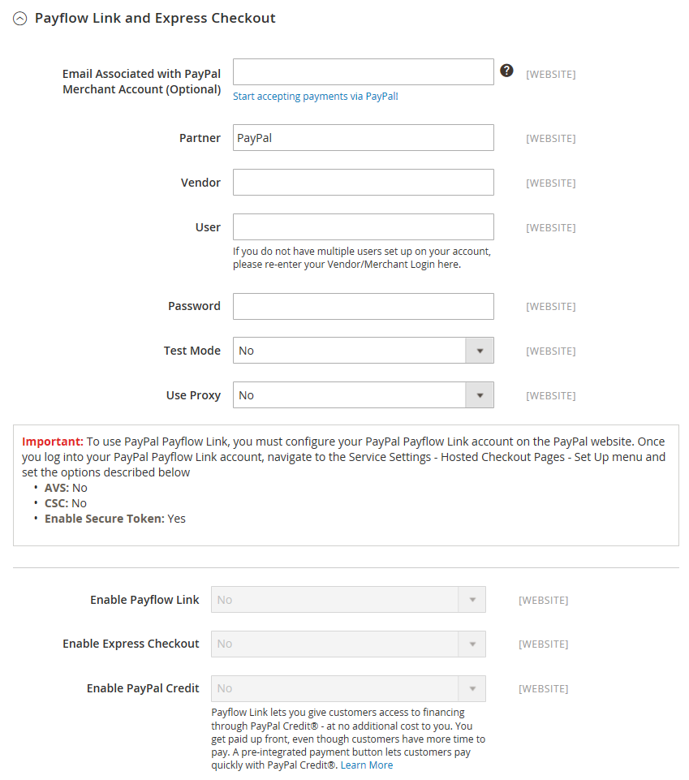
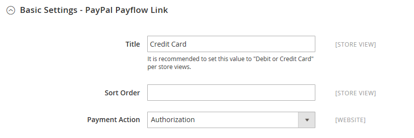
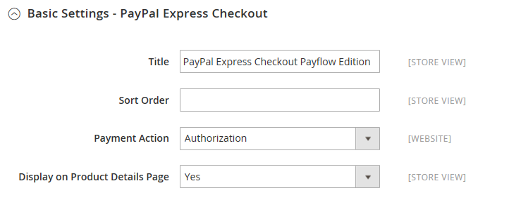

# [!UICONTROL Sales] > [!UICONTROL Payment Methods] > [!UICONTROL PayPal Payflow Link]

>[!IMPORTANT]
>
>**PSD2-krav:**  
>Från och med den 14 september 2019 kan europeiska banker avböja betalningar som inte uppfyller kraven för [PSD2](../../getting-started/compliance-payment-services-directive.md). [!DNL PayPal Payflow Link] måste integreras med [!DNL Cardinal Commerce] för att uppfylla PSD2. Mer information finns i [3-D Secure for Payflow](https://developer.paypal.com/api/nvp-soap/payflow/3d-secure-overview/).

{{config}}

## [!UICONTROL Required Settings]

<!-- zoom -->

| Fält | [Omfång](../../getting-started/websites-stores-views.md#scope-settings) | Beskrivning |
|--- |--- |--- |
| [!UICONTROL Email Associated with PayPal Merchant Account] | Webbplats | (Valfritt) Alla e-postadresser som är kopplade till ditt PayPal-handelskonto. E-postadresser är skiftlägeskänsliga och måste exakt matcha adresserna som finns på ditt konto. |
| [!UICONTROL Partner] | Webbplats | Ditt PayPal Partner-ID, om tillämpligt. |
| [!UICONTROL Vendor] | Webbplats | Ditt PayPal-användarnamn. |
| Användare | Webbplats | ID för en extra användare på ditt PayPal-konto. Om det inte finns några andra användare i nätverket anger du ditt leverantörs- eller handels-ID. |
| [!UICONTROL Password] | Webbplats | Lösenordet som är kopplat till ditt PayPal-handelskonto. |
| [!UICONTROL Test Mode] | Webbplats | När det är aktiverat körs PayPal Payflow Pro i en testmiljö. Stäng av testläget när du är redo att börja använda i produktionsläge. Alternativ: `Yes` / `No` |
| [!UICONTROL Use Proxy] | Webbplats | En proxy kan användas för att dirigera om trafik när serverns brandvägg förhindrar direktåtkomst till PayPal-servern. Identifierar, om tillämpligt, den proxyserver som används för att upprätta anslutningen till PayPal-servern. Alternativ: `Yes` / `No`   Om det här alternativet är aktiverat anger du proxyalternativen:  **`Proxy Host`**- IP-adressen för proxyvärden. **`Proxy Port`** - Proxyportens nummer. |
| [!UICONTROL Enable Payflow Link] | Webbplats | Avgör om PayPal Payflow Link är tillgänglig för dina kunder som betalningsmetod. |
| [!UICONTROL Enable Express Checkout] | Webbplats | Avgör om PayPal Express Checkout är tillgänglig för dina kunder som betalningsmetod. |
| [!UICONTROL Enable PayPal Credit] | Webbplats | Avgör om PayPal-kredit är tillgängligt för dina kunder som betalningsalternativ. |

{style="table-layout:auto"}

## [!UICONTROL Advertise PayPal Credit]

<!-- zoom -->

| Fält | [Omfång](../../getting-started/websites-stores-views.md#scope-settings) | Beskrivning |
|--- |--- |--- |
| [!UICONTROL Publisher ID] | Webbplats | Det utgivar-ID som är kopplat till ditt PayPal-kreditkonto. |
| [!UICONTROL Get Publisher ID from PayPal] |  | Hämtar ditt utgivar-ID från PayPal. |
| [!UICONTROL Home Page] | Webbplats | Bestämmer placeringen och storleken på banderollen [!DNL PayPal Credit] på startsidan. Alternativ:  **`Display`**- Avgör om en [!DNL PayPal Credit]-banderoll visas på butikens startsida. Alternativ: `Yes` / `No` **`Position`** - Bestämmer placeringen av banderollen [!DNL PayPal Credit] på startsidan. Alternativ: Sidhuvud (mitten)/Sidlist (höger)  **`Size`**- Anger storleken på banderollen [!DNL PayPal Credit] på startsidan. Alternativ: `190 x 100` / `234 x 60` / `300 x 50` / `468 x 60` / `728 x 90` /` 800 x 66` |
| [!UICONTROL Catalog Category Page] | Webbplats | Bestämmer placeringen och storleken på banderollen [!DNL PayPal Credit] på kategorisidor. Alternativ: (samma som för [!UICONTROL Home Page]) |
| [!UICONTROL Catalog Product Page] | Webbplats | Bestämmer placeringen och storleken på banderollen [!DNL PayPal Credit] på produktsidor. Alternativ: (samma som för [!UICONTROL Home Page]) |
| [!UICONTROL Checkout Cart Page] | Webbplats | Bestämmer placeringen och storleken på banderollen [!DNL PayPal Credit] på kundvagnssidan. Alternativ: (samma som för [!UICONTROL Home Page]) |

{style="table-layout:auto"}

### [!UICONTROL Basic Settings]

<!-- zoom -->

| Fält | [Omfång](../../getting-started/websites-stores-views.md#scope-settings) | Beskrivning |
|--- |--- |--- |
| [!UICONTROL Title] | Butiksvy | Ett namn som identifierar PayPal Payflow Link som en betalningsmetod vid utcheckning. |
| [!UICONTROL Sort Order] | Butiksvy | Ett tal som bestämmer i vilken ordning som PayPal Payflow Link visas när det visas med andra betalningsmetoder vid utcheckning. |
| [!UICONTROL Payment Action] | Webbplats | Bestämmer vilken åtgärd som PayPal ska vidta när en order skickas. Alternativ:  **`Authorization`**- Godkänn köpet, men spärrar pengarna. Beloppet dras inte tillbaka förrän handlaren&quot;fångar&quot; det. **`Sale`** - Köpbeloppet är auktoriserat och dras omedelbart tillbaka från kundens konto. |

{style="table-layout:auto"}

### [!UICONTROL Advanced Settings]

<!-- zoom -->

| Fält | [Omfång](../../getting-started/websites-stores-views.md#scope-settings) | Beskrivning |
|--- |--- |--- |
| [!UICONTROL Payment Applicable From] | Webbplats | Anger intervallet för det tillämpliga landsvalet. Alternativ: Alla tillåtna länder/specifika länder |
| [!UICONTROL Countries Payment Applicable From] | Webbplats | Identifierar varje land från vilket betalning accepteras. Endast kunder med en faktureringsadress i ett visst land kan göra inköp med den här betalningsmetoden. |
| [!UICONTROL Debug Mode] | Webbplats | Registrerar meddelanden som skickas mellan din butik och betalningssystemet i en loggfil. Alternativ: `Yes` / `No`   **_Obs!_**&#x200B;Loggfilen lagras på servern och är bara tillgänglig för utvecklare. I enlighet med PCI-datasäkerhetsstandarder registreras inte kreditkortsinformation i loggfilen. |
| [!UICONTROL Enable SSL Verification] | Webbplats | Avgör om den säkra kanalen på värden verifieras innan en transaktion utförs. Alternativ: `Yes` / `No` |
| [!UICONTROL CVV Entry is Editable] | Webbplats | Avgör om kunden kan redigera CVV-koden efter att den har angetts. Alternativ: `Yes` / `No` |
| [!UICONTROL Require CVV Entry] | Webbplats | Avgör om kunderna måste ange CVV-koden på baksidan av kreditkortet. Alternativ: `Yes` / `No` |
| [!UICONTROL Send Email Confirmation] | Webbplats | Avgör om kunden får en e-postbekräftelse på betalningen. Alternativ: `Yes` / `No` |
| [!UICONTROL URL Method for Cancel  URL and Return URL] | Webbplats | Bestämmer metoden som används för att utbyta information med PayPal-servern under en transaktion. Alternativ:  **`GET`**- Hämtar information som är resultatet av en process. (Det här är standardmetoden.) **`POST`** - Skickar ett datablock, t.ex. data som har angetts i ett formulär, till datahanteringsprocessen. |

{style="table-layout:auto"}

## [!UICONTROL Settlement Report Settings]

<!-- zoom -->

| Fält | [Omfång](../../getting-started/websites-stores-views.md#scope-settings) | Beskrivning |
|--- |--- |--- |
| **[!UICONTROL SFTP Credentials]** |  |  |
| [!UICONTROL Login] | Webbplats | Ditt användarnamn som krävs för att logga in på PayPals säkra FTP-server. |
| [!UICONTROL Password] | Webbplats | Ditt lösenord som krävs för att logga in på PayPals säkra FTP-server. |
| [!UICONTROL Sandbox Mode] | Webbplats | När det här alternativet är aktiverat körs rapporter i en testmiljö innan de publiceras i produktionsmiljön. Alternativ: `Yes` / `No` |
| [!UICONTROL Custom Endpoint Hostname or IP-Address] | Webbplats | Den URL där kvittningsrapporter hanteras. Standardvärde: `reports.paypal.com` |
| [!UICONTROL Custom Path] | Webbplats | Sökvägen där kvittningsrapporter sparas på servern. Standardvärde: `/ppreports/outgoing` |
| **[!UICONTROL Scheduled Fetching]** |  |  |
| [!UICONTROL Enable Automatic Fetching] | Webbplats | När det här alternativet är aktiverat hämtas kvittningsrapporter automatiskt enligt schemat. Alternativ: `Yes` / `No` |
| [!UICONTROL Schedule] | Global | Avgör hur ofta kvittningsrapporter genereras av PayPal. Alternativ: `Daily` / `Every 3 days` / `Every 7 days` / `Every 10 days` / `Every 14 days` / `Every 30 days` / `Every 40 days` |
| [!UICONTROL Time of Day] | Global | Anger timmen, minuten och sekunden som kvittningsrapporter genereras. |

{style="table-layout:auto"}

## [!UICONTROL Frontend Experience Settings]

<!-- zoom -->

| Fält | [Omfång](../../getting-started/websites-stores-views.md#scope-settings) | Beskrivning |
|--- |--- |--- |
| [!UICONTROL PayPal Product Logo] | Butiksvy | Bestämmer PayPal-logotypen som visas i din butik. Det finns fyra grundläggande format i två storlekar. Alternativ: `No Logo` / `We prefer PayPal (150 x 60)` / `We prefer PayPal (150 x 40)` / `Now accepting PayPal (150 x 60)` / `Now accepting PayPal (150 x 40)` / `Payments by PayPal (150 x 60)` / `Payments by PayPal (150 x 40)` / `Shop now using (150 x 60)` / `Shop now using (150 x 40)` |
| Format för PayPal Merchant Pages |  |  |
| [!UICONTROL Page Style] | Butiksvy | Bestämmer utseendet på din PayPal-handlarsida. Tillåtna värden:  **`paypal`**- Använder sidformatet PayPal. **`primary`** - Använder det sidformat som du identifierade som &quot;primärt&quot; format i din kontoprofil.  **`your_custom_value`**- Använder ett anpassat betalningssidformat som anges i din kontoprofil. |
| [!UICONTROL Header Image URL] | Butiksvy | URL-adressen till bilden som visas i det övre vänstra hörnet på utcheckningssidan. Den maximala storleken är 750 x 90 pixlar.   **_Obs!_**&#x200B;PayPal rekommenderar att bilden lagras på en säker (https) server. Annars kan kundens webbläsare varna för att&quot;sidan innehåller både säkra och osäkra objekt&quot;. |
| [!UICONTROL Header Image Background Color] | Butiksvy | Koden [hexadecimal färg](https://en.wikipedia.org/wiki/Web_colors) med sex tecken för bakgrundsfärgen för sidhuvudet på utcheckningssidan. Du kan ange koden med antingen versaler eller gemener. |
| [!UICONTROL Header Image Border Color] | Butiksvy | Den hexadecimala färgkoden med sex tecken för kanten med två pixlar runt rubriken. |
| [!UICONTROL Page Background Color] | Butiksvy | Den hexadecimala färgkoden på sex tecken för bakgrundsfärgen på den utcheckningssida som visas bakom rubriken och betalningsformuläret. |

{style="table-layout:auto"}

### [!UICONTROL Basic Settings - PayPal Express Checkout]

<!-- zoom -->

| Fält | [Omfång](../../getting-started/websites-stores-views.md#scope-settings) | Beskrivning |
|--- |--- |--- |
| [!UICONTROL Title] | Butiksvy | Ett namn som identifierar betalningsmetoden PayPal Express Checkout under utcheckningen. |
| [!UICONTROL Sort Order] | Butiksvy | Ett tal som bestämmer i vilken ordning som PayPal Express Checkout ska visas när det visas med andra betalningsmetoder vid utcheckning. Ange `0` överst i listan. |
| [!UICONTROL Payment Action] | Webbplats | Bestämmer vilken åtgärd som PayPal ska utföra när den tar emot en order. Alternativ:  **`Authorization`**- Godkänn köpet, men spärrar pengarna. Beloppet dras inte tillbaka förrän handlaren&quot;fångar&quot; det. **`Sale`** - Köpbeloppet är auktoriserat och dras omedelbart tillbaka från kundens konto.  **`Order`**- Representerar ett avtal med PayPal som tillåter att handlaren kan hämta ett eller flera belopp upp till den beställda summan från kundens köpkonto inom en angiven tidsperiod. Det kan vara upp till 29 dagar. En eller flera fakturor måste genereras från Commerce Admin för att pengarna ska kunna hämtas. |
| [!UICONTROL URL Display on Product Details Page] | Butiksvy | Avgör om knappen&quot;Checka ut med PayPal&quot; visas på produktsidor. Alternativ: `Yes` / `No` |

{style="table-layout:auto"}

### [!UICONTROL Advanced Settings - PayPal Express Checkout]

<!-- zoom -->

| Fält | [Omfång](../../getting-started/websites-stores-views.md#scope-settings) | Beskrivning |
|--- |--- |--- |
| [!UICONTROL Display on Shopping Cart] | Butiksvy | Avgör om PayPal Express Checkout visas som ett betalningsalternativ i kundvagnen. Alternativ: Ja (rekommenderas) / Nej |
| [!UICONTROL Payment Action Applicable From] | Webbplats | Anger intervallet för det tillämpliga landsvalet. Alternativ: Alla tillåtna länder/specifika länder |
| [!UICONTROL Countries Payment Applicable From] | Webbplats | Identifierar varje land från vilket betalning accepteras. Endast kunder med en faktureringsadress i ett visst land kan göra inköp med den här betalningsmetoden. |
| [!UICONTROL Debug Mode] | Webbplats | Registrerar meddelanden som skickas mellan din butik och PayPal-betalningssystemet i en loggfil. Alternativ: `Yes` / `No`   **_Obs!_**&#x200B;Loggfilen lagras på servern och är bara tillgänglig för utvecklare. I enlighet med PCI-datasäkerhetsstandarder registreras inte kreditkortsinformation i loggfilen. |
| [!UICONTROL Enable SSL Verification] | Webbplats | Aktiverar verifiering av värdsäkerhetscertifikatet. Alternativ: `Yes` / `No` |
| [!UICONTROL Transfer Cart Line Items] | Webbplats | Visar en fullständig sammanfattning av radobjekten från kundens kundvagn på PayPal-webbplatsen. Alternativ: `Yes` / `No` |
| [!UICONTROL Skip Order Review Step] | Webbplats | Avgör om kunderna kan slutföra transaktionen från PayPal-webbplatsen eller måste återvända till din butik och slutföra ordergranskningssteget innan ordern skickas. Alternativ: `Yes` / `No` |

{style="table-layout:auto"}
