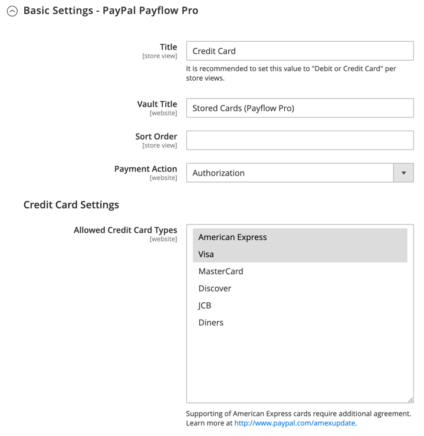

# [!UICONTROL Sales] > [!UICONTROL Payment Methods] >  [!UICONTROL PayPal Payflow Pro]

>[!IMPORTANT]
>
>**PSD2-krav:**  
>Från och med den 14 september 2019 kan europeiska banker avböja betalningar som inte uppfyller kraven för [PSD2](../../getting-started/compliance-payment-services-directive.md). [!DNL PayPal Payflow Pro] måste integreras med [!DNL Cardinal Commerce] för att uppfylla PSD2. Mer information finns i [3-D Secure for Payflow](https://developer.paypal.com/api/nvp-soap/payflow/3d-secure-overview/).

{{config}}

## [!UICONTROL Required Settings]

<!-- zoom -->

| Fält | [Omfång](../../getting-started/websites-stores-views.md#scope-settings) | Beskrivning |
|--- |--- |--- |
| [!UICONTROL Email Associated with PayPal Merchant Account] | Webbplats | (Valfritt) Alla e-postadresser som är kopplade till ditt PayPal-handelskonto. E-postadresser är skiftlägeskänsliga och måste exakt matcha adresserna som finns på ditt konto. |
| [!UICONTROL Partner] | Webbplats | Ditt PayPal Partner-ID, om tillämpligt. |
| [!UICONTROL Vendor] | Webbplats | Ditt PayPal-användarnamn. |
| Användare | Webbplats | ID för en annan användare på ditt PayPal-konto. |
| [!UICONTROL Password] | Webbplats | Lösenordet som är kopplat till ditt PayPal-handelskonto. |
| [!UICONTROL Test Mode] | Webbplats | När det är aktiverat körs PayPal Payflow Pro i en testmiljö. Stäng av testläget när du är redo att börja använda i produktionsläge. Alternativ: `Yes` / `No` |
| [!UICONTROL Use Proxy] | Webbplats | En proxy kan användas för att dirigera om trafik när serverns brandvägg förhindrar direktåtkomst till PayPal-servern. Identifierar, om tillämpligt, den proxyserver som används för att upprätta anslutningen till PayPal-servern. Alternativ: `Yes` / `No`   Om det här alternativet är aktiverat anger du proxyalternativen:  **`Proxy Host`**- IP-adressen för proxyvärden. **`Proxy Port`** - Proxyportens nummer. |
| [!UICONTROL Enable this Solution] | Webbplats | Avgör om PayPal Payflow Pro är tillgängligt för dina kunder som betalningsmetod. |
| [!UICONTROL Enable PayPal Credit] | Webbplats | Avgör om PayPal-kredit är tillgängligt för dina kunder som betalningsalternativ. |

{style="table-layout:auto"}

## [!UICONTROL Advertise PayPal Credit]

<!-- zoom -->

| Fält | [Omfång](../../getting-started/websites-stores-views.md#scope-settings) | Beskrivning |
|--- |--- |--- |
| [!UICONTROL Publisher ID] | Webbplats | Det utgivar-ID som är kopplat till ditt PayPal-kreditkonto. |
| [!UICONTROL Get Publisher ID from PayPal] |  | Hämtar ditt utgivar-ID från PayPal. |
| [!UICONTROL Home Page] | Webbplats | Bestämmer placeringen och storleken på banderollen [!DNL PayPal Credit] på startsidan. Alternativ:  **`Display`**- Avgör om en [!DNL PayPal Credit]-banderoll visas på butikens startsida. Alternativ: `Yes` / `No` **`Position`** - Bestämmer placeringen av banderollen [!DNL PayPal Credit] på startsidan. Alternativ: Sidhuvud (mitten)/Sidlist (höger)  **`Size`**- Anger storleken på banderollen [!DNL PayPal Credit] på startsidan. Alternativ: `190 x 100` / `234 x 60` / `300 x 50` / `468 x 60` / `728 x 90` /` 800 x 66` |
| [!UICONTROL Catalog Category Page] | Webbplats | Bestämmer placeringen och storleken på banderollen [!DNL PayPal Credit] på kategorisidor. Alternativ: (samma som för [!UICONTROL Home Page]) |
| [!UICONTROL Catalog Product Page] | Webbplats | Bestämmer placeringen och storleken på banderollen [!DNL PayPal Credit] på produktsidor. Alternativ: (samma som för [!UICONTROL Home Page]) |
| [!UICONTROL Checkout Cart Page] | Webbplats | Bestämmer placeringen och storleken på banderollen [!DNL PayPal Credit] på kundvagnssidan. Alternativ: (samma som för [!UICONTROL Home Page]) |

{style="table-layout:auto"}

## [!UICONTROL Basic Settings - PayPal Payflow Pro]

<!-- zoom -->

| Fält | [Omfång](../../getting-started/websites-stores-views.md#scope-settings) | Beskrivning |
|--- |--- |--- |
| [!UICONTROL Title] | Butiksvy | Ett namn som identifierar PayPal Payflow Pro som en betalningsmetod vid utcheckning. |
| [!UICONTROL Sort Order] | Butiksvy | Ett tal som bestämmer i vilken ordning PayPal Payflow Pro visas när det visas med andra betalningsmetoder vid utcheckning. |
| [!UICONTROL Payment Action] | Webbplats | Bestämmer vilken åtgärd som PayPal ska vidta när en order skickas. Alternativ:  **`Authorization`**- Godkänn köpet, men spärrar pengarna. Beloppet dras inte tillbaka förrän handlaren&quot;fångar&quot; det. **`Sale`** - Köpbeloppet är auktoriserat och dras omedelbart tillbaka från kundens konto. |
| **[!UICONTROL Credit Card Settings]** |  |  |
| [!UICONTROL Allowed Credit Cart Types] | Webbplats | Bestämmer vilka kreditkort som är tillgängliga för kunder vid utcheckning. Välj varje kort som stöds. Alternativ: `American Express` (kräver ett extra avtal) / `Visa` / `MasterCard` / `Discover` / `JCB` |

{style="table-layout:auto"}

## [!UICONTROL Advanced Settings]

<!-- zoom -->

| Fält | [Omfång](../../getting-started/websites-stores-views.md#scope-settings) | Beskrivning |
|--- |--- |--- |
| Visa på kundvagn | Butiksvy | Avgör om PayPal Express Checkout visas som ett betalningsalternativ i kundvagnen. Alternativ: Ja (rekommenderas) / Nej |
| [!UICONTROL Payment Action Applicable From] | Webbplats | Anger intervallet för det tillämpliga landsvalet. Alternativ: Alla tillåtna länder/specifika länder |
| [!UICONTROL Countries Payment Applicable From] | Webbplats | Identifierar varje land från vilket betalning accepteras. Endast kunder med en faktureringsadress i ett visst land kan göra inköp med den här betalningsmetoden. |
| [!UICONTROL Debug Mode] | Webbplats | Registrerar meddelanden som skickas mellan din butik och PayPal-betalningssystemet i en loggfil. Alternativ: `Yes` / `No`   **_Obs!_**&#x200B;Loggfilen lagras på servern och är bara tillgänglig för utvecklare. I enlighet med PCI-datasäkerhetsstandarder registreras inte kreditkortsinformation i loggfilen. |
| [!UICONTROL Enable SSL Verification] | Webbplats | Aktiverar verifiering av värdsäkerhetscertifikatet. Alternativ: `Yes` / `No` |
| [!UICONTROL Transfer Cart Line Items] | Webbplats | Visar en fullständig sammanfattning av radobjekten från kundens kundvagn på PayPal-webbplatsen. Alternativ: `Yes` / `No` |
| [!UICONTROL Skip Order Review Step] | Webbplats | Avgör om kunderna kan slutföra transaktionen från PayPal-webbplatsen eller måste återvända till din butik och slutföra ordergranskningssteget innan ordern skickas. Alternativ: `Yes` / `No` |

{style="table-layout:auto"}
