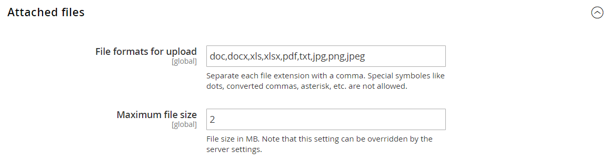

# [!UICONTROL Sales] > [!UICONTROL Quotes]

{{b2b-feature}}

>[!TIP]
>
>Med installation och aktivering av B2B för Adobe Commerce kan köpupplevelsen personaliseras med företagsspecifika funktioner. B2B för Adobe Commerce är en integrerad lösning som stöder både B2B- och B2C-modeller. Mer information om B2B-funktionerna finns i [Användarhandbok för B2B för Adobe Commerce](https://experienceleague.adobe.com/docs/commerce-admin/b2b/introduction.html).

{{config}}

<!-- [Quotes](https://docs.magento.com/user-guide/sales/quotes.html) -->

## [!UICONTROL General]

<!-- zoom -->

| Fält | [Omfång](../../getting-started/websites-stores-views.md#scope-settings) | Beskrivning |
|--- |--- |--- |
| [!UICONTROL Minimum Amount] | Webbplats | Den minsta delsumman för kundvagnen, efter eventuella rabatter, som krävs innan en kund kan skicka in en anbudsförfrågan. Standardvärde: `0` |
| [!UICONTROL Minimum Amount Message] | Butiksvy | Meddelandet som visas i kundvagnen när en kund försöker skicka en anbudsförfrågan, men minimibeloppet som krävs uppfylls inte. |
| [!UICONTROL Default Expiration Period] | Webbplats | Bestämmer standardlivslängden för en [citat](../../b2b/quote-price-negotiation.md) som tidsperiod från det datum då anbudsförfrågan ingavs. Alternativ: `Days` / `Weeks` / `Months` |

{:style=&quot;table-layout:auto&quot;}

## [!UICONTROL Attached Files]

<!-- zoom -->

| Fält | [Omfång](../../getting-started/websites-stores-views.md#scope-settings) | Beskrivning |
|--- |--- |--- |
| [!UICONTROL File formats for upload] | Global | Bestämmer vilka filformat som kan bifogas till en offert. Standardvärden som stöds: `doc`, `docx`, `xls`, `xlsx`, `pdf`, `txt`, `jpg`, `png`och `jpeg` |
| [!UICONTROL Maximum file size] | Global | Anger den maximala storleken för en fil som är kopplad till en offert. Den här inställningen kan åsidosättas av serverkonfigurationen. |

{:style=&quot;table-layout:auto&quot;}
