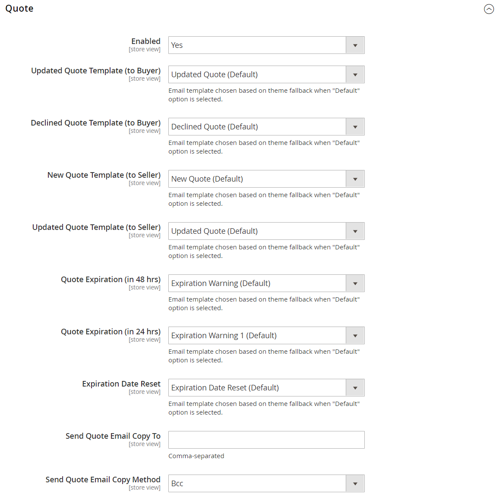
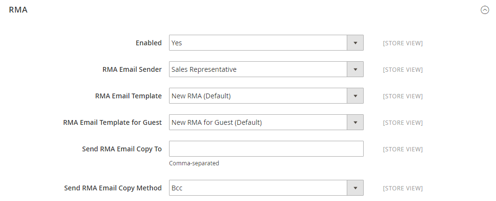
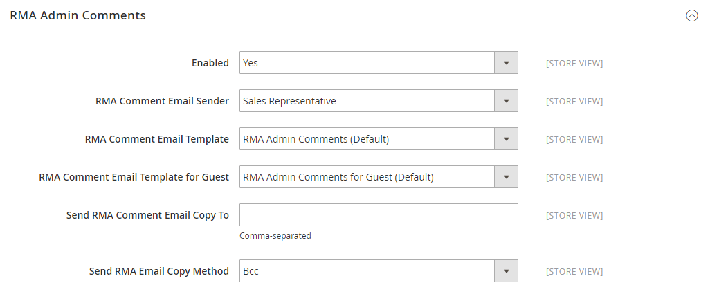

# [!UICONTROL Sales] > [!UICONTROL Sales Emails]

{{config}}

## [!UICONTROL General Settings]

<!-- zoom -->

<!-- [General Settings](https://docs.magento.com/user-guide/system/email-communications.html) -->

| Fält | [Omfång](../../getting-started/websites-stores-views.md#scope-settings) | Beskrivning |
|--- |--- |--- |
| [!UICONTROL Asynchronous sending] | Global | Avgör om e-postmeddelanden om försäljning skickas asynkront. Du bör aktivera asynkron sändning. Alternativ:  **`Disable`**- (standard) E-post om försäljning skickas när den aktiveras av en händelse. **`Enable`** - (Rekommenderas) E-post om försäljning skickas med förbestämda, regelbundna intervall. |

{style="table-layout:auto"}

## [!UICONTROL Order]

<!-- zoom -->

<!-- [Order](https://docs.magento.com/user-guide/sales/orders.html) -->

| Fält | [Omfång](../../getting-started/websites-stores-views.md#scope-settings) | Beskrivning |
|--- |--- |--- |
| [!UICONTROL Enabled] | Butiksvy | När det här alternativet är aktiverat skickas ett transaktionsmeddelande för varje beställning. Alternativ: `Yes` / `No` |
| [!UICONTROL New Order Confirmation Email Sender] | Butiksvy | Identifierar den butikskontakt som visas som meddelandeavsändare. Standardavsändare: `Sales Representative` |
| [!UICONTROL New Order Confirmation Template] | Butiksvy | Identifierar mallen som skickas för att bekräfta nya beställningar som gjorts av kunder. Standardmall: `New Order` |
| [!UICONTROL New Order Confirmation Template for Guest] | Butiksvy | Identifierar mallen som skickas för att bekräfta nya beställningar som gjorts av gäster. Standardmall: `New Order for Guest` |
| [!UICONTROL Send Order Email Copy To] | Butiksvy | Anger e-postadressen till alla som ska få en kopia av ett e-postbeställningsmeddelande. Avgränsa flera adresser med komma. |
| [!UICONTROL Send Order Email Copy Method] | Butiksvy | Anger den e-postmetod som används för att skicka kopian. Alternativen är:  **`Bcc`**- Skickar en kopia med blindhet genom att inkludera mottagaren i rubriken för samma e-postmeddelande som skickas till kunden. Mottagaren av hemlig kopia är inte synlig för kunden. **`Separate Email`** - Skickar kopian som ett separat e-postmeddelande. |

{style="table-layout:auto"}

## [!UICONTROL Order Comments]

<!-- zoom -->

<!-- [Order Comments](https://docs.magento.com/user-guide/sales/order-processing.html) -->

| Fält | [Omfång](../../getting-started/websites-stores-views.md#scope-settings) | Beskrivning |
|--- |--- |--- |
| [!UICONTROL Enabled] | Butiksvy | När det här alternativet är aktiverat skickas ett transaktionsmeddelande för varje orderkommentar. Alternativ: `Yes` / `No` |
| [!UICONTROL Order Comment Email Sender] | Butiksvy | Identifierar den butikskontakt som visas som meddelandeavsändare. Standardavsändare: `Sales Representative` |
| [!UICONTROL Order Comment Email Template] | Butiksvy | Identifierar mallen som skickas när en kommentar läggs till i en kundorder. Standardmall: `Order Update` |
| [!UICONTROL New Order Confirmation Template for Guest] | Butiksvy | Identifierar mallen som skickas när en kommentar läggs till i en gästorder. Standardmall: `Order Update for Guest` |
| [!UICONTROL Send Order Email Copy To|Store View] | Anger e-postadressen till alla som ska få en kopia av ett e-postmeddelande med en orderkommentar. Avgränsa flera adresser med komma. |
| [!UICONTROL Send Order Email Copy Method] | Butiksvy | Anger den metod som används för att skicka kopian. Alternativen är:  **`Bcc`**- Skickar en kopia med blindhet genom att inkludera mottagaren i rubriken för samma e-postmeddelande som skickas till kunden. Mottagaren av hemlig kopia är inte synlig för kunden. **`Separate Email`** - Skickar kopian som ett separat e-postmeddelande. |

{style="table-layout:auto"}

## [!UICONTROL Invoice]

<!-- zoom -->

<!-- [Invoice](https://docs.magento.com/user-guide/sales/invoices.html) -->

| Fält | [Omfång](../../getting-started/websites-stores-views.md#scope-settings) | Beskrivning |
|--- |--- |--- |
| [!UICONTROL Enabled] | Butiksvy | När det här alternativet är aktiverat skickas ett transaktionsmeddelande för varje faktura som genereras. Alternativ: `Yes` / `No` |
| [!UICONTROL Invoice Email Sender] | Butiksvy | Identifierar den butikskontakt som visas som meddelandeavsändare. Standardavsändare: `Sales Representative` |
| [!UICONTROL Invoice Email Template] | Butiksvy | Identifierar mallen som skickas när en faktura genereras för en kund. Standardmall: `New Invoice` |
| [!UICONTROL Invoice Email Template for Guest] | Butiksvy | Identifierar mallen som skickas när en faktura genereras för en gäst. Standardmall: `New Invoice for Guest` |
| [!UICONTROL Send Invoice Email Copy To] | Butiksvy | Anger e-postadressen till alla som ska få en kopia av ett fakturameddelande. Avgränsa flera adresser med komma. |
| [!UICONTROL Send Invoice Email Copy Method] | Butiksvy | Anger den metod som används för att skicka kopian. Alternativen är:  **`Bcc`**- Skickar en kopia med blindhet genom att inkludera mottagaren i rubriken för samma e-postmeddelande som skickas till kunden. Mottagaren av hemlig kopia är inte synlig för kunden. **`Separate Email`** - Skickar kopian som ett separat e-postmeddelande. |

{style="table-layout:auto"}

## [!UICONTROL Invoice Comments]

<!-- zoom -->

<!-- [Invoice Comments](https://docs.magento.com/user-guide/sales/invoice-create.html) -->

| Fält | [Omfång](../../getting-started/websites-stores-views.md#scope-settings) | Beskrivning |
|--- |--- |--- |
| [!UICONTROL Enabled] | Butiksvy | När det här alternativet är aktiverat skickas ett transaktionsmeddelande för varje fakturakommentar. Alternativ: `Yes` / `No` |
| [!UICONTROL Invoice Comment Email Sender] | Butiksvy | Identifierar den butikskontakt som visas som meddelandeavsändare. Standardavsändare: `Sales Representative` |
| [!UICONTROL Invoice Comment Email Template] | Butiksvy | Identifierar mallen som skickas när en kommentar läggs till i en kundfaktura. Standardmall: `Invoice Update` |
| [!UICONTROL Invoice Comment Email Template for Guest] | Butiksvy | Identifierar mallen som skickas när en kommentar läggs till i en gästfaktura. Standardmall: `Invoice Update for Guest` |
| [!UICONTROL Send Invoice Comment Email Copy To] | Butiksvy | Anger e-postadressen till alla som ska få en kopia av ett e-postmeddelande med en fakturakommentar. Avgränsa flera adresser med komma. |
| [!UICONTROL Send Invoice Comments Email Copy Method] | Butiksvy | Anger den e-postmetod som används för att skicka kopian. Alternativen är:  **`Bcc`**- Skickar en kopia med blindhet genom att inkludera mottagaren i rubriken för samma e-postmeddelande som skickas till kunden. Mottagaren av hemlig kopia är inte synlig för kunden. **`Separate Email`** - Skickar kopian som ett separat e-postmeddelande. |

{style="table-layout:auto"}

## [!UICONTROL Shipment]

<!-- zoom -->

<!-- [Shipment](https://docs.magento.com/user-guide/sales/shipments.html) -->

| Fält | [Omfång](../../getting-started/websites-stores-views.md#scope-settings) | Beskrivning |
|--- |--- |--- |
| [!UICONTROL Enabled] | Butiksvy | När det här alternativet är aktiverat skickas ett transaktionsmeddelande för varje leveransen som genereras. Alternativ: `Yes` / `No` |
| [!UICONTROL Shipment Email Sender] | Butiksvy | Identifierar den butikskontakt som visas som meddelandets avsändare. Standardavsändare: `Sales Representative` |
| [!UICONTROL Shipment Email Template] | Butiksvy | Identifierar mallen som skickas när en leverans genereras för en kund. Standardmall: `New Shipment` |
| [!UICONTROL Shipment Email Template for Guest] | Butiksvy | Identifierar mallen som skickas när en leverans genereras för en gäst. Standardmall: `New Shipment for Guest` |
| [!UICONTROL Send Shipment Email Copy To] | Butiksvy | Anger e-postadressen till alla som ska få en kopia av ett e-postmeddelande. Avgränsa flera adresser med komma. |
| [!UICONTROL Send Shipment Email Copy Method] | Butiksvy | Anger den metod som används för att skicka kopian. Alternativen är:  **`Bcc`**- Skickar en kopia med blindhet genom att inkludera mottagaren i rubriken för samma e-postmeddelande som skickas till kunden. Mottagaren av hemlig kopia är inte synlig för kunden. **`Separate Email`** - Skickar kopian som ett separat e-postmeddelande. |

{style="table-layout:auto"}

## [!UICONTROL Shipment Comments]

<!-- zoom -->

<!-- [Shipment Comments](https://docs.magento.com/user-guide/sales/shipments.html) -->

| Fält | [Omfång](../../getting-started/websites-stores-views.md#scope-settings) | Beskrivning |
|--- |--- |--- |
| [!UICONTROL Enabled] | Butiksvy | När det här alternativet är aktiverat skickas ett transaktionsmejl för varje försändelsekommentar. Alternativ: `Yes` / `No` |
| [!UICONTROL Shipment Comment Email Sender] | Butiksvy | Identifierar den butikskontakt som visas som meddelandeavsändare. Standardavsändare: `Sales Representative` |
| [!UICONTROL Shipment Comment Email Template] | Butiksvy | Identifierar mallen som skickas när en kommentar läggs till i en kundleverans. Standardmall: `Shipment Update` |
| [!UICONTROL Shipment Comment Email Template for Guest] | Butiksvy | Identifierar mallen som skickas när en kommentar läggs till i en gästleverans. Standardmall: `Shipment Update for Guest` |
| [!UICONTROL Send Shipment Comment Email Copy To] | Butiksvy | Anger e-postadressen till alla som ska få en kopia av ett e-postmeddelande med en försändelsekommentar. Avgränsa flera adresser med komma. |
| [!UICONTROL Send Shipment Comments Email Copy Method] | Butiksvy | Anger den e-postmetod som används för att skicka kopian. Alternativen är:  **`Bcc`**- Skickar en kopia med blindhet genom att inkludera mottagaren i rubriken för samma e-postmeddelande som skickas till kunden. Mottagaren av hemlig kopia är inte synlig för kunden. **`Separate Email`** - Skickar kopian som ett separat e-postmeddelande. |

{style="table-layout:auto"}

## [!UICONTROL Credit Memo]

<!-- zoom -->

<!-- [Credit Memo](https://docs.magento.com/user-guide/sales/credit-memos.html) -->

| Fält | [Omfång](../../getting-started/websites-stores-views.md#scope-settings) | Beskrivning |
|--- |--- |--- |
| [!UICONTROL Enabled] | Butiksvy | Aktiverar transaktionens e-postadress för varje kreditnota som skapas. Alternativ: `Yes` / `No` |
| [!UICONTROL Credit Memo Email Sender] | Butiksvy | Identifierar den butikskontakt som visas som meddelandets avsändare. Standardavsändare: `Sales Representative` |
| [!UICONTROL Credit Memo Email Template] | Butiksvy | Identifierar mallen som skickas när en kreditnota skapas för en kund. Standardmall: `New Credit Memo` |
| [!UICONTROL Credit Memo Email Template for Guest] | Butiksvy | Identifierar mallen som skickas när en kreditnota skapas för en gäst. Standardmall: `New Credit Memo for Guest` |
| [!UICONTROL Send Credit Memo Email Copy To] | Butiksvy | Anger e-postadressen till alla som ska få en kopia av ett e-postmeddelande med kreditnota. Avgränsa flera adresser med komma. |
| [!UICONTROL Send Credit Memo Email Copy Method] | Butiksvy | Anger den metod som används för att skicka kopian. Alternativen är:  **`Bcc`**- Skickar en kopia med blindhet genom att inkludera mottagaren i rubriken för samma e-postmeddelande som skickas till kunden. Mottagaren av hemlig kopia är inte synlig för kunden. **`Separate Email`** - Skickar kopian som ett separat e-postmeddelande. |

{style="table-layout:auto"}

## [!UICONTROL Credit Memo Comments]

<!-- zoom -->

<!-- [Credit Memo Comments](https://docs.magento.com/user-guide/sales/credit-memo-create.html) -->

| Fält | [Omfång](../../getting-started/websites-stores-views.md#scope-settings) | Beskrivning |
|--- |--- |--- |
| [!UICONTROL Enabled] | Butiksvy | När det här alternativet är aktiverat skickas ett transaktionsmejl för varje kreditnotskommentar. Alternativ: `Yes` / `No` |
| [!UICONTROL Credit Memo Comment Email Sender] | Butiksvy | Identifierar den butikskontakt som visas som meddelandeavsändare. Standardavsändare: `Sales Representative` |
| [!UICONTROL Credit Memo Comment Email Template] | Butiksvy | Identifierar mallen som skickas när en kommentar läggs till i en kundkreditnota. Standardmall: `Credit Memo Update` |
| [!UICONTROL Credit Memo Comment Email Template for Guest] | Butiksvy | Identifierar mallen som skickas när en kommentar läggs till i en gästkreditnota. Standardmall: `Credit Memo Update for Guest` |
| [!UICONTROL Send Credit Memo Comment Email Copy To] | Butiksvy | Anger e-postadressen till alla som ska få en kopia av ett e-postmeddelande med en kreditnotskommentar. Avgränsa flera adresser med komma. |
| [!UICONTROL Send Credit Memo Comments Email Copy Method] | Butiksvy | Anger den e-postmetod som används för att skicka kopian. Alternativen är:  **`Bcc`**- Skickar en kopia med blindhet genom att inkludera mottagaren i rubriken för samma e-postmeddelande som skickas till kunden. Mottagaren av hemlig kopia är inte synlig för kunden. **`Separate Email`** - Skickar kopian som ett separat e-postmeddelande. |

{style="table-layout:auto"}

## [!UICONTROL Order Ready For Pickup in Store]

<!-- zoom -->

<!-- [Order Ready For Pickup in Store](https://docs.magento.com/user-guide/shipping/shipping-in-store-delivery.html) -->

| Fält | [Omfång](../../getting-started/websites-stores-views.md#scope-settings) | Beskrivning |
|--- |--- |--- |
| [!UICONTROL Enabled] | Butiksvy | När det här alternativet är aktiverat skickas ett transaktionsmejl när en beställning är klar för butiksupphämtning. Alternativ: `Yes` / `No` |
| [!UICONTROL Order Ready For Pickup Email Sender] | Butiksvy | Identifierar den butikskontakt som visas som meddelandeavsändare. Standardavsändare: `General Contact` |
| [!UICONTROL Order Ready For Pickup Email Template] | Butiksvy | Identifierar mallen som används för transaktionens e-postadress för varje order som är klar för hämtning i butik för en registrerad kund. Standardmall: `Order is Ready for Pickup` |
| [!UICONTROL Order Ready For Pickup Email Template for Guest] | Butiksvy | Identifierar den mall som används för transaktionens e-postadress för varje order som är klar att hämtas i butik för en gäst. Standardmall: `Order is Ready for Pickup for Guest` |
| Skicka beställningen klar för hämtning av e-postkopia till | Butiksvy | Anger e-postadressen till alla som ska få en kopia av ett _e-postmeddelande om beställning klar för hämtning_. Avgränsa flera adresser med komma. |
| [!UICONTROL Send Order Ready For Pickup Email Copy Method] | Butiksvy | Anger den e-postmetod som används för att skicka kopian. Alternativ:  **`Bcc`**- Skickar en hemlig kopia genom att inkludera mottagaren i rubriken för samma e-postmeddelande som skickas till kunden. Mottagaren av hemlig kopia är inte synlig för kunden. **`Separate Email`** - Skickar kopian som ett separat e-postmeddelande. |

{style="table-layout:auto"}

## [!UICONTROL Purchase Order Approval]

{{b2b-feature}}

<!-- zoom -->

| Fält | [Omfång](../../getting-started/websites-stores-views.md#scope-settings) | Beskrivning |
|--- |--- |--- |
| [!UICONTROL Enabled] | Butiksvy | När det här alternativet är aktiverat skickas e-postmeddelanden under inköpsorderprocessen. Alternativ: `Yes` / `No` |
| [!UICONTROL Created and requires Approval Purchase Order (to Buyer)] | Butiksvy | Skickar en e-postbekräftelse till den som skapat inköpsordern. |
| [!UICONTROL Created and Automatically approved Purchase Order (to Buyer)] | Butiksvy | Skickar en e-postbekräftelse till den som skapat inköpsordern. |
| [!UICONTROL Approved Purchase Order (to Buyer)] | Butiksvy | Skickar ett e-postmeddelande till skaparen när inköpsordern har godkänts. |
| [!UICONTROL Rejected Purchase Order (to Buyer)] | Butiksvy | Skickar ett e-postmeddelande till skaparen när inköpsordern har avvisats. |
| [!UICONTROL Comment added to Purchase Order] | Butiksvy | Skickar ett e-postmeddelande till författaren när en kommentar har lagts till i inköpsordern. |
| [!UICONTROL Error creating Order from Purchase Order (to Buyer)] | Butiksvy | Meddelar den som skapat ordern att ett fel uppstod vid konvertering av en inköpsorder till en order. |
| [!UICONTROL Purchase Order required Approval (to Approver)] | Butiksvy | Skickar ett e-postmeddelande för att meddela godkännaren att inköpsordern kräver deras godkännande. |

{style="table-layout:auto"}

## [!UICONTROL Quote]

{{b2b-feature}}

<!-- zoom -->

<!-- [Quotes](https://docs.magento.com/user-guide/customers/account-dashboard-quotes.html) -->

| Fält | [Omfång](../../getting-started/websites-stores-views.md#scope-settings) | Beskrivning |
|--- |--- |--- |
| [!UICONTROL Enabled] | Butiksvy | Gör att e-postmeddelanden med offerter kan skickas från den aktuella butiksvyn. Alternativ: `Yes` / `No` |
| [!UICONTROL Updated Quote Template (to Buyer)] | Butiksvy | Bestämmer e-postmallen som används för meddelanden som skickas till köparen när en uppdaterad offert är tillgänglig. Standardmall: `Updated Quote` |
| [!UICONTROL Declined Quote Template (to Buyer)] | Butiksvy | Bestämmer e-postmallen som används för meddelanden som skickas till köparen när en offert avvisas. Standardmall: `Declined Quote` |
| [!UICONTROL New Quote Template (to Seller)] | Butiksvy | Bestämmer e-postmallen som används för meddelanden som skickas till säljaren när en begäran om en ny offert tas emot. Standardmall: `New Quote` |
| [!UICONTROL Updated Quote Template (to Seller)] | Butiksvy | Bestämmer e-postmallen som används för meddelanden som skickas till säljaren när en uppdaterad offert tas emot. Standardmall: `Updated Quote` |
| [!UICONTROL Quote Expiration (in 48 hrs)] | Butiksvy | Anger den e-postmall som används för förfallomeddelandet som skickas 48 timmar innan offerten förfaller. Standardmall: `Expiration Warning` |
| [!UICONTROL Quote Expiration (in 24 hrs)] | Butiksvy | Anger den e-postmall som används för förfallomeddelandet som skickas 24 timmar innan offerten förfaller. Standardmall: `Expiration Warning 1` |
| [!UICONTROL Expiration Date Reset] | Butiksvy | Anger den e-postmall som används för meddelandet som skickas när förfallodatumet ändras. Standardmall: `Expiration Date Reset` |
| [!UICONTROL Send Quote Email Copy To] | Butiksvy | Anger e-postadressen till varje person som ska få en kopia av offertmeddelandet. Avgränsa flera adresser med komma. |
| [!UICONTROL Send Quote Email Copy Method] | Butiksvy | Anger den e-postmetod som används för att skicka kopian. Alternativen är:  **`Bcc`**- Skickar en kopia med blindhet genom att inkludera mottagaren i rubriken för samma e-postmeddelande som skickas till kunden. Mottagaren av hemlig kopia är inte synlig för kunden. **`Separate Email`** - Skickar kopian som ett separat e-postmeddelande. |

{style="table-layout:auto"}

## [!UICONTROL RMA]

{{ee-feature}}

<!-- zoom -->

<!-- [RMA](https://docs.magento.com/user-guide/sales/returns.html) -->

| Fält | [Omfång](../../getting-started/websites-stores-views.md#scope-settings) | Beskrivning |
|--- |--- |--- |
| [!UICONTROL Enabled] | Butiksvy | Aktiverar e-postmeddelanden för varje RMA som genereras. Alternativ: `Yes` / `No` |
| [!UICONTROL RMA Email Sender] | Butiksvy | Identifierar den [butikskontakt](../../getting-started/store-details.md#store-email-addresses) som visas som meddelandets avsändare. Standardvärde: `Sales Representative` |
| [!UICONTROL RMA Email Template] | Butiksvy | Avgör den [e-postmall](../../systems/email-templates.md) som används för meddelanden som skickas när en RMA genereras för en kund. Standardmall: `New RMA` |
| [!UICONTROL RMA Email Template for Guest] | Butiksvy | Bestämmer mallen som skickas när en RMA genereras för en gäst. Standardmall: `New RMA for Guest` |
| [!UICONTROL Send RMA Email Copy To] | Butiksvy | Anger e-postadressen till alla som ska få en kopia av ett RMA-e-postmeddelande. Avgränsa flera adresser med komma. |
| [!UICONTROL Send RMA  Email Copy Method] | Butiksvy | Anger den e-postmetod som används för att skicka kopian. Alternativen är:  **`Bcc`**- Skickar en kopia med blindhet genom att inkludera mottagaren i rubriken för samma e-postmeddelande som skickas till kunden. Mottagaren av hemlig kopia är inte synlig för kunden. **`Separate Email`** - Skickar kopian som ett separat e-postmeddelande. |

{style="table-layout:auto"}

## [!UICONTROL RMA Authorization]

{{ee-feature}}

<!-- zoom -->

<!-- [RMA Authorization](https://docs.magento.com/user-guide/sales/rma-configure.html) -->

| Fält | [Omfång](../../getting-started/websites-stores-views.md#scope-settings) | Beskrivning |
|--- |--- |--- |
| [!UICONTROL Enabled] | Butiksvy | När det här alternativet är aktiverat skickas ett e-postmeddelande för varje RMA-auktorisering. Alternativ: `Yes` / `No` |
| [!UICONTROL RMA Authorization Email Sender] | Butiksvy | Identifierar den [butikskontakt](../../getting-started/store-details.md#store-email-addresses) som visas som meddelandeavsändare. Standardvärde: `Sales Representative` |
| [!UICONTROL RMA Authorization Email Template] | Butiksvy | Avgör den [e-postmall](../../systems/email-templates.md) som används när ett RMA-auktoriseringsmeddelande skickas. Standardmall: `RMA Authorization` |
| [!UICONTROL RMA Authorization Email Template for Guest] | Butiksvy | Bestämmer mallen som används när ett RMA-auktoriseringsmeddelande skickas till en gäst. Standardmall: `RMA Authorization for Guest` |
| [!UICONTROL Send RMA Authorization Email Copy To] | Butiksvy | Anger e-postadressen till alla som ska få en kopia av ett RMA-auktoriseringsmeddelande. Avgränsa flera adresser med komma. |
| [!UICONTROL Send RMA Authorization Email Copy Method] | Butiksvy | Anger den e-postmetod som används för att skicka kopian. Alternativen är:  **`Bcc`**- Skickar en kopia med blindhet genom att inkludera mottagaren i rubriken för samma e-postmeddelande som skickas till kunden. Mottagaren av hemlig kopia är inte synlig för kunden. **`Separate Email`** - Skickar kopian som ett separat e-postmeddelande. |

{style="table-layout:auto"}

## [!UICONTROL RMA Admin Comments]

{{ee-feature}}

<!-- zoom -->

| Fält | [Omfång](../../getting-started/websites-stores-views.md#scope-settings) | Beskrivning |
|--- |--- |--- |
| [!UICONTROL Enabled] | Butiksvy | När det här alternativet är aktiverat skickas ett e-postmeddelande för varje RMA-administratörskommentar. Alternativ: `Yes` / `No` |
| [!UICONTROL RMA Comment Email Sender] | Butiksvy | Identifierar den [butikskontakt](../../getting-started/store-details.md#store-email-addresses) som visas som meddelandeavsändare. Standardvärde: `Sales Representative` |
| [!UICONTROL RMA Comment Email Template] | Butiksvy | Avgör den [e-postmall](../../systems/email-templates.md) som används när en administratör lägger till en kommentar i en RMA för en kund. Standardmall: `RMA Admin Comments` |
| [!UICONTROL RMA Comment Email Template for Guest] | Butiksvy | Bestämmer vilken mall som ska användas när en administratör lägger till en kommentar i en RMA för en gäst. Standardmall: `RMA Admin Comments for Guest` |
| [!UICONTROL Send RMA Comment Email Copy To] | Butiksvy | Anger e-postadressen till alla som ska få en kopia av meddelandet. Avgränsa flera adresser med komma. |
| [!UICONTROL Send RMA Comments Email Copy Method] | Butiksvy | Anger den e-postmetod som används för att skicka kopian. Alternativen är:  **`Bcc`**- Skickar en kopia med blindhet genom att inkludera mottagaren i rubriken för samma e-postmeddelande som skickas till kunden. Mottagaren av hemlig kopia är inte synlig för kunden. **`Separate Email`** - Skickar kopian som ett separat e-postmeddelande. |

{style="table-layout:auto"}

## [!UICONTROL RMA Customer Comments]

{{ee-feature}}

<!-- zoom -->

<!-- [RMA Customer Comments](https://docs.magento.com/user-guide/sales/returns.html) -->

| Fält | [Omfång](../../getting-started/websites-stores-views.md#scope-settings) | Beskrivning |
|--- |--- |--- |
| [!UICONTROL Enabled] | Butiksvy | När det här alternativet är aktiverat skickas ett e-postmeddelande för varje RMA-kundkommentar. Alternativ: `Yes` / `No` |
| [!UICONTROL RMA Comment Email Sender] | Butiksvy | Identifierar den [butikskontakt](../../getting-started/store-details.md#store-email-addresses) som visas som meddelandeavsändare. Standardvärde: `Customer Support` |
| [!UICONTROL RMA Comment Email Recipient] | Butiksvy | Identifierar den butikskontakt som är mottagare av e-postmeddelandet med kundkommentarer. Standardvärde: `Sales Representative` |
| [!UICONTROL RMA Comment Email Template] | Butiksvy | Avgör den [e-postmall](../../systems/email-templates.md) som används när en kund lägger till en kommentar i en RMA-fil. Standardmall: `RMA Admin Comments` |
| [!UICONTROL Send RMA Comment Email Copy To] | Butiksvy | Anger e-postadressen till alla som ska få en kopia av meddelandet. Avgränsa flera adresser med komma. |
| [!UICONTROL Send RMA Comments Email Copy Method] | Butiksvy | Anger den e-postmetod som används för att skicka kopian. Alternativen är:  **`Bcc`**- Skickar en kopia med blindhet genom att inkludera mottagaren i rubriken för samma e-postmeddelande som skickas till kunden. Mottagaren av hemlig kopia är inte synlig för kunden. **`Separate Email`** - Skickar kopian som ett separat e-postmeddelande. |

{style="table-layout:auto"}
