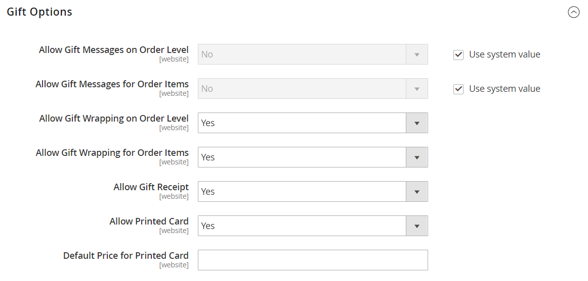

# [!UICONTROL Sales] > [!UICONTROL Sales]

{{config}}

## [!UICONTROL General]

<!-- zoom -->

<!-- [General](https://experienceleague.adobe.com/sv/docs/commerce-admin/stores-sales/site-store/sales-documents) -->

| Fält | [Omfång](../../getting-started/websites-stores-views.md#scope-settings) | Beskrivning |
|--- |--- |--- |
| [!UICONTROL Hide Customer IP] | Butiksvy | Avgör om kundens IP-adress visas på order, fakturor, leveranser och kreditnotor. Alternativ: `Yes` / `No` |

{style="table-layout:auto"}

## [!UICONTROL Checkout Totals Sort Order]

<!-- zoom -->

<!-- [Checkout Totals Sort Order](https://experienceleague.adobe.com/sv/docs/commerce-admin/stores-sales/point-of-purchase/checkout/checkout-totals-sort-order) -->

| Fält | [Omfång](../../getting-started/websites-stores-views.md#scope-settings) | Beskrivning |
|--- |--- |--- |
| [!UICONTROL Subtotal] | Webbplats | Ett tal som bestämmer när delsumman beräknas i relation till andra utcheckningssummor. Standardvärde: `10` |
| [!UICONTROL Discount] | Webbplats | Ett tal som bestämmer när rabatten beräknas i relation till andra utcheckningssummor. Standardvärde: `20` |
| [!UICONTROL Shipping] | Webbplats | Ett tal som bestämmer när leveransen beräknas i relation till andra utcheckningssummor. Standardvärde: `30` |
| [!UICONTROL Tax] | Webbplats | Ett tal som bestämmer när moms beräknas i relation till andra utcheckningssummor. Standardvärde: `40` |
| [!UICONTROL Fixed Product Tax] | Webbplats | Ett tal som bestämmer när fast produktskatt beräknas i relation till andra utcheckningssummor. Standardvärde: `50` |
| [!UICONTROL Grand Total] | Webbplats | Ett tal som bestämmer när totalsumman beräknas i relation till andra utcheckningssummor. Standardvärde: `100` |

{style="table-layout:auto"}

## [!UICONTROL Reorder]

<!-- zoom -->

<!-- [Reorder](https://experienceleague.adobe.com/sv/docs/commerce-admin/stores-sales/shopper-tools/reorders-allow) -->

| Fält | [Omfång](../../getting-started/websites-stores-views.md#scope-settings) | Beskrivning |
|--- |--- |--- |
| [!UICONTROL Allow Reorder] | Butiksvy | Avgör om kunderna kan ändra ordning från sina konton. Alternativ: `Yes` / `No` |

{style="table-layout:auto"}

## [!UICONTROL Allow Zero Grand Total]

| Fält | [Omfång](../../getting-started/websites-stores-views.md#scope-settings) | Beskrivning |
|--- |--- |--- |
| [!UICONTROL Allow Zero Grand Total for Credit Memo] | Butiksvy | Avgör möjligheten att skapa en kreditnota med totalsumman noll. Alternativ: `Yes` / `No` |

{style="table-layout:auto"}

## [!UICONTROL Invoice and Packing Slip Design]

<!-- zoom -->

<!-- [Invoice and Packing Slip Design](https://experienceleague.adobe.com/sv/docs/commerce-admin/stores-sales/site-store/sales-documents) -->

| Fält | [Omfång](../../getting-started/websites-stores-views.md#scope-settings) | Beskrivning |
|--- |--- |--- |
| [!UICONTROL Logo for PDF Print-outs] | Butiksvy | Identifierar logotypfilen som visas i huvudet på PDF fakturor och följesedlar. Tillåtna filtyper:  JPG/JPEG  TIF/TIFF  PNG |
| [!UICONTROL Logo for HTML Print View] | Butiksvy | Identifierar logotypfilen som visas i sidhuvudet i HTML utskriftsvy med fakturor och följesedlar. Tillåtna filtyper:  JPG/JPEG  GIF  PNG |
| [!UICONTROL Address] | Butiksvy | Butiksadressen som du vill att den ska visas på fakturor och följesedlar. |

{style="table-layout:auto"}

## [!UICONTROL Minimum Order Amount]

<!-- zoom -->

<!-- [Minimum Order Amount](https://experienceleague.adobe.com/sv/docs/commerce-admin/stores-sales/point-of-purchase/cart/cart-configuration#minimum-order-amount) -->

| Fält | [Omfång](../../getting-started/websites-stores-views.md#scope-settings) | Beskrivning |
|--- |--- |--- |
| [!UICONTROL Enable] | Webbplats | Avgör om ett minimiorderbelopp har angetts för platsen. Alternativ: `Yes` / `No` |
| [!UICONTROL Minimum Amount] | Webbplats | Anger den minsta delsumman, beställ efter rabatt. |
| [!UICONTROL Include Discount Amount] | Webbplats | Avgör om minimiorderbeloppet innehåller tillämpade rabatter. Alternativ: `Yes` / `No` |
| [!UICONTROL Include Tax to Amount] | Webbplats | Avgör om minimiorderbeloppet inkluderar moms. Alternativ: `Yes` / `No` |
| [!UICONTROL Description Message] | Butiksvy | Avgör meddelandet som visas högst upp i kundvagnen när kundvagnssumman är mindre än minimiorderbeloppet. Om inget anges visas följande standardmeddelande: `Minimum order amount is $[minimum_amount]` |
| [!UICONTROL Error to Show in Shopping Cart] | Butiksvy | Avgör meddelandet som visas från mini-vagnen eller utcheckningslänken när orderbeloppet är mindre än det minimiorderbelopp som krävs. Om inget anges visas ett standardmeddelande. |
| [!UICONTROL Validate Each Address Separately in Multi-address Checkout] | Webbplats | För order med flera artiklar avgör om orderartiklarna ska separeras mycket om det minimala orderbeloppet uppfylls. Alternativ: `Yes` / `No` |
| [!UICONTROL Multi-address Description Message] | Butiksvy | För beställningar med flera adresser avgör vilket meddelande som visas i kundvagnen om artiklarna som skickas till en adress är mindre än minimiorderbeloppet. |
| [!UICONTROL Multi-address Error to Show in Shopping Cart] | Butiksvy | För beställningar med flera adresser, avgör vilket meddelande som visas från minikorgen eller utcheckningslänken när orderbeloppet är mindre än det minsta orderbelopp som krävs. Om inget anges visas ett standardmeddelande. |

{style="table-layout:auto"}

## [!UICONTROL Dashboard]

<!-- zoom -->

<!-- [Dashboard](https://experienceleague.adobe.com/sv/docs/commerce-admin/start/admin/tools/admin-dashboard) -->

| Fält | [Omfång](../../getting-started/websites-stores-views.md#scope-settings) | Beskrivning |
|--- |--- |--- |
| [!UICONTROL Use Aggregated Data] | Global | Avgör om aggregerade försäljningsdata i realtid används för att skapa rapporter om ögonblicksbilder på instrumentpanelen. Om du har en stor mängd data att bearbeta kan prestanda förbättras genom att realtidsdata inaktiveras. Alternativ: `Yes` / `No` |

{style="table-layout:auto"}

## [!UICONTROL Orders Cron Settings]

<!-- zoom -->

<!-- [Orders Cron Settings](https://experienceleague.adobe.com/sv/docs/commerce-admin/systems/tools/cron) -->

| Fält | [Omfång](../../getting-started/websites-stores-views.md#scope-settings) | Beskrivning |
|--- |--- |--- |
| [!UICONTROL Pending Payment Order Lifetime] | Webbplats | Anger livslängden för väntande order i minuter. Standardinställning: `480` minuter (8 timmar) |

{style="table-layout:auto"}

## [!UICONTROL Promotions]

[!BADGE Endast SaaS]{type=Positive url="https://experienceleague.adobe.com/sv/docs/commerce/user-guides/product-solutions" tooltip="Gäller endast Adobe Commerce as a Cloud Service-projekt (SaaS-infrastruktur som hanteras av Adobe)."}

[!BADGE Sandbox]{type=Caution tooltip="Objekten i listan är för närvarande bara tillgängliga i sandlådemiljöer. Adobe gör nya releaser tillgängliga i sandlådemiljöer först för att ge dig tid att testa kommande ändringar innan releasen är tillgänglig i produktionsmiljöer."}

<!-- zoom -->

| Fält | [Omfång](../../getting-started/websites-stores-views.md#scope-settings) | Beskrivning |
|--- |--- |--- |
| [!UICONTROL Apply Catalog Price Rule on Grouped Price] | Global | Aktiverar [nivåpriser för katalogprisregler](../../catalog/product-price-tier.md) när kvantiteten för ett skiktpris är inställd på `1`.  Alternativ: `Yes` / `No` |

## [!UICONTROL Gift Options]

<!-- zoom -->

<!-- [Gift Options](https://experienceleague.adobe.com/sv/docs/commerce-admin/stores-sales/point-of-purchase/cart/cart-configuration#gift-options) -->

| Fält | [Omfång](../../getting-started/websites-stores-views.md#scope-settings) | Beskrivning |
|--- |--- |--- |
| [!UICONTROL Allow Gift Messages on Order Level] | Webbplats | Ange om ett presentmeddelande kan läggas till för hela ordern. |
| [!UICONTROL Allow Gift Messages on Order Items] | Webbplats | Ange om ett presentmeddelande kan läggas till för en enskild orderartikel. |
| [!UICONTROL Allow Gift Wrapping on Order Level] | Webbplats |  (endast Adobe Commerce) Ange om det går att lägga till en present för hela ordern. |
| [!UICONTROL Allow Gift Wrapping for Order Items] | Webbplats |  (endast Adobe Commerce) Ange om det går att lägga till en presentförpackning för den enskilda orderartikeln. |
| [!UICONTROL Allow Gift Receipt] | Webbplats |  (endast Adobe Commerce) Ange om ett presentkvitto kan läggas till för ordern. |
| [!UICONTROL Allow Printed Card] | Webbplats |  (endast Adobe Commerce) Ange om ett utskrivet kort kan läggas till för ordern. |
| [!UICONTROL Default Price for Printed Card] | Webbplats |  (endast Adobe Commerce) Ange standardpriset för det utskrivna kortet. |

{style="table-layout:auto"}

## [!UICONTROL Minimum Advertised Price]

<!-- zoom -->

<!-- [Minimum Advertised Price](https://experienceleague.adobe.com/sv/docs/commerce-admin/catalog/products/pricing/product-price-minimum-advertised) -->

| Fält | [Omfång](../../getting-started/websites-stores-views.md#scope-settings) | Beskrivning |
|--- |--- |--- |
| [!UICONTROL Enable MAP] | Webbplats | Aktiverar lägsta kampanjpris för din butik. Alternativ: `Yes` / `No` |
| [!UICONTROL Display Actual Price] | Webbplats | Avgör var det faktiska priset på en produkt är synligt för kunden. Alternativ:  **`In Cart`**- Visar det faktiska produktpriset i kundvagnen. **`Before Order Confirmation`** - Visar det faktiska produktpriset i slutet av utcheckningsprocessen, precis innan ordern har bekräftats.  **`On Gesture`**- Visar det faktiska produktpriset i en popup när kunden klickar på&quot;Click for price&quot; eller&quot;What&#39;s this?&quot; länk. |
| [!UICONTROL Default Popup Text Message] | Butiksvy | Det textmeddelande som visas när kunden väljer länken&quot;Klicka för pris&quot; från en kategorilista eller en produktvysida. |
| [!UICONTROL Default "What's This" Text Message] | Butiksvy | Det textmeddelande som visas när kunden klickar på&quot;What&#39;s this?&quot; från produktvysidan. |
| [!UICONTROL Manufacturer's Suggested Retail Price] | Global | Det detaljhandelspris som tillverkaren föreslår. |

{style="table-layout:auto"}

## [!UICONTROL Multicoupon Settings]

{{ee-feature}}

<!-- zoom -->

| Fält | [Omfång](../../getting-started/websites-stores-views.md#scope-settings) | Beskrivning |
|--- |--- |--- |
| [!UICONTROL Maximum number of coupons per order] | Webbplats | Anger det maximala antalet kuponger som tillåts per order. Den här funktionen är endast tillgänglig i Admin, GraphQL och REST API. Det är **_inte tillgängligt_** i Storefront. |

{style="table-layout:auto"}

## [!UICONTROL Order by SKU Settings]

{{ee-feature}}

<!-- zoom -->

<!-- [Order by SKU Settings](https://experienceleague.adobe.com/sv/docs/commerce-admin/stores-sales/point-of-purchase/cart/order-by-sku) -->

<!-- zoom -->

| Fält | [Omfång](../../getting-started/websites-stores-views.md#scope-settings) | Beskrivning |
|--- |--- |--- |
| [!UICONTROL Enable Order by SKU on My Account in Storefront] | Webbplats | Avgör om Order by SKU är tillgängligt på kundkontots kontrollpanel. Alternativ:  **`Yes, for Everyone`**- Fliken Ordna efter SKU visas på kontouppsättningen för alla kunder. **`Yes, for Specified Customer Groups`** - Fliken Ordna efter SKU visas på kontomanelen för medlemmar i angivna grupper eller en delad katalog.  **`No`**- Fliken Order by SKU är inte tillgänglig i kundkontot. |
| [!UICONTROL Customer Groups] | Webbplats | Bestämmer kundgrupperna. Alternativ: `General` / `Retailer` / `Wholesale` |

{style="table-layout:auto"}

## [!UICONTROL Instant Purchase]

<!-- zoom -->

<!-- [Instant Purchase](https://experienceleague.adobe.com/sv/docs/commerce-admin/stores-sales/point-of-purchase/checkout-instant-purchase) -->

| Fält | [Omfång](../../getting-started/websites-stores-views.md#scope-settings) | Beskrivning |
|--- |--- |--- |
| [!UICONTROL Enabled] | Butiksvy | Aktiverar direktköp för butiksvyn om betalningsmetoden, som Braintree, har valv aktiverat. Alternativ: `Yes` / `No` |
| [!UICONTROL Button Text] | Butiksvy | Anger texten som visas på knappen Direktköp. Standardtexten är `Instant Purchase`. |

{style="table-layout:auto"}

## [!UICONTROL Rate Limiting]

<!-- zoom -->

| Fält | [Omfång](../../getting-started/websites-stores-views.md#scope-settings) | Beskrivning |
|--------------------------------------------------------|--- |------------------------------------------------------------------------------------------------------------------------------------------------------------------------------------|
| [!UICONTROL Enable rate limiting for placing orders] | Butiksvy | Avgör om hastighetsbegränsning används för att placera order från butiksvyn (standardvärdet är `No`). Alternativ: `Yes` / `No`. |
| [!UICONTROL Requests limit per authenticated customer] | Butiksvy | Antalet inköpsbegäranden som en autentiserad kund kan göra under perioden. Standardgränsen är `10`. |
| [!UICONTROL Requests limit per guest] | Butiksvy | Antalet inköpsbegäranden som en oautentiserad kund kan göra under den angivna perioden. Standardvärdet är `50`. |
| [!UICONTROL Counter resets in a ...] | Butiksvy | Den tidsperiod under vilken en autentiserad/oautentiserad kund kan göra ett visst antal inköpsbegäranden (standard är `Minute`). Alternativ: `Minute` / `Hour` /`Day` |

{style="table-layout:auto"}

## [!UICONTROL Orders, Invoices, Shipments, Credit Memos Archiving]

{{ee-feature}}

<!-- zoom -->

Mer information om hur du ändrar de här inställningarna finns i [Konfigurera orderarkivet](../../stores-purchase/order-archive.md#configure-the-order-archive) i _butiker och inköpsupplevelseguiden_.

| Fält | [Omfång](../../getting-started/websites-stores-views.md#scope-settings) | Beskrivning |
|--- |--- |--- |
| [!UICONTROL Enable Archiving] | Global | Avgör om arkivering är aktiverat. Alternativ: `Yes` / `No` |
| [!UICONTROL Archive Orders Purchased] | Global | Anger antalet dagar som går innan en slutförd order arkiveras. Standardvärde: `30` |
| [!UICONTROL Order  Statuses to be Archived] | Global | Bestämmer [status](../../stores-purchase/order-status.md) för order som ska arkiveras. Som standard arkiveras order med statusen Slutfört eller Stängt. Alternativ: `Pending` / `Processing` / `Suspected Fraud` / `Complete` / `Closed` / `Canceled` / `On Hold` |

{style="table-layout:auto"}

## [!UICONTROL RMA Settings]

{{ee-feature}}

<!-- zoom -->

Mer information om hur du ändrar de här inställningarna finns i [Konfigurera returer](../../stores-purchase/rma-configure.md) i _Handboken för butiker och köp_.

| Fält | [Omfång](../../getting-started/websites-stores-views.md#scope-settings) | Beskrivning |
|--- |--- |--- |
| [!UICONTROL Enable RMA on Storefront] | Webbplats | Avgör om kunderna kan skapa och visa RMA-begäranden från butiken. RMA kan tillämpas både på nya och befintliga order. Som standard är RMA inte aktiverat för butiken. Alternativ: `Yes` / `No` |
| [!UICONTROL Enable RMA on Product Level] | Webbplats | Anger standardvärdet för fältet Aktivera RMA i produktinformationen. |
| [!UICONTROL Use Store Address] | Webbplats | Bestämmer det kontaktnamn och den adress som används för försändelser av returnerade varor. Alternativ:  **`Yes`**- Använder adressen [Point of Origin](../../stores-purchase/shipping-settings.md#point-of-origin) från Leveransinställningar. **`No`** - Öppnar adressformuläret så att du kan ange en alternativ adress. |

{style="table-layout:auto"}
