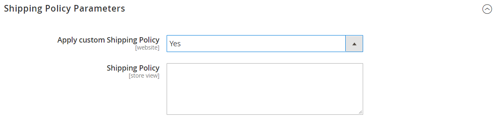

# [!UICONTROL Sales] > [!UICONTROL Shipping Settings]

{{config}}

Mer information om hur du ändrar de här inställningarna finns i [Leveransinställningar](../../stores-purchase/shipping-settings.md) i _Butiks and Purchase Experience Guide_.

## [!UICONTROL Origin]

<!-- zoom -->

| Fält | [Omfång](../../getting-started/websites-stores-views.md#scope-settings) | Beskrivning |
|--- |--- |--- |
| [!UICONTROL Country] | Webbplats | Ursprungslandet. |
| [!UICONTROL Region/State] | Webbplats | Ursprungsregionen eller ursprungsstaten. |
| [!UICONTROL ZIP/Postal Code] | Webbplats | Postnummer eller postnummer för ursprungsorten. |
| [!UICONTROL City] | Webbplats | Ort till ursprungsplatsen. |
| [!UICONTROL Street Address] | Webbplats | Gatuadress till ursprungsplatsen. |
| [!UICONTROL Street Address Line 2] | Webbplats | En extra rad för gatuadressen till ursprungsplatsen, om det behövs. |

{:style=&quot;table-layout:auto&quot;}

## [!UICONTROL Shipping Policy Parameters]

<!-- zoom -->

| Fält | [Omfång](../../getting-started/websites-stores-views.md#scope-settings) | Beskrivning |
|--- |--- |--- |
| [!UICONTROL Apply Custom Shipping Policy] | Webbplats | Anger om din leveransprofil visas under utcheckningen. Alternativ: `Yes` / `No` |
| [!UICONTROL Shipping Policy] | Butiksvy | Innehåller din leveranspolicy som text. |

{:style=&quot;table-layout:auto&quot;}
