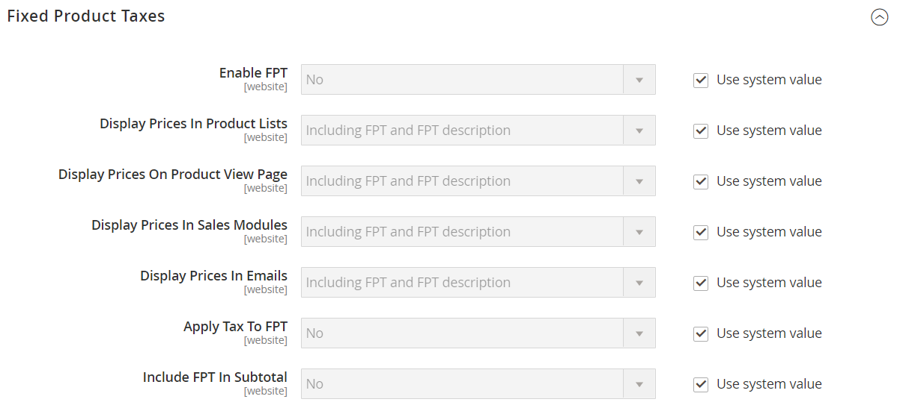

# [!UICONTROL Sales] > [!UICONTROL Tax]

>[!NOTE]
>
>Adobe Commerce och Magento Open Source, version 2.4.0 till 2.4.3, innehåller tillägget Vertex som utvecklats av leverantören och som används för att integrera med [!UICONTROL Vertex Cloud]. Från och med version 2.4.4 är det här tillägget inte längre paketerat med kärnversionen och måste installeras och uppdateras från Commerce Marketplace. Marketplace ger också tillgång till aktuell dokumentation från tilläggsutvecklaren.
>  
>Om du har det paketerade tillägget aktiverat och konfigurerat måste du uppdatera filen Composer.json som en del av uppgraderingsprocessen för 2.4.4 och hantera tilläggsuppdateringar vidare. Se [Uppgraderingsmoduler och tillägg](https://experienceleague.adobe.com/docs/commerce-operations/upgrade-guide/modules/upgrade.html) i _Uppgraderingshandbok_ för mer information.

{{config}}

## [!UICONTROL Tax Classes]

<!-- zoom -->

Mer information om hur du ändrar de här inställningarna finns i [Skatteklasser](../../stores-purchase/tax-class.md) i _Butiks and Purchase Experience Guide_.

| Fält | [Omfång](../../getting-started/websites-stores-views.md#scope-settings) | Beskrivning |
|--- |--- |--- |
| [!UICONTROL Tax Class for Shipping] | Webbplats | Identifierar den momsklass som används för leverans. Alternativen omfattar alla tillgängliga produktskatteklasser: `None` / `Taxable Goods` / `Shipping` / `Tax Exempt` |
| [!UICONTROL Tax Class for Gift Options] | Webbplats |  (Endast Adobe Commerce) Identifierar den standardskatteklass som används för presentalternativ. |
| [!UICONTROL Default Tax Class for Product] | Global | Identifierar den standardskatteklass som används för produkter. |
| [!UICONTROL Default Tax Class for Customer] | Global | Identifierar den standardskatteklass som används för kunder. |

{:style=&quot;table-layout:auto&quot;}

## [!UICONTROL Calculation Settings]

<!-- zoom -->

| Fält | [Omfång](../../getting-started/websites-stores-views.md#scope-settings) | Beskrivning |
|--- |--- |--- |
| [!UICONTROL Tax Calculation Method Based On] | Webbplats | Bestämmer metoden som används för att beräkna momsen för en order. Alternativ: **`Unit Price`**- Skatteberäkningarna baseras på enhetspriset för varje produkt. **`Row Total`** - Skatteberäkningar baseras på radartikelsumman.  **`Total`**- Skatteberäkningarna baseras på ordersumman.  _** Obs!**_Om ett tillägg för momsberäkning installeras från Marketplace, till exempel _Vertex Cloud_, visas tilläggstjänsten som ett alternativ. |
| [!UICONTROL Tax Calculation Based On] | Webbplats | Avgör om momsberäkningen baseras på leveransadress, faktureringsadress eller leveransens ursprung. Alternativ: `Shipping Address` / `Billing Address` / `Shipping Origin` |
| [!UICONTROL Catalog Prices] | Webbplats | Avgör om katalogpriser innehåller eller exkluderar moms. Alternativ: `Excluding Tax` / `Including Tax` |
| [!UICONTROL Shipping Prices] | Webbplats | Anger fraktpriser inklusive eller exklusive moms. Alternativ: `Excluding Tax` / `Including Tax` |
| [!UICONTROL Apply Customer Tax] | Webbplats | Avgör om moms tillämpas före eller efter en rabatt. Alternativ: `Before Discount` / `After Discount` |
| [!UICONTROL Apply Discount on Prices] | Webbplats | Avgör om rabattpriser inkluderar eller exkluderar moms. Alternativ: `Excluding Tax` / `Including Tax` |
| [!UICONTROL Apply Tax On] | Webbplats | Avgör om momsen gäller för det ursprungliga priset eller för ett anpassat pris, om tillgängligt. Alternativ: `Custom price if available` / `Original price only` |
| [!UICONTROL Enable Cross Border Trade] | Webbplats | När det här alternativet är aktiverat tillämpas konsekventa priser över gränserna för regioner med olika skattesatser. Alternativ: `Yes` / `No`   **_Obs!_**Vid användning av gränsöverskridande handel justeras vinstmarginalen efter skattesats. |

{:style=&quot;table-layout:auto&quot;}

## [!UICONTROL Default Tax Destination Calculation]

<!-- zoom -->

| Fält | [Omfång](../../getting-started/websites-stores-views.md#scope-settings) | Beskrivning |
|--- |--- |--- |
| [!UICONTROL Default Country] | Butiksvy | Anger det land som momsberäkningarna baseras på. |
| [!UICONTROL Default State] | Butiksvy | Anger vilket tillstånd momsberäkningar baseras på. En asterisk (*) kan fungera som ett jokertecken för att ange alla lägen i det valda landet. |
| [!UICONTROL Default Post Code] | Butiksvy | Identifierar postnumret eller postnumret som momsberäkningarna baseras på. En asterisk (*) kan fungera som jokertecken för att ange alla postnummer i det valda läget. |

{:style=&quot;table-layout:auto&quot;}

## [!UICONTROL Price Display Settings]

<!-- zoom -->

Mer information om hur du ändrar de här inställningarna finns i [Konfigurera inställningar för prisvisning](../../stores-purchase/display-settings.md#configure-price-display-settings) i _Butiks and Purchase Experience Guide_.

| Fält | [Omfång](../../getting-started/websites-stores-views.md#scope-settings) | Beskrivning |
|--- |--- |--- |
| [!UICONTROL Display Product Prices in Catalog] | Butiksvy | Avgör om produktpriser som publiceras i katalogen inkluderar eller exkluderar moms, eller visar två versioner av priset, en med och den andra utan moms. Alternativ: `Excluding Tax` / `Including Tax` / `Including and Excluding Tax`   **_Obs!_**Om du anger att fältet Visa produktpriser ska vara `Including Tax`visas momsen bara om det finns en momsregel som matchar skatteursprunget eller om det finns en kundadress som matchar momsregeln. Händelser som kan utlösa en matchning är bland annat att skapa ett kundkonto, logga in eller använda skattnings- och leveransberäkningsverktyget i kundvagnen. |
| [!UICONTROL Display Shipping Prices] | Butiksvy | Avgör om leveranspriserna inkluderar eller exkluderar moms, eller visar två versioner av leveranspriset; den ena med och den andra utan moms. Alternativ: `Excluding Tax` / `Including Tax` / `Including and Excluding Tax` |

{:style=&quot;table-layout:auto&quot;}

## [!UICONTROL Shopping Cart Display Settings]

<!-- zoom -->

Mer information om hur du ändrar de här inställningarna finns i [Konfigurera visningsinställningar för kundvagn](../../stores-purchase/display-settings.md#step-2-configure-shopping-cart-display-settings) i _Butiks and Purchase Experience Guide_.

| Fält | [Omfång](../../getting-started/websites-stores-views.md#scope-settings) | Beskrivning |
|--- |--- |--- |
| [!UICONTROL Display Prices] | Butiksvy | Avgör om kundvagnspriserna inkluderar eller exkluderar moms, eller visar två versioner av priset; den ena med och den andra utan moms. Alternativ: `Excluding Tax` / `Including Tax` / `Including and Excluding Tax` |
| [!UICONTROL Display Subtotal|Store View] | Avgör om delsumman i kundvagnen innehåller eller exkluderar moms, eller visar två versioner av delsumman; den ena med och den andra utan moms. Alternativ: `Excluding Tax` / `Including Tax` / `Including and Excluding Tax` |
| [!UICONTROL Display Shipping Amount] | Butiksvy | Avgör om kundvagnens leveransbelopp inkluderar eller exkluderar moms, eller visar två versioner av fraktbeloppet, den ena med och den andra utan moms. Alternativ: `Excluding Tax` / `Including Tax` / `Including and Excluding Tax` |
| [!UICONTROL Additionally Show Order Total Without Tax] | Butiksvy | Avgör om en extra rad med totalbeloppet utan moms visas i kundvagnen. Alternativ: `Yes` / `No` |
| [!UICONTROL Display Full Tax Summary] | Butiksvy | Avgör om kundvagnen innehåller en fullständig momssammanfattning. Alternativ: `Yes` / `No` |
| [!UICONTROL Display Zero Tax Subtotal] | Butiksvy | Avgör om kundvagnen innehåller en momsdelsumma när momsen är noll. Alternativ: `Yes` / `No` |

{:style=&quot;table-layout:auto&quot;}

## [!UICONTROL Orders, Invoices, Credit Memos Display Settings]

<!-- zoom -->

Mer information om hur du ändrar de här inställningarna finns i [Konfigurera visningsinställningar för order, fakturor och kreditnotor](../../stores-purchase/display-settings.md#step-3-configure-order-invoice-and-credit-memo-display-settings) i _Butiks and Purchase Experience Guide_.

| Fält | [Omfång](../../getting-started/websites-stores-views.md#scope-settings) | Beskrivning |
|--- |--- |--- |
| [!UICONTROL Display Prices] | Butiksvy | Avgör om priserna på försäljningsdokument inkluderar eller exkluderar moms, eller om varje dokument visar två versioner av priset; den ena med och den andra utan moms. Alternativ: `Excluding Tax` / `Including Tax` / `Including and Excluding Tax` |
| [!UICONTROL Display Subtotal] | Butiksvy | Avgör om delsumman i försäljningsdokument inkluderar eller exkluderar moms, eller om varje dokument visar två versioner av delsumman; den ena med och den andra utan moms. Alternativ: `Excluding Tax` / `Including Tax` / `Including and Excluding Tax` |
| [!UICONTROL Display Shipping Amount] | Butiksvy | Avgör om leveransbeloppet i försäljningsdokument inkluderar eller exkluderar moms, eller om varje dokument visar två versioner av delsumman; den ena med och den andra utan moms. Alternativ: `Excluding Tax` / `Including Tax` / `Including and Excluding Tax` |
| [!UICONTROL Additionally Show Order Total Without Tax] | Butiksvy | Avgör om en extra rad med totalbeloppet utan moms visas på försäljningsdokument. Alternativ: `Yes` / `No` |
| [!UICONTROL Display Full Tax Summary] | Butiksvy | Avgör om den fullständiga momssammanfattningen visas på försäljningsdokument. Alternativ: `Yes` / `No` |
| [!UICONTROL Display Zero Tax Subtotal] | Butiksvy | Avgör delsummeavsnittet i försäljningsdokument när ingen moms debiteras. Alternativ: `Yes` / `No` |
| [!UICONTROL Display Gift Wrapping Prices] | Butiksvy |  (Endast Adobe Commerce) Anger om priserna för presentationer ska inkluderas i delsumman. Alternativ: `Excluding Tax` / `Including Tax` / `Including and Excluding Tax` |
| [!UICONTROL Display Printed Card Prices] | Butiksvy |  (Endast Adobe Commerce) Anger om priset på utskrivna kort ska ingå i delsumman. Alternativ: `Excluding Tax` / `Including Tax` / `Including and Excluding Tax` |

{:style=&quot;table-layout:auto&quot;}

## [!UICONTROL Fixed Product Taxes]

<!-- zoom -->

Mer information om hur du ändrar de här inställningarna finns i [Fast produktskatt](../../stores-purchase/fixed-product-tax.md) i _Butiks and Purchase Experience Guide_.

| Fält | [Omfång](../../getting-started/websites-stores-views.md#scope-settings) | Beskrivning |
|--- |--- |--- |
| [!UICONTROL Enable FPT] | Webbplats | Avgör om FPT är tillgängligt. Alternativ: `Yes` / `No` |
| [!UICONTROL Display Prices in Product Lists] | Webbplats | Styr visningen av FPT i produktlistor. Alternativ:  **`Including FPT Only`** - Priserna är fasta produktskatter. FPT-beloppet visas inte separat. **`Including FPT and FPT description`**- Priserna är fasta produktskatter. FPT-beloppet visas separat. **`Excluding FPT. Including FPT description and final price`** - De priser som visas inkluderar inte fasta produktskatter. FPT-beloppet visas separat. **`Excluding FPT`**- De priser som visas inkluderar inte fasta produktskatter. FPT-beloppet visas inte separat. |
| Visa pris på produktvysida | Webbplats | Styr visningen av FPT på produktsidan. Alternativ:  **`Including FPT Only`** - Priserna är fasta produktskatter. FPT-beloppet visas inte separat. **`Including FPT and FPT description`**- Priserna är fasta produktskatter. FPT-beloppet visas separat. **`Excluding FPT. Including FPT description and final price`** - De priser som visas inkluderar inte fasta produktskatter. FPT-beloppet visas separat. **`Excluding FPT`**- De priser som visas inkluderar inte fasta produktskatter. FPT-beloppet visas inte separat. |
| [!UICONTROL Display Prices in Sales Modules] | Webbplats | Styr visningen av FPT i kundvagnen och under utcheckningen. Alternativ:  **`Including FPT Only`** - Priserna är fasta produktskatter. FPT-beloppet visas inte separat. **`Including FPT and FPT description`**- Priserna är fasta produktskatter. FPT-beloppet visas separat. **`Excluding FPT. Including FPT description and final price`** - De priser som visas inkluderar inte fasta produktskatter. FPT-beloppet visas separat. **`Excluding FPT`**- De priser som visas inkluderar inte fasta produktskatter. FPT-beloppet visas inte separat. |
| [!UICONTROL Display Prices in Emails] | Webbplats | Styr visningen av FPT i e-post. Alternativ:  **`Including FPT Only`** - Priserna är fasta produktskatter. FPT-beloppet visas inte separat. **`Including FPT and FPT description`**- Priserna är fasta produktskatter. FPT-beloppet visas separat. ** Utom FPT. Inklusive FPT-beskrivning och slutpris **- De priser som visas inkluderar inte fasta produktskatter. FPT-beloppet visas separat. **`Excluding FPT`** - De priser som visas inkluderar inte fasta produktskatter. FPT-beloppet visas inte separat. |
| [!UICONTROL Apply Discounts to FPT] | Webbplats | Avgör om rabatter kan tillämpas på FPT-beloppet. Alternativ: `Yes` / `No` |
| [!UICONTROL FPT Tax Configuration] | Webbplats | Bestämmer hur FPT-skatt beräknas. Alternativ:  **`Not Taxed`**- Välj det här alternativet om din skattejurisdiktion inte beskattar FPT. (Exempel: Kalifornien.) **`Taxed`** - Välj det här alternativet om din skattejurisdiktion inte beskattar FPT. (Till exempel Kanada.)  **`Loaded and Displayed with Tax`**- Klicka på det här alternativet om FPT läggs till i ordersumman innan moms används. (Exempel: EU-länder.) |
| [!UICONTROL Include FPT in Subtotal] | Webbplats | Avgör om FPT ingår i kundvagnens delsumma. Alternativ:  **`Yes`**- Inkluderar FPT i kundvagnens delsumma. **`No`** - FPT ingår inte i delsumman och läggs efter delsumman i kundvagnen. |

{:style=&quot;table-layout:auto&quot;}
