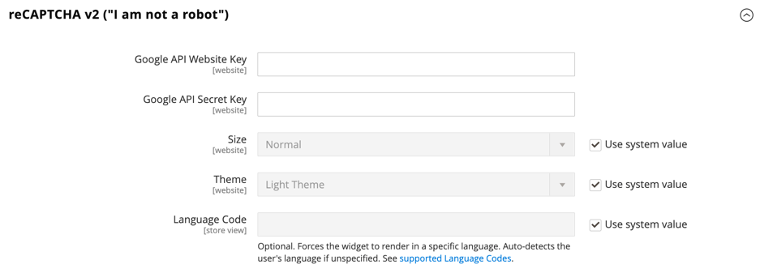

# [!UICONTROL Security] > [!UICONTROL Google reCAPTCHA Storefront]

>[!IMPORTANT]
>
>Innan Google reCAPTCHA kan konfigureras måste du se till att `PHP.ini` filen innehåller följande inställning: `allow_url_fopen = 1`. Detta kan kräva hjälp av utvecklare. Se [PHP-inställningar](https://experienceleague.adobe.com/docs/commerce-operations/installation-guide/prerequisites/php-settings.html) i _Installationshandbok_.

{{config}}

Mer information om hur du använder Google reCAPTCHA för att skydda din butik finns i Google [reCAPTCHA](../../systems/security-google-recaptcha.md) i _Handbok för adminsystem_.

## [!UICONTROL reCAPTCHA v2 ("I am not a robot")]

<!-- zoom -->

| Fält | [Omfång](../../getting-started/websites-stores-views.md#scope-settings) | Beskrivning |
|--|--|--|
| [!UICONTROL Google API Website Key] | Webbplats | Den webbplatsnyckel som skapas när du registrerar ditt Google reCAPTCHA-konto. |
| [!UICONTROL Google API Secret Key] | Webbplats | Den hemliga nyckel som är kopplad till ditt Google reCAPTCHA-konto. |
| [!UICONTROL Size] | Webbplats | Storleken på rutan Google reCAPTCHA som visas när en kund loggar in på sitt konto. Alternativ: `Normal` (standard) / `Compact` |
| [!UICONTROL Theme] | Webbplats | Anger formatet för rutan Google reCAPTCHA. Alternativ: `Light Theme` (standard) / `Dark Theme` |
| [!UICONTROL Language Code] | Butiksvy | The [kod med två tecken](https://developers.google.com/recaptcha/docs/language) som anger vilket språk som används för Google reCAPTCHA-text och -meddelanden. |

{:style=&quot;table-layout:auto&quot;}

## [!UICONTROL reCAPTCHA v2 Invisible]

<!-- zoom -->

| Fält | [Omfång](../../getting-started/websites-stores-views.md#scope-settings) | Beskrivning |
|--|--|--|
| [!UICONTROL Google API Website Key] | Webbplats | Den webbplatsnyckel som skapas när du registrerar ditt Google reCAPTCHA-konto. |
| [!UICONTROL Google API Secret Key] | Webbplats | Den hemliga nyckel som är kopplad till ditt Google reCAPTCHA-konto. |
| [!UICONTROL Invisible Badge Position] | Webbplats | Positionen för det osynliga reCAPTCHA-märket på varje sida. Alternativ: `Inline` / `Bottom Right` / `Bottom Left` |
| [!UICONTROL Theme] | Global | Anger formatet för rutan Google reCAPTCHA. Alternativ: `Light Theme` (standard) / `Dark Theme` |
| [!UICONTROL Language Code] | Butiksvy | A [kod med två tecken](https://developers.google.com/recaptcha/docs/language) som anger vilket språk som används för Google reCAPTCHA-text och -meddelanden. |

{:style=&quot;table-layout:auto&quot;}

## [!UICONTROL reCAPTCHA v3 Invisible]

<!-- zoom -->

| Fält | [Omfång](../../getting-started/websites-stores-views.md#scope-settings) | Beskrivning |
|--|--|--|
| [!UICONTROL Google API Website Key] | Webbplats | Den webbplatsnyckel som skapas när du registrerar ditt Google reCAPTCHA-konto. |
| [!UICONTROL Google API Secret Key] | Webbplats | Den hemliga nyckel som är kopplad till ditt Google reCAPTCHA-konto. |
| [!UICONTROL Minimum Score Threshold] | Global | Det lägsta poängvärde som identifierar en användarinteraktion som en potentiell risk, där 1.0 är en typisk användarinteraktion och 0.0 är troligtvis en robot. Standard: `0.5` |
| [!UICONTROL Invisible Badge Position] | Webbplats | Positionen för det osynliga reCAPTCHA-märket på varje sida. Alternativ: `Inline` / `Bottom Right` / `Bottom Left` |
| [!UICONTROL Theme] | Webbplats | Anger formatet för rutan Google reCAPTCHA. Alternativ: `Light Theme` (standard) / `Dark Theme` |
| [!UICONTROL Language Code] | Butiksvy | A [kod med två tecken](https://developers.google.com/recaptcha/docs/language) som anger vilket språk som används för Google reCAPTCHA-text och -meddelanden. |

{:style=&quot;table-layout:auto&quot;}

## [!UICONTROL reCAPTCHA Failure Messages]

<!-- zoom -->

| Fält | [Omfång](../../getting-started/websites-stores-views.md#scope-settings) | Beskrivning |
|--|--|--|
| [!UICONTROL reCAPTCHA Validation Failure Message] | Butiksvy | Meddelandet som visas i butiken om verifieringen misslyckas. Standardtext: `reCAPTCHA verification failed.` |
| [!UICONTROL reCAPTCHA Technical Failure Message] | Butiksvy | Meddelandet som visas i butiken om reCAPTCHA inte returnerar ett verifieringsresultat. Standardtext: `Something went wrong with reCAPTCHA. Please contact the store owner.` |

{:style=&quot;table-layout:auto&quot;}

## [!UICONTROL Storefront]

<!-- zoom -->

>[!NOTE]
>
>Typen reCAPTCHA som du väljer måste matcha den typ som är associerad med API-nyckeln från ditt Google reCAPTCHA-konto.

>[!WARNING]
>
>När du använder reCAPTCHA version 3 kan en äkta användare med låg poäng inte fortsätta. För version 2 får en äkta användare med låg poäng en utmaning. Tänk efter noga om äkta användare med låg poäng ska kunna lösa ett problem (version 2) eller blockeras (version 3).

| Fält | [Omfång](../../getting-started/websites-stores-views.md#scope-settings) | Beskrivning |
|--|--|--|
| [!UICONTROL Enable for Customer Login] | Webbplats | Anger den typ av reCAPTCHA som används när kunder [logga in](../../customers/customer-sign-in.md) till sina konton. Alternativ: **`No`**- (standard) Verifierar inte inloggningsbegäran. **`reCAPTCHA v2 ("I am not a robot")`** - Kräver att användaren väljer _Jag är ingen robot_ kryssrutan. **`Invisible reCAPTCHA v2`**- Validerar användarbeteende i bakgrunden utan att det krävs interaktioner baserat på poängen. **`Invisible reCAPTCHA v3`** - (Rekommenderas) Validerar användarbeteende i bakgrunden baserat på interaktionspoäng. |
| [!UICONTROL Enable for Forgot Password] | Webbplats | Anger den typ av reCAPTCHA som används när kunderna begär en [återställa lösenordet](../../customers/password-reset.md). Alternativ: **`No`**- (standard) Verifierar inte begäran om återställning av lösenord. **`reCAPTCHA v2 ("I am not a robot")`** - Kräver att användaren väljer _Jag är ingen robot_ kryssrutan. **`Invisible reCAPTCHA v2`**- Validerar användarbeteende i bakgrunden utan att det krävs interaktioner baserat på poängen. **`Invisible reCAPTCHA v3`** - (Rekommenderas) Validerar användarbeteende i bakgrunden baserat på interaktionspoäng. |
| [!UICONTROL Enable for Create New Customer Account] | Webbplats | Anger den typ av reCAPTCHA som används när kunden registrerar sig för en [nytt konto](../../customers/account-create.md). Alternativ: **`No`**- (standard) Verifierar inte kontobegäran. **`reCAPTCHA v2 ("I am not a robot")`** - Kräver att användaren väljer _Jag är ingen robot_ kryssrutan. **`Invisible reCAPTCHA v2`**- Validerar användarbeteende i bakgrunden utan att det krävs interaktioner baserat på poängen. **`Invisible reCAPTCHA v3`** - (Rekommenderas) Validerar användarbeteende i bakgrunden baserat på interaktionspoäng. |
| [!UICONTROL Enable for Edit Customer Account] | Webbplats | Anger den typ av reCAPTCHA som används när kunden ändrar sin [kontoinformation](../../customers/account-dashboard-account-information.md). Alternativ: **`No`**- (standard) Verifierar inte kontobegäran. **`reCAPTCHA v2 ("I am not a robot")`** - Kräver att användaren väljer _Jag är ingen robot_ kryssrutan. **`Invisible reCAPTCHA v2`**- Validerar användarbeteende i bakgrunden utan att det krävs interaktioner baserat på poängen. **`Invisible reCAPTCHA v3`** - (Rekommenderas) Validerar användarbeteende i bakgrunden baserat på interaktionspoäng. |
| [!UICONTROL Enable for Create New Company Account] | Webbplats |  (Endast tillgängligt för B2B för Adobe Commerce) Anger den typ av reCAPTCHA som används när en ny [företagskonto](../../b2b/account-company-create.md) skapas. Alternativ: **`No`**- (standard) Verifierar inte kontobegäran. **`reCAPTCHA v2 ("I am not a robot")`** - Kräver att användaren väljer _Jag är ingen robot_ kryssrutan. **`Invisible reCAPTCHA v2`**- Validerar användarbeteende i bakgrunden utan att det krävs interaktioner baserat på poängen. **`Invisible reCAPTCHA v3`** - (Rekommenderas) Validerar användarbeteende i bakgrunden baserat på interaktionspoäng. |
| [!UICONTROL Enable for Contact Us] | Webbplats | Anger den typ av reCAPTCHA som används för att skicka ett meddelande från [Kontakta oss](../../getting-started/store-details.md#contact-us-form) sida i din butik. Alternativ: **`No`**- (standard) Verifierar inte meddelandebegäran. **`reCAPTCHA v2 ("I am not a robot")`** - Kräver att användaren väljer _Jag är ingen robot_ kryssrutan. **`Invisible reCAPTCHA v2`**- Validerar användarbeteende i bakgrunden utan att det krävs interaktioner baserat på poängen. **`Invisible reCAPTCHA v3`** - (Rekommenderas) Validerar användarbeteende i bakgrunden baserat på interaktionspoäng. |
| [!UICONTROL Enable for Product Review] | Webbplats | Anger den typ av reCAPTCHA som används när kunder skickar en [produktrecension](../../merchandising-promotions/product-reviews.md). Alternativ: **`No`**- (standard) Validerar inte begäran om produktgranskning. **`reCAPTCHA v2 ("I am not a robot")`** - Kräver att användaren väljer _Jag är ingen robot_ kryssrutan. **`Invisible reCAPTCHA v2`**- Validerar användarbeteende i bakgrunden utan att det krävs interaktioner baserat på poängen. **`Invisible reCAPTCHA v3`** - (Rekommenderas) Validerar användarbeteende i bakgrunden baserat på interaktionspoäng. |
| [!UICONTROL Enable for Newsletter Subscription] | Webbplats | Anger den typ av osynlig reCAPTCHA som används när kunder registrerar sig för en [prenumeration på nyhetsbrev](../../merchandising-promotions/newsletter-subscribers.md). Alternativ: **`No`**- (standard) Validerar inte prenumerationsbegäran för nyhetsbrev. **`reCAPTCHA v2 ("I am not a robot")`** - Kräver att användaren väljer _Jag är ingen robot_ kryssrutan. **`Invisible reCAPTCHA v2`**- Validerar användarbeteende i bakgrunden utan att det krävs interaktioner baserat på poängen. **`Invisible reCAPTCHA v3`** - (Rekommenderas) Validerar användarbeteende i bakgrunden baserat på interaktionspoäng. |
| [!UICONTROL Enable for Gift Card] | Webbplats |  (Endast Adobe Commerce) Anger den typ av reCAPTCHA som används när kunder anger en [presentkort](../../catalog/product-gift-card-create.md) kod. Alternativ: **`No`**- (standard) Validerar inte presentkortets kodinlämning. **`reCAPTCHA v2 ("I am not a robot")`** - Kräver att användaren väljer _Jag är ingen robot_ kryssrutan. **`Invisible reCAPTCHA v2`**- Validerar användarbeteende i bakgrunden utan att det krävs interaktioner baserat på poängen. **`Invisible reCAPTCHA v3`** - (Rekommenderas) Validerar användarbeteende i bakgrunden baserat på interaktionspoäng. |
| [!UICONTROL Enable for Invitation Create Account] | Webbplats | Anger den typ av reCAPTCHA som används när kunder skickar ett kontoskapande [inbjudan](../../merchandising-promotions/invitations.md) kod. Alternativ: **`No`**- (standard) Verifierar inte e-postinlämningen av inbjudan. **`reCAPTCHA v2 ("I am not a robot")`** - Kräver att användaren väljer _Jag är ingen robot_ kryssrutan. **`Invisible reCAPTCHA v2`**- Validerar användarbeteende i bakgrunden utan att det krävs interaktioner baserat på poängen. **`Invisible reCAPTCHA v3`** - (Rekommenderas) Validerar användarbeteende i bakgrunden baserat på interaktionspoäng. |
| [!UICONTROL Enable for Send to Friend] | Webbplats | Anger den typ av reCAPTCHA som används när kunder [dela en produkt](../../stores-purchase/email-a-friend.md) med en vän. Alternativ: **`No`**- (standard) Verifierar inte e-postöverföringen. **`reCAPTCHA v2 ("I am not a robot")`** - Kräver att användaren väljer _Jag är ingen robot_ kryssrutan. **`Invisible reCAPTCHA v2`**- Validerar användarbeteende i bakgrunden utan att det krävs interaktioner baserat på poängen. **`Invisible reCAPTCHA v3`** - (Rekommenderas) Validerar användarbeteende i bakgrunden baserat på interaktionspoäng. |
| [!UICONTROL Enable for Wishlist Sharing] | Webbplats | Anger den typ av reCAPTCHA som används när kunder [dela en önskelista](../../stores-purchase/wishlist-storefront.md#share-the-wish-list). Alternativ: **`No`**- (standard) Verifierar inte e-postmeddelandet och e-postinlämningen. **`reCAPTCHA v2 ("I am not a robot")`** - Kräver att användaren väljer _Jag är ingen robot_ kryssrutan. **`Invisible reCAPTCHA v2`**- Validerar användarbeteende i bakgrunden utan att det krävs interaktioner baserat på poängen. **`Invisible reCAPTCHA v3`** - (Rekommenderas) Validerar användarbeteende i bakgrunden baserat på interaktionspoäng. |
| [!UICONTROL Enable for Coupon Codes] | Webbplats | Anger den typ av reCAPTCHA som används när kunderna anger en [kupong](../../merchandising-promotions/price-rules-cart-coupon.md). Alternativ: **`No`**- (standard) Validerar inte inskickandet av kupongkoden. **`reCAPTCHA v2 ("I am not a robot")`** - Kräver att användaren väljer _Jag är ingen robot_ kryssrutan. **`Invisible reCAPTCHA v2`**- Validerar användarbeteende i bakgrunden utan att det krävs interaktioner baserat på poängen. **`Invisible reCAPTCHA v3`** - (Rekommenderas) Validerar användarbeteende i bakgrunden baserat på interaktionspoäng. |
| [!UICONTROL Enable for PayPal Payflow Pro payment form] | Webbplats | Anger den typ av reCAPTCHA som används när kunder betalar för ett köp med [PayPal Payflow Pro](../../stores-purchase/paypal-payflow-pro.md). Alternativ: **`No`**- (standard) Verifierar inte begäran om återställning av lösenord. **`reCAPTCHA v2 ("I am not a robot")`** - Kräver att användaren väljer _Jag är ingen robot_ kryssrutan. **`Invisible reCAPTCHA v2`**- Validerar användarbeteende i bakgrunden utan att det krävs interaktioner baserat på poängen. **`Invisible reCAPTCHA v3`** - (Rekommenderas) Validerar användarbeteende i bakgrunden baserat på interaktionspoäng. |

{:style=&quot;table-layout:auto&quot;}
