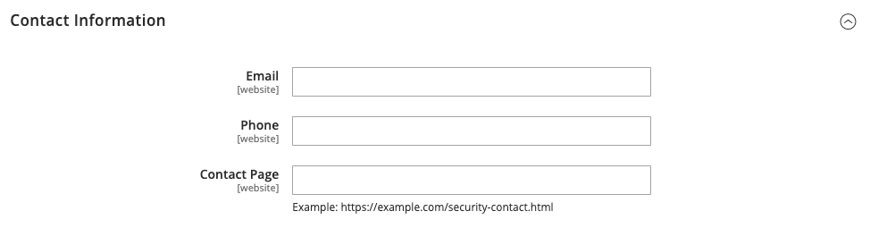

# [!UICONTROL Security] > [!UICONTROL Security.txt]

Mer information om hur du ändrar de här konfigurationsinställningarna finns i [Rapportering om säkerhetsproblem](../../systems/security-issue-reporting.md).

{{config}}

## [!UICONTROL General]

<!-- zoom -->

| Fält | [Omfång](../../getting-started/websites-stores-views.md#scope-settings) | Beskrivning |
|--- |--- |--- |
| [!UICONTROL Enable] | Webbplats | När det här alternativet är aktiverat sparas en `security.txt`-fil som innehåller information som krävs av säkerhetsforskare för att rapportera potentiella säkerhetsluckor till dig. Alternativ: **`Yes`**- Skapar filen `security.txt` baserat på information som anges i avsnitten _Kontaktinformation_ och _Annan information_. **`No`** - (standard) Skapar inte filen `security.txt`. |

{style="table-layout:auto"}

## [!UICONTROL Contact information]

<!-- zoom -->

| Fält | [Omfång](../../getting-started/websites-stores-views.md#scope-settings) | Beskrivning |
|--- |--- |--- |
| [!UICONTROL Email] | Webbplats | E-postadressen dit säkerhetsrapporter kan skickas. |
| [!UICONTROL Phone] | Webbplats | Ett telefonnummer som kan användas för att rapportera säkerhetsproblem. |
| [!UICONTROL Contact Page] | Webbplats | URL-adressen till en sida på din webbplats som innehåller en lista över säkerhetskontakter, eller din _Kontakta oss_-sida. Exempel:  `https://mystore.com/security-contact.html` `https://mystore.com/contact/` |

{style="table-layout:auto"}

## [!UICONTROL Other information]

<!-- zoom -->

| Fält | [Omfång](../../getting-started/websites-stores-views.md#scope-settings) | Beskrivning |
|--- |--- |--- |
| [!UICONTROL Encryption] | Webbplats | En URL som pekar på platsen för en krypteringsnyckel som säkerhetsforskare kan använda för att skicka krypterad kommunikation. _&#x200B;**Ange inte krypteringsnyckeln i det här fältet.**&#x200B;_   Det är forskarens ansvar att verifiera att nyckeln kommer från en betrodd källa. Forskaren får inte anta att nyckeln är densamma som den som användes för att generera den digitala signaturen. Exempel: OpenPGP-nyckel från webbserver - `https://mystore.com/pgp-key.txt` |
| [!UICONTROL Acknowledgments] | Webbplats | En URL som pekar på en sida i din butik där säkerhetsforskare bekräftas, till exempel `https://mystore.com/hall-of-fame.html`. För att förhindra framtida attacker bör du bara ta med en allmän beskrivning utan att visa specifik information om sårbarhetsproblem. Exempel: Vi vill tacka följande forskare: (åååå/mm/dd) Justin Thyme - SQL injection |
| [!UICONTROL Preferred Languages] | Webbplats | Anger minst ett rekommenderat säkerhetsrapporteringsspråk. Avgränsa flera [språkkoder](https://en.wikipedia.org/wiki/List_of_ISO_639-1_codes) med två tecken med kommatecken. Alla angivna språk har samma prioritet. Om du till exempel vill ange engelska, spanska och franska anger du `en, es, fr`. |
| [!UICONTROL Hiring] | Webbplats | URL-adressen till en sida på webbplatsen som listar säkerhetsrelaterade jobbpositioner. Exempel: `https://mystore.com/jobs.html` |
| [!UICONTROL Policy] | Webbplats | URL:en till sidan som beskriver din säkerhetspolicy och rutiner för rapportering av säkerhetsluckor. Exempel: `https://mystore.com/security-reporting.html` Standard: `https://mystore.com/security` |
| [!UICONTROL Signature] | Webbplats | En länk till din digitala signaturfil. Den digitala signaturen måste genereras från kommandoraden och sparas i mappen `.well-known` på servern. Mer information finns i [Security.txt](https://github.com/magento/security-package/blob/1.0-develop/Securitytxt/README.md) på GitHub. Exempel: `https://mystore.com/.well-known/security.txt.sig` |

{style="table-layout:auto"}
