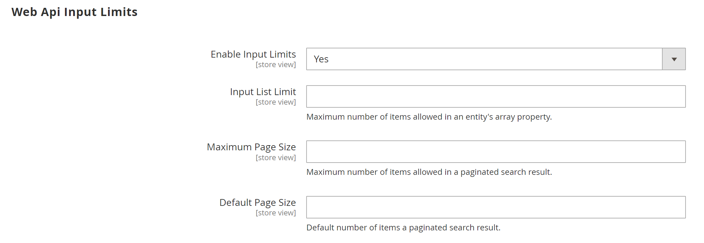

# [!UICONTROL Services] > [!UICONTROL Magento Web API]

{{config}}

<!-- [X-ref](../systems/integrations.md) -->

## [!UICONTROL SOAP Settings]

<!-- zoom -->

| Fält | [Omfång](../../getting-started/websites-stores-views.md#scope-settings) | Beskrivning |
|--- |--- |--- |
| [!UICONTROL Default Response Charset] | Butiksvy | Anger standardteckenuppsättningen. Om den är tom används UTF-8. |

{:style=&quot;table-layout:auto&quot;}

## [!UICONTROL GraphQl Input Limits]

<!-- zoom -->

| Fält | [Omfång](../../getting-started/websites-stores-views.md#scope-settings) | Beskrivning |
|--- |--- |--- |
| [!UICONTROL Enable Input Limits] | Butiksvy | Anger om indatagränser är aktiverade för GraphQL-anrop. Standardvärde: `No`. |
| [!UICONTROL Maximum Page Size] | Butiksvy | Anger det maximala antalet objekt som tillåts i ett sidnumrerat sökresultat i GraphQL-svaret. Det här alternativet är inte tillgängligt när _Aktivera indatagränser_ = `No`. |

{:style=&quot;table-layout:auto&quot;}

## [!UICONTROL Web Api Input Limits]

<!-- zoom -->

| Fält | [Omfång](../../getting-started/websites-stores-views.md#scope-settings) | Beskrivning |
|--- |--- |--- |
| [!UICONTROL Enable Input Limits] | Butiksvy | Avgör om indatagränser är aktiverade för webb-API-anrop. Standardvärde: `No`. |
| Gräns för inmatningslista | Butiksvy | Anger det maximala antalet objekt som tillåts i en entitetsmatrisegenskap i Web API-begäran. Det här alternativet är inte tillgängligt när _Aktivera indatagränser_ = `No`. |
| [!UICONTROL Maximum Page Size] | Butiksvy | Anger det maximala antalet objekt som tillåts i ett sidnumrerat sökresultat i webb-API-svaret. Det här alternativet är inte tillgängligt när _Aktivera indatagränser_ = `No`. |
| [!UICONTROL Default Page Size] | Butiksvy | Anger standardantalet objekt i ett sidnumrerat sökresultat i webb-API-svaret. |

{:style=&quot;table-layout:auto&quot;}

## [!UICONTROL Web API Security]

<!-- zoom -->

| Fält | [Omfång](../../getting-started/websites-stores-views.md#scope-settings) | Beskrivning |
|--- |--- |--- |
| [!UICONTROL Allow Anonymous Guest Access] | Global | Fastställer att gäster kan få anonym åtkomst till CMS, katalog och lagra resurser från både SOAP- och REST-API:er. Som standard tillåts inte anonym gäståtkomst. Alternativ: `Yes` / `No` |

{:style=&quot;table-layout:auto&quot;}

## [!UICONTROL JWT Authentication]

<!-- zoom -->

| Fält | [Omfång](../../getting-started/websites-stores-views.md#scope-settings) | Beskrivning |
|--- |--- |--- |
| [!UICONTROL Algorithm to sign/encrypt JWTs used for authentication] | Global | Anger den typ av JWS- eller JWE-algoritm som används för JWT-kryptering (JSON Web Token) |
| [!UICONTROL Content encryption algorithm for JWEs] | Global | Anger vilken typ av innehållskrypteringsalgoritm som används för JWT-kryptering när JWE-algoritmen har valts. Det här alternativet ignoreras för JWS-algoritmer. |
| [!UICONTROL Customer JWT Expires In] | Global | Anger tiden (i minuter) innan en kundens JWT-bearer-token upphör att gälla. Kundens JWT-bearer-token upphör att gälla om 30 minuter om det här fältet är tomt eller har ett negativt värde. Standardvärde: `60` |
| [!UICONTROL Admin User JWT Expires In] | Global | Anger tiden (i minuter) innan Admin JWT Bearer-token upphör att gälla. Admin JWT Bearer-token upphör att gälla om 30 minuter om det här fältet är tomt eller har ett negativt värde. Standardvärde: `60` |

{:style=&quot;table-layout:auto&quot;}
