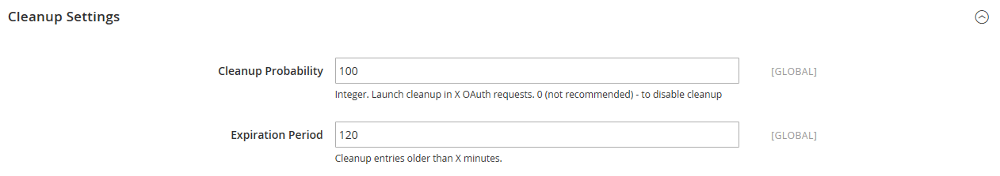

# [!UICONTROL Services] > [!UICONTROL OAuth]

{{config}}

## [!UICONTROL Access Token Expiration]

<!-- zoom -->

| Fält | [Omfång](../../getting-started/websites-stores-views.md#scope-settings) | Beskrivning |
|--- |--- |--- |
| [!UICONTROL Customer Token Lifetime (hours]) | Global | Fastställer tiden i timmar innan en kund-API-token upphör att gälla. Kundtoken upphör aldrig att gälla om fältet är tomt. Standardvärde: `1` |
| [!UICONTROL Admin Token Lifetime (hours)] | Global | Fastställer hur lång tid i timmar som en API-token för administratörer ska förfalla. Admin-token upphör aldrig att gälla om fältet är tomt. Standardvärde: `4` |

{style="table-layout:auto"}

>[!NOTE]
>
>Livstid och krypteringsalgoritmer för Bearer-token för kund och administratör-API styrs av konfigurationsinställningarna för [JWT-autentisering](magento-web-api.md#jwt-authentication) .

## [!UICONTROL Cleanup Settings]

<!-- zoom -->

| Fält | [Omfång](../../getting-started/websites-stores-views.md#scope-settings) | Beskrivning |
|--- |--- |--- |
| [!UICONTROL Cleanup Probability] | Global | Anger antalet OAuth-begäranden innan rensning startas. Ange inte `0` för att inaktivera rensning. |
| [!UICONTROL Enable WSDL Cache] | Global | Fastställer posernas ålder i minuter, innan de rensas. |

{style="table-layout:auto"}

## [!UICONTROL Consumer Settings]

<!-- zoom -->

| Fält | [Omfång](../../getting-started/websites-stores-views.md#scope-settings) | Beskrivning |
|--- |--- |--- |
| [!UICONTROL OAuth consumer credentials HTTP Post timeout] | Global | Anger hur många sekunder det tar för systemet att timeout inträffar när kunderna skickar sina inloggningsuppgifter. |
| [!UICONTROL OAuth consumer credentials HTTP Post maxredirects] | Global | Anger det maximala antalet omdirigeringar som är relaterade till en publicering av konsumentreferenser. |
| [!UICONTROL Expiration Period] | Global | Anger antalet sekunder innan en oanvänd nyckel/hemlighet upphör att gälla efter att OAuth-tokenutbytet börjar. |

{style="table-layout:auto"}

## [!UICONTROL Authentication Locks]

<!-- zoom -->

| Fält | [Omfång](../../getting-started/websites-stores-views.md#scope-settings) | Beskrivning |
|--- |--- |--- |
| [!UICONTROL Maximum Login Failures to Lock Out Account] | Global | Anger maximalt antal autentiseringsfel som ska låsa ut kontot. |
| [!UICONTROL Lockout Time (seconds)] | Global | Anger den tidsperiod i sekunder efter vilken kontot låses upp. |

{style="table-layout:auto"}
