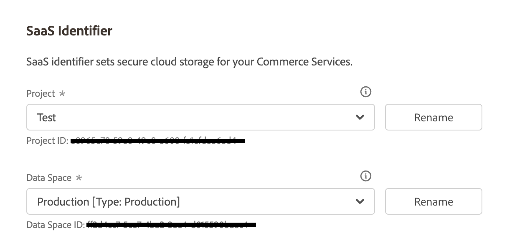
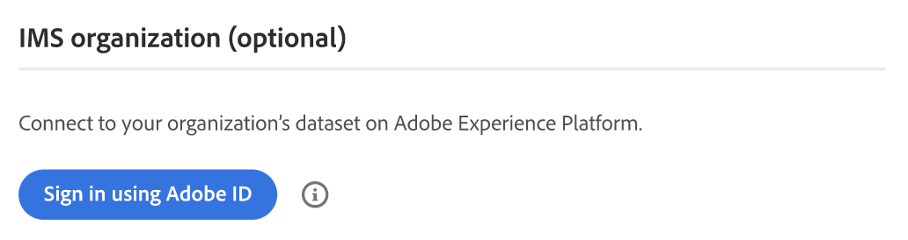

# [!UICONTROL Services] > [!UICONTROL Commerce Services Connector]

Mer information om hur du ansluter din butik till Adobe Commerce tjänster finns i [Commerce Services](https://experienceleague.adobe.com/docs/commerce-merchant-services/user-guides/integration-services/saas.html).

{{config}}

## [!UICONTROL Sandbox API Keys]

<!-- zoom -->

| Fält | [Omfång](../../getting-started/websites-stores-views.md#scope-settings) | Beskrivning |
|--- |--- |--- |
| [!UICONTROL Sandbox public API key] | Global | API-nyckel som identifierar författaren och deras rättigheter, om sådana finns. |
| [!UICONTROL Sandbox private API key] | Global | En privat nyckel som är associerad med API-nyckeln. |

{style="table-layout:auto"}

## [!UICONTROL Production Keys]

<!-- zoom -->

| Fält | [Omfång](../../getting-started/websites-stores-views.md#scope-settings) | Beskrivning |
|--- |--- |--- |
| [!UICONTROL Production public API key] | Global | API-nyckel som identifierar författaren och deras rättigheter, om sådana finns. |
| [!UICONTROL Production private API key] | Global | En privat nyckel som är associerad med API-nyckeln. |

{style="table-layout:auto"}

## [!UICONTROL SaaS Identifier]

<!-- zoom -->

| Fält | [Omfång](../../getting-started/websites-stores-views.md#scope-settings) | Beskrivning |
|--- |--- |--- |
| [!UICONTROL Project] | Global | Namnet på det SaaS-projekt som grupperar alla dina SaaS-datamallar. A _Skapa projekt_ visas om det inte finns några SaaS-projekt. |
| [!UICONTROL Data Space] | Global | Visar en lista över SaaS-datautrymmen i det angivna SaaS-projektet. Hur många SaaS-datamallar som är beroende av din [Handelslicens](https://experienceleague.adobe.com/docs/commerce-merchant-services/user-guides/integration-services/saas.html): Adobe Commerce - ett produktionsdatautrymme; två testdatautrymme; Magento Open Source - Ett produktionsdatautrymme utan testdatautrymme |

{style="table-layout:auto"}

## [!UICONTROL IMS Organization]

<!-- zoom -->

| Fält | Beskrivning |
|--- |--- |
| [!UICONTROL Sign in using Adobe ID] | Adobe ID är vanligtvis den e-postadress du använde när du startade ditt medlemskap eller köpte ett program eller en tjänst från Adobe. Din Adobe ID är nyckeln som du behöver för att komma åt ditt Adobe-konto. |

{style="table-layout:auto"}
