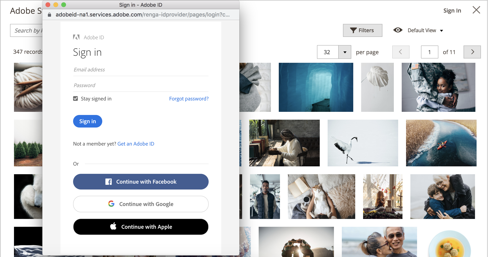

# Använda Adobe Stock-bilder

[Adobe Stock](https://stock.adobe.com) bilder kan användas i stället för att överföra ditt eget bildinnehåll. Ett vanligt användningssätt är att överföra och montera bildinnehåll när du skapar en sida.

The [[!DNL Media Gallery]](media-gallery.md) har en direkt integrering med Adobe Stock, vilket gör det enkelt att licensiera bilder direkt från gallerisidan.

## Åtkomst till Adobe Stock sökstödraster

Adobe Stock sökpanel är tillgänglig när du [lägga till eller redigera en sida](page-add.md)när du [skapa eller redigera en kategori](../catalog/category-create.md)eller när du [infoga bilder via Content Editor](editor-insert-image.md).

**_Så här söker du efter Adobe Stock-resurser och lägger till en stockbild på en sida:_**

1. På _Administratör_ sidebar, gå till **[!UICONTROL Content]** > _[!UICONTROL Elements]_>**[!UICONTROL Pages]**.

1. Klicka på **[!UICONTROL Add a New Page]**.

   Om du vill redigera en befintlig sida kan du använda _[!UICONTROL Action]_kolumn att klicka på&#x200B;**[!UICONTROL Select]**och välja **[!UICONTROL Edit]**.

1. Expandera  den **[!UICONTROL Content]** och gör följande:

   - Om du har [WYSIWYG-redigeraren är aktiverad](editor.md), klicka **[!UICONTROL Show/Hide Editor]** och sedan klicka **[!UICONTROL Insert Image]**.

   - Om du har [Page Builder aktiverat](../page-builder/setup.md), expandera **[!UICONTROL Media]** och dra en **[!UICONTROL Image]** platshållare till målbehållaren. Klicka sedan på **[!UICONTROL Select from Gallery]**.

     {width="600" zoomable="yes"}

1. Klicka på **[!UICONTROL Search Adobe Stock]**.

**_Så här söker du efter Adobe Stock-resurser och lägger till en stockbild i en kategori:_**

1. På _Administratör_ sidebar, gå till **[!UICONTROL Catalog]** > **[!UICONTROL Categories]**.

1. Klicka **[!UICONTROL Add Root Category]** eller **[!UICONTROL Add Subcategory]**.

   Om du vill lägga till bilden i en befintlig kategori klickar du på kategorinamnet i listan till vänster.

1. Expandera **[!UICONTROL Content]** och under _[!UICONTROL Category Image]_klicka **[!UICONTROL Select from Gallery]**.

1. Klicka på **[!UICONTROL Search Adobe Stock]**.

Så här söker du efter Adobe Stock-resurser och lägger till en stockbild från WYSIWYG-redigeraren:

1. klicka **[!UICONTROL Show/Hide Editor]**.

1. Klicka på **[!UICONTROL Insert Image]**.

1. Klicka på **[!UICONTROL Search Adobe Stock]**.

   {width="600" zoomable="yes"}

## Filtrera och söka efter Adobe Stock-resurser

The [Adobe Stock Search Grid](#access-the-adobe-stock-search-grid) har funktioner för frågor och filtrering som hjälper dig att hitta den perfekta bilden för [!DNL Commerce] butiker.

Som standard kommer sökresultaten från ett galleri med några hundra resultat från Adobe Stock. När du gör en egen nyckelordssökning söker du efter de miljontals mediefiler som är tillgängliga via Adobe Stock.

### Söka efter Adobe Stock-resurser med nyckelord

1. [Åtkomst till Adobe Stock Search-stödrastret](#access-the-adobe-stock-search-grid).

1. Ange din nyckelordssökning i **[!UICONTROL Search by keyword]** inmatningsfältet längst upp till vänster och klicka på förstoringsglaset eller tryck på **Retur**.

   {width="600" zoomable="yes"}

### Filtrera Adobe Stock-resurser

1. [Kör en nyckelordssökning för Adobe Stock-resurser](#search-for-adobe-stock-assets-by-keywords).

1. Klicka på **[!UICONTROL Filters]**.

   Det finns flera filter för att förfina sökresultaten:

   | Filter | Beskrivning |
   |---|---|
   | [!UICONTROL Subcategory] | Filter för bilder som **Foton** eller **Illustrationer** |
   | [!UICONTROL Orientation] | Filtrera bilder efter storlek, form och proportioner |
   | [!UICONTROL Color] | Använda en färgpalett för att filtrera bilder efter färg |
   | [!UICONTROL Price] | Filtrera efter bilder baserat på deras kostnad |
   | [!UICONTROL Safe search] | Aktivera eller inaktivera säker sökning |
   | [!UICONTROL Isolated Assets] | Begränsa visningen till endast _isolerade resurser_, som har objekt som visas var för sig mot en bakgrund |

   {style="table-layout:auto"}

   {width="600" zoomable="yes"}

1. Klicka på **[!UICONTROL Apply Filters]**.

   Sökresultatstödrastret uppdateras med den förfinade sökningen.

## Visa bildinformation

Varje bild har information som kan visas. Ytterligare bildspecifika åtgärder, som [spara förhandsvisningar av bilder](adobe-stock-save-preview.md) eller [spara (och eventuellt licensiera) bilder](adobe-stock-license-image.md)är tillgängliga via den här detaljerade vyn.

1. [Åtkomst till Adobe Stock sökstödraster](#access-the-adobe-stock-search-grid).

1. Klicka på en bild i sökresultatet.

   Ytterligare bildinformation visas, till exempel:

   - En större version av bilden
   - Bildmetadata, till exempel _[!UICONTROL Dimensions]_,_[!UICONTROL File type]_, _[!UICONTROL Category]_,_[!UICONTROL File]_ och _Nyckelord_
   - Relaterade bilder, till exempel bilder från samma _serie_ eller _modell_
   - Åtgärdsknappar, som [[!UICONTROL Save Preview]](adobe-stock-save-preview.md) och [[!UICONTROL Save (and optionally license) Image]](adobe-stock-license-image.md)

     {width="600" zoomable="yes"}

## Logga in på ditt Adobe-konto

Om du vill ha fullständig åtkomst till en bild och ta bort Adobe Stock-vattenstämpeln måste du [logga in med ett Adobe-konto](https://helpx.adobe.com/manage-account/using/access-adobe-id-account.html) och köpa krediter för att få rätt att använda en bild.

1. [Åtkomst till Adobe Stock Search-stödrastret](#access-the-adobe-stock-search-grid).

1. Klicka **[!UICONTROL Sign In]** överst till höger.

   Ett nytt webbläsarfönster guidar dig genom [Adobe inloggningsprocess](https://helpx.adobe.com/manage-account/using/access-adobe-id-account.html).

   När du har slutfört inloggningsprocessen visas det licensierade läget för bilder i sökresultaten som en etikett.

   {width="600" zoomable="yes"}

### Visa det licensierade läget för sökresultat

[Logga in på ditt Adobe-konto](#log-in-to-your-adobe-account).

Alla licensierade bilder som är kopplade till ditt Adobe-konto har en etikett som visar vilka bilder du har licensierat.

{width="600" zoomable="yes"}

### Spara bilder i medielagringen

Bilder som söks igenom med Adobe Stock-integreringen kan sparas i [!DNL Commerce] [medielagring](media-storage.md) för enkel återanvändning i hela [!DNL Commerce] butik.

Du kan spara två typer av bilder: och [förhandsgranskning av bild](adobe-stock-save-preview.md) eller en [licensierad bild](adobe-stock-license-image.md).

#### Spara en bildförhandsvisning

En förhandsvisning är en vattenstämplad version av en Adobe Stock-resurs. Förhandsgranskning av bilder är kostnadsfria och ett bra sätt att experimentera med olika bilder innan du bestämmer dig för att köpa en licens för specifika bilder och använda dem i produktionsbutikerna.

1. [Åtkomst till Adobe Stock sökstödraster](#access-the-adobe-stock-search-grid).

1. Till [visa bildinformation](#view-image-details)klickar du på en bild i sökstödrastret.

1. Klicka på **[!UICONTROL Save Preview]**.

   Den här åtgärden visar en uppmaning om att ange ett filnamn som används för att spara bilden i medielagringen. Ett standardfilnamn anges, men du kan anpassa namnet efter dina inställningar.

   {width="500" zoomable="yes"}

1. Klicka på **[!UICONTROL Confirm]**.

   Sidan dirigeras om till medielagringen och den sparade förhandsvisningen visas.

#### Spara en licensierad bild

Adobe Stock-material som du vill använda i produktionen [!DNL Commerce] butiker ska vara licensierade. Licensen säkerställer att du har laglig åtkomst till bilden och att du eliminerar den Adobe Stock-vattenstämpel som finns på alla [förhandsgranskning av bilder](adobe-stock-save-preview.md). Om du vill licensiera bilder eller spara redan licensierade bilder måste du vara inloggad på ditt Adobe-konto.

1. [Logga in på ditt Adobe-konto](#log-in-to-your-adobe-account).

1. Till [visa bildinformation](#view-image-details)klickar du på en bild i sökstödrastret.

1. Beroende på den aktuella licensstatusen för bilden gör du något av följande:

   - Om bilden redan är licensierad klickar du på **[!UICONTROL Save]**.

   - Om bilden är _not_ licensierad, klicka **[!UICONTROL License and Save]**.

     >[!NOTE]
     >
     >Du måste ha [Adobe Stock-krediter](https://helpx.adobe.com/stock/help/credit-packs.html) i ditt konto för att licensiera bilden.

   Den här åtgärden visar en uppmaning om att ange ett filnamn som används för att spara bilden i [medielagring](media-storage.md). Ett standardfilnamn anges, men du kan anpassa namnet efter dina inställningar.

1. Klicka på **[!UICONTROL Confirm]**.

   Sidan dirigeras om till medielagringen och den sparade förhandsvisningen visas.
