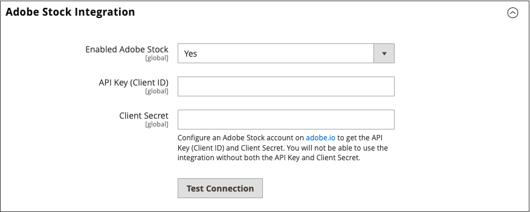

# Adobe Stock Integration

Integrera [Adobe Stock][adobe-stock] med [!UICONTROL Commerce] om du vill få tillgång till ett oändligt antal medieresurser som du kan använda i din butik.

{width="700" zoomable="yes"}

Adobe Stock ger företag tillgång till miljontals utvalda och royaltyfria foton, vektorer, illustrationer, videor, mallar och 3D-resurser av hög kvalitet för alla kreativa projekt. [!DNL Commerce] användare kan snabbt hitta, förhandsgranska och licensiera Adobe Stock-resurser. Användarna kan också spara dem i [medielagringsplatsen](./media-storage.md), utan att lämna arbetsytan Admin.

## Förutsättningar

Den här integreringen kräver:

- Ett [Adobe Developer][dev-console]-konto
- Adobe Commerce eller Magento Open Source, 2.3.4 eller senare

För licensiering av Adobe Stock-bilder krävs:

- Ett [Adobe-konto][adobe-signin]
- En betald [Adobe Stock][adobe-stock]-plan som är kopplad till kontot

## Integrera [!DNL Commerce] och Adobe Stock

Att konfigurera Adobe Stock-integrationen för Adobe Commerce är en tvåstegsprocess:

1. [Skapa en adobe.developer-integration](#create-an-adobe-developer-integration) för att generera en API-nyckel
1. [Konfigurera Adobe Stock-integreringen i Commerce Admin](#configure-the-adobe-stock-integration)

### Integrera Adobe Developer

1. Gå till [Adobe Developer Console][dev-console].

1. Klicka på **[!UICONTROL Create new project]** under _[!UICONTROL Quick Start]_.

1. Klicka på **[!UICONTROL Add API]** i blocket _[!UICONTROL Project overview]_.

1. Välj **[!UICONTROL Adobe Stock]** i integreringslistan och klicka på **[!UICONTROL Next]**.

1. Välj OAuth 2.0 **[!UICONTROL Web App]**.

1. Ange **[!UICONTROL redirect URI]**.

   Standardomdirigerings-URI:n har formatet `${HOST}/${ADMIN_URI}/adobe_ims/oauth/callback/`, till exempel `https://store.myshop.com/admin_hgkq1l/adobe_ims/oauth/callback/`, där:

   - `${HOST}` är ditt [!DNL Commerce] fullständiga kvalificerade domännamn (till exempel `https://store.myshop.com`).
   - `${ADMIN_URI}` är din [!DNL Commerce] Admin URI (till exempel `admin_hgkq1l`), som kan hämtas genom att köra `magento info:adminuri`.

1. Ange **[!UICONTROL Redirect URI pattern]**, som är samma som din omdirigerings-URI med två skillnader:

   - Alla punkter (`.`) måste föregås av två omvända snedstreck (`\\`).
   - Lägg till `.*` i slutet av mönstret.

   Om du använder exemplet från den tidigare omdirigerings-URI:n blir det `https://store\\.myshop\\.com/admin_hgkq1l/adobe_ims/oauth/callback/.*`.

1. Klicka på **[!UICONTROL Next]**.

1. Granska tillgängliga omfattningar och klicka på **[!UICONTROL Save configured API]**.

1. Kopiera **[!UICONTROL Client ID]** (API-nyckel) och **[!UICONTROL Client secret]** på den följande sidan.

   Den här informationen används i steg i nästa avsnitt.

### Konfigurera Adobe Stock-integrering

Om du vill ange systemkonfigurationen i din [!DNL Commerce]-administratör använder du _API-nyckeln_ och _klienthemligheten_ som genererats i [föregående avsnitt][create-integration].

1. Gå till **[!UICONTROL Stores]** > _[!UICONTROL Settings]_>**[!UICONTROL Configuration]**&#x200B;på sidofältet_ Admin _.

1. Expandera **[!UICONTROL Advanced]** i den vänstra panelen och välj **[!UICONTROL System]**.

1. Expandera  **[!UICONTROL Adobe Stock Integration]** och gör följande:

   - Ange **[!UICONTROL Enabled Adobe Stock]** till `Yes`.

   - Ange din **[!UICONTROL API Key (Client ID)]**.

   - Ange din **[!UICONTROL Client Secret]**.

   - Klicka på **[!UICONTROL Test Connection]** för att validera dina nycklar.

   {width="600" zoomable="yes"}

   Ge valideringen några sekunder. Om dina autentiseringsuppgifter är giltiga bör du se en grön _anslutning klar!_ meddelande.

1. Klicka på **[!UICONTROL Save Config]** när du är klar.

[adobe-stock]: https://stock.adobe.com
[adobe-signin]: https://helpx.adobe.com/se/manage-account/using/access-adobe-id-account.html
[dev-console]: https://developer.adobe.com/console/home
[create-integration]: #create-an-adobeio-integration
