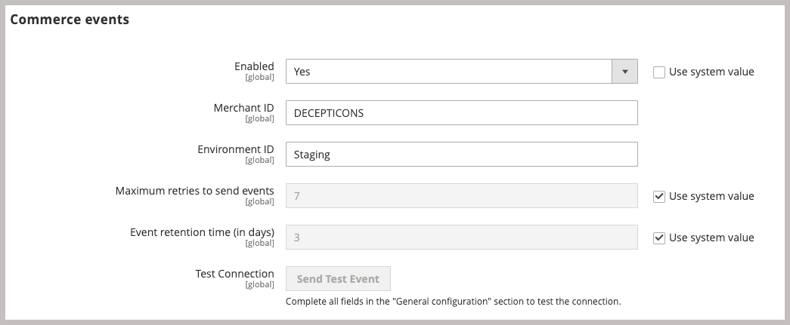

# Installera och konfigurera AEM Assets Integration för Commerce

{{$include /help/_includes/aem-assets-integration-beta-note.md}}

Installera och konfigurera AEM Assets-integrationen för Commerce genom att lägga till tillägget i Commerce-programmet, ansluta till Commerce SaaS-tjänster, e Adobe I/O Events-tjänsten och ansluta till Commerce SaaS.

## Systemkrav

**Programvarukrav**

- Adobe Commerce 2.4.5+
- PHP 8.1, 8.2, 8.3
- Disposition: 2.x

**Konfigurationskrav**

- Adobe Commerce måste vara konfigurerat att använda [Adobe IMS-autentisering](/help/getting-started/adobe-ims-config.md).
- Kontoetablering och behörigheter
   - [Commerce molnprojektadministratör](https://experienceleague.adobe.com/en/docs/commerce-cloud-service/user-guide/project/user-access) - Installera nödvändiga tillägg och konfigurera Commerce-programservern från Admin eller kommandoraden
   - [Commerce Admin](https://experienceleague.adobe.com/en/docs/commerce-admin/start/guide-overview) - Uppdatera butikskonfigurationen och hantera Commerce-användarkonton

## Konfigurationsöversikt

Aktivera integreringen genom att utföra följande uppgifter:

1. [Installera AEM Assets Integration-tillägget (`aem-assets-integration`)](#install-the-aem-assets-integration-extension).
1. [Konfigurera Commerce Service Connector](#configure-the-commerce-services-connector) för att ansluta din Adobe Commerce-instans och med de tjänster som gör att data kan överföras mellan Adobe Commerce och AEM Assets.
1. [Konfigurera Adobe I/O-händelser för Commerce](#configure-adobe-io-events-for-commerce)
1. [Hämta autentiseringsuppgifter för API-åtkomst](#get-authentication-credentials-for-api-access)

## Installera AEM Assets Integration-tillägget

>[!BEGINSHADEBOX]

**Förutsättning**

- Åtkomst till [repo.magento.com](https://repo.magento.com/admin/dashboard) för att installera tillägget. Om du vill ha nyckelgenerering och de nödvändiga rättigheterna kan du läsa [Hämta dina autentiseringsnycklar](https://experienceleague.adobe.com/en/docs/commerce-operations/installation-guide/prerequisites/authentication-keys). Information om molninstallationer finns i [Commerce on Cloud Infrastructure Guide](https://experienceleague.adobe.com/en/docs/commerce-cloud-service/user-guide/develop/authentication-keys)

- Åtkomst till kommandoraden på Adobe Commerce-programservern.

>[!ENDSHADEBOX]

Installera den senaste versionen av AEM Assets Integration-tillägget (`aem-assets-integration`) på en Adobe Commerce som kör Adobe Commerce 2.4.4 eller senare. AEM Asset Integration levereras som ett kompositmetapaket från databasen [repo.magento.com](https://repo.magento.com/admin/dashboard).

>[!BEGINTABS]

>[!TAB Molninfrastruktur]

Använd den här metoden om du vill installera tillägget [!DNL AEM Assets Integration] för en Commerce Cloud-instans.

1. På din lokala arbetsstation byter du till projektkatalogen för ditt Adobe Commerce i molninfrastrukturprojekt.

   >[!NOTE]
   >
   >Mer information om att hantera Commerce projektmiljöer lokalt finns i [Hantera grenar med CLI](https://experienceleague.adobe.com/en/docs/commerce-cloud-service/user-guide/develop/cli-branches) i _Adobe Commerce on Cloud Infrastructure User Guide_.

1. Kolla in miljögrenen för att uppdatera med Adobe Commerce Cloud CLI.

   ```shell
   magento-cloud environment:checkout <environment-id>
   ```

1. Lägg till tillägget AEM Assets Integration for Commerce.

   ```shell
   composer require "magento/aem-assets-integration" "<version-tbd>" --no-update
   ```

1. Uppdatera paketberoenden.

   ```shell
   composer update "magento/aem-assets-integration"
   ```

1. Genomför och push-kodsändringar för filerna `composer.json` och `composer.lock`.

1. Lägg till, implementera och skicka kodändringarna för `composer.json`- och `composer.lock`-filerna till molnmiljön.

   ```shell
   git add -A
   git commit -m "Install AEM Assets Integration extension for Adobe Commerce"
   git push origin <branch-name>
   ```

   När uppdateringarna skickas initieras [Commerce molndistributionsprocess](https://experienceleague.adobe.com/en/docs/commerce-cloud-service/user-guide/develop/deploy/process) för att ändringarna ska börja gälla. Kontrollera distributionsstatusen från [distributionsloggen](https://experienceleague.adobe.com/en/docs/commerce-cloud-service/user-guide/develop/test/log-locations#deploy-log).

>[!TAB Lokal]

Använd den här metoden för att installera tillägget [!DNL AEM Assets Integration] för en lokal instans.

1. Använd Composer för att lägga till tillägget AEM Assets Integration for Commerce i ditt projekt:

   ```shell
   composer require "magento/aem-assets-integration" --no-update
   ```

1. Uppdatera beroenden och installera tillägget:

   ```shell
   composer update  "magento/aem-assets-integration"
   ```

1. Uppgradera Adobe Commerce:

   ```shell
   bin/magento setup:upgrade
   ```

1. Rensa cachen:

   ```shell
   bin/magento cache:clean
   ```

   >[!TIP]
   >
   >I vissa fall, särskilt när du distribuerar till produktion, kanske du vill undvika att rensa kompilerad kod eftersom det kan ta en stund. Se till att du säkerhetskopierar systemet innan du gör några ändringar.

>[!ENDTABS]

## Konfigurera Commerce Services Connector

Commerce Services Connector möjliggör datasynkronisering och kommunikation mellan Commerce-instansen, tjänsten Resursregelmotor och andra stödtjänster.

>[!NOTE]
>
>Installationen av Commerce Services Connector är en engångsprocess som krävs för att använda [Adobe Commerce SaaS-tjänster](https://experienceleague.adobe.com/en/docs/commerce-merchant-services/user-guides/integration-services/saas#availableservices). Om du redan har konfigurerat anslutningen för en annan tjänst kan du visa den befintliga konfigurationen från Commerce Admin genom att välja **[!UICONTROL Systems]** > [!UICONTROL Services] > **[!UICONTROL Commerce Services Connector]**.

Om du vill överföra data mellan din Adobe Commerce-instans och de tjänster som aktiverar AEM Assets-integreringen konfigurerar du Commerce Services Connector med följande:

- Konfigurera din Commerce-instans med produktions- och sandbox-API-nycklar för autentisering.
- Ange ett dataområde (SaaS-identifierare) för säker molnlagring.
- Logga in på samma IMS-organisation som du använder för att få tillgång till AEM Assets för att upprätta anslutningen mellan din datauppsättning och Adobe Experience Platform.

Mer information finns i [Commerce Services Connector](https://experienceleague.adobe.com/en/docs/commerce-merchant-services/user-guides/integration-services/saas#organizationid).

När du konfigurerar Commerce Services Connector genererar systemet SaaS-projektet och databas-ID:n. Du behöver dessa ID:n under introduktionsprocessen.

{width="600" zoomable="yes"}

## Konfigurera Adobe I/O-händelser för Commerce

AEM Assets Integration använder tjänsten Adobe I/O Events för att skicka anpassade händelsedata mellan Commerce-instansen och Experience Cloud. Händelsedata används för att koordinera arbetsflöden för AEM Assets-integrering.

>[!BEGINSHADEBOX]

**Förutsättning**

- Se till att RabbitMQ är aktiverat och lyssnar efter händelser.
   - [RabbitMQ-installation för Adobe Commerce lokalt](https://experienceleague.adobe.com/en/docs/commerce-cloud-service/user-guide/configure/service/rabbitmq)
   - [RabbitMQ Setup for Adobe Commerce on cloud infrastructure](https://experienceleague.adobe.com/en/docs/commerce-cloud-service/user-guide/configure/service/rabbitmq)

>[!ENDSHADEBOX]

>[!NOTE]
>
>Mer information om Adobe I/O Events för Commerce finns i dokumentationen om [Adobe I/O Events för Commerce](https://developer.adobe.com/commerce/extensibility/events/) på Adobe Developer webbplats.

För konfiguration krävs följande steg.

1. Aktivera Commerce Eventing-ramverket genom att konfigurera Adobe I/O-händelser på programservern och i Admin.
1. Aktivera datasynkronisering mellan Adobe Commerce och AEM Assets genom att använda API:t för tjänsten Assets Rules Engine för att konfigurera anslutningen.
1. Aktivera integreringen av AEM Assets i Admin.

### Aktivera Commerce Eventing-ramverket

Aktivera Commerce utvecklingsmiljö genom att använda instruktionerna för den miljö där ditt Commerce-projekt ska distribueras.

>[!BEGINTABS]

>[!TAB Molninfrastruktur]

1. Aktivera tjänsten Adobe I/O Events på menyn [!DNL Store Settings Configuration].

   1. Gå till **[!UICONTROL Stores]** > [!UICONTROL Settings] > **[!UICONTROL Configuration]** > **[!UICONTROL Adobe Services]** > **Adobe I/O-händelser** i Admin.

   1. Expandera **[!UICONTROL Commerce events]**.

   1. Ange **[!UICONTROL Enabled]** till `Yes`.

      {width="600" zoomable="yes"}

      >[!NOTE]
      >
      >[Aktivera cron](https://developer.adobe.com/commerce/extensibility/events/configure-commerce/#check-cron-and-message-queue-configuration) så att Commerce kan skicka händelser till API-slutpunkterna för att hantera kommunikation och arbetsflöden för integreringen.

1. Uppdatera molnprojektkonfigurationen.

   1. Lägg till filen `app/etc/config.php` i din arbetsdatabas:

   ```shell
   git add app/etc/config.php
   ```

   1. Kör kommandot `composer info magento/ece-tools` för att avgöra vilken version av verktygen du använder. Om versionen är mindre än `2002.1.13` [uppdaterar du till den senaste versionen](https://experienceleague.adobe.com/en/docs/commerce-cloud-service/user-guide/dev-tools/ece-tools/update-package).

   1. Aktivera händelse i filen `.magento.env.yaml`:

      ```yaml
      stage:
         global:
            ENABLE_EVENTING: true
      ```

   1. Implementera och skicka uppdaterade filer till molnmiljön.

>[!TAB Lokal]

1. Aktivera tjänsten Adobe I/O Events på menyn [!DNL Store Settings Configuration].

   1. Gå till **[!UICONTROL Stores]** > [!UICONTROL Settings] > **[!UICONTROL Configuration]** > **[!UICONTROL Adobe Services]** > **Adobe I/O-händelser** i Admin.

   1. Expandera **[!UICONTROL Commerce events]**.

   1. Ange **[!UICONTROL Enabled]** till `Yes`.

      {width="600" zoomable="yes"}

      >[!NOTE]
      >
      >[Aktivera cron-jobb](https://developer.adobe.com/commerce/extensibility/events/configure-commerce/#check-cron-and-message-queue-configuration) så att Commerce kan skicka händelser för att hantera kommunikation och arbetsflöden mellan AEM och Commerce.

>[!ENDTABS]

## Hämta autentiseringsuppgifter för API-åtkomst

AEM Assets Integration för Commerce kräver OAuth-autentiseringsuppgifter för att tillåta API-åtkomst till Commerce-instansen. Du behöver dessa autentiseringsuppgifter för att registrera Commerce-projektet med tjänsten Assets Rule Engine vid registrering av innehavare och för att skicka in API-begäranden om hantering av resurser mellan Adobe Commerce och AEM Assets.

Du genererar autentiseringsuppgifterna genom att lägga till integreringen i Commerce-instansen och aktivera den.

### Lägg till integreringen i Commerce-miljön

1. Gå till **System** > Tillägg > **Integrationer** i Admin och klicka sedan på **Lägg till ny integrering**.

1. Ange information om integreringen.

   I avsnittet **Allmänt** anger du bara integreringen **Namn** och **E-post**. Använd e-postmeddelandet för ett Adobe IMS-konto med tillgång till den organisation där Commerce och Experience Manager Assets är driftsatta.

   {width="600" zoomable="yes"}

1. Bekräfta din identitet genom att klicka på **Bekräfta identitet**.

   Systemet verifierar din identitet genom att autentisera Experience Cloud med ditt Adobe ID.

1. Konfigurera API-resurser.

   1. Klicka på **[!UICONTROL API]** i den vänstra panelen.
E
   1. Välj den externa mediaresursen **[!UICONTROL Catalog > Inventory > Products > External Media]**.

   {width="600" zoomable="yes"}

1. Klicka på **[!UICONTROL Save]**.

### Generera autentiseringsuppgifter

Generera autentiseringsuppgifterna för OAuth på integreringssidan genom att klicka på **Aktivera** för Assets-integreringen. Du behöver dessa autentiseringsuppgifter för att registrera Commerce-projektet med tjänsten Assets Rule Engine och för att skicka API-begäranden för att hantera resurser mellan Adobe Commerce och AEM Assets.

1. Generera autentiseringsuppgifterna från sidan Integreringar genom att klicka på **[!UICONTROL Activate]**.

   {width="600" zoomable="yes"}

1. Spara inloggningsuppgifterna för konsumentnyckeln och åtkomsttoken för senare bruk.

{width="600" zoomable="yes"}

1. Klicka på **[!UICONTROL Done]**.

>[!NOTE]
>
>Du kan också generera autentiseringsuppgifter med Adobe Commerce API:er. Mer information om den här processen och OAuth-baserad autentisering för Adobe Commerce finns i [OAuth-baserad autentisering](https://developer.adobe.com/commerce/webapi/get-started/authentication/gs-authentication-oauth/) i Adobe Developer-dokumentationen.
