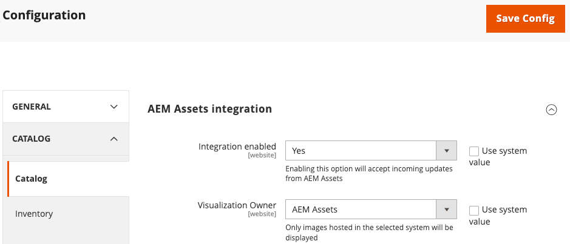

# Konfigurera synkroniseringstjänsten

Tjänsten Asset Rules Engine (ARES) är en tjänst för flera innehavare som integrerar AEM Assets med Adobe Commerce. Den här tjänsten synkroniserar resurser mellan Adobe Commerce och Experience Manager. ARES-tjänsten matchar automatiskt resurser i AEM med produkter i Adobe Commerce baserat på SKU eller andra nyckelattribut. Det ser också till att de senaste produktresurserna och variationerna alltid finns tillgängliga på e-handelsplatsen.

Om du vill konfigurera tjänsten måste du registrera ditt klient-ID med ARES GraphQL API och välja matchningsregel för att synkronisera resurser.

## Välj en matchande strategi

AEM Assets Integration för Commerce har stöd för två matchande strategier för att synkronisera resurser mellan Adobe Commerce och AEM Assets.

- **MatchBySku**-Det här är standardmatchningsregeln som matchar resurser baserat på lagerinställningarna (SKU) för produkten. SKU:n är en unik identifierare för varje produkt. Den här regeln matchar SKU:n i resursmetadata med Commerce-produktens SKU för att säkerställa att resurserna är kopplade till rätt produkter.

- **ExternalMatcher**-Den här matchningsregeln gäller för mer komplexa scenarier eller specifika affärskrav som kräver anpassad matchningslogik. Om du vill använda den här regeln måste du ha implementerad anpassad kod i Adobe Developer App Builder som definierar hur resurser matchas med produkter.

Använd strategin `MatchBySku` för inledande introduktion. Om det behövs kan du ändra matchningsstrategin senare.

## Registrera en klient

>[!BEGINSHADEBOX]

**Förutsättning**

- [AEM Assets-projektet har konfigurerats med Commerce-metadata som krävs för att mappa resurser](aem-assets-configure-aem.md).

- [Installera och konfigurera Experience Manager Assets-integreringen i Adobe Commerce](aem-assets-configure-commerce.md).

>[!ENDSHADEBOX]

## Samla in inloggningsuppgifter

Du behöver följande autentiseringsuppgifter för att autentisera och ansluta din projektmiljö från Commerce och AEM Assets till Commerce SaaS-tjänster.

| Obligatoriska data | Source | Var hittar du den? |
| ---------- | ------ | ------------- |
| API-nyckel från Magento-konto | Commerce | Ange den offentliga API-nyckeln för den Commerce-miljö som du använder, mellanlagring eller produktion. API-nycklarna för produktions- och mellanlagringsmiljöerna finns på sidan [Commerce Service Connector Setup](aem-assets-configure-commerce.md#configure-the-commerce-services-connector) i Admin, eller på sidan [!UICONTROL My Account] i avsnittet [!UICONTROL API Portal]. |
| Commerce SaaS Project Identifier <ul><li>`magento-environment-Id`</li><li>`Project ID`</li></ul> | Commerce Admin | Dessa värden identifierar Commerce-miljön och SaaS-datamallen och -projektet som ska anslutas till. Värdena kommer från [SaaS-identifierarkonfigurationen för Commerce Services Connector].(aem-assets-configure-commerce.md#configure-the-commerce-services-connector). |
| AEM `programId`<br>`environmentId` | [AEM Assets redigeringsmiljö](https://experienceleague.adobe.com/en/docs/experience-manager-cloud-service/content/sites/authoring/quick-start) | Öppna AEM Sites-sidan och välj **[!UICONTROL Assets]**.  Kopiera projekt- och miljö-ID från URL:en: `https://author-p[Program ID]-e[EnvironmentID].adobeaemcloud.com/` |
| baseURL | Commerce storefront | [bas-URL](../stores-purchase/store-urls.md) för din Commerce-butik. |
| OAuth-autentiseringsuppgifter för API-åtkomst | Commerce Admin | Du hittar dessa autentiseringsuppgifter i konfigurationsinställningarna för Commerce [för Assets-integreringen](aem-assets-configure-commerce.md#experience-manager-assets-integration-for-adobe-commerce-10-release). |

## Registrera klient

Fullfölj innehavarregistreringen genom att skicka en begäran till Assets Rule Engine-tjänsten om att lägga till autentiseringsuppgifter och klient-ID:n. Begäran innehåller referenser och projektidentifierare som krävs för att upprätta anslutningar mellan tjänsten, Commerce-projektet och Experience Manager Assets-projektet.

Skicka begäran med en GraphQL-klient eller cURL.

>[!BEGINTABS]

>[!TAB GraphQL Request]

Använd en GraphQL-klient för att skicka en POST till API-slutpunkten `https://commerce.adobe.io/assets-integration/graphql`

**Obligatoriska rubriker**

Ange följande HTTP-rubriker för begäran:

- `x-api-key`: API-nyckel från ditt Magento-konto
- `magento-environment-Id`: SaaS-identifierare
- `x-gw-signature`: JWT-token associerad med MAGEID

**Begäran:**

**Syntax**

```graphql
mutation registerTenant($tenantInput: TenantInput!) {
   registerTenant(tenantInput: $tenantInput) {
      tenantId
      userErrors {
         message
         path
      }
    }
}
```

**Exempelanvändning**

Registrera en klientorganisation och välj regeln `matchBySku` för att mappa resurser mellan Adobe Commerce och AEM Assets-projektet.

**Begäran:**

```graphql
   {
      "tenantInput": {
         "enabled": true,
         "projectId": "8231afb6-90cd-65e8-84ba-d9abac0f94e6",
         "aem": {
               "programId": "11111",
               "environmentId": "222222"
         },
         "commerce": {
               "baseUrl": "***",
               "credentials": {
                  "consumerKey": "***",
                  "consumerSecret": "***",
                  "accessToken": "***",
                  "accessTokenSecret": "***"
               }
         },
         "rule": {
            "type": "matchBySKU"
            "matchBySkuRule": {
               "metadataField": "commerce:skus"
            }
         }
      }
   }
```

**Svar**

```graphql
{
    "data": {
        "registerTenant": {
            "tenantId": "b65d5da7-2756-46a1-9ff1-14fb5d925fee",
            "userErrors": []
        }
    }
}
```

>[!TAB cURL-begäran]

```shell
curl --request POST \
  --url https://commerce.adobe.io/assets-integration/graphql \
  --header 'Content-Type: application/json' \
  --header 'Magento-Environment-Id: ****' \
  --header 'x-api-key: ****' \
  --header 'x-gw-signature: *****' \
  --data '{"query":"mutation registerTenant($tenantInput: TenantInput!) {\n\tregisterTenant(tenantInput: $tenantInput) {\n\t\ttenantId\n\t\tuserErrors {\n\t\t\tmessage\n\t\t\tpath\n\t\t}\n\t}\n}\n","operationName":"registerTenant","variables":{"tenantInput":{"enabled":true,"threshold":100,"projectId":"5d6faa03-e200-4623-9008-da144e4eefd8","aem":{"programId":"***","environmentId":"***"},"commerce":{"version":"2.4.6-p2","extensionVersion":"0.0.1","baseUrl":"***","credentials":{"consumerKey":"***","consumerSecret":"***","accessToken":"***","accessTokenSecret":"***"}},"rule":{"type":"matchBySKU","matchBySkuRule":{"metadataField":"commerce:skus"}}}}}'
```

>[!ENDTABS]

### Indatafält

#### AemInput

Identifierar AEM Assets-instansen för lagring av Commerce-resurser. Du kan hämta den här informationen från Cloud Manager My Programs-vyn eller från innehållsredigeringens URL.

| Fält | Datatyp | Beskrivning |
| ----- | --------- | ----------- |
| `programId` | Sträng! | Unik identifierare för ditt projekt inom AEM Cloud Service |
| `environmentId` | Sträng! | ID för den projektmiljö som du använder, till exempel produktion, mellanlagring eller utveckling |

#### CommerceInput

Det här inmatningsfältet innehåller OAuth-autentiseringsuppgifter för API-åtkomst till Commerce-katalogen. Du hittar dessa autentiseringsuppgifter i konfigurationsinställningarna för Commerce [för Assets-integreringen](aem-assets-configure-commerce.md#experience-manager-assets-integration-for-adobe-commerce-10-release).

| Fält | Datatyp | Beskrivning |
| ----- | --------- | ----------- |
| `baseUrl` | Sträng | [bas-URL](../stores-purchase/store-urls.md) för din Commerce-butik. |
| `credentials` | [CommerceCredentialsInput](#commercecredentialsinput)! | Anger autentiseringsuppgifter för åtkomst till Commerce-instansen. |
| `extensionVersion` | Sträng | Valfritt. Den version av AEM Assets Integration för tillägget Commerce som är installerad på Commerce-instansen. |
| `version` | Sträng | Valfritt. Den version av Commerce som är installerad på Commerce-instansen. |

#### CommerceCredentialsInput

Det här inmatningsfältet innehåller OAuth-autentiseringsuppgifter för API-åtkomst till Commerce-katalogen. Du hittar dessa autentiseringsuppgifter i konfigurationsinställningarna för Commerce [för Assets-integreringen](aem-assets-configure-commerce.md#experience-manager-assets-integration-for-adobe-commerce-10-release).

| Fält | Datatyp | Beskrivning |
| ----- | --------- | ----------- |
| `accessToken` | Sträng! | Åtkomsttoken som genererats för Assets-integreringen. |
| `accessTokenSecret` | Sträng! | Åtkomsttokenhemligheten som genererats för Assets-integreringen. |
| `consumerKey` | Sträng! | Konsumentnyckeln som genererats för Assets-integreringen. |
| `consumerSecret` | Sträng! | Den hemlighet som genererats för Assets-integreringen. |

#### ExternalMatcherInput

| Fält | Datatyp | Beskrivning |
| ----- | --------- | ----------- |
| assetToProductUrl | Sträng! | <!--Add field description--> |
| productToAssetUrl | Sträng! | <!--Add field description--> |
| autentiseringsuppgifter | [ExternalMatcherCredentialsInput](#externalmatchercredentials)! | Autentiseringsuppgifter för åtkomst till App Builder-projektet för AEM Assets-integrering för Commerce. |

#### ExternalMatcherCredentials

| Fält | Datatyp | Beskrivning |
| ----- | --------- | ----------- |
| `oauthServerUrl` | Sträng! |    |
| `clientId` | Sträng! |      |
| `clientSecret` | Sträng! |    |
| `imsOrgId` | Sträng! | IMS-organisationen där AEM Assets och Adobe Commerce etableras. |

#### MatchaEfterSkuRuleInput

| Fält | Datatyp | Beskrivning |
| ----- | --------- | ----------- |
| metadataField | Sträng! | Ange det metadatafält för resurser som ska användas för matchning. Använd `commerce:skus` |

#### RuleInput

Anger den matchningsregel som ska användas för att synkronisera resurser mellan Adobe Commerce och AEM Assets.

| Fält | Datatyp | Beskrivning |
| ----- | --------- | ----------- |
| externalMatcher | [ExternalMatcherInput](#externalmatcherinput) | Väljer regeln externalMatcher för tillgångsmatchning och anger de data som krävs för att använda den. |
| MatchaEfterSkuRule | [MatchBySkuRuleInput](#matchbyskuruleinput) | Väljer MatchBySkuRule för tillgångsmatchning och anger de data som krävs för att använda den. |

#### RuleTypeInput

| Fält | Datatyp | Beskrivning |
| ----- | --------- | ----------- |
| RuleType | enum | Anger en lista över matchningsregler för tillgångar som är tillgängliga för AEM Assets Integration för Commerce. Tillgängliga värden är `matchBySKU` eller `externalMatcher`. |

#### TenantInput

| Fält | Datatyp | Beskrivning |
| ----- | --------- | ----------- |
| `aem` | [AemInput!](#aeminput) | Identifierar AEM Assets-instansen i AEM Cloud Service där du lagrar Commerce-resurserna. |
| `commerce` | [CommerceInput!](#commerceinput) | Tillhandahåller projektinformation och autentiseringsuppgifter för Commerce för API-åtkomst |
| `enabled` | Boolean! | Aktivera eller inaktivera resurssynkronisering mellan Adobe Commerce och AEM Assets. |
| `projectId` | Sträng! | SaaS-projekt-ID:t från [SaaS-identifierarkonfigurationen för Commerce Services Connector](aem-assets-configure-commerce.md#configure-the-commerce-services-connector). |
| `rule` | [RuleInput!](#ruleinput) | Anger den matchningsregel som ska användas för att synkronisera resurser mellan Adobe Commerce och AEM Assets. Ange antingen `[matchBySkuRule](#matchbyskuruleinput)` eller `[externalMatcher](#externalmatcherinput)`. |

### Utdatafält

| Fält | Datatyp | Beskrivning |
| ----- | --------- | ----------- |
| data | [registerTenant] | Returnerar innehavarregistreringsinformationen och eventuella felmeddelanden från servern. |

#### RegisterTenantResponse

| Fält | Datatyp | Beskrivning |
| ----- | --------- | ----------- |
| tenantId | Sträng! | Returnerar det klient-ID som registrerats. Detta ID ser till att data för AEM Assets Integration för Commerce lagras och hämtas från det SaaS-datautrymme som är kopplat till Commerce-miljön. |
| userErrors | [[userError!]!](#usererror) | Returnerar eventuella felmeddelanden som genererats av begäran. |

#### UserError

| Fel | Beskrivning |
|:------|:------------|
| `IMS Org ID not associated to this Commerce` | Det här felet inträffar om det miljö-ID som anges i huvudet `Magento-Environment-Id` inte har tilldelats IMS-kontot. Det här felet kan inträffa eftersom IMS-kontot inte var anslutet när [Commerce Services Connector](aem-assets-configure-commerce.md#configure-the-commerce-services-connector) konfigurerades för Commerce-instansen. |
| `Client ID is invalid` | Rubriken `x-api-key` är felaktig. |
| `Client ID is missing` | Rubriken `x-api-key` har inte angetts. |
| `JWT is required` | Rubriken `x-gw-signature` har inte angetts. |
| `JWT is invalid` | Rubriken `x-gw-signature` har inte angetts. |
| `Tenant already exists` | En klientorganisation med angiven `mageID` (tagen från JWT-token) och `saasId` (tillhandahålls av rubriken `Magento-Environment-Id`) har redan registrerats. |
| `Unexpected error when connecting with AEM Assets` | Det här felet inträffar på grund av ogiltiga eller obefintliga `programId`- eller `environmentId`-värden. |
| `Unable to connect with AEM Assets` | Det finns två möjliga orsaker till felet:<br>1. Det AEM tillgångskontot är associerat med ett annat IMS-organisations-ID än det som anges för Adobe Commerce.<br>2. Metadata för `commerce:isCommerce` finns inte i AEM Assets, vilket anger att det inte finns några godkända resurser att skicka från AEM Assets till Commerce-instansen. |
| `Unexpected error when connecting with Commerce` | Det här felet inträffar när den ogiltiga e-handeln `baseURL` anges. |
| `Unable to connect with Commerce, unauthorized` | Ogiltiga inloggningsuppgifter angavs, vilket resulterade i obehörig åtkomst. |
| `Invalid rule. The value must be matchBySKU or externalMatcher` | Fältet `Rule` innehåller ett felaktigt värde. För RegisterTenant-begäran definieras tillgängliga regeltyper av uppräkningen [RuleTypeInput](#ruletypeinput). |

## Aktivera Experience Manager Assets-integrering

När du har registrerat innehavaren är det sista steget i introduktionsprocessen att aktivera tillägget Experience Manager Assets Integration for Commerce i Admin.

1. Aktivera tillägget.

   1. Gå till **Lagrar** > Inställningar > **Konfiguration** > **Katalog**.

   1. Öppna katalogkonfigurationen genom att välja **[!UICONTROL Catalog]**.

   1. Expandera **[!UICONTROL AEM Assets integration]**.

   1. Ange **[!UICONTROL Integration enabled]** till `yes`.

      {width="600" zoomable="yes"}
