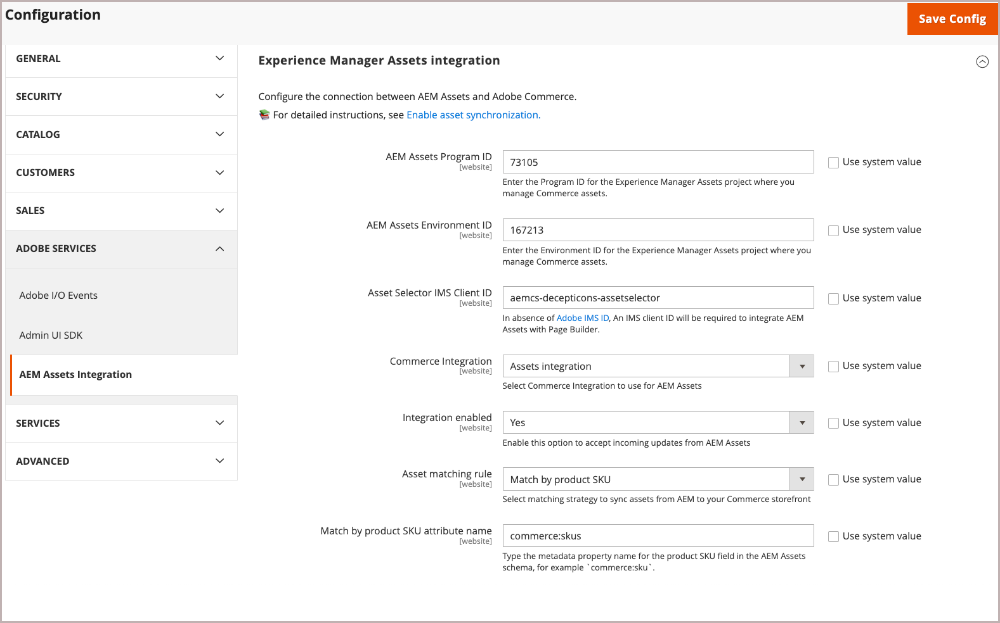

# Konfigurera integreringen

Konfigurera integreringen genom att ansluta Commerce till AEM Assets-instansen och välja matchningsstrategi för resurssynkronisering.

När du har identifierat AEM Assets-projektet väljer du matchningsregel för att synkronisera resurser mellan Adobe Commerce och AEM Assets.

- **[!UICONTROL Match by product SKU]** - Standardregel som matchar SKU:n i resursmetadata med [Commerce-produktens SKU](https://experienceleague.adobe.com/en/docs/commerce-operations/implementation-playbook/glossary#sku) för att se till att resurserna är kopplade till rätt produkter.

- **[!UICONTROL Custom match]** - Matchningsregel för mer komplexa scenarier eller specifika affärskrav som kräver anpassad matchningslogik. Implementering av anpassad matchning kräver utveckling av anpassad kod i Adobe Developer App Builder för att definiera hur resurser matchas med produkter. Mer information kommer snart...

Använd standardregeln *Matcha efter produktsku* för den första konfigurationen.

## Förutsättningar

- [Installera AEM Assets-paket](aem-assets-configure-aem.md)

- [Installera Adobe Commerce-paket](aem-assets-configure-commerce.md) om du vill lägga till tillägget och generera de autentiseringsuppgifter och anslutningar som krävs för att använda tillägget.

- Skapa en supportanmälan för att begära aktivering av AEM Assets för Commerce Integration. Inkludera **[!UICONTROL Program ID]**, **[!UICONTROL Environment ID]** och **[!UICONTROL IMS Org ID]** för den AEM Assets-redigeringsmiljö som du vill ansluta till Commerce i biljetten.

- Ange **[!UICONTROL Asset Selector IMS Client ID]**. Se [ImsAuthProps](https://experienceleague.adobe.com/en/docs/experience-manager-cloud-service/content/assets/manage/asset-selector/asset-selector-integration/integrate-asset-selector-adobe-app) i dokumentationen för *AEM Assets Selector* .

## Konfigurera anslutningen

1. Hämta projekt- och miljö-ID:t för [AEM Assets Authoring Environment](https://experienceleague.adobe.com/en/docs/experience-manager-cloud-service/content/sites/authoring/quick-start).

   1. Öppna AEM Sites-konsolen och välj **[!UICONTROL Assets]**.

   1. Kopiera och spara projekt- och miljö-ID:n från URL:en: `https://author-p[Program ID]-e[EnvironmentID].adobeaemcloud.com/`
1. Öppna AEM Assets Integration-konfigurationen i Commerce Admin.

   1. Gå till **[!UICONTROL Store]** > Konfiguration > **[!UICONTROL ADOBE SERVICES]** > **[!UICONTROL AEM Assets Integration]**.

      {width="600" zoomable="yes"}

1. Ange AEM Assets-miljön **[!UICONTROL Program ID]** och **[!UICONTROL Environment ID]**.

   Redigera konfigurationsvärdena genom att ta bort markeringen från *[!UICONTROL Use system value]*.

1. Ange **[!UICONTROL Asset Selector IMS Client ID]**.

   [Klient-ID:t för IMS-klient ](https://experienceleague.adobe.com/en/docs/experience-manager-cloud-service/content/assets/manage/asset-selector/asset-selector-integration/integrate-asset-selector-adobe-app#ims-auth-props) för resursväljaren krävs av [!UICONTROL Assets Selector], en AEM Assets-funktion som gör att användare kan bädda in visuella resurser direkt på Commerce produktsidor.

1. Välj [[!UICONTROL Commerce integration]](aem-assets-configure-commerce.md#add-the-integration-to-the-commerce-environment) för autentisering av begäranden mellan Commerce och tjänsten för tillgångsmatchning.

1. Ange **[!UICONTROL Integration enabled]** till `Yes` om du vill tillåta att Commerce accepterar inkommande uppdateringar från AEM Assets.

   När integreringen har aktiverats finns det ytterligare konfigurationsalternativ som du kan använda för att ange matchningsvillkor för resurser.

1. Definiera matchningsregeln för resurssynkronisering.

   1. Välj **[!UICONTROL Match by product SKU]** eller **[!UICONTROL Custom match (Requires App Builder)]**.

   1. Lägg till [AEM Assets-metadatafältnamnet ](aem-assets-configure-aem.md#configure-metadata) som definierats för Commerce produkt-SKU:er i fältet **[!UICONTROL Match by product SKU attribute name]**, till exempel `commerce:skus`.

1. Välj **[!UICONTROL Save Config]** om du vill använda uppdateringar och initiera resurssynkronisering.

   Konfigurationsuppdateringen utlöser den inledande synkroniseringsprocessen så att Commerce kan acceptera inkommande uppdateringar från AEM Assets. Den tid som krävs för synkronisering beror på mängden resurser och specifika konfigurationer. Integreringen utnyttjar automatiserade processer för att minimera den tid som krävs för synkronisering.

### Konfigurera URL för anpassad domän

Om en handlare anger ett [anpassat domännamn](https://experienceleague.adobe.com/en/docs/experience-manager-cloud-service/content/implementing/using-cloud-manager/custom-domain-names/add-custom-domain-name){target=_blank} på sin AEM-kontrollpanel måste du lägga till den här **anpassade domän-URL:en** i Commerce, så att AEM Assets-integreringen kan använda den.

1. Navigera till **[!UICONTROL Store]** > Konfiguration > **[!UICONTROL ADOBE SERVICES]** > **[!UICONTROL AEM Assets Integration]**.

   {width="600" zoomable="yes"}

1. Lägg till **URL:en för den anpassade domänen** i fältet **[!UICONTROL Asset Custom Domain]**.

1. Klicka på **[!UICONTROL Save Config]** för att tillämpa uppdateringar och initiera resurssynkronisering.

## Nästa steg

[Använd AEM Assets med Commerce](aem-assets-manage.md)
