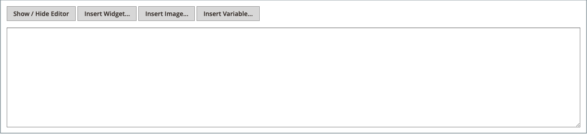

# Lägga till innehållsblock

Du kan skapa egna block med innehåll och sedan lägga till dem på en sida, i en grupp med sidor eller till och med i ett annat block. Du kan till exempel placera ett bildreglage i ett block och sedan placera blocket på startsidan. Arbetsytan Blockar använder samma [grundläggande kontroller](pages-workspace.md) som arbetsytan _Sidor_ för att du ska kunna hitta tillgängliga block och utföra rutinunderhåll. När blocket är klart kan du använda verktyget [Widget](widget-static-block.md) för att placera det på specifika sidor i din butik.

{width="700" zoomable="yes"}

## Skapa ett block

1. Gå till **[!UICONTROL Content]** > _[!UICONTROL Elements]_>**[!UICONTROL Blocks]**&#x200B;på sidofältet_ Admin _.

1. Klicka på **Lägg till nytt block** i det övre högra hörnet.

   {width="500" zoomable="yes"}

1. Om du vill ändra standardaktiverad status för det nya blocket anger du **Aktivera block** till `No`.

1. Tilldela en **blocktitel** för intern referens.

1. Tilldela en unik **identifierare** för blocket.

   Använd alla gemener med understreck i stället för mellanslag.

1. Markera varje **[!UICONTROL Store View]** där du vill att blocket ska vara tillgängligt.

1. Lägg till innehållet för blocket med verktygsuppsättningen för det visade innehållet:

   - Om [Page Builder](../page-builder/introduction.md) är aktiverat väljer du **[!UICONTROL Edit with Page Builder]** om du vill använda Page Builder-verktygen i innehållets [arbetsyta](../page-builder/workspace.md).

     {width="500" zoomable="yes"}

     >[!NOTE]
     >
     >Mer information om hur du lägger till block med Page Builder finns i [Självstudiekurs 2: Block](../page-builder/2-blocks.md).

   - Använd [redigeraren](editor.md) för att formatera text, skapa länkar och lägga till tabeller, bilder, video och ljud.

     Om du föredrar att arbeta med HTML-kod klickar du på **Visa/dölj redigerare**.

     {width="500" zoomable="yes"}

1. Klicka på pilen **[!UICONTROL Save]** när du är klar och välj **[!UICONTROL Save & Close]**.

   Det nya blocket visas längst ned i listan i rutnätet.

1. Använd verktyget [Widget](widget-static-block.md) för att placera det färdiga blocket på en viss sida i din butik.

## Ta bort ett block

Det finns två sätt att ta bort ett anpassat block. Du kan ta bort den från stödrastret _Block_ eller från sidan Redigera block.

### Metod 1: Ta bort ett block från rutnätet

1. Gå till **[!UICONTROL Content]** > _[!UICONTROL Elements]_>**[!UICONTROL Blocks]**&#x200B;på sidofältet_ Admin _.
1. Leta upp blocken med hjälp av filter ovanför stödrastret och markera kryssrutan för ett eller flera block som ska tas bort.
1. I listans övre vänstra hörn anger du **[!UICONTROL Actions]** till `Delete`.
1. Bekräfta åtgärden genom att klicka på **[!UICONTROL OK]**.

### Metod 2: Ta bort ett block från redigeringssidan

1. Gå till **[!UICONTROL Content]** > _[!UICONTROL Elements]_>**[!UICONTROL Blocks]**&#x200B;på sidofältet_ Admin _.
1. Sök efter det block som ska tas bort.
1. Klicka på **[!UICONTROL Select]** i kolumnen _Åtgärder_ för blocket och välj **[!UICONTROL Edit]**.
1. Klicka på **[!UICONTROL Delete Block]** på menyraden.
1. Bekräfta åtgärden genom att klicka på **[!UICONTROL OK]**.

## Spara-menyn

| Kommando | Beskrivning |
|----------|----------- |
| [!UICONTROL Save] | Spara det aktuella blocket och fortsätt arbeta. |
| [!UICONTROL Save & Duplicate] | Spara och stäng det aktuella blocket och öppna en ny kopia. |
| [!UICONTROL Save & Close] | Spara och stäng det aktuella blocket och återgå till rutnätet för block. |

{style="table-layout:auto"}

## Lägga till en ljuslåda eller ett reglage

- Det är enkelt att lägga till ett [reglage](../page-builder/slider.md) i din butik med [[!DNL Page Builder]](../page-builder/introduction.md). Skjutreglaget kan ställas in så att det spelas upp automatiskt, eller styras manuellt med navigeringsknappar.

  {width="600" zoomable="yes"}

  Det finns också ett brett sortiment av jQuery-baserade ljusbord på [[!DNL Commerce Marketplace]][1], och vissa är kostnadsfria.

- Du kan också hämta ett tillägg från [!DNL Commerce Marketplace]. Mer hjälp finns i dokumentationen från tilläggsutvecklaren.

[1]: https://marketplace.magento.com/extensions.html?q=lightbox
