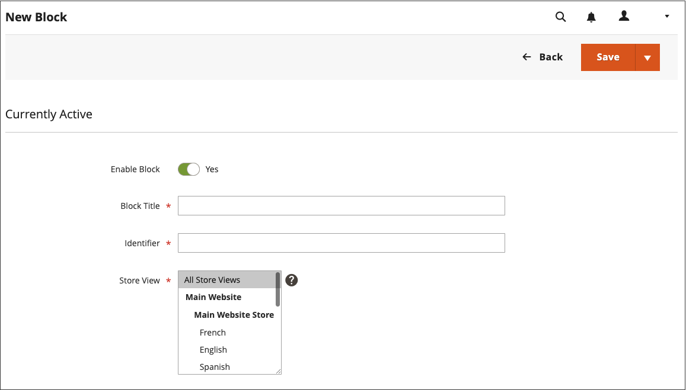

# Lägga till innehållsblock

Du kan skapa egna block med innehåll och sedan lägga till dem på en sida, i en grupp med sidor eller till och med i ett annat block. Du kan till exempel placera ett bildreglage i ett block och sedan placera blocket på startsidan. Arbetsytan Blockar använder samma [grundläggande kontroller](pages-workspace.md) som _Sidor_ arbetsyta som hjälper dig att hitta tillgängliga block och utföra rutinunderhåll. När blocket är klart kan du använda [Widget](widget-static-block.md) verktyg för att placera den på specifika sidor i din butik.

{width="700" zoomable="yes"}

## Skapa ett block

1. På _Administratör_ sidebar, gå till **[!UICONTROL Content]** > _[!UICONTROL Elements]_>**[!UICONTROL Blocks]**.

1. Klicka på i det övre högra hörnet **Lägg till nytt block**.

   {width="500" zoomable="yes"}

1. Om du vill ändra det nya blockets standardaktiverade status anger du **Aktivera block** till `No`.

1. Tilldela en **Blocknamn** för intern referens.

1. Tilldela en unik **Identifierare** för blocket.

   Använd alla gemener med understreck i stället för mellanslag.

1. Markera varje **[!UICONTROL Store View]** där du vill att blocket ska vara tillgängligt.

1. Lägg till innehållet för blocket med verktygsuppsättningen för det visade innehållet:

   - If [Page Builder](../page-builder/introduction.md) är aktiverat, välj **[!UICONTROL Edit with Page Builder]** för att använda verktygen i Page Builder i innehållet [arbetsyta](../page-builder/workspace.md).

     {width="500" zoomable="yes"}

     >[!NOTE]
     >
     >Mer information om hur du lägger till block med Page Builder finns i [Självstudiekurs 2: Block](../page-builder/2-blocks.md).

   - Använd [redigerare](editor.md) om du vill formatera text, skapa länkar och lägga till tabeller, bilder, video och ljud.

     Om du föredrar att arbeta med HTML-kod klickar du på **Visa/dölj redigerare**.

     {width="500" zoomable="yes"}

1. Klicka på knappen **[!UICONTROL Save]** pil och välj **[!UICONTROL Save & Close]**.

   Det nya blocket visas längst ned i listan i rutnätet.

1. Använd [Widget](widget-static-block.md) för att placera det färdiga blocket på en viss sida i din butik.

## Ta bort ett block

Det finns två sätt att ta bort ett anpassat block. Du kan ta bort den från _Block_ eller från sidan Redigera block.

### Metod 1: Ta bort ett block från rutnätet

1. På _Administratör_ sidebar, gå till **[!UICONTROL Content]** > _[!UICONTROL Elements]_>**[!UICONTROL Blocks]**.
1. Leta upp blocken med hjälp av filter ovanför stödrastret och markera kryssrutan för ett eller flera block som ska tas bort.
1. I listans övre vänstra hörn anger du **[!UICONTROL Actions]** till `Delete`.
1. Bekräfta åtgärden genom att klicka **[!UICONTROL OK]**.

### Metod 2: Ta bort ett block från redigeringssidan

1. På _Administratör_ sidebar, gå till **[!UICONTROL Content]** > _[!UICONTROL Elements]_>**[!UICONTROL Blocks]**.
1. Sök efter det block som ska tas bort.
1. I _Åtgärder_ kolumn för blocket klickar du på **[!UICONTROL Select]** och välja **[!UICONTROL Edit]**.
1. Klicka på **[!UICONTROL Delete Block]**.
1. Bekräfta åtgärden genom att klicka **[!UICONTROL OK]**.

## Spara-menyn

| Kommando | Beskrivning |
|----------|----------- |
| [!UICONTROL Save] | Spara det aktuella blocket och fortsätt arbeta. |
| [!UICONTROL Save & Duplicate] | Spara och stäng det aktuella blocket och öppna en ny kopia. |
| [!UICONTROL Save & Close] | Spara och stäng det aktuella blocket och återgå till rutnätet för block. |

{style="table-layout:auto"}

## Lägga till en ljuslåda eller ett reglage

- Det är enkelt att lägga till en [reglage](../page-builder/slider.md) till din butik med [[!DNL Page Builder]](../page-builder/introduction.md). Skjutreglaget kan ställas in så att det spelas upp automatiskt, eller styras manuellt med navigeringsknappar.

  {width="600" zoomable="yes"}

  Det finns också ett brett sortiment av jQuery-baserade ljusbord för bilder på [[!DNL Commerce Marketplace]][1], och vissa är gratis.

- Du kan även hämta ett tillägg från [!DNL Commerce Marketplace]. Mer hjälp finns i dokumentationen från tilläggsutvecklaren.

[1]: https://marketplace.magento.com/extensions.html?q=lightbox
