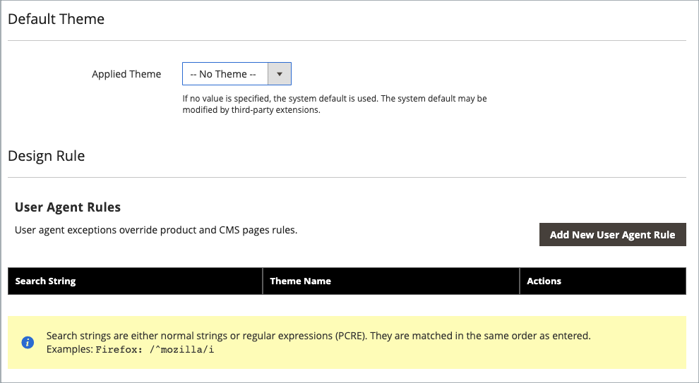

# Designkonfiguration

Designkonfigurationen gör det enkelt att redigera designrelaterade regler och konfigurationsinställningar genom att visa inställningarna på en enda sida.

{width="700" zoomable="yes"}

## Ändra designkonfigurationen

1. Gå till **[!UICONTROL Content]** > _[!UICONTROL Design]_>**[!UICONTROL Configuration]**&#x200B;på sidofältet_ Admin _.

1. Leta reda på den butiksvy som du vill konfigurera och klicka på **[!UICONTROL Edit]** i kolumnen _[!UICONTROL Action]_.

   På sidan visas de aktuella designinställningarna för butiksvyn.

1. Om du vill ändra standardtemat anger du **[!UICONTROL Applied Theme]** till det tema som du vill använda i vyn.

   Om inget tema anges används systemets standardtema. Vissa tillägg från tredje part ändrar systemets standardtema.

1. [!BADGE PaaS endast]{type=Informative url="https://experienceleague.adobe.com/sv/docs/commerce/user-guides/product-solutions" tooltip="Gäller endast Adobe Commerce i molnprojekt (Adobe-hanterad PaaS-infrastruktur) och lokala projekt."} Om temat bara ska användas för en viss enhet anger du **[!UICONTROL User Agent Rules]**.

   {width="400" zoomable="yes"}

   För varje enhetstyp där du vill ange ett tema:

   - Klicka på **[!UICONTROL Add New User Agent Rule]**.

   - Ange webbläsar-ID för den specifika enheten för **[!UICONTROL Search String]**.

     En söksträng kan antingen vara ett normalt uttryck eller ett Perl Compatible Regular Expression (PCRE) (mer information finns i [Användaragent](https://en.wikipedia.org/wiki/User_agent)). Följande söksträng identifierar Firefox:

         /^mozilla/i
     
   - För **[!UICONTROL Theme Name]** väljer du det tema som ska användas för den angivna enheten.

   >[!NOTE]
   >
   >Du kan lägga till så många regler för de enheter som du vill ange. Söksträngarna matchas i den ordning de anges.

1. Under _[!UICONTROL Other Settings]_&#x200B;expanderar du varje avsnitt och följer instruktionerna i de länkade avsnitten för att redigera inställningarna efter behov.

   - [[!UICONTROL Pagination]](../catalog/navigation-product-listings.md#pagination-controls) [!BADGE Endast PaaS]{type=Informative url="https://experienceleague.adobe.com/sv/docs/commerce/user-guides/product-solutions" tooltip="Gäller endast Adobe Commerce i molnprojekt (Adobe-hanterad PaaS-infrastruktur) och lokala projekt."}
   - [[!UICONTROL HTML Head]](page-setup.md#html-head) [!BADGE Endast PaaS]{type=Informative url="https://experienceleague.adobe.com/sv/docs/commerce/user-guides/product-solutions" tooltip="Gäller endast Adobe Commerce i molnprojekt (Adobe-hanterad PaaS-infrastruktur) och lokala projekt."}
   - [[!UICONTROL Header]](page-setup.md#header) [!BADGE Endast PaaS]{type=Informative url="https://experienceleague.adobe.com/sv/docs/commerce/user-guides/product-solutions" tooltip="Gäller endast Adobe Commerce i molnprojekt (Adobe-hanterad PaaS-infrastruktur) och lokala projekt."}
   - [[!UICONTROL Footer]](page-setup.md#footer) [!BADGE Endast PaaS]{type=Informative url="https://experienceleague.adobe.com/sv/docs/commerce/user-guides/product-solutions" tooltip="Gäller endast Adobe Commerce i molnprojekt (Adobe-hanterad PaaS-infrastruktur) och lokala projekt."}
   - [[!UICONTROL Search Engine Robots]](../merchandising-promotions/seo-overview.md#search-engine-robots) [!BADGE Endast PaaS]{type=Informative url="https://experienceleague.adobe.com/sv/docs/commerce/user-guides/product-solutions" tooltip="Gäller endast Adobe Commerce i molnprojekt (Adobe-hanterad PaaS-infrastruktur) och lokala projekt."}
   - [[!UICONTROL Product Image Watermarks]](../catalog/product-image.md#watermarks)
   - [[!UICONTROL Transactional Emails]](../systems/email-templates.md#configure-email-templates)

   {width="500" zoomable="yes"}

1. Klicka på **[!UICONTROL Save Configuration]** när du är klar.
