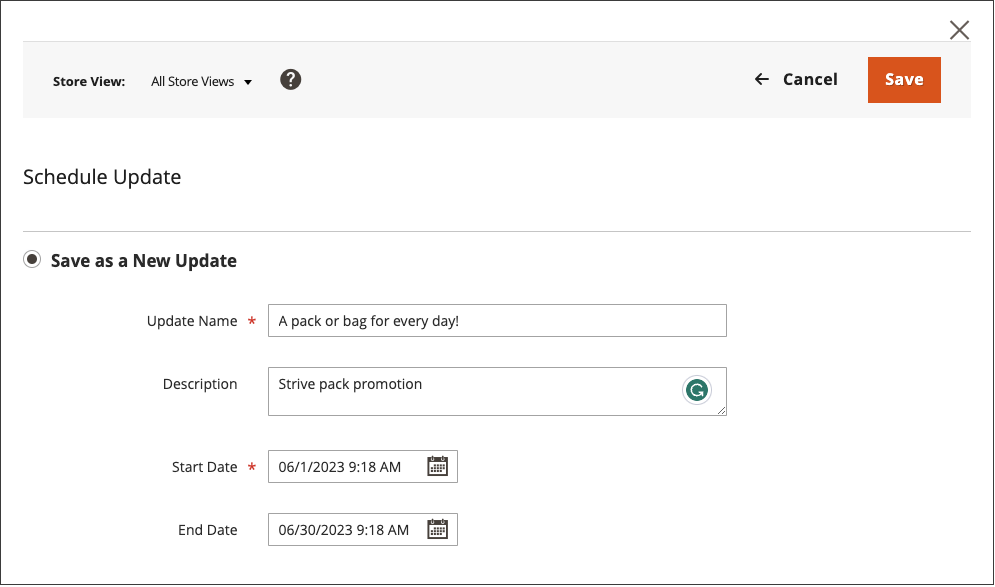

# Schemalägg en innehållsuppdatering

{{ee-feature}}

I följande exempel visas hur du schemalägger en tillfällig prisändring för en produkt. Det inkluderar schemaläggning och förhandsgranskning av ändringar samt visning av schemalagda uppdateringar i kalendern. Även om det här exemplet bara innehåller en enda ändring, kan en kampanj innehålla flera ändringar av produkter, prisregler, CMS-sidor och andra enheter som är schemalagda att äga rum samtidigt. Följ en liknande metod för att ange från-/till-datum för [!UICONTROL Set Product As New] -attribut.

>[!NOTE]
>Du måste skapa en schemalagd uppdatering som anger start- (och slutdatum) för [!UICONTROL Set Product As New]. För [!UICONTROL Special Price] och [!UICONTROL Design Change], tas datumfälten från/till bort från Adobe Commerce och är endast tillgängliga i Magento Open Source.
>
>Alla schemalagda uppdateringar tillämpas i följd, vilket innebär att alla enheter bara kan ha en schemalagd uppdatering åt gången. Alla schemalagda uppdateringar tillämpas på alla butiksvyer inom tidsramen. Därför kan en enhet inte ha en annan schemalagd uppdatering för olika butiksvyer samtidigt. Alla värden för entitetsattribut i alla butiksvyer, som inte påverkas av den aktuella schemalagda uppdateringen, hämtas från standardvärdena och inte från den tidigare schemalagda uppdateringen.

## Schemalägg en uppdatering för en produkt

1. Från _[!UICONTROL Products]_rutnät, öppna en produkt i redigeringsläge.

1. I _[!UICONTROL Scheduled Changes]_överst på sidan klickar du på&#x200B;**[!UICONTROL Schedule New Update]**.

   {width="600" zoomable="yes"}

1. Med **[!UICONTROL Save as a New Update]** valt alternativ, ange de grundläggande parametrarna för uppdateringen:

   - För **[!UICONTROL Update Name]** anger du ett namn för den nya innehållstagningskampanjen.

   - Ange en kort beskrivning **[!UICONTROL Description]** av uppdateringen och hur den ska användas.

   - Använd kalendern () för att välja **Startdatum** och **Slutdatum** för kampanjen.

     Om du vill skapa en öppen kampanj ska du inte ange något slutdatum (lämna tomt). I det här exemplet ska kampanjen börja vid midnatt för det nya året, 1 januari 2021 kl. 12.00 PST.

     För en prisregelkampanj som har skapats utan ett slutdatum kan ett slutdatum inte läggas till senare. I så fall måste du skapa en kampanj och ange startdatumet till det datum då du vill att den gamla kampanjen ska sluta och den nya ska börja. På det startdatumet upphör den gamla kampanjen och den nya kampanjen börjar som den är definierad.

     {width="600" zoomable="yes"}

     >[!NOTE]
     >
     >Kampanjens startdatum och slutdatum måste definieras med **_standard_** Administratörens tidszon, som konverteras från den lokala tidszonen för varje webbplats. Om du till exempel har flera webbplatser i olika tidszoner, men vill starta en kampanj som baseras på en amerikansk (standard) tidszon, måste du schemalägga en separat uppdatering för varje lokal tidszon. I det här fallet anger du **[!UICONTROL Start Date]** och **[!UICONTROL End Date]** som konverterats från de lokala webbplatsernas tidszon till administratörens standardtidszon.

1. Bläddra nedåt till _[!UICONTROL Price]_och klicka **[!UICONTROL Advanced Pricing]**.

1. Ange en **[!UICONTROL Special Price]** för produkten under den schemalagda kampanjen och klicka **[!UICONTROL Done]**.

1. När du är klar klickar du på **[!UICONTROL Save]**.

   Den schemalagda ändringen visas högst upp på produktsidan med kampanjens start- och slutdatum.

   {width="600" zoomable="yes"}

## Redigera den schemalagda ändringen

1. I _Schemalagda ändringar_ överst på sidan klickar du på **[!UICONTROL View/Edit]**.

1. Gör de ändringar som behövs för den schemalagda uppdateringen.

1. Klicka på **[!UICONTROL Save]**.

## Förhandsgranska den schemalagda ändringen

I _Schemalagda ändringar_ överst på sidan klickar du på **[!UICONTROL Preview]**.

Förhandsgranskningen öppnar en ny flik i webbläsaren och visar hur produkten visas under den schemalagda kampanjen.

>[!NOTE]
>
>En mellanlagringsförhandsvisning för en schemalagd uppdatering startar alltid från **standard** butiksvy, som emulerar kundens upplevelse av att navigera genom kampanjen för mellanlagringsuppdatering.

Mer information om hur du använder verktygen för att förhandsgranska innehåll för att ändra datumet och omfånget för förhandsgranskningen finns i [Förhandsgranska en kampanj](content-staging-preview.md). Du kan även dela en länk till butiksförhandsgranskningen med dina kollegor.
