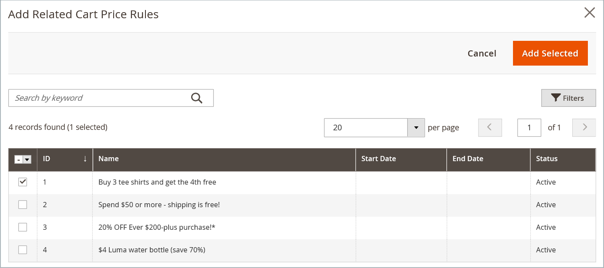

# Dynamiska block i prisregler

{{ee-feature}}

Alla [dynamiska block](dynamic-blocks.md) som du skapar kan kopplas till en befordran. Om du vill skapa associationen måste du först skapa både det dynamiska blocket och [katalogprisregeln](../merchandising-promotions/price-rules-catalog.md) eller [kundvagnsprisregeln](../merchandising-promotions/price-rules-cart.md). Kopplingen kan skapas när du arbetar med en prisregel eller när du arbetar med ett dynamiskt block.

>[!IMPORTANT]
>
>När du har skapat den här associationen visas det dynamiska blocket **endast** när regeln aktiveras. Om kampanjen är avsedd för segment A visas blocket för segment A. Om erbjudandet inte är aktivt visas inte blocket.

## Associera ett dynamiskt block med en prisregel

1. Gå till **[!UICONTROL Marketing]** > _[!UICONTROL Promotions]_&#x200B;på sidofältet_ Admin _och välj något av följande:

   - **[!UICONTROL Catalog Price Rules]**
   - **[!UICONTROL Cart Price Rules]**

1. Leta reda på regeln som du vill associera med det dynamiska blocket i stödrastret och öppna i redigeringsläge.

1. Bläddra nedåt och expandera  **[!UICONTROL Related Dynamic Blocks]**.

1. I den första kolumnen ställer du in filtret på `Any` och klickar på **[!UICONTROL Reset Filter]**.

   Rutnätet visar nu alla tillgängliga dynamiska block.

1. Markera kryssrutan för varje dynamiskt block som du vill koppla till regeln.

   {width="600" zoomable="yes"}

1. Klicka på **[!UICONTROL Save]** när du är klar.

## Associera en prisregel med ett dynamiskt block

1. Gå till **[!UICONTROL Content]** > _[!UICONTROL Elements]_>**[!UICONTROL Dynamic Blocks]**&#x200B;på sidofältet_ Admin _.

1. Hitta det dynamiska blocket i rutnätet och öppna i redigeringsläge.

1. Rulla ned och expandera **[!UICONTROL Related Promotions]**.

   Eventuella aktuella prisregler visas i rutnätet.

1. Lägg till en ny associerad regel eller ta bort en aktuell association.

   - Klicka på **[!UICONTROL Add Cart Price Rules]** om du vill associera en kundvagnsbefordran.

   - Klicka på **[!UICONTROL Add Catalog Price Rules]** om du vill associera en produktrelaterad kampanj.

1. Markera kryssrutan för varje regel som du vill koppla till det dynamiska blocket i rutnätet.

1. Klicka på **[!UICONTROL Add Selected]**.

   {width="600" zoomable="yes"}

1. Klicka på **[!UICONTROL Save]** när du är klar.
