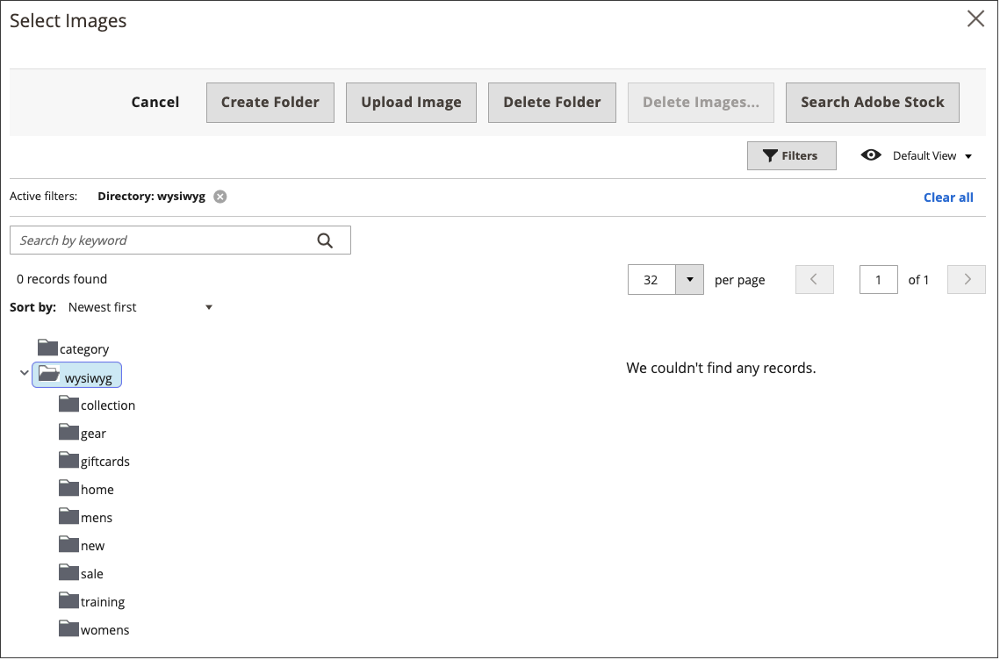

# Infoga en bild i redigeraren

I redigeraren kan du infoga en bild med tre källtyper:

- Lägg till en bild som har överförts till [medielagringsplatsen](media-storage.md)
- Länka till en bild som finns på en annan server
- Använd Adobe Stock-integreringen för att söka efter och använda Adobe Stock-resurser

{width="650" zoomable="yes"}

1. Öppna en sida, ett block eller ett dynamiskt block i redigeringsläge.

1. Gå till avsnittet _[!UICONTROL Content]_och klicka på ett element som stöder redigeraren.

1. Placera markören där du vill att bilden ska visas.

1. Klicka på ikonen _Infoga bild_ i redigeringsverktygsfältet.

   {width="700" zoomable="yes"}

   Den här åtgärden öppnar dialogrutan _[!UICONTROL Insert/edit image]_.

1. För **Source** klickar du på ikonen _Sök_ och använder den metod som matchar platsen för den bildresurs som du vill använda:

   {width="250" zoomable="yes"}

   - **Överför en ny bild**: Använd den här metoden om du vill överföra en ny bildfil.

      - Markera den mapp i trädet där du vill lägga till den nya bildfilen.

      - Klicka på **[!UICONTROL Choose Files]**.

      - Leta reda på och välj bildfilen.

      - Klicka på miniatyrbilden för den nya filen och klicka på **[!UICONTROL Add Selected]**.

   - **Välj en befintlig resurs**: Använd den här metoden om du vill välja en befintlig bildresurs från medielagring/galleri.

      - Använd trädet för att navigera till bilden.

      - Klicka på miniatyrbilden och klicka på **[!UICONTROL Add Selected]**.

   - **Sök efter och markera en Adobe Stock-bild**: Använd den här metoden om du vill söka efter en bild från Adobe Stock.

     >[!NOTE]
     >
     >Den här metoden kräver en [Adobe Stock-integrering](adobe-stock.md) konfigurerad för din administratör.

      - Klicka på **[!UICONTROL Search Adobe Stock]** och sök efter en bild.

      - Spara förhandsvisningen eller den licensierade bilden i galleriet.

        Mer information om hur du arbetar med [Adobe Stock](https://stock.adobe.com)-resurser finns i [Använda Adobe Stock-bilder](adobe-stock-manage.md).

      - Välj miniatyrbilden för resursen i galleriet och klicka på **[!UICONTROL Add Selected]**.

1. Ange en kort beskrivning av bilden för **[!UICONTROL Image Description]**.

1. Ange bredden och höjden **[!UICONTROL Dimensions]** i pixlar för återgivning av bilden på sidan.

   Behåll kryssrutan **[!UICONTROL Constrain proportions]** markerad för att automatiskt behålla bildens proportioner.

1. Klicka på **[!UICONTROL Insert]** för att slutföra processen.
