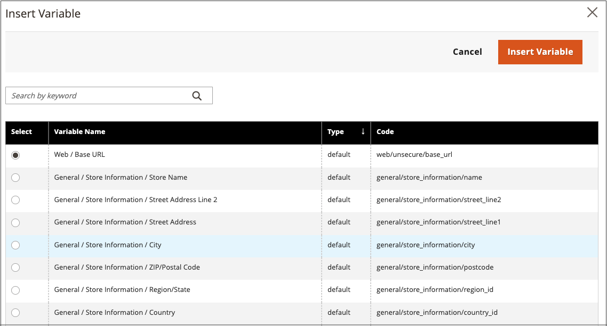

# Infoga en variabel i redigeraren

Butiken innehåller många fördefinierade [variabler](../systems/variables-predefined.md) som kan införlivas i sidinnehåll och annan kommunikation. Dessutom kan du inkludera egna [anpassade variabler](../systems/variables-custom.md) som är specifika för dina behov.

1. Öppna en sida, ett block eller ett dynamiskt block i redigeringsläge.

1. Gå till avsnittet _[!UICONTROL Content]_&#x200B;och klicka på ett element som stöder redigeraren.

1. Placera markören där du vill att variabeln ska visas och klicka på ikonen _Infoga variabel_ .

   {width="700" zoomable="yes"}

   Om du inte har [!UICONTROL Page Builder] aktiverat och föredrar att arbeta med HTML-koden klickar du på **[!UICONTROL Show / Hide Editor]**. Placera insättningspunkten i texten där du vill att variabeln ska visas. Klicka sedan på **[!UICONTROL Insert Variable]**.

1. I listan med tillgängliga variabler väljer du den du vill ha och klickar på **[!UICONTROL Insert Variable]**.

   {width="600" zoomable="yes"}

1. När dina innehållsredigeringar är klara klickar du på **[!UICONTROL Save]**.
