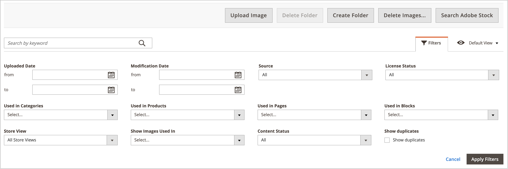

# Mediegalleriets resurshantering

Det nya [Mediegalleriet](media-gallery.md) innehåller verktyg för att hantera överförda mediefiler och resurser som du hämtar via en [Adobe Stock-integrering](adobe-stock.md). Om du har sparat en [bildförhandsvisning](adobe-stock-save-preview.md) från Adobe Stock kan du även [licensiera](adobe-stock-license-image.md) bilden i det nya mediegalleriet.

## Överföra en resurs

1. Gå till _>_ > **[!UICONTROL Content]** på sidofältet _[!UICONTROL Media]_&#x200B;Admin **[!UICONTROL Media Gallery]**.

1. Klicka på **[!UICONTROL Upload Image]**.

1. Markera filen som ska överföras.

   Den valda resursen överförs automatiskt till den valda mappen (eller till lagringsroten om ingen mapp har valts).

## Visa tillgångsinformation

1. Gå till _>_ > **[!UICONTROL Content]** på sidofältet _[!UICONTROL Media]_&#x200B;Admin **[!UICONTROL Media Gallery]**.

1. Klicka på de tre punkterna under resursen ({width="10" zoomable="no"}) och klicka sedan på **[!UICONTROL View Details]**.

   {width="600" zoomable="yes"}

   Resursinformationen visas på en bildrutepanel. De innehåller information om var tillgången används:

   - **[!UICONTROL Categories]**
   - **[!UICONTROL Products]**
   - **[!UICONTROL Pages]**
   - **[!UICONTROL Blocks]**

   {width="600" zoomable="yes"}

   Klicka på länkarna **[!UICONTROL Used In]** om du vill visa information. Rutnätet i följande exempel visar alla kategorier där en viss resurs används.

   {width="600" zoomable="yes"}

   Det går också att ta bort resursen från avsnittet _Visa detaljer_.

## Redigera en resurs

1. Gå till _>_ > **[!UICONTROL Content]** på sidofältet _[!UICONTROL Media]_&#x200B;Admin **[!UICONTROL Media Gallery]**.

1. Klicka på de tre punkterna under resursen ({width="10" zoomable="no"}) och klicka sedan på **[!UICONTROL Edit]**.

   {width="600" zoomable="yes"}

1. Ändra vid behov något av följande metadatavärden:

   - **[!UICONTROL Title]**
   - **[!UICONTROL Description]**
   - **[!UICONTROL Tags/Keywords]**

   Dessa data sparas i databasen och i själva filens metadata. För närvarande stöds XMP- och IPTC-format.

   Du kan hämta bilden med de uppdaterade metadata.

## Använda en resurs

Assets kan användas i stor utsträckning i hela administratören, till exempel [lägg till eller redigera en sida](page-add.md), [skapa eller redigera en kategori](../catalog/category-create.md) eller [infoga bilder från Innehållsredigeraren](editor-insert-image.md).

1. Gå till det nya mediegalleriet från ett område där du kan använda medieresurser.

1. Markera resursen och klicka på **[!UICONTROL Add Selected]**.

{{$include /help/_includes/image-optimization-animated-gif-note.md}}

## Ta bort resurser

1. Gå till _>_ > **[!UICONTROL Content]** på sidofältet _[!UICONTROL Media]_&#x200B;Admin **[!UICONTROL Media Gallery]**.

1. Klicka på **[!UICONTROL Delete Images...]** och markera kryssrutan för varje resurs som du vill ta bort.

1. Klicka på **[!UICONTROL Delete Image]** i bekräftelsedialogrutan.

   {width="500" zoomable="yes"}

## Sök efter resurser

1. Gå till _>_ > **[!UICONTROL Content]** på sidofältet _[!UICONTROL Media]_&#x200B;Admin **[!UICONTROL Media Gallery]**.

1. Använd indata från **[!UICONTROL Search by keywords]** för att utföra bildsökning med nyckelord/taggar.

   Sökningen i följande exempel söker efter resurser som innehåller en specifik tagg (`mountain`).

   {width="600" zoomable="yes"}

>[!NOTE]
>
>Mer information om hur du kan uppdatera bildtaggar finns i avsnittet _[Redigera en resurs](#edit-an-asset)_.

## Filtrera resurser

>[!NOTE]
>
>Funktionen _Används i_ kräver att [!UICONTROL Media Gallery Image Optimization] är aktiverad i [konfigurationsinställningarna](media-gallery-image-optimization.md).

1. Gå till _>_ > **[!UICONTROL Content]** på sidofältet _[!UICONTROL Media]_&#x200B;Admin **[!UICONTROL Media Gallery]**.

1. Klicka på fliken **[!UICONTROL Filters]**.

   {width="600" zoomable="yes"}

1. Ange filteralternativen.

   Du kan filtrera resurserna efter användning av enheterna:

   - **[!UICONTROL Used in Categories]**
   - **[!UICONTROL Used in Products]**
   - **[!UICONTROL Used in Pages]**
   - **[!UICONTROL Used in Blocks]**

   Du kan också filtrera resurserna efter **[!UICONTROL Store View]**, **[!UICONTROL License Status]** och **[!UICONTROL Content Status]**. Ange ett datumintervall för **[!UICONTROL Uploaded Date]** och/eller **[!UICONTROL Modification Date]** för att filtrera resurser efter fildatum.

1. Klicka på **[!UICONTROL Apply Filters]** för att se resultatet.

   Filtreringen i följande exempel hittar resurser som används i en viss kategori (`cars`) och som är aktiverade.

   {width="600" zoomable="yes"}

## Söka efter bilddubbletter

1. Klicka på fliken **[!UICONTROL Filters]** och markera kryssrutan **[!UICONTROL Show duplicates]**.

1. Klicka på **[!UICONTROL Apply Filters]** om du vill se resultatet.

<!-- Last updated from includes: 2024-01-30 15:43:39 -->
