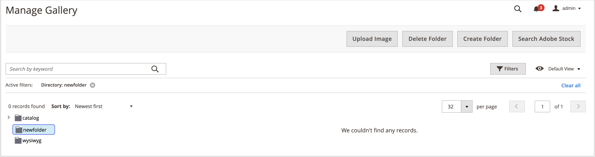

# Mapphantering för mediegalleriet

Använd mappar för att ordna bilder i de nya [Mediegalleri](media-gallery.md). När antalet medieresurser ökar blir det enklare att hitta och hantera befintliga resurser i mediegalleriet.

## Skapa en mapp

1. På _Administratör_ sidebar, gå till **[!UICONTROL Content]** > _[!UICONTROL Media]_>**[!UICONTROL Media Gallery]**.

1. Klicka på **[!UICONTROL Create Folder]**.

   Om du vill skapa en undermapp markerar du den överordnade mappen innan du klickar på **[!UICONTROL Create Folder]**.

1. Ange det nya mappnamnet och klicka på **[!UICONTROL Confirm]**.

   {width="600" zoomable="yes"}

## Ta bort en mapp

>[!WARNING]
>
>Om du tar bort en mapp tas alla bilder i mappen bort.

1. På _Administratör_ sidebar, gå till **[!UICONTROL Content]** > _[!UICONTROL Media]_>**[!UICONTROL Media Gallery]**.

1. Markera mappen som ska tas bort.

   {width="600" zoomable="yes"}

1. Klicka på **[!UICONTROL Delete Folder]**.

1. Bekräfta borttagningen av mappen genom att klicka på **[!UICONTROL OK]**.
