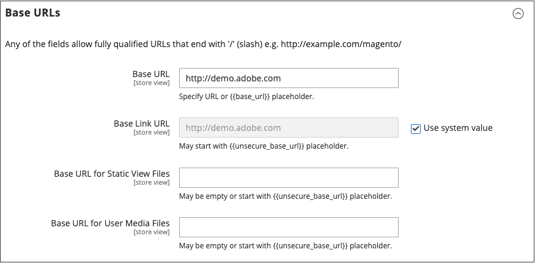
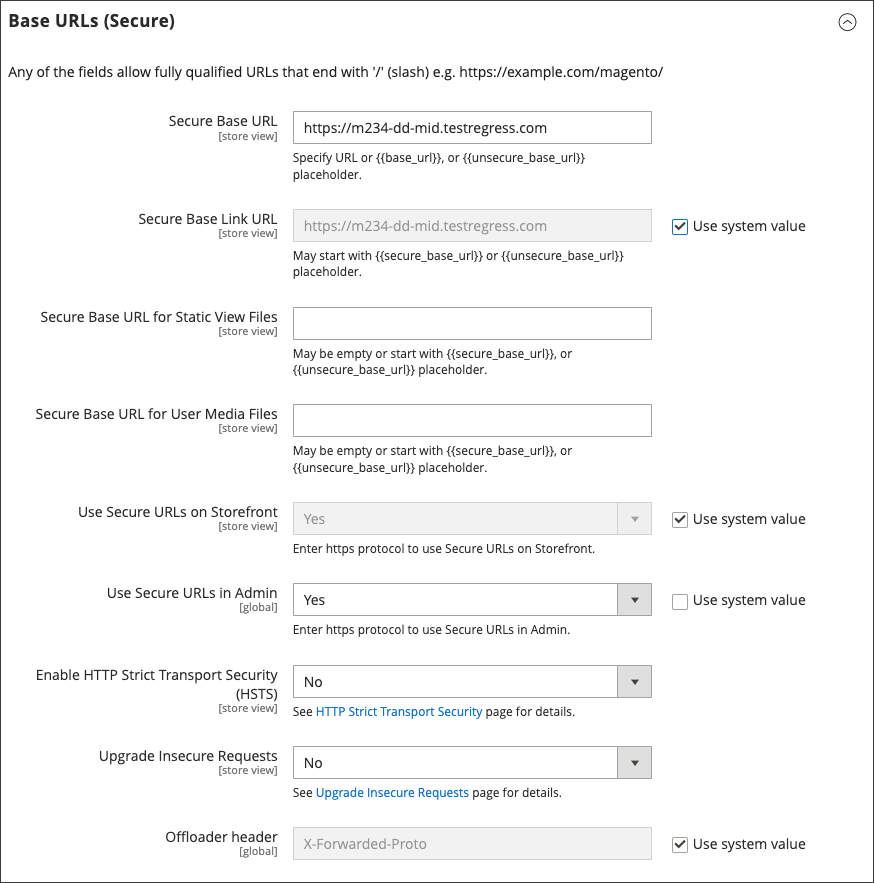

# Använd ett leveransnätverk

Ett leveransnätverk kan användas för att lagra mediefiler. I Adobe Commerce molninfrastruktur ingår snabbt-CDN (se [Snabbt](https://experienceleague.adobe.com/docs/commerce-cloud-service/user-guide/cdn/fastly.html) i _Commerce on Cloud Infrastructure Guide_). En Commerce-instans som är installerad _lokalt_ innehåller ingen integrering med ett specifikt CDN. Du kan använda valfritt CDN.

När du har konfigurerat CDN måste du slutföra konfigurationen från administratören. Ändringarna kan göras antingen globalt eller på webbplatsnivå. När ett CDN används för medielagring ändras alla sökvägar till media på Commerce Store-sidor till de CDN-sökvägar som anges i konfigurationen.

## CDN-arbetsflöde

1. **Webbläsaren begär media** - en sida från butiken öppnas i kundens webbläsare och webbläsaren begär media som har angetts i HTML.
1. **Begäran skickades till CDN; bilder hittades och kunde hanteras** - Begäran skickas först till CDN. Om CDN har bilderna i lager skickas mediefilerna till kundens webbläsare.
1. **Mediet hittades inte, begäran skickades till [!DNL Commerce] webbservern** - Om CDN inte har mediefilerna skickas begäran till [!DNL Commerce]-webbservern. Om mediefilerna hittas i filsystemet skickas de till kundens webbläsare av webbservern.

>[!IMPORTANT]
>
>Av säkerhetsskäl fungerar inte JavaScript korrekt om ett CDN används som medielagring om det finns utanför din underdomän.

## Konfigurera ett nätverk för innehållsleverans

1. Gå till **[!UICONTROL Stores]** > _[!UICONTROL Settings]_>**[!UICONTROL Configuration]**&#x200B;på sidofältet_ Admin _.

1. Välj **[!UICONTROL Web]** i den vänstra panelen under _[!UICONTROL General]_.

1. Ange **[!UICONTROL Store View]** efter behov i det övre vänstra hörnet.

1. Expandera  i avsnittet **[!UICONTROL Base URLs]** och gör följande:

   {width="600" zoomable="yes"}

   - Uppdatera **[!UICONTROL Base URL for Static View Files]** med URL:en för den plats i CDN där statiska vyfiler lagras.

   - Uppdatera **[!UICONTROL Base URL for User Media Files]** med URL:en för JavaScript-filerna på CDN:en.

     Båda dessa fält kan lämnas tomma eller börja med platshållaren: `{{unsecure_base_url}}`

1. Expandera  i avsnittet **[!UICONTROL Base URLs (Secure)]** och gör följande:

   {width="600" zoomable="yes"}

   - Uppdatera **[!UICONTROL Secure Base URL for Static View Files]** med URL:en för den plats i CDN där statiska vyfiler lagras.

   - Uppdatera **[!UICONTROL Secure Base URL for User Media Files]** med URL:en för JavaScript-filerna på CDN:en.

     Båda dessa fält kan lämnas tomma eller börja med platshållaren: `{{unsecure_base_url}}`

1. Klicka på **[!UICONTROL Save Config]** när du är klar.
