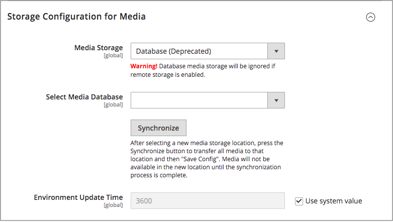

# Använda en mediedatabas

>[!IMPORTANT]
>
>Databasmedielagringsmetoden används inte i Adobe Commerce och Magento Open Source 2.4.3.

Som standard lagras alla bilder, kompilerade CSS-filer och kompilerade JavaScript-filer för instansen [!DNL Commerce] i filsystemet på webbservern. Du kan välja att lagra dessa filer i en databas på en databasserver. En fördel med detta är möjligheten till automatisk synkronisering och omvänd synkronisering mellan webbserverns filsystem och databasen. Du kan använda standarddatabasen för att lagra media eller skapa en. Om du vill kunna använda en nyligen skapad databas som medielagring måste du lägga till information om den och dess autentiseringsuppgifter för åtkomst till filen `env.php`.

## Databasarbetsflöde

1. **Webbläsaren begär media** - en sida från butiken öppnas i kundens webbläsare och webbläsaren begär media som har angetts i HTML.

1. **Systemet söker efter media i filsystemet** - Systemet söker efter media i filsystemet och skickar det till webbläsaren om det hittas.

1. **Systemet hittar media i databasen** - Om mediet inte hittas i filsystemet skickas en begäran om mediet till databasen som anges i konfigurationen.

1. **Systemet hittar media i databasen** - Ett PHP-skript överför filerna från databasen till filsystemet och skickar dem till kundens webbläsare. Webbläsarbegäran om media utlöser skriptet så här:

   - Om webbservern [rewrites](../merchandising-promotions/url-rewrite.md) är aktiverad för [!DNL Commerce] och stöds av servern, körs PHP-skriptet bara när det begärda mediet inte hittas i filsystemet.
   - Om återskrivningar från webbservern är inaktiverade för [!DNL Commerce], eller inte stöds av servern, körs PHP-skriptet ändå, även om det nödvändiga mediet är tillgängligt i filsystemet.

## Använd en databas för medielagring

1. Gå till **[!UICONTROL Stores]** > _[!UICONTROL Settings]_>**[!UICONTROL Configuration]**på sidofältet_ Admin _.

1. Expandera **[!UICONTROL Advanced]** i den vänstra panelen och välj **[!UICONTROL System]**.

1. I det övre vänstra hörnet anger du **[!UICONTROL Store View]** till `Default Config` för att tillämpa konfigurationen på global nivå.

1. Expandera  i avsnittet **[!UICONTROL Storage Configuration for Media]** och gör följande:

   {width="600" zoomable="yes"}

   - Ange **[!UICONTROL Media Storage]** till `Database`.

   - Ange **[!UICONTROL Select Media Database]** till databasen som du vill använda.

   - Klicka på **[!UICONTROL Synchronize]** om du vill överföra befintliga media till den nyligen markerade databasen.

   - Ange **[!UICONTROL Environment Update Time]** i sekunder.

1. Klicka på **[!UICONTROL Save Config]** när du är klar.
