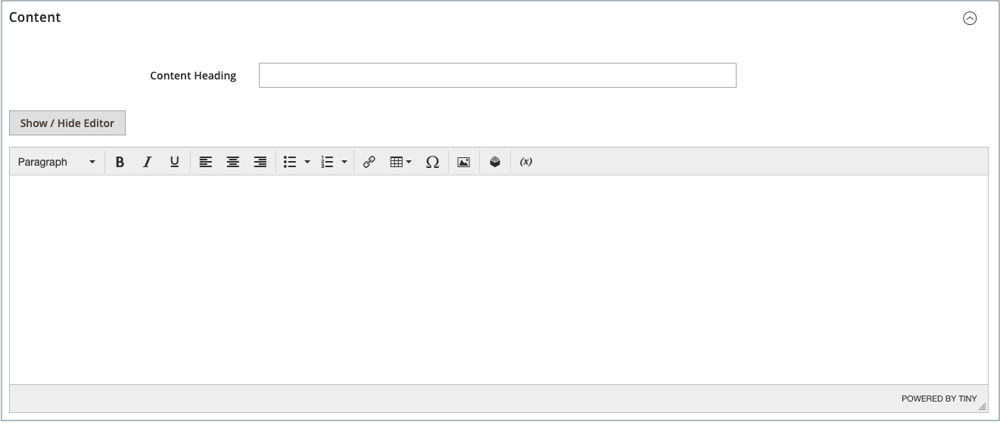

# Lägga till och ta bort sidor

Processen att lägga till en innehållssida i din butik är i stort sett densamma för alla typer av sidor som du kanske vill skapa. Du kan inkludera text, bilder, innehållsblock, variabler och widgetar. De flesta innehållssidor är utformade för att läsas av sökmotorer först och av andra. Tänk på behoven för var och en av dessa två olika målgrupper när du väljer sidrubrik, URL-adress och när du komponerar metadata och innehåll. När sidan är klar kan den läggas till i din butiksnavigering, länkas till andra sidor, länkas från butikens sidfot eller användas som en ny [hemsida](page-home-new.md).

{width="700" zoomable="yes"}

## Lägga till en sida

I följande instruktioner får du hjälp med varje steg för att skapa en enkel sida. Vissa avancerade funktioner hoppas över, men beskrivs i andra ämnen.

### Steg 1: Skapa sidan

1. Gå till _>_ > **[!UICONTROL Content]** på sidofältet _[!UICONTROL Elements]_Admin **[!UICONTROL Pages]**.

1. Klicka på **[!UICONTROL Add New Page]**.

   {width="600" zoomable="yes"}

1. Om du inte vill publicera sidan omedelbart anger du **[!UICONTROL Enable Page]** till `No`.

1. Ange **[!UICONTROL Page Title]**.

   Sidtiteln visas i navigeringen [breadcrumb](../catalog/navigation-breadcrumb-trail.md).

### Steg 2: Slutför innehållet

Lägg till sidinnehållet beroende på konfigurationen för [avancerade verktyg för innehåll](../configuration-reference/general/content-management.md).

>[!NOTE]
>
>Page Builder-innehållets redigerare visar inte en förhandsvisning av CMS Page-element som inte är tillgängliga för standardbutiksvyn. Du kan till exempel inte förhandsgranska ett CMS-block som endast är tilldelat icke-standardbutiksvyer. I så fall måste du publicera din CMS-sida först. Sedan kan du visa den här sidan direkt på Storefront. Du kan också visa sidan från rutnätet [!UICONTROL Pages] i Admin genom att markera CMS-sidan [!UICONTROL View] i kolumnen [!UICONTROL Action].

#### Använda innehållsverktygen i Page Builder

1. Expandera  **[!UICONTROL Content]**.

   {width="600" zoomable="yes"}

1. Ange den rubrik som du vill ska visas överst på sidan i rutan **[!UICONTROL Content Heading]**.

   Om det här alternativet är aktiverat visas [Page Builder](../page-builder/introduction.md)-scenen och panelen nedanför innehållsrubriken. Mer information finns i [Workspace](../page-builder/workspace.md). Om _Page Builder_ inte är aktiverat öppnas redigeraren i WYSIWYG-läge med verktygsfältet överst.

1. Fyll i innehållet och formatera texten efter behov.

#### Använda redigeringsverktygsfältet

1. Expandera  **[!UICONTROL Content]**.

   {width="600" zoomable="yes"}

1. Ange den rubrik som du vill ska visas överst på sidan i rutan **[!UICONTROL Content Heading]**.

1. Fyll i innehållet och formatera texten efter behov.

   Du kan lägga till [bilder](media-storage.md), [variabler](../systems/variables-predefined.md) och [widgetar](widgets.md) efter behov. Mer information finns i [Använda redigeraren](editor.md).

### Steg 3: Fyll i SEO-informationen

1. Expandera  **[!UICONTROL Search Engine Optimization]**.

   {width="600" zoomable="yes"}

1. Acceptera standardvärdet eller ange en annan **[!UICONTROL URL Key]** som består av alla gemener, med bindestreck i stället för mellanslag.

   Standardnyckeln för URL skapades när sidan sparades och baseras på rubriken Innehåll.

1. Ange en **[!UICONTROL Meta Title]** för sidan.

   Meta-title får inte innehålla fler än 70 tecken och visas i webbläsarens namnlist och på fliken.

1. Ange ditt val av **[!UICONTROL Meta Keywords]** med högt värde som sökmotorer kan använda för att indexera sidan.

   Avgränsa flera ord med komma. Meta-nyckelord ignoreras av vissa sökmotorer, men används av andra.

1. Ange en kort beskrivning av sidan för sökresultatlistor för **[!UICONTROL Meta Description]**.

   I idealfallet bör beskrivningen vara 150-160 tecken lång, med en maxgräns på 255.

1. Klicka på **[!UICONTROL Save]**.

### Steg 4: Ange sidans omfattning

1. Expandera  **[!UICONTROL Page in Websites]**.

   {width="600" zoomable="yes"}

1. I listan **[!UICONTROL Store View]** väljer du varje vy där sidan ska vara tillgänglig.

   Om installationen har flera webbplatser väljer du varje webbplats och butiksvy där sidan ska vara tillgänglig.

### Steg 5: Identifiera den överordnade sidan (om tillämpligt)

{{ee-feature}}

1. Expandera  **[!UICONTROL Hierarchy]**.

   {width="600" zoomable="yes"}

1. Om den här sidan är underordnad en annan sida markerar du kryssrutan för **[!UICONTROL Parent page]**.

### Steg 6: Ange designändringar (valfritt)

1. Expandera  **[!UICONTROL Design]** om du vill ändra sidans layout.

   {width="600" zoomable="yes"}

1. Om du vill ändra sidans kolumnlayout anger du **[!UICONTROL Layout]** till något av följande:

   - `Empty`
   - `1 column`
   - `2 columns with left bar`
   - `2 columns with right bar`
   - `3 columns`
   - `Page -- Full Width` (Kräver [Page Builder](../page-builder/introduction.md))
   - `Category -- Full Width` (Kräver Page Builder)
   - `Product -- Full Width` (Kräver Page Builder)

1. Om du vill använda en **[!UICONTROL Custom Layout Update]** väljer du namnet på filen i listan.

   Mer information finns i [Layoutuppdateringar](layout-updates.md).

1. Om du vill ändra sidans tema anger du **[!UICONTROL New Theme]** till något av följande:

   - `Magento Black`
   - `Magento Luma`

1.  (endast Magento Open Source) Om du vill schemalägga en designändring expanderar du  **[!UICONTROL Custom Design Update]** och gör följande:

   {width="600" zoomable="yes"}

   - Använd kalendern () för att välja datum **[!UICONTROL From]** och **[!UICONTROL To]** för ändringen som ska gälla.

   - Om du vill använda ett annat tema på sidan markerar du namnet på **[!UICONTROL New Theme]**.

   - Om du vill ändra sidans kolumnlayout väljer du **[!UICONTROL Layout]** som du vill använda.

### Steg 7: Förhandsgranska sidan

1. Klicka på pilen **[!UICONTROL Save]** och välj **[!UICONTROL Save & Close]** för att gå tillbaka till sidstödrastret.

1. Hitta sidan i rutnätet och välj **[!UICONTROL View]** i kolumnen _[!UICONTROL Action]_.

1. Om du vill gå tillbaka till rutnätet klickar du på **[!UICONTROL Back]** i det övre vänstra hörnet i webbläsarfönstret.

### Steg 8: Publicera sidan

1. Välj **[!UICONTROL Edit]** i kolumnen _[!UICONTROL Action]_i rutnätet.

1. Ange **[!UICONTROL Enable Page]** till `Yes`.

1. Klicka på pilen **[!UICONTROL Save]** och välj **[!UICONTROL Save & Close]**.

## Duplicera en sida

Alla innehållssidor kan användas som mallar och sparas som dubbletter. Du kan använda den här tidsbesparande tekniken för att skapa en enhetlig design för innehållssidor på hela webbplatsen. Den duplicerade sidan behåller den ursprungliga sidans titel, men fälten URL-nyckel och Status måste uppdateras.

{width="600" zoomable="yes"}

1. Gå till _>_ > **[!UICONTROL Content]** på sidofältet _[!UICONTROL Elements]_Admin **[!UICONTROL Pages]**.

1. Leta reda på sidan som du vill duplicera i rutnätet och klicka på **[!UICONTROL Edit]** i kolumnen _[!UICONTROL Action]_.

1. Klicka på pilen **[!UICONTROL Save]** och välj **[!UICONTROL Save & Duplicate]**.

1. När du ser meddelanden om att sidan har sparats och duplicerats klickar du på **[!UICONTROL Back]** i det övre knappfältet för att gå tillbaka till rutnätet.

1. Hitta den duplicerade sidan i rutnätet och notera följande:

   - Sidrubriken är densamma som originalet.
   - En unik, men tillfällig URL-nyckel tilldelas.
   - Sidans status är `Disabled`.

1. Öppna den duplicerade sidan i läget _Redigera_ och gör följande:

   - Om du vill publicera sidan omedelbart anger du **[!UICONTROL Enable Page]** till `Yes`.

   - Uppdatera **[!UICONTROL Page Title]** efter behov.

   - Expandera  i avsnittet **[!UICONTROL Search Engine Optimization]** och ange den unika **[!UICONTROL URL Key]** som du vill använda för den duplicerade sidan.

     {width="600" zoomable="yes"}

   - Uppdatera det återstående sidinnehållet efter behov.

1. Klicka på pilen **[!UICONTROL Save]** och välj **[!UICONTROL Save & Close]**.

   Den duplicerade sidan i rutnätet återspeglar dina ändringar.

## Spara-menyn

| Kommando | Beskrivning |
|--- |--- |
| [!UICONTROL Save] | Spara den aktuella sidan och fortsätt arbeta. |
| [!UICONTROL Save & New] | Spara och stäng den aktuella sidan och påbörja en ny sida. |
| [!UICONTROL Save & Duplicate] | Spara och stäng den aktuella sidan och öppna en ny kopia. |
| [!UICONTROL Save & Close] | Spara och stäng den aktuella sidan och gå tillbaka till sidstödrastret. |

{style="table-layout:auto"}

## Ta bort en sida

Det finns två sätt att ta bort en skapad sida. Du kan ta bort den från stödrastret _[!UICONTROL Pages]_eller från sidan_[!UICONTROL Edit]_.

### Metod 1: Ta bort en sida från sidstödrastret

1. Gå till _>_ > **[!UICONTROL Content]** på sidofältet _[!UICONTROL Elements]_Admin **[!UICONTROL Pages]**.

1. Leta upp sidorna med hjälp av filter ovanför stödrastret och markera kryssrutan för en eller flera sidor som ska tas bort.

1. I listans övre vänstra hörn anger du **[!UICONTROL Actions]** till `Delete`.

1. Bekräfta åtgärden genom att klicka på **[!UICONTROL OK]**.

### Metod 2: Ta bort en sida från redigeringssidan

1. Gå till _>_ > **[!UICONTROL Content]** på sidofältet _[!UICONTROL Elements]_Admin **[!UICONTROL Pages]**.

1. Hitta sidan som ska tas bort.

1. Klicka på _[!UICONTROL Actions]_i kolumnen **[!UICONTROL Select]**för sidenheten och välj **[!UICONTROL Edit]**.

1. Klicka på **[!UICONTROL Delete Page]** i knappfältet.

1. Bekräfta åtgärden genom att klicka på **[!UICONTROL OK]**.
