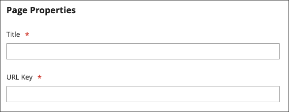

# Sidhierarki

{{ee-feature}}

Med arkivsidans hierarkisystem kan du ordna dina innehållssidor och lägga till sidnumrering, navigering och menyer. Sekretesspolicyn i exempeldata är ett exempel på en sida med en meny till vänster. Om du publicerar en stor mängd innehåll regelbundet kan du använda en sidhierarki för att ordna ditt innehåll så att det blir enkelt för människor att hitta intresseartiklar.

I sidhierarkisystemet används noder för att identifiera relaterade innehållsdelar och för att ordna innehållssidor i överordnade/underordnade relationer. En överordnad nod fungerar som en mapp som kan innehålla underordnade noder och sidor. Den relativa positionen för varje nod och sida i hierarkin visas som en _träd_-struktur. En nod kan innehålla andra noder och innehållssidor, och en enda innehållssida kan vara kopplad till flera noder och andra innehållssidor i en överordnad/underordnad eller grannrelation.

{width="600" zoomable="yes"}

## Konfigurera sidhierarki

Konfigurationsinställningarna aktiverar sidhierarkisystemet och metadata och fastställer standardmenylayouten.

{width="600" zoomable="yes"}

1. Gå till **[!UICONTROL Stores]** > _[!UICONTROL Settings]_>**[!UICONTROL Configuration]**på sidofältet_ Admin _.

1. Välj **[!UICONTROL Content Management]** i den vänstra panelen under _[!UICONTROL General]_.

1. Expandera  **[!UICONTROL CMS Page Hierarchy]** och gör de ändringar som behövs.

1. Klicka på **[!UICONTROL Save Config]** när du är klar.

| Fält | Beskrivning |
|--- |--- |
| [!UICONTROL Enable Hierarchy Functionality] | Aktiverar användning av sidhierarki för innehållssidor. Alternativ: `Yes` / `No` |
| [!UICONTROL Enable Hierarchy Metadata] | När det här alternativet är aktiverat kan du associera metadata med sidor i hierarkin. Alternativ: `Yes` / `No` |
| [!UICONTROL Default Layout for Hierarchy Menu] | Anger standardmenyformatet. Alternativ: `Content` / `Left Column` / `Right Column` |

{style="table-layout:auto"}

## Lägg till en hierarkinod

I följande exempel visas hur du skapar en nod med enkel navigering till relaterade innehållssidor. Även om en nod inte har någon associerad innehållssida har den en URL-nyckel som kan refereras till någon annanstans på platsen.

Du kan till exempel skapa en nod med namnet _Pressmeddelanden_ som har navigering till enskilda pressmeddelanden. Sedan kan du inkludera länken på sidan _Om oss_ till noden. Du kan också skapa en nod för en samling med bakomliggande utgåvor av nyhetsbrevet.

Om du vill länka till en nod använder du verktyget [Widget](widgets.md) för att skapa en CMS-hierarkikodlänk och placerar widgeten i ett innehållsblock eller en -sida.

{width="600" zoomable="yes"}

### Steg 1: Skapa en nod

1. Gå till **[!UICONTROL Content]** > _[!UICONTROL Elements]_>**[!UICONTROL Hierarchy]**på sidofältet_ Admin _.

   {width="600" zoomable="yes"}

1. Klicka på **[!UICONTROL Add Node...]** ovanför rutnätet.

1. Under _[!UICONTROL Page Properties]_anger du en **[!UICONTROL Title]**för noden och en lämplig **[!UICONTROL URL Key]**.

   URL-nyckeln ger en unik webbadress för noden. Det måste bestå av enbart små bokstäver, och bindestreck måste användas för att avgränsa ord i stället för blanksteg.

   {width="500" zoomable="yes"}

1. Klicka på **[!UICONTROL Save]**.

   Noden visas som en mapp i trädet till vänster på sidan.

### Steg 2: Lägg till sidor i noden

1. Markera noden genom att klicka i hierarkiträdet.

1. Klicka på **[!UICONTROL Add Selected Pages(s) to Tree]**.

   Du kan rulla uppåt för att se att varje vald sida visas i trädet nedanför nodmappen.

### Steg 3: Definiera strukturen

1. Om det behövs drar du sidorna till rätt plats för att ange i vilken ordning de ska visas på menyn.

   {width="500" zoomable="yes"}

1. Klicka på noden högst upp i hierarkin.

   Avsnittet _[!UICONTROL Page Properties]_visar nu information om noden.

1. Gör följande under **[!UICONTROL Render Metadata in HTML Head]**:

   {width="400" zoomable="yes"}

   - Om du vill identifiera noden som överst i hierarkin anger du **[!UICONTROL First]** till `Yes`.

   - Om du vill visa en sidnumreringskontroll anger du **[!UICONTROL Next/Previous]** till `Yes`.

   - Om du vill ordna sidorna i hierarkin som en bok anger du **[!UICONTROL Enable Chapter/Section]** till `Yes`.

     Om du inte vill inkludera noden som en del av boken låter du standardvärdet `No` vara kvar.

   - Om du vill tilldela noden till en viss del av boken anger du **[!UICONTROL Chapter/Section]** till något av följande:

      - `No` - Definierar inte noden som kapitel/avsnitt.
      - `Chapter` - Tilldelar den aktuella noden som ett kapitel.
      - `Section` - Tilldelar den aktuella noden som ett avsnitt.
      - `Both` - Tilldelar den aktuella noden som både kapitel och avsnitt.

### Steg 4: Lägg till sidnumreringskontroller

1. Under _Sidnumreringsalternativ för kapslade sidor_ anger du **[!UICONTROL Enable Pagination]** till `Yes`.

1. För **[!UICONTROL Frame]** anger du antalet sidlänkar som du vill ta med i sidnumreringskontrollen.

   Om det finns fler sidor i hierarkin som kan inkluderas i sidnumreringskontrollen.

1. För **[!UICONTROL Frame Skip]** anger du antalet sidor som du vill hoppa över (eller bak) för nästa uppsättning sidnumreringslänkar.

### Steg 5: Välj menylayout

Om du vill att noden ska visas på menyn gör du följande:

1. Under _Alternativ på menyn Sidnavigering_ anger du **[!UICONTROL Show in navigation menu]** till `Yes`.

   Den här inställningen avgör om en navigeringsmeny genereras för sidhierarkin.

   {width="300" zoomable="yes"}

1. Om du vill ange menyns plats i relation till innehållet anger du **[!UICONTROL Menu Layout]**:

   - `Content` - Menylayouten finns i innehållet.
   - `Use Default` - Använder det menyformat som anges i [konfigurationen](../configuration-reference/general/content-management.md).
   - `Left Column` - Menyn visas till vänster om innehållet.
   - `Right Column` - Menyn visas till höger om innehållet.

1. Om du vill ange hur mycket information som ska visas på menyn anger du **[!UICONTROL Menu Detalization]** till något av följande:

   - `Only Children` - Inkluderar endast undersidor på menyn.
   - `Neighbours and Children` - Inkluderar undersidor och andra sidor på samma nivå i hierarkin.

1. Om du vill fastställa menyns djup anger du **[!UICONTROL Maximal Depth]** för det maximala antalet nivåer som ska inkluderas.

1. Om du vill formatera menyn väljer du en **[!UICONTROL List Type]**:

   - `Unordered` - Menyalternativen är inte numrerade och kan formateras med eller utan punkter. Alternativ för oordnad listtyp: Standard / Cirkel / Skiva / Fyrkant
   - `Ordered` - Menyalternativen är numrerade och kan formateras som numeriska, alfabetiska eller latinska siffror i antingen versaler eller gemener.

1. Ange **[!UICONTROL List Style]** till något av följande:

   - `Circle`
   - `Disc`
   - `Square`

1. Om du även vill att noden ska vara synlig på navigeringsmenyn, bläddrar du till _Alternativ för huvudnavigeringsmeny_ och anger **[!UICONTROL Show in Navigation menu]** som `Yes`.

   {width="250" zoomable="yes"}

1. Klicka på **[!UICONTROL Save]**.
