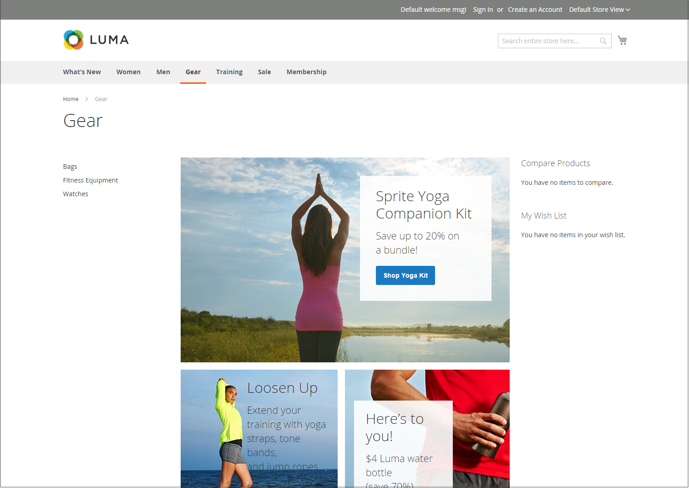

# Layoutexempel för Storefront

Kolumndimensionerna bestäms av temats formatmall. Vissa teman använder en fast pixelbredd på sidlayouten, medan andra använder procentvärden för att få sidan att reagera på bredden på fönstret eller enheten.

De flesta skrivbordsteman har en fast bredd för huvudkolumnen och all aktivitet sker inom det avgränsade området. Beroende på skärmupplösningen finns det tomt utrymme på varje sida av huvudkolumnen.

## En kolumn

Innehållsområdet för en layout med en kolumn sträcker sig över huvudkolumnens hela bredd. Den här layouten används ofta för en hemsida med stor banderoll eller reglage, eller för sidor som inte kräver någon navigering, till exempel en inloggningssida, välkomstsida, video eller helsidesreklam.

{width="700" zoomable="yes"}

## Två kolumner med vänster fält

Innehållsområdet i den här layouten är uppdelat i två kolumner. Huvudinnehållskolumnen placeras till höger och sidlisten till vänster.

{width="700" zoomable="yes"}

## Två kolumner med höger fält

Den här layouten är en spegelbild av den andra tvåkolumnslayouten. Den här gången flyter sidofältet åt höger och huvudinnehållskolumnen åt vänster.

{width="700" zoomable="yes"}

## Tre kolumner

En layout med tre kolumner har ett huvudinnehållsområde med två sidkolumner. Den vänstra stapeln och huvudinnehållskolumnen radbryts tillsammans och flyter som en enhet till vänster. Den andra sidorutan flyter till höger.

{width="700" zoomable="yes"}
