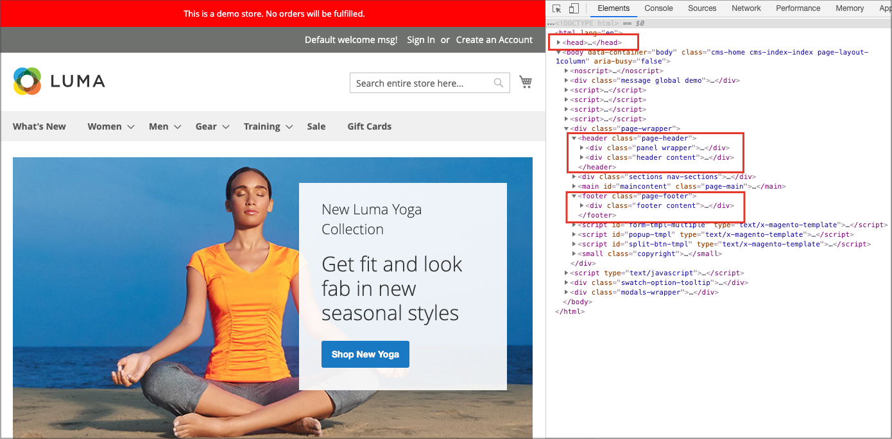
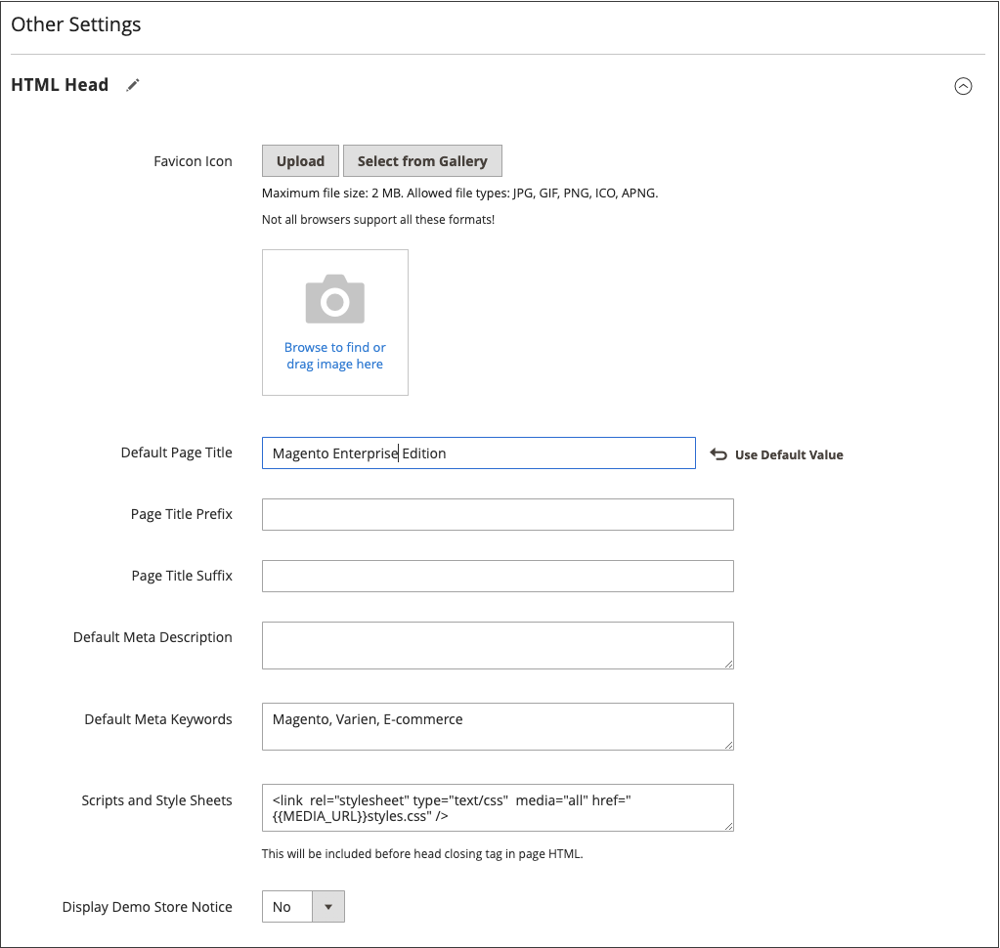

# Utskriftsformat

Huvudavsnitten på sidan styrs delvis av en uppsättning HTML-standardtaggar. Vissa av dessa märkord kan användas för att bestämma vilka teckensnitt, färger, storlekar, bakgrundsfärger och bilder som ska användas i varje avsnitt på sidan. Andra inställningar styr sidelement som logotypen i sidhuvudet och copyrightinformationen i sidfoten. De här avsnitten motsvarar den underliggande strukturen på HTML-sidan och många av de grundläggande egenskaperna kan anges från administratören.

- [HTML Head](#html-head)
- [Sidhuvud](#header)
- [Sidfot](#footer)

{width="700" zoomable="yes"}

## HTML Head

Inställningarna i avsnittet HTML Head motsvarar taggen `<head>` på en HTML-sida och kan konfigureras för varje butiksvy. Förutom metadata för sidans titel, beskrivning och nyckelord innehåller avsnittet en länk till favoritikonen och olika skript. Instruktioner för sökrobotar och visning av demonstrationsmeddelanden för butiker konfigureras också i det här avsnittet.

### Konfigurera HTML Head

1. Gå till **[!UICONTROL Content]** > _[!UICONTROL Design]_>**[!UICONTROL Configuration]**&#x200B;på sidofältet_ Admin _.

1. Leta reda på den butiksvy som du vill konfigurera och klicka på **[!UICONTROL Edit]** i kolumnen _[!UICONTROL Action]_.

1. Under _Andra inställningar_ expanderar du  i avsnittet **[!UICONTROL HTML Head]**.

   {width="500" zoomable="yes"}

1. Uppdatera [favicon](../getting-started/storefront-branding.md#add-a-favicon) vid behov.

1. Uppdatera sidtitelsinställningarna efter dina behov:

   - **[!UICONTROL Default Page Title]**
   - **[!UICONTROL Page Title Prefix]**
   - **[!UICONTROL Page Title Suffix]**

   Du kan använda ett suffix och/eller prefix med standardrubriken för att skapa en titel med två eller tre delar. Du kan lägga till ett lodrätt streck eller kolon som avgränsare mellan prefixet eller suffixet och standardtiteln.

1. Lägg till eller ändra metadata som har stöd för sökmotoroptimering (SEO) och hjälper till att styra kunderna till din butik från sökresultat:

   - **[!UICONTROL Default Meta Description]**
   - **[!UICONTROL Default Meta Keywords]**

1. Ange eventuella **[!UICONTROL Scripts and Style Sheets]** efter behov.

   >[!NOTE]
   >
   >Alla JavaScript som anges i fältet [!UICONTROL Scripts and Style Sheets] måste vitlistas i inställningarna för Content Security Policy (CSP), annars körs den inte på utcheckningssidorna. Mer information finns i [Säkerhetspolicy för innehåll](https://developer.adobe.com/commerce/php/development/security/content-security-policies).

1. Aktivera eller inaktivera [demonstrationsbutiksmeddelandet](../getting-started/storefront-branding.md#set-the-store-demo-notice) om det behövs.

1. Klicka på **[!UICONTROL Save Configuration]** när du är klar.

### Fältbeskrivningar för HTML Head

| Fält | Omfång | Beskrivning |
|--- |--- |--- |
| [!UICONTROL Favicon Icon] | Butiksvy | Överför den lilla bilden som visas i webbläsarens adressfält och flik. Tillåtna filtyper: ICO, PNG, APNG, GIF och JPG (JPEG). Alla webbläsare stöder inte dessa format. |
| [!UICONTROL Default Page Title] | Butiksvy | Titeln som visas i namnlisten på varje sida när den visas i en webbläsare. Standardtiteln används för alla sidor, såvida inte en annan rubrik har angetts för enskilda sidor. |
| [!UICONTROL Page Title Prefix] | Butiksvy | Du kan lägga till ett prefix före titeln för att skapa en titel med två eller tre delar. Ett lodrätt streck eller kolon kan användas som avgränsare i slutet av prefixet för att skilja det från texten i huvudrubriken. |
| [!UICONTROL Page Title Suffix] | Butiksvy | Du kan lägga till ett suffix efter titeln för att skapa en titel med två eller tre delar. Ett lodrätt streck eller kolon kan användas som avgränsare i slutet av prefixet för att skilja det från texten i huvudrubriken. |
| [!UICONTROL Default Meta Description] | Butiksvy | Beskrivningen innehåller en sammanfattning av webbplatsen för sökmotorlistor och får inte innehålla fler än 160 tecken. |
| [!UICONTROL Default Meta Keywords] | Butiksvy | En serie nyckelord som beskriver din butik, där vart och ett avgränsas med kommatecken. |
| [!UICONTROL Scripts and Style Sheets] | Butiksvy | Innehåller skript som måste inkluderas i HTML före den avslutande `<head>`-taggen. Alla tredjepartsprogram som måste placeras före taggen `<body>` kan till exempel anges här. |
| [!UICONTROL Display Demo Store Notice] | Butiksvy | Styr visningen av demonstrationsmeddelanden högst upp på sidan. Alternativ: `Yes` / `No` |

{style="table-layout:auto"}

## Sidhuvud

Huvudkonfigurationen identifierar sökvägen till din butikslogotyp och anger logotypens alt-text och välkomstmeddelandet.

{width="400" zoomable="yes"}

### Konfigurera rubriken

1. Gå till **[!UICONTROL Content]** > _[!UICONTROL Design]_>**[!UICONTROL Configuration]**&#x200B;på sidofältet_ Admin _.

1. Leta reda på den butiksvy som du vill konfigurera och klicka på **[!UICONTROL Edit]** i kolumnen _[!UICONTROL Action]_.

1. Under _Andra inställningar_ expanderar du  i avsnittet **[!UICONTROL Header]**.

1. Gör de ändringar som behövs för butiksvyn:

   - Inställningar för [logotyp](../getting-started/storefront-branding.md#upload-your-logo)
   - [Inställningar för välkomstmeddelande](../getting-started/storefront-branding.md#change-the-welcome-message)

1. Klicka på **[!UICONTROL Save Configuration]** när du är klar.

### Beskrivningar av rubrikfält

| Fält | Omfång | Beskrivning |
|--- |--- |--- |
| [!UICONTROL Logo Image] | Butiksvy | Identifierar sökvägen till logotypen som visas i sidhuvudet. Filtyper som stöds: PNG, GIF, JPG (JPEG) |
| [!UICONTROL Logo Attribute Width] | Butiksvy | Logotypbildens bredd i pixlar. |
| [!UICONTROL Logo Attribute Height] | Butiksvy | Logotypbildens höjd i pixlar. |
| [!UICONTROL Welcome Text] | Butiksvy | Välkomstmeddelandet visas i sidhuvudet och innehåller namnet på de kunder som är inloggade. |
| [!UICONTROL Logo Image Alt] | Butiksvy | Den Alt-text som är kopplad till logotypen. |
| [!UICONTROL Translate Title] | Butiksvy | Avgör om `Page Title` eller `Meta Title` ska översättas. |

{style="table-layout:auto"}

## Sidfot

I konfigurationsavsnittet Sidfot kan du uppdatera det [copyrightmeddelande](../getting-started/storefront-branding.md#change-the-copyright-notice) som visas längst ned på sidan och ange olika skript som måste placeras före den avslutande `<body>` -taggen.

{width="400" zoomable="yes"}

### Konfigurera sidfoten

1. Gå till **[!UICONTROL Content]** > _[!UICONTROL Design]_>**[!UICONTROL Configuration]**&#x200B;på sidofältet_ Admin _.

1. Leta reda på den butiksvy som du vill konfigurera och klicka på **[!UICONTROL Edit]** i kolumnen _[!UICONTROL Action]_.

1. Under _Andra inställningar_ expanderar du  i avsnittet **[!UICONTROL Footer]**.

1. Gör de ändringar som krävs för inställningarna för **[!UICONTROL Copyright]** och **[!UICONTROL Miscellaneous HTML]**.

   >[!NOTE]
   >
   >Alla JavaScript som anges i fältet [!UICONTROL Miscellaneous HTML] måste vitlistas i inställningarna för Content Security Policy (CSP), annars körs den inte på utcheckningssidorna. Mer information finns i [Säkerhetspolicy för innehåll](https://developer.adobe.com/commerce/php/development/security/content-security-policies).

1. Klicka på **[!UICONTROL Save Configuration]** när du är klar.

## Beskrivningar av sidfotsfält

| Fält | Omfång | Beskrivning |
|--- |--- |--- |
| [!UICONTROL Miscellaneous HTML] | Butiksvy | En inmatningsruta där du kan överföra olika skript till servern som måste placeras precis före den avslutande `<body>`-taggen. |
| [!UICONTROL Copyright] | Butiksvy | Upphovsrättssatsen som visas längst ned på varje sida. Om du vill ta med copyrightsymbolen använder du HTML-teckenentiteten `\&copy;` enligt följande: `\&copy; 2021 Commerce Demo Store. All Rights Reserved.` Se till att ersätta copyrightmeddelandet med ditt eget. |
| [!UICONTROL Display Report Bugs Link] | Butiksvy | Anger om felrapportlänken (som stöds för vissa teman) är aktiverad eller inaktiverad. |

{style="table-layout:auto"}
