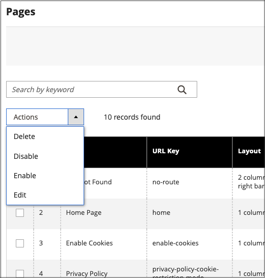

# Kontroller för arbetsytan Sida

Sidans arbetsyta innehåller verktyg som hjälper dig att snabbt hitta de sidor du behöver, och kommandon som utför rutinunderhåll på enskilda eller flera sidor. Du kan också snabbt uppdatera sidegenskaper från rutnätet.

{width="700" zoomable="yes"}

## Uppdatera sidegenskaper snabbt

1. Gå till **[!UICONTROL Content]** > _[!UICONTROL Elements]_>**[!UICONTROL Pages]**på sidofältet_ Admin _.
1. Klicka på en rad i rutnätet.

   {width="600" zoomable="yes"}

   Om du vill markera flera poster markerar du kryssrutan för varje rad som du vill uppdatera.

1. Uppdatera följande egenskaper:

   - **[!UICONTROL Title]**
   - **[!UICONTROL URL Key]**
   - **[!UICONTROL Status]**
   - **[!UICONTROL Layout]**

1. Klicka på **[!UICONTROL Save]** när du är klar.

## Workspace

| Kontroll | Beskrivning |
|--- |--- |
| [!UICONTROL Add New Page] | Lägger till en sida. |
| [!UICONTROL Search] | Startar en katalogsökning baserat på de aktuella filtren. |
| [!UICONTROL Actions] | Visar alla åtgärder som kan tillämpas på markerade objekt i listan. Om du vill utföra en åtgärd på en sida, eller på flera sidor, markerar du kryssrutan i den första kolumnen i varje post som åtgärden gäller. Alternativ: `Delete` / `Disable` / `Enable` / `Edit` |
| [!UICONTROL Select] | Kontrollen i den första kolumnens sidhuvud kan användas för att markera flera poster som mål för åtgärden. Markera kryssrutan i den första kolumnen i varje post som du vill markera. Alternativ: `Select All` / `Deselect All` |
| [!UICONTROL Save Edits] | Tillämpar den aktuella åtgärden på markerade poster. |
| [!UICONTROL Edit] | Öppnar posten i redigeringsläge. Du kan åstadkomma samma sak genom att klicka var som helst på raden. |

{style="table-layout:auto"}

## Kolumner

| Kolumn | Beskrivning |
|--- |--- |
| [!UICONTROL Select] | Kryssrutan i den första kolumnen används för att markera flera poster. Alternativ: `Select All` / `Deselect All` |
| [!UICONTROL ID] | ID:t är ett ökande nummer som tilldelas varje sida. |
| [!UICONTROL Title] | Titeln som visas högst upp på sidan. |
| [!UICONTROL URL Key] | URL-nyckeln liknar ett filnamn och identifierar sidan i URL:en. |
| [!UICONTROL Layout] | Avgör om sidan visas med sidofält till höger eller vänster om huvudinnehållsområdet. Alternativ: `1 column` / `2 columns with left bar` / `2 columns with right bar` / `3 columns` / `Empty` |
| [!UICONTROL Store View] | Används för att associera sidan med en viss butiksvy. |
| [!UICONTROL Status] | Anger om sidan är online eller offline. Alternativ: `Enabled` / `Disabled` |
| [!UICONTROL Created] | Det datum då sidan skapades. |
| [!UICONTROL Modified] | Det datum då sidan senast ändrades. |
| [!UICONTROL Action] | De åtgärder som kan tillämpas på en enskild post är: **[!UICONTROL Edit]**- Öppnar sidan i redigeringsläge. **[!UICONTROL Delete]** - Tar bort sidan. **[!UICONTROL View]**- Visar sidan i förhandsgranskningsläge. |

{style="table-layout:auto"}

## Andra kolumner

| Kolumn | Beskrivning |
|--- |--- |
| [!UICONTROL Custom design from/to] | Anger start- och slutdatum när den valda designen används på sidan.  (endast Magento Open Source). |
| [!UICONTROL Custom Theme] | Använder ett anpassat tema på sidan |
| [!UICONTROL Custom Layout] | Anger sidans anpassade layout |
| [!UICONTROL Meta Title] | Meta title for the page |
| [!UICONTROL Meta Keywords] | Meta-nyckelorden för sidan |
| [!UICONTROL Meta Description] | Sidans metabeskrivning |

{style="table-layout:auto"}

## Sidsökning

Sökrutan i det övre vänstra hörnet av stödrastret _[!UICONTROL Pages]_kan användas för att hitta specifika sidor per nyckelord. Om du vill göra en mer avancerad sökning kan du [filtrera](../getting-started/admin-grid-controls.md) sökningen efter flera parametrar.

### Sök efter nyckelord

1. Ange en sökterm i sökrutan.

1. Om du vill visa resultatet klickar du på ikonen Sök ().

   Resultatet innehåller alla sidor som innehåller nyckelordet.

### Filtrera sökresultaten

1. Om det behövs klickar du på **[!UICONTROL Clear All]** för att rensa de tidigare sökvillkoren.

1. Om du vill visa urvalet av sökfilter klickar du på **[!UICONTROL Filters]** !Fliken ([Tratt icon](../assets/icon-filter-search.png)).

1. Fyll i så många av filtren som behövs för att beskriva sidorna som du vill hitta.

1. Klicka på **[!UICONTROL Apply Filters]** för att visa resultatet.

### Sökfilter

| Filter | Beskrivning |
|--- |--- |
| [!UICONTROL ID] | Filtrera sökningen efter siduppgifts-ID. |
| [!UICONTROL Title] | Filtrera sökningen baserat på sidrubriken. |
| [!UICONTROL URL Key] | Filtrera sökningen med URL-nyckeln. |
| [!UICONTROL Created] | Filtrera sökningen efter det datum då sidan skapades. |
| [!UICONTROL Modified] | Filtrera sökningen baserat på det datum då sidan senast ändrades. |
| [!UICONTROL Store View] | Filtrera sökningen baserat på butiksvyn. Alternativ: `All available` / `Store Views` |
| [!UICONTROL Layout] | Filtrera sökningen baserat på sidlayout. Alternativ: `1 column` / `2 columns with left bar` / `2 columns with right bar` / `3 columns` / `Empty` |
| [!UICONTROL Status] | Filtrera sökningen på sidstatus. Alternativ: `Disabled` / `Published` |
| [!UICONTROL Custom design from / to] | Filtrera sökningen efter start- och slutdatum när den valda designen används på sidan.  (endast Magento Open Source). |
| [!UICONTROL Asset] | Filtrera sökningen efter sidrubrikresurser |
| [!UICONTROL Custom Layout] | Filtrera sökningen baserat på en anpassad layout. Alternativ: `1 column` / `2 columns with left bar` / `2 columns with right bar` / `3 columns` / `Empty` / `Page -- Full Width` / `Category -- Full Width` / `Product -- Full Width` |
| [!UICONTROL Custom Theme] | Filtrera sökningen baserat på ett anpassat tema. Standardalternativ: `Magento Blank` / `Magento Luma` |
| [!UICONTROL Meta Keywords] | Filtrera sökningen baserat på metannyckelorden för sidan. |
| [!UICONTROL Meta Title] | Filtrera sökningen baserat på sidans metanamn. |
| [!UICONTROL Meta Description] | Filtrera sökningen baserat på sidans metabeskrivning. |

{style="table-layout:auto"}

### Sökverktyg

| Verktyg | Beskrivning |
|--- |--- |
| [!UICONTROL Apply Filters] | Tillämpar alla filter på sökresultaten. |
| [!UICONTROL Cancel] | Avbryter aktuell sökning. |
| [!UICONTROL Clear All] | Tar bort alla sökfilter. |

{style="table-layout:auto"}

## Sidåtgärder

Sidor kan redigeras, inaktiveras, aktiveras och tas bort. Om du vill utföra en åtgärd på en enskild sida markerar du kryssrutan i den första kolumnen. Om du vill markera eller avmarkera alla sidor använder du markeringskontrollen längst upp i kolumnen.

{width="400" zoomable="yes"}

### En åtgärd

Använd kolumnen _[!UICONTROL Action]_längst till höger om du vill använda någon av följande åtgärder på den enskilda sidan:

- [!UICONTROL Edit] - öppnar sidan i redigeringsläge
- [!UICONTROL Delete] - tar bort sidan (kräver bekräftelse)
- [!UICONTROL View] - öppnar en sida direkt i butiken

{width="600" zoomable="yes"}

### Massåtgärder

Använd någon av följande åtgärder på flera markerade sidor samtidigt med _[!UICONTROL Action]_-väljaren i det övre vänstra hörnet:

- [!UICONTROL Delete] - tar bort sidorna (kräver bekräftelse)
- [!UICONTROL Disable] - inaktiverar sidorna i butiken
- [!UICONTROL Enable] - aktiverar sidorna i butiken
- [!UICONTROL Edit] - öppnar kolumner i stödrastret i redigeringsläge (**[!UICONTROL Title]**, **[!UICONTROL URL Key]**, **[!UICONTROL Layout]** och **[!UICONTROL Status]**)

## Sidstödrasterlayout

Markeringen av kolumner och deras ordning i rutnätet kan ändras enligt dina önskemål. Om du vill behålla den nya kolumnordningen kan du spara den som en vy.

### Ändra markeringen av kolumner

Klicka på kontrollen _Kolumner_ () i det övre högra hörnet och gör följande:

- Markera kryssrutan för den kolumn som du vill lägga till i rutnätet.

- Avmarkera kryssrutan för de kolumner som du vill ta bort från stödrastret.

### Flytta en kolumn

1. Klicka på kolumnrubriken och håll ned.

1. Dra kolumnen till den nya positionen och släpp den.

### Spara en vy

1. Klicka på kontrollen _Visa_ () och klicka sedan på **[!UICONTROL Save View As]**.

1. Ange ett namn för vyn.

1. Om du vill spara vyn klickar du på _pilen_ ().

   Namnet på vyn visas nu som den aktuella vyn.

### Ändra vyn

Klicka på kontrollen _Visa_ () och gör något av följande:

- Välj den vy som du vill använda.

- Ändra namnet på en vy genom att klicka på ikonen Redigera () och uppdatera namnet.

  {width="600" zoomable="yes"}

## Schemalagda ändringar

{{ee-feature}}

Sidändringar kan tillämpas enligt schema och grupperas med andra innehållsändringar. Du kan skapa en kampanj baserat på schemalagda ändringar på en sida eller tillämpa ändringarna på en befintlig kampanj. Mer information finns i [Förproduktion av innehåll](content-staging.md).

>[!NOTE]
>
>Om en kampanj är länkad till mer än en sida kan kampanjen bara redigeras från [kontrollpanelen för innehållsindelning](content-staging-dashboard.md).

>[!NOTE]
>
>Fliken [!UICONTROL Custom Design Update] har tagits bort i  Adobe Commerce och kan inte ändras direkt på sidan. Du måste skapa en schemalagd uppdatering för dessa aktiveringar.

>[!NOTE]
>
>Alla schemalagda uppdateringar tillämpas i följd, vilket innebär att alla enheter bara kan ha en schemalagd uppdatering i ett steg. Alla schemalagda uppdateringar tillämpas på alla butiksvyer inom tidsramen. Därför kan en enhet inte ha en annan schemalagd uppdatering för olika butiksvyer samtidigt. Alla värden för entitetsattribut i alla butiksvyer, som inte påverkas av den aktuella schemalagda uppdateringen, hämtas från standardvärdena och inte från den tidigare schemalagda uppdateringen.

{width="600" zoomable="yes"}

>[!NOTE]
>
>Startdatum och slutdatum för kampanj måste definieras med hjälp av administratörstidszonen **_default_** som konverteras från den lokala tidszonen för varje webbplats. Tänk dig ett exempel där du har flera webbplatser i olika tidszoner, men du vill starta en kampanj som baseras på en tidszon i USA. I det här fallet måste du schemalägga en separat uppdatering för varje lokal tidszon och ange **[!UICONTROL Start Date]** och **[!UICONTROL End Date]** som konverteras från varje lokal webbplats tidszon till standardtidszonen för administratörer.

Du kan också schemalägga och förhandsgranska ändringar för produktuppdateringar. Mer information finns i [Schemalägga en uppdatering](content-staging-scheduled-update.md).
