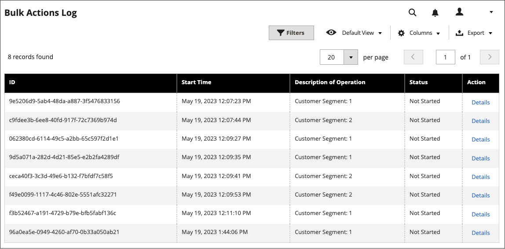

# Schemalägg designändringar

Schemalägg ändringar av temats design i förväg så att de träder i kraft efter era affärscykler och händelser. Du kan använda schemalagda designändringar för säsongsändringar, kampanjer eller bara för att lägga till variation.

{width="700" zoomable="yes"}

## Lägga till en schemalagd designändring

1. Gå till **[!UICONTROL Content]** > _[!UICONTROL Design]_>**[!UICONTROL Schedule]**på sidofältet_ Admin _.

1. Klicka på **[!UICONTROL Add Design Change]**.

   {width="600" zoomable="yes"}

1. Ange **[!UICONTROL Store]** i den butiksvy där du vill tillämpa ändringarna.

1. Ange **[!UICONTROL Custom Design]** till temat, eller variant av ett tema, som ska användas.

1. För **[!UICONTROL Date From]** och **[!UICONTROL Date To]** klickar du på ikonen _Kalender_ () för att välja start- och slutvärden för den period då ändringen gäller.

1. Klicka på **[!UICONTROL Save]** när du är klar.

## Redigera schemalagd designändring

1. Gå till **[!UICONTROL Content]** > _[!UICONTROL Design]_>**[!UICONTROL Schedule]**på sidofältet_ Admin _.

1. Markera det objekt som du vill redigera.

1. Gör de ändringar som behövs.

1. Klicka på **[!UICONTROL Save]** när du är klar.

## Ta bort schemalagd designändring

1. Gå till **[!UICONTROL Content]** > _[!UICONTROL Design]_>**[!UICONTROL Schedule]**på sidofältet_ Admin _.

1. Markera det objekt som du vill ta bort.

1. Klicka på **[!UICONTROL Delete]** i knappfältet överst på sidan.

1. Bekräfta åtgärden genom att klicka på **[!UICONTROL OK]**.
