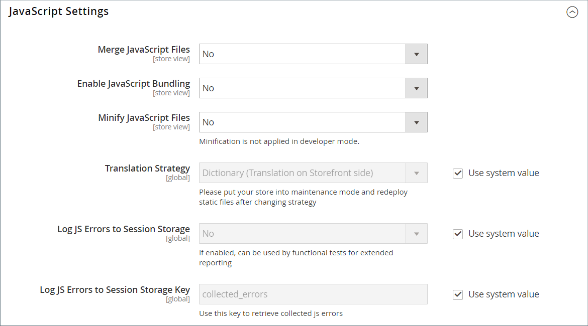

# Temaresurser

De _statiska filerna_ är en samling resurser, till exempel CSS, teckensnitt, bilder och JavaScript som används av ett tema. Platsen för statiska filer anges i konfigurationen [Bas-URL](../stores-purchase/store-urls.md) . Du kan lägga till en digital signatur i URL:en för varje statisk fil så att webbläsarna kan identifiera när en nyare version är tillgänglig. Den nyare versionen av filen används om signaturen skiljer sig från den som lagras i webbläsarens cache.

För en standardinstallation ordnas resurserna som är kopplade till ett tema i mappen `web` på följande plats nedanför roten [!DNL Commerce].

`[commerce_root]/app/design/frontend/Magento/[theme_name]/web`

## Lägga till en digital signatur i statiska filadresser

1. Gå till **[!UICONTROL Stores]** > _[!UICONTROL Settings]_>**[!UICONTROL Configuration]**&#x200B;på sidofältet_ Admin _.

1. Expandera **[!UICONTROL Advanced]** i den vänstra panelen och välj **[!UICONTROL Developer]**.

1. Expandera  i avsnittet **[!UICONTROL Static Files Settings]**.

   {width="500" zoomable="yes"}

1. Ange **[!UICONTROL Sign Static Files]** till `Yes`.

1. Klicka på **[!UICONTROL Save Config]** när du är klar.

| Filtyp | Beskrivning |
|--- |--- |
| CSS | Styr den visuella formatering som är kopplad till skalet. Exempelplats på servern: `[commerce]/app/design/frontend/Magento/[theme]/web/css` |
| Typsnitt | Ange de teckensnitt som är tillgängliga för temat. Plats på servern: `[commerce]/app/design/frontend/Magento/[theme]/web/fonts` |
| Bilder | Ange de grafiska resurser som används av temat, inklusive knappar, bakgrundstexturer och så vidare. Exempelplats på servern: `[commerce]/app/design/frontend/Magento/[theme]/web/images` |
| JS | Temaspecifika JavaScript-rutiner och anropbara funktioner. Exempelplats på servern: `[commerce]/app/design/frontend/Magento/[theme]/web/js` |

{style="table-layout:auto"}

## Sammanfoga CSS-filer

Som en del av ett försök att optimera webbplatsen och minska sidinläsningstiden kan du minska antalet separata CSS-filer genom att sammanfoga dem till en enda komprimerad fil. Om du öppnar en sammanfogad CSS-fil ser du ett kontinuerligt textflöde med radbrytningar borttagna. Du kan inte redigera den sammanfogade filen, så det är bäst att vänta tills du är utanför utvecklingsläget och inte längre gör vanliga ändringar i CSS.

>[!NOTE]
>
>CSS-filer kan bara sammanfogas från panelen _Admin_ när du arbetar i [utvecklarläget](../systems/developer-tools.md#operation-modes).

1. Gå till **[!UICONTROL Stores]** > _[!UICONTROL Settings]_>**[!UICONTROL Configuration]**&#x200B;på sidofältet_ Admin _.

1. I den vänstra panelen **[!UICONTROL Advanced]** och väljer **[!UICONTROL Developer]**.

1. Expandera  i avsnittet **[!UICONTROL CSS Settings]**.

   {width="500" zoomable="yes"}

   Detaljerade beskrivningar av dessa konfigurationsalternativ finns i [CSS-inställningar](../configuration-reference/advanced/developer.md#css-settings) i _Konfigurationsreferens_.

1. Ange **[!UICONTROL Merge CSS Files]** till `Yes`.

1. Klicka på **[!UICONTROL Save Config]** när du är klar.

## Slå samman JavaScript-filer

Flera JavaScript-filer kan sammanfogas till en enda komprimerad fil för att minska sidinläsningstiden. Om du öppnar en sammanfogad JavaScript-fil ser du ett kontinuerligt textflöde med radbrytningar borttagna. Om du är klar med utvecklingsprocessen och koden inte innehåller några fel kan du sammanfoga filerna.

>[!NOTE]
>
>JavaScript-filer kan bara sammanfogas från panelen _Admin_ när du arbetar i [Utvecklarläge](../systems/developer-tools.md#operation-modes).

1. Gå till **[!UICONTROL Stores]** > _[!UICONTROL Settings]_>**[!UICONTROL Configuration]**&#x200B;på sidofältet_ Admin _.

1. I den vänstra panelen **[!UICONTROL Advanced]** och väljer **[!UICONTROL Developer]**.

1. Expandera  i avsnittet **[!UICONTROL JavaScript Settings]**.

   {width="600" zoomable="yes"}

   Detaljerade beskrivningar av dessa konfigurationsalternativ finns i [JavaScript-inställningar](../configuration-reference/advanced/developer.md#javascript-settings) i _Konfigurationsreferens_.

1. Ange **[!UICONTROL Merge JavaScript Files]** till `Yes`.

1. Klicka på **[!UICONTROL Save Config]** när du är klar.
