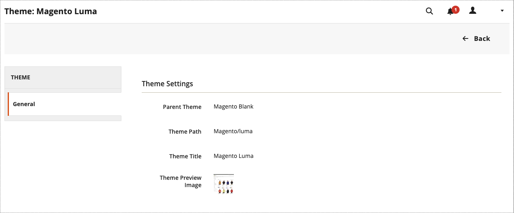
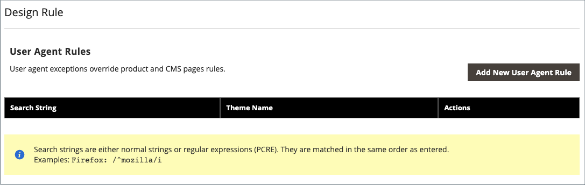

# Teman

Ett tema är en samling filer som avgör den visuella presentationen av din butik. När du installerar [!DNL Commerce], baseras butikens designelement på _Standard_ tema. Förutom det inledande standardtemat som medföljer [!DNL Commerce] kan du använda många olika teman _as_ eller anpassa efter dina behov.

Ett responsivt tema justerar sidlayouten så att den passar enhetens visningsport. Exemplet _Luma_ -temat har en flexibel, responsiv layout som kan visas från skrivbordet, surfplattan eller mobilenheten.

[!DNL Commerce] teman innehåller layoutfiler, mallfiler, översättningsfiler och skal. Ett skal är en samling CSS-, bild- och JavaScript-filer som tillsammans skapar den visuella presentation och de interaktioner som kunderna upplever när de besöker er butik. Teman och skal kan ändras och anpassas av utvecklare eller designproffs som förstår Commerce-temadedesign och har tillgång till servern. Mer information finns i [_Utvecklarhandbok för Edge_](https://developer.adobe.com/commerce/frontend-core/guide/themes/).

{width="600" zoomable="yes"}

## Standardtemat

The `Magento Blank` Med responsiva teman kan du visa din butik för olika enheter och använda de bästa metoderna för datorer, tabeller och mobila enheter. Vissa teman är utformade för att endast användas med vissa enheter. När [!DNL Commerce] identifierar ett specifikt webbläsar-ID, eller en användaragent, som använder det tema som är konfigurerat för den specifika webbläsaren. Söksträngen kan även innehålla Perl-Compatible Regular Expressions (PCRE).

{width="700" zoomable="yes"}

### Filtrera temarutnätet

1. På _Administratör_ sidebar, gå till **[!UICONTROL Content]** > _[!UICONTROL Design]_>**[!UICONTROL Themes]**.

1. Klicka på **[!UICONTROL Filters]**.

1. Ange ett ID-intervall, temanamn (eller titel), mappsökväg eller överordnat tema.

1. Klicka **[!UICONTROL Apply Filters]** för att uppdatera listan med teman.

## Visa aktuella temainställningar

1. På _Administratör_ sidebar, gå till **[!UICONTROL Content]** > _[!UICONTROL Design]_>**[!UICONTROL Themes]**.

1. I listan med installerade teman letar du reda på det tema som du vill granska och klickar på raden för att visa inställningarna.

1. Klicka på knappen **[!UICONTROL Theme Preview Image]**.

{width="600" zoomable="yes"}

## Använd ett standardtema

1. På _Administratör_ sidebar, gå till **[!UICONTROL Content]** > _[!UICONTROL Design]_>**[!UICONTROL Configuration]**.

1. Leta reda på butiksvyn som du vill konfigurera och klicka på **[!UICONTROL Edit]** i _[!UICONTROL Action]_kolumn.

1. Under _[!UICONTROL Default Theme]_, ange **[!UICONTROL Applied Theme]**till den som du vill använda för den aktuella vyn.

   {width="600" zoomable="yes"}

1. När du är klar klickar du på **[!UICONTROL Save Configuration]**.

## Lägg till en användaragentregel

1. På _Administratör_ sidebar, gå till **[!UICONTROL Content]** > _[!UICONTROL Design]_>**[!UICONTROL Configuration]**.

1. Under _[!UICONTROL Design Rule]_, klicka **[!UICONTROL Add New User Agent Rule]**.

   {width="600" zoomable="yes"}

1. För **[!UICONTROL Search String]** anger du webbläsar-ID för den specifika enheten.

   Söksträngar matchas i den ordning de anges. För Firefox anger du till exempel:

   `/^mozilla/i`

1. Om du vill ange ytterligare enheter upprepar du processen.

1. När du är klar klickar du på **[!UICONTROL Save Configuration]**.
